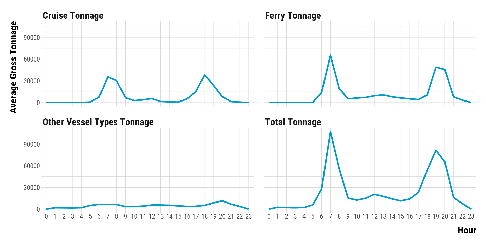
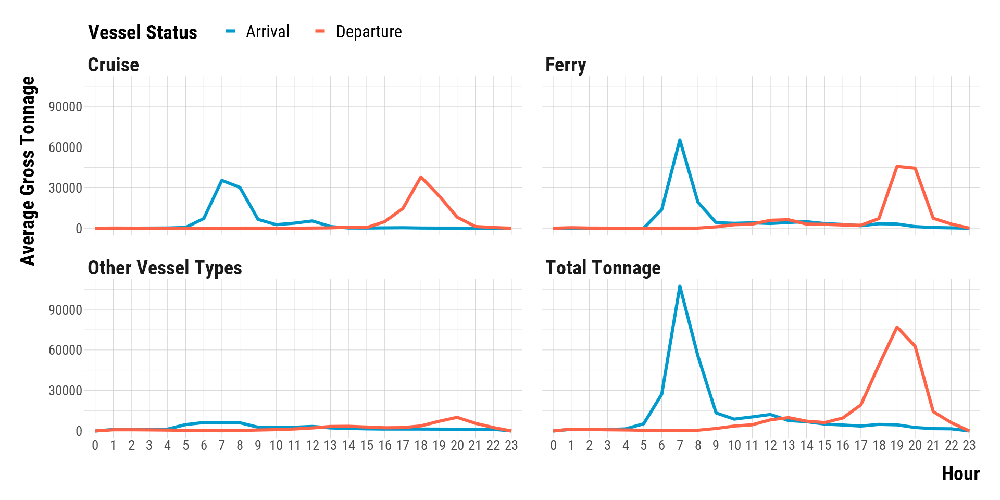
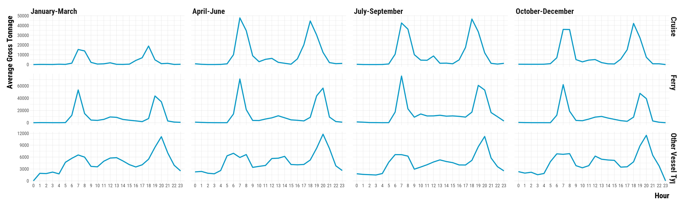
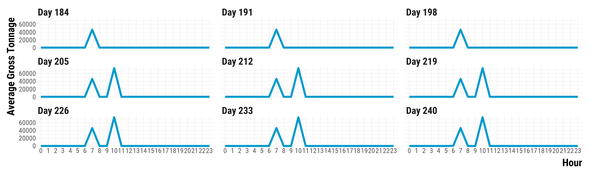
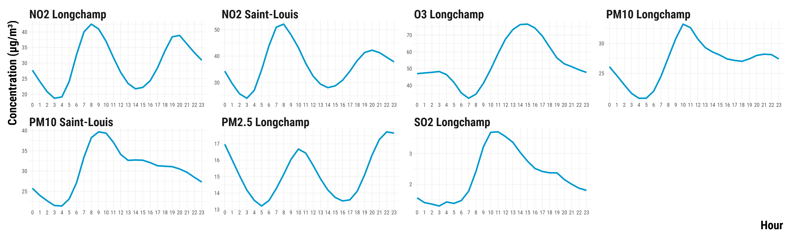
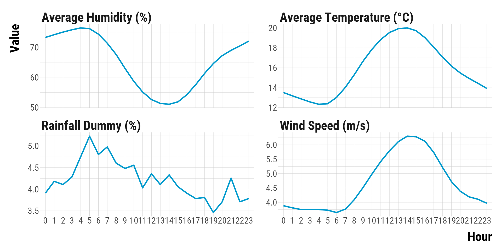
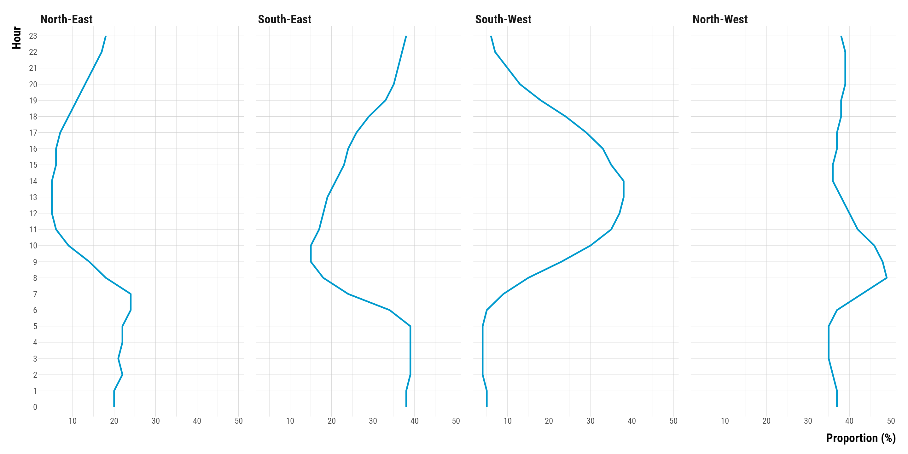
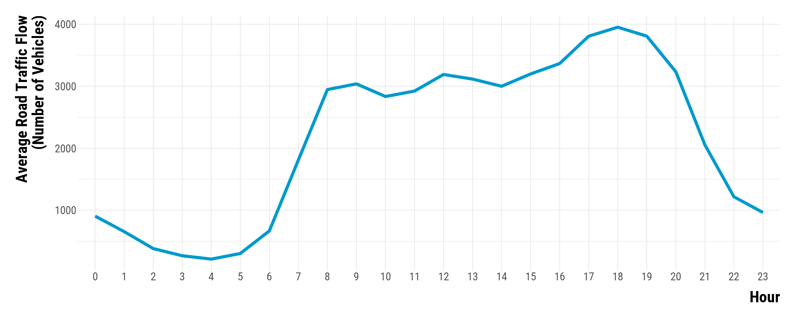

<style>
body {
text-align: justify}
</style>


In this document, we provide all steps to reproduce the exploratory analysis of our data at the hourley. **Should you have any questions or find errors, please do not hesitate to contact us at leo.zabrocki@psemail.eu and marion.leroutier@psemail.eu**

# Required Packages

To reproduce exactly the `script_data_wrangling.hmtl` document, you first need to have installed:

* the [R](https://www.r-project.org/) programming language on your computer 
* [RStudio](https://rstudio.com/), an integrated development environment for R, which will allow you to knit the `script_data_wrangling.Rmd` file and interact with the R code chunks
* the [R Markdown](https://rmarkdown.rstudio.com/) package
* and the [Distill](https://rstudio.github.io/distill/) package which provides the template of this document. 

Once everything is set up, we need to load the following packages:

<div class="layout-chunk" data-layout="l-body">
<div class="sourceCode"><pre class="sourceCode r"><code class="sourceCode r"><span class='co'># load required packages</span>
<span class='kw'><a href='https://rdrr.io/r/base/library.html'>library</a></span><span class='op'>(</span><span class='va'><a href='https://github.com/rstudio/rmarkdown'>rmarkdown</a></span><span class='op'>)</span> <span class='co'># for creating the R Markdown document</span>
<span class='kw'><a href='https://rdrr.io/r/base/library.html'>library</a></span><span class='op'>(</span><span class='va'><a href='https://yihui.org/knitr/'>knitr</a></span><span class='op'>)</span> <span class='co'># for creating the R Markdown document</span>
<span class='kw'><a href='https://rdrr.io/r/base/library.html'>library</a></span><span class='op'>(</span><span class='va'><a href='https://here.r-lib.org/'>here</a></span><span class='op'>)</span> <span class='co'># for files paths organization</span>
<span class='kw'><a href='https://rdrr.io/r/base/library.html'>library</a></span><span class='op'>(</span><span class='va'><a href='https://tidyverse.tidyverse.org'>tidyverse</a></span><span class='op'>)</span> <span class='co'># for data manipulation and visualization</span>
<span class='kw'><a href='https://rdrr.io/r/base/library.html'>library</a></span><span class='op'>(</span><span class='va'><a href='https://wilkelab.org/ggridges/'>ggridges</a></span><span class='op'>)</span> <span class='co'># for density ridge plots</span>
<span class='kw'><a href='https://rdrr.io/r/base/library.html'>library</a></span><span class='op'>(</span><span class='va'><a href='https://patchwork.data-imaginist.com'>patchwork</a></span><span class='op'>)</span> <span class='co'># for combining plots</span>
<span class='kw'><a href='https://rdrr.io/r/base/library.html'>library</a></span><span class='op'>(</span><span class='va'><a href='http://www.rforge.net/Cairo/'>Cairo</a></span><span class='op'>)</span> <span class='co'># for printing customed police of graphs</span>
</code></pre></div>

</div>


We also load our custom `ggplot2` theme for graphs:

<div class="layout-chunk" data-layout="l-body">
<div class="sourceCode"><pre class="sourceCode r"><code class="sourceCode r"><span class='co'># load ggplot customed theme</span>
<span class='kw'><a href='https://rdrr.io/r/base/source.html'>source</a></span><span class='op'>(</span><span class='fu'>here</span><span class='fu'>::</span><span class='fu'><a href='https://here.r-lib.org//reference/here.html'>here</a></span><span class='op'>(</span><span class='st'>"2.scripts"</span>, <span class='st'>"4.custom_ggplot2_theme"</span>, <span class='st'>"script_custom_ggplot_theme.R"</span><span class='op'>)</span><span class='op'>)</span>
</code></pre></div>

</div>


The theme is based on the fantastic [hrbrthemes](https://hrbrmstr.github.io/hrbrthemes/index.html) package. If you do not want to use this theme or are unable to install it because of fonts issues, you can use the `theme_mimimal()` included in the `ggplot2` package.

Finally, we load the data: 

<div class="layout-chunk" data-layout="l-body">
<div class="sourceCode"><pre class="sourceCode r"><code class="sourceCode r"><span class='co'># load data</span>
<span class='va'>data</span> <span class='op'>&lt;-</span> <span class='fu'><a href='https://rdrr.io/r/base/readRDS.html'>readRDS</a></span><span class='op'>(</span><span class='fu'>here</span><span class='fu'>::</span><span class='fu'><a href='https://here.r-lib.org//reference/here.html'>here</a></span><span class='op'>(</span><span class='st'>"1.data"</span>, <span class='st'>"2.data_for_analysis"</span>, <span class='st'>"0.main_data"</span>, <span class='st'>"data_for_analysis_hourly.RDS"</span><span class='op'>)</span><span class='op'>)</span>
</code></pre></div>

</div>


# Vessel Traffic Data

We first explore the patterns of vessel traffic data at the hourly level and by vessel type (cruise, ferry and other types).

### Hourly Patterns of Gross Tonnage 

Mean of total tonnage by vessel categories and hour of the day:

<div class="layout-chunk" data-layout="l-body-outset">
<div class="sourceCode"><pre class="sourceCode r"><code class="sourceCode r"><span class='co'># create the graph</span>
<span class='va'>graph_total_tonnage_hour_vessel_type</span> <span class='op'>&lt;-</span> <span class='va'>data</span> <span class='op'>%&gt;%</span>
  <span class='fu'>select</span><span class='op'>(</span><span class='va'>hour</span>, <span class='va'>total_gross_tonnage</span>, <span class='va'>total_gross_tonnage_cruise</span>, <span class='va'>total_gross_tonnage_ferry</span>, <span class='va'>total_gross_tonnage_other_vessels</span><span class='op'>)</span> <span class='op'>%&gt;%</span>
  <span class='fu'>rename</span><span class='op'>(</span><span class='st'>"Total Tonnage"</span> <span class='op'>=</span> <span class='va'>total_gross_tonnage</span>, <span class='st'>"Cruise Tonnage"</span> <span class='op'>=</span> <span class='va'>total_gross_tonnage_cruise</span>, <span class='st'>"Ferry Tonnage"</span> <span class='op'>=</span><span class='va'>total_gross_tonnage_ferry</span>, <span class='st'>"Other Vessel Types Tonnage"</span> <span class='op'>=</span> <span class='va'>total_gross_tonnage_other_vessels</span><span class='op'>)</span> <span class='op'>%&gt;%</span>
  <span class='fu'>pivot_longer</span><span class='op'>(</span>cols <span class='op'>=</span> <span class='op'>-</span><span class='fu'><a href='https://rdrr.io/r/base/c.html'>c</a></span><span class='op'>(</span><span class='va'>hour</span><span class='op'>)</span>, names_to <span class='op'>=</span> <span class='st'>"tonnage_type"</span>, values_to <span class='op'>=</span> <span class='st'>"tonnage"</span><span class='op'>)</span> <span class='op'>%&gt;%</span>
  <span class='fu'>group_by</span><span class='op'>(</span><span class='va'>tonnage_type</span>, <span class='va'>hour</span><span class='op'>)</span> <span class='op'>%&gt;%</span>
  <span class='fu'>summarise</span><span class='op'>(</span>mean_tonnage <span class='op'>=</span> <span class='fu'><a href='https://rdrr.io/r/base/mean.html'>mean</a></span><span class='op'>(</span><span class='va'>tonnage</span><span class='op'>)</span> <span class='op'>%&gt;%</span>
              <span class='fu'><a href='https://rdrr.io/r/base/ifelse.html'>ifelse</a></span><span class='op'>(</span><span class='fu'><a href='https://rdrr.io/r/base/NA.html'>is.na</a></span><span class='op'>(</span><span class='va'>.</span><span class='op'>)</span>, <span class='fl'>0</span>, <span class='va'>.</span><span class='op'>)</span><span class='op'>)</span> <span class='op'>%&gt;%</span>
  <span class='fu'>ggplot</span><span class='op'>(</span><span class='va'>.</span>, <span class='fu'>aes</span><span class='op'>(</span>x <span class='op'>=</span> <span class='fu'><a href='https://rdrr.io/r/base/factor.html'>as.factor</a></span><span class='op'>(</span><span class='va'>hour</span><span class='op'>)</span>, y <span class='op'>=</span> <span class='va'>mean_tonnage</span>, group <span class='op'>=</span> <span class='st'>"l"</span><span class='op'>)</span><span class='op'>)</span> <span class='op'>+</span> 
  <span class='fu'>geom_line</span><span class='op'>(</span>colour <span class='op'>=</span> <span class='st'>"deepskyblue3"</span>, size <span class='op'>=</span> <span class='fl'>1.6</span><span class='op'>)</span> <span class='op'>+</span>
  <span class='fu'>facet_wrap</span><span class='op'>(</span><span class='op'>~</span> <span class='va'>tonnage_type</span><span class='op'>)</span> <span class='op'>+</span>
  <span class='fu'>xlab</span><span class='op'>(</span><span class='st'>"Hour"</span><span class='op'>)</span> <span class='op'>+</span> <span class='fu'>ylab</span><span class='op'>(</span><span class='st'>"Average Gross Tonnage"</span><span class='op'>)</span> <span class='op'>+</span>
  <span class='va'>custom_theme</span>

<span class='co'># display the graph</span>
<span class='va'>graph_total_tonnage_hour_vessel_type</span>
</code></pre></div>
<!-- --><div class="sourceCode"><pre class="sourceCode r"><code class="sourceCode r"><span class='fu'>ggsave</span><span class='op'>(</span><span class='va'>graph_total_tonnage_hour_vessel_type</span>, filename <span class='op'>=</span> <span class='fu'>here</span><span class='fu'>::</span><span class='fu'><a href='https://here.r-lib.org//reference/here.html'>here</a></span><span class='op'>(</span><span class='st'>"3.outputs"</span>, <span class='st'>"1.figures"</span>, <span class='st'>"1.eda"</span>, <span class='st'>"graph_total_tonnage_hour_vessel_type.pdf"</span><span class='op'>)</span>, 
       width <span class='op'>=</span> <span class='fl'>45</span>, height <span class='op'>=</span> <span class='fl'>20</span>, units <span class='op'>=</span> <span class='st'>"cm"</span>, device <span class='op'>=</span> <span class='va'>cairo_pdf</span><span class='op'>)</span>
</code></pre></div>

</div>


Mean of entering and exiting total tonnage by vessel categories and hour of the day:

<div class="layout-chunk" data-layout="l-body-outset">
<div class="sourceCode"><pre class="sourceCode r"><code class="sourceCode r"><span class='co'># create the graph</span>
<span class='va'>graph_entering_exiting_total_tonnage_hour_vessel_type</span> <span class='op'>&lt;-</span> <span class='va'>data</span> <span class='op'>%&gt;%</span>
  <span class='fu'>select</span><span class='op'>(</span><span class='va'>hour</span>, <span class='va'>total_gross_tonnage_entry</span><span class='op'>:</span><span class='va'>total_gross_tonnage_entry_other_vessels</span>,
         <span class='va'>total_gross_tonnage_exit</span><span class='op'>:</span><span class='va'>total_gross_tonnage_exit_other_vessels</span><span class='op'>)</span> <span class='op'>%&gt;%</span>
  <span class='fu'>pivot_longer</span><span class='op'>(</span>cols <span class='op'>=</span> <span class='op'>-</span><span class='fu'><a href='https://rdrr.io/r/base/c.html'>c</a></span><span class='op'>(</span><span class='va'>hour</span><span class='op'>)</span>, names_to <span class='op'>=</span> <span class='st'>"tonnage_type"</span>, values_to <span class='op'>=</span> <span class='st'>"tonnage"</span><span class='op'>)</span> <span class='op'>%&gt;%</span>
  <span class='fu'>mutate</span><span class='op'>(</span>entry_exit <span class='op'>=</span> <span class='fu'><a href='https://rdrr.io/r/base/ifelse.html'>ifelse</a></span><span class='op'>(</span><span class='fu'>str_detect</span><span class='op'>(</span><span class='va'>tonnage_type</span>, <span class='st'>"entry"</span><span class='op'>)</span>, <span class='st'>"Arrival"</span>, <span class='st'>"Departure"</span><span class='op'>)</span>,
         vessel_type <span class='op'>=</span> <span class='st'>"Total Tonnage"</span> <span class='op'>%&gt;%</span>
           <span class='fu'><a href='https://rdrr.io/r/base/ifelse.html'>ifelse</a></span><span class='op'>(</span><span class='fu'>str_detect</span><span class='op'>(</span><span class='va'>tonnage_type</span>, <span class='st'>"cruise"</span><span class='op'>)</span>, <span class='st'>"Cruise"</span>, <span class='va'>.</span><span class='op'>)</span> <span class='op'>%&gt;%</span>
           <span class='fu'><a href='https://rdrr.io/r/base/ifelse.html'>ifelse</a></span><span class='op'>(</span><span class='fu'>str_detect</span><span class='op'>(</span><span class='va'>tonnage_type</span>, <span class='st'>"ferry"</span><span class='op'>)</span>, <span class='st'>"Ferry"</span>, <span class='va'>.</span><span class='op'>)</span> <span class='op'>%&gt;%</span>
           <span class='fu'><a href='https://rdrr.io/r/base/ifelse.html'>ifelse</a></span><span class='op'>(</span><span class='fu'>str_detect</span><span class='op'>(</span><span class='va'>tonnage_type</span>, <span class='st'>"other"</span><span class='op'>)</span>, <span class='st'>"Other Vessel Types"</span>, <span class='va'>.</span><span class='op'>)</span><span class='op'>)</span> <span class='op'>%&gt;%</span>
  <span class='fu'>group_by</span><span class='op'>(</span><span class='va'>vessel_type</span>, <span class='va'>entry_exit</span>, <span class='va'>hour</span><span class='op'>)</span> <span class='op'>%&gt;%</span>
  <span class='fu'>summarise</span><span class='op'>(</span>mean_tonnage <span class='op'>=</span> <span class='fu'><a href='https://rdrr.io/r/base/mean.html'>mean</a></span><span class='op'>(</span><span class='va'>tonnage</span><span class='op'>)</span> <span class='op'>%&gt;%</span>
              <span class='fu'><a href='https://rdrr.io/r/base/ifelse.html'>ifelse</a></span><span class='op'>(</span><span class='fu'><a href='https://rdrr.io/r/base/NA.html'>is.na</a></span><span class='op'>(</span><span class='va'>.</span><span class='op'>)</span>, <span class='fl'>0</span>, <span class='va'>.</span><span class='op'>)</span><span class='op'>)</span> <span class='op'>%&gt;%</span>
  <span class='fu'>ggplot</span><span class='op'>(</span><span class='va'>.</span>, <span class='fu'>aes</span><span class='op'>(</span>x <span class='op'>=</span> <span class='fu'><a href='https://rdrr.io/r/base/factor.html'>as.factor</a></span><span class='op'>(</span><span class='va'>hour</span><span class='op'>)</span>, y <span class='op'>=</span> <span class='va'>mean_tonnage</span>, group <span class='op'>=</span> <span class='va'>entry_exit</span>, colour <span class='op'>=</span> <span class='va'>entry_exit</span><span class='op'>)</span><span class='op'>)</span> <span class='op'>+</span> 
  <span class='fu'>geom_line</span><span class='op'>(</span>size <span class='op'>=</span> <span class='fl'>1.6</span><span class='op'>)</span> <span class='op'>+</span>
  <span class='fu'>scale_colour_manual</span><span class='op'>(</span>values <span class='op'>=</span> <span class='fu'><a href='https://rdrr.io/r/base/c.html'>c</a></span><span class='op'>(</span><span class='st'>"deepskyblue3"</span>, <span class='st'>"tomato"</span><span class='op'>)</span><span class='op'>)</span> <span class='op'>+</span>
  <span class='fu'>facet_wrap</span><span class='op'>(</span><span class='op'>~</span> <span class='va'>vessel_type</span><span class='op'>)</span> <span class='op'>+</span>
  <span class='fu'>xlab</span><span class='op'>(</span><span class='st'>"Hour"</span><span class='op'>)</span> <span class='op'>+</span> <span class='fu'>ylab</span><span class='op'>(</span><span class='st'>"Average Gross Tonnage"</span><span class='op'>)</span> <span class='op'>+</span>
  <span class='fu'>labs</span><span class='op'>(</span>colour <span class='op'>=</span> <span class='st'>"Vessel Status"</span><span class='op'>)</span> <span class='op'>+</span>
  <span class='va'>custom_theme</span> <span class='op'>+</span>
  <span class='fu'>theme</span><span class='op'>(</span>legend.position <span class='op'>=</span> <span class='st'>"top"</span>, legend.justification <span class='op'>=</span> <span class='st'>"left"</span>, legend.direction <span class='op'>=</span> <span class='st'>"horizontal"</span><span class='op'>)</span>

<span class='co'># display the graph</span>
<span class='va'>graph_entering_exiting_total_tonnage_hour_vessel_type</span>
</code></pre></div>
<!-- --><div class="sourceCode"><pre class="sourceCode r"><code class="sourceCode r"><span class='fu'>ggsave</span><span class='op'>(</span><span class='va'>graph_entering_exiting_total_tonnage_hour_vessel_type</span>, filename <span class='op'>=</span> <span class='fu'>here</span><span class='fu'>::</span><span class='fu'><a href='https://here.r-lib.org//reference/here.html'>here</a></span><span class='op'>(</span><span class='st'>"3.outputs"</span>, <span class='st'>"1.figures"</span>, <span class='st'>"1.eda"</span>, <span class='st'>"graph_entering_exiting_total_tonnage_hour_vessel_type.pdf"</span><span class='op'>)</span>, 
       width <span class='op'>=</span> <span class='fl'>45</span>, height <span class='op'>=</span> <span class='fl'>20</span>, units <span class='op'>=</span> <span class='st'>"cm"</span>, device <span class='op'>=</span> <span class='va'>cairo_pdf</span><span class='op'>)</span>
</code></pre></div>

</div>


### Hourly Patterns of total Gross Tonnage by Season

Mean of total tonnage by vessel categories, season and hour of the day:

<div class="layout-chunk" data-layout="l-body-outset">
<div class="sourceCode"><pre class="sourceCode r"><code class="sourceCode r"><span class='co'># create the graph</span>
<span class='va'>graph_total_tonnage_season_hour_vessel_type</span> <span class='op'>&lt;-</span> <span class='va'>data</span> <span class='op'>%&gt;%</span>
  <span class='fu'>mutate</span><span class='op'>(</span>season <span class='op'>=</span> <span class='fu'>recode</span><span class='op'>(</span><span class='va'>season</span>, <span class='st'>"1"</span> <span class='op'>=</span> <span class='st'>"January-March"</span>, <span class='st'>"2"</span> <span class='op'>=</span> <span class='st'>"April-June"</span>, <span class='st'>"3"</span> <span class='op'>=</span> <span class='st'>"July-September"</span>, <span class='st'>"4"</span> <span class='op'>=</span> <span class='st'>"October-December"</span><span class='op'>)</span> <span class='op'>%&gt;%</span> <span class='fu'>fct_relevel</span><span class='op'>(</span><span class='va'>.</span>, <span class='st'>"January-March"</span>, <span class='st'>"April-June"</span>, <span class='st'>"July-September"</span>,<span class='st'>"October-December"</span><span class='op'>)</span><span class='op'>)</span> <span class='op'>%&gt;%</span>
  <span class='fu'>select</span><span class='op'>(</span><span class='va'>hour</span>, <span class='va'>season</span>, <span class='va'>total_gross_tonnage_cruise</span>, <span class='va'>total_gross_tonnage_ferry</span>, <span class='va'>total_gross_tonnage_other_vessels</span><span class='op'>)</span> <span class='op'>%&gt;%</span>
  <span class='fu'>rename</span><span class='op'>(</span><span class='st'>"Cruise"</span> <span class='op'>=</span> <span class='va'>total_gross_tonnage_cruise</span>, <span class='st'>"Ferry"</span> <span class='op'>=</span><span class='va'>total_gross_tonnage_ferry</span>, <span class='st'>"Other Vessel Types"</span> <span class='op'>=</span> <span class='va'>total_gross_tonnage_other_vessels</span><span class='op'>)</span> <span class='op'>%&gt;%</span>
  <span class='fu'>pivot_longer</span><span class='op'>(</span>cols <span class='op'>=</span> <span class='op'>-</span><span class='fu'><a href='https://rdrr.io/r/base/c.html'>c</a></span><span class='op'>(</span><span class='va'>hour</span>, <span class='va'>season</span><span class='op'>)</span>, names_to <span class='op'>=</span> <span class='st'>"tonnage_type"</span>, values_to <span class='op'>=</span> <span class='st'>"tonnage"</span><span class='op'>)</span> <span class='op'>%&gt;%</span>
  <span class='fu'>group_by</span><span class='op'>(</span><span class='va'>tonnage_type</span>, <span class='va'>season</span>, <span class='va'>hour</span><span class='op'>)</span> <span class='op'>%&gt;%</span>
  <span class='fu'>summarise</span><span class='op'>(</span>mean_tonnage <span class='op'>=</span> <span class='fu'><a href='https://rdrr.io/r/base/mean.html'>mean</a></span><span class='op'>(</span><span class='va'>tonnage</span><span class='op'>)</span> <span class='op'>%&gt;%</span>
              <span class='fu'><a href='https://rdrr.io/r/base/ifelse.html'>ifelse</a></span><span class='op'>(</span><span class='fu'><a href='https://rdrr.io/r/base/NA.html'>is.na</a></span><span class='op'>(</span><span class='va'>.</span><span class='op'>)</span>, <span class='fl'>0</span>, <span class='va'>.</span><span class='op'>)</span><span class='op'>)</span> <span class='op'>%&gt;%</span>
  <span class='fu'>ggplot</span><span class='op'>(</span><span class='va'>.</span>, <span class='fu'>aes</span><span class='op'>(</span>x <span class='op'>=</span> <span class='fu'><a href='https://rdrr.io/r/base/factor.html'>as.factor</a></span><span class='op'>(</span><span class='va'>hour</span><span class='op'>)</span>, y <span class='op'>=</span> <span class='va'>mean_tonnage</span>, group <span class='op'>=</span> <span class='st'>"l"</span><span class='op'>)</span><span class='op'>)</span> <span class='op'>+</span> 
  <span class='fu'>geom_line</span><span class='op'>(</span>colour <span class='op'>=</span> <span class='st'>"deepskyblue3"</span>, size <span class='op'>=</span> <span class='fl'>1.6</span><span class='op'>)</span> <span class='op'>+</span>
  <span class='fu'>facet_grid</span><span class='op'>(</span><span class='va'>tonnage_type</span> <span class='op'>~</span> <span class='va'>season</span>, scales <span class='op'>=</span> <span class='st'>"free_y"</span><span class='op'>)</span> <span class='op'>+</span>
  <span class='fu'>xlab</span><span class='op'>(</span><span class='st'>"Hour"</span><span class='op'>)</span> <span class='op'>+</span> <span class='fu'>ylab</span><span class='op'>(</span><span class='st'>"Average Gross Tonnage"</span><span class='op'>)</span> <span class='op'>+</span>
  <span class='va'>custom_theme</span> <span class='op'>+</span>
  <span class='fu'>theme</span><span class='op'>(</span>    
    <span class='co'># axis titles parameters</span>
    axis.title.x <span class='op'>=</span> <span class='fu'>element_text</span><span class='op'>(</span>size<span class='op'>=</span><span class='fl'>32</span>, face <span class='op'>=</span> <span class='st'>"bold"</span>, margin <span class='op'>=</span> <span class='fu'>margin</span><span class='op'>(</span>t <span class='op'>=</span> <span class='fl'>20</span>, r <span class='op'>=</span> <span class='fl'>0</span>, b <span class='op'>=</span> <span class='fl'>0</span>, l <span class='op'>=</span><span class='fl'>0</span><span class='op'>)</span><span class='op'>)</span>,
    axis.title.y <span class='op'>=</span> <span class='fu'>element_text</span><span class='op'>(</span>size<span class='op'>=</span><span class='fl'>32</span>, face <span class='op'>=</span> <span class='st'>"bold"</span>, margin <span class='op'>=</span> <span class='fu'>margin</span><span class='op'>(</span>t <span class='op'>=</span> <span class='fl'>0</span>, r <span class='op'>=</span> <span class='fl'>20</span>, b <span class='op'>=</span> <span class='fl'>0</span>, l <span class='op'>=</span> <span class='fl'>0</span><span class='op'>)</span><span class='op'>)</span>,
    <span class='co'># facet texts</span>
    strip.text.x <span class='op'>=</span> <span class='fu'>element_text</span><span class='op'>(</span>size<span class='op'>=</span><span class='fl'>32</span>, face <span class='op'>=</span> <span class='st'>"bold"</span><span class='op'>)</span>,
    strip.text.y <span class='op'>=</span> <span class='fu'>element_text</span><span class='op'>(</span>size<span class='op'>=</span><span class='fl'>32</span>, face <span class='op'>=</span> <span class='st'>"bold"</span><span class='op'>)</span><span class='op'>)</span>

<span class='co'># display the graph</span>
<span class='va'>graph_total_tonnage_season_hour_vessel_type</span>
</code></pre></div>
<!-- --><div class="sourceCode"><pre class="sourceCode r"><code class="sourceCode r"><span class='co'># save the graph</span>
<span class='fu'>ggsave</span><span class='op'>(</span><span class='va'>graph_total_tonnage_season_hour_vessel_type</span>, filename <span class='op'>=</span> <span class='fu'>here</span><span class='fu'>::</span><span class='fu'><a href='https://here.r-lib.org//reference/here.html'>here</a></span><span class='op'>(</span><span class='st'>"3.outputs"</span>, <span class='st'>"1.figures"</span>, <span class='st'>"1.eda"</span>, <span class='st'>"graph_total_tonnage_season_hour_vessel_type.pdf"</span><span class='op'>)</span>, 
       width <span class='op'>=</span> <span class='fl'>90</span>, height <span class='op'>=</span> <span class='fl'>36</span>, units <span class='op'>=</span> <span class='st'>"cm"</span>, device <span class='op'>=</span> <span class='va'>cairo_pdf</span><span class='op'>)</span>
</code></pre></div>

</div>


### Lack of Variation in Vessel Traffic

One issue of for our matching analysis is that vessel traffic is very regular. For instance, cruise vessels dock and leave the port for specific days and hours so that it is hard to find similar pairs of hours with and without traffic. We plot below the hourly tonnage of cruise docking the port for mondays belonging to July and August months of 2012:

<div class="layout-chunk" data-layout="l-body-outset">
<div class="sourceCode"><pre class="sourceCode r"><code class="sourceCode r"><span class='co'># create the data</span>
<span class='va'>data_tonnage_cruise_traffic_monday_season_3_2012</span> <span class='op'>&lt;-</span> <span class='va'>data</span> <span class='op'>%&gt;%</span>
  <span class='fu'><a href='https://rdrr.io/r/stats/filter.html'>filter</a></span><span class='op'>(</span><span class='va'>month</span> <span class='op'>%in%</span> <span class='fu'><a href='https://rdrr.io/r/base/c.html'>c</a></span><span class='op'>(</span><span class='st'>"July"</span>, <span class='st'>"August"</span><span class='op'>)</span> <span class='op'>&amp;</span> <span class='va'>year</span> <span class='op'>==</span> <span class='fl'>2012</span> <span class='op'>&amp;</span> <span class='va'>weekday</span> <span class='op'>==</span> <span class='st'>"Monday"</span><span class='op'>)</span> <span class='op'>%&gt;%</span>
  <span class='fu'>mutate</span><span class='op'>(</span>julian_date <span class='op'>=</span> <span class='fu'>lubridate</span><span class='fu'>::</span><span class='fu'><a href='https://lubridate.tidyverse.org/reference/day.html'>yday</a></span><span class='op'>(</span><span class='va'>date</span><span class='op'>)</span><span class='op'>)</span> <span class='op'>%&gt;%</span>
  <span class='fu'>mutate</span><span class='op'>(</span>julian_date <span class='op'>=</span> <span class='fu'>map</span><span class='op'>(</span><span class='va'>julian_date</span>, <span class='op'>~</span> <span class='fu'><a href='https://rdrr.io/r/base/paste.html'>paste</a></span><span class='op'>(</span><span class='st'>"Day"</span>, <span class='va'>.</span>, sep <span class='op'>=</span> <span class='st'>" "</span><span class='op'>)</span><span class='op'>)</span><span class='op'>)</span> <span class='op'>%&gt;%</span>
  <span class='fu'>unnest</span><span class='op'>(</span><span class='va'>julian_date</span><span class='op'>)</span> <span class='op'>%&gt;%</span>
  <span class='fu'>select</span><span class='op'>(</span><span class='va'>julian_date</span>, <span class='va'>hour</span>, <span class='va'>total_gross_tonnage_entry_cruise</span><span class='op'>)</span> 

<span class='co'># graph entering tonnage cruise</span>
<span class='va'>graph_tonnage_variation_cruise</span> <span class='op'>&lt;-</span> <span class='va'>data_tonnage_cruise_traffic_monday_season_3_2012</span> <span class='op'>%&gt;%</span> 
  <span class='fu'>ggplot</span><span class='op'>(</span><span class='va'>.</span>, <span class='fu'>aes</span><span class='op'>(</span>x <span class='op'>=</span> <span class='fu'><a href='https://rdrr.io/r/base/factor.html'>as.factor</a></span><span class='op'>(</span><span class='va'>hour</span><span class='op'>)</span>, y <span class='op'>=</span> <span class='va'>total_gross_tonnage_entry_cruise</span>, group <span class='op'>=</span> <span class='va'>julian_date</span><span class='op'>)</span><span class='op'>)</span> <span class='op'>+</span> 
  <span class='fu'>geom_line</span><span class='op'>(</span>colour <span class='op'>=</span> <span class='st'>"deepskyblue3"</span>, size <span class='op'>=</span> <span class='fl'>3</span><span class='op'>)</span> <span class='op'>+</span>
  <span class='fu'>facet_wrap</span><span class='op'>(</span><span class='op'>~</span> <span class='va'>julian_date</span><span class='op'>)</span> <span class='op'>+</span>
  <span class='fu'>scale_y_continuous</span><span class='op'>(</span>labels <span class='op'>=</span> <span class='kw'>function</span><span class='op'>(</span><span class='va'>x</span><span class='op'>)</span> <span class='fu'><a href='https://rdrr.io/r/base/format.html'>format</a></span><span class='op'>(</span><span class='va'>x</span>, scientific <span class='op'>=</span> <span class='cn'>FALSE</span><span class='op'>)</span><span class='op'>)</span> <span class='op'>+</span>
  <span class='fu'>xlab</span><span class='op'>(</span><span class='st'>"Hour"</span><span class='op'>)</span> <span class='op'>+</span> <span class='fu'>ylab</span><span class='op'>(</span><span class='st'>"Average Gross Tonnage"</span><span class='op'>)</span> <span class='op'>+</span>
  <span class='va'>custom_theme</span> <span class='op'>+</span>
  <span class='fu'>theme</span><span class='op'>(</span>
    <span class='co'># axis titles parameters</span>
    axis.title.x <span class='op'>=</span> <span class='fu'>element_text</span><span class='op'>(</span>size<span class='op'>=</span><span class='fl'>42</span>, face <span class='op'>=</span> <span class='st'>"bold"</span>, margin <span class='op'>=</span> <span class='fu'>margin</span><span class='op'>(</span>t <span class='op'>=</span> <span class='fl'>20</span>, r <span class='op'>=</span> <span class='fl'>0</span>, b <span class='op'>=</span> <span class='fl'>0</span>, l <span class='op'>=</span><span class='fl'>0</span><span class='op'>)</span><span class='op'>)</span>,
    axis.title.y <span class='op'>=</span> <span class='fu'>element_text</span><span class='op'>(</span>size<span class='op'>=</span><span class='fl'>42</span>, face <span class='op'>=</span> <span class='st'>"bold"</span>, margin <span class='op'>=</span> <span class='fu'>margin</span><span class='op'>(</span>t <span class='op'>=</span> <span class='fl'>0</span>, r <span class='op'>=</span> <span class='fl'>20</span>, b <span class='op'>=</span> <span class='fl'>0</span>, l <span class='op'>=</span> <span class='fl'>0</span><span class='op'>)</span><span class='op'>)</span>,
    <span class='co'># facet texts</span>
    strip.text.x <span class='op'>=</span> <span class='fu'>element_text</span><span class='op'>(</span>size<span class='op'>=</span><span class='fl'>40</span>, face <span class='op'>=</span> <span class='st'>"bold"</span><span class='op'>)</span>,
    strip.text.y <span class='op'>=</span> <span class='fu'>element_text</span><span class='op'>(</span>size<span class='op'>=</span><span class='fl'>40</span>, face <span class='op'>=</span> <span class='st'>"bold"</span><span class='op'>)</span>,
    <span class='co'># axis texts</span>
    axis.text.x <span class='op'>=</span> <span class='fu'>element_text</span><span class='op'>(</span>size<span class='op'>=</span><span class='fl'>28</span><span class='op'>)</span>,
    axis.text.y <span class='op'>=</span> <span class='fu'>element_text</span><span class='op'>(</span>size<span class='op'>=</span><span class='fl'>28</span><span class='op'>)</span><span class='op'>)</span>

<span class='co'># display the graph entering tonnage cruise</span>
<span class='va'>graph_tonnage_variation_cruise</span>
</code></pre></div>
<!-- --><div class="sourceCode"><pre class="sourceCode r"><code class="sourceCode r"><span class='fu'>ggsave</span><span class='op'>(</span><span class='va'>graph_tonnage_variation_cruise</span>, filename <span class='op'>=</span> <span class='fu'>here</span><span class='fu'>::</span><span class='fu'><a href='https://here.r-lib.org//reference/here.html'>here</a></span><span class='op'>(</span><span class='st'>"3.outputs"</span>, <span class='st'>"1.figures"</span>, <span class='st'>"1.eda"</span>, <span class='st'>"graph_tonnage_variation_cruise.pdf"</span><span class='op'>)</span>, 
       width <span class='op'>=</span> <span class='fl'>84</span>, height <span class='op'>=</span> <span class='fl'>35</span>, units <span class='op'>=</span> <span class='st'>"cm"</span>, device <span class='op'>=</span> <span class='va'>cairo_pdf</span><span class='op'>)</span>
</code></pre></div>

</div>


# Pollution Data

We explore here the hourly patterns of pollutant concentrations. We plot below the average concentration by hour for each pollutant:

<div class="layout-chunk" data-layout="l-body-outset">
<div class="sourceCode"><pre class="sourceCode r"><code class="sourceCode r"><span class='co'># creat the graph of pollutants' concentration by hour of the day</span>
<span class='va'>graph_pollutant_hour</span> <span class='op'>&lt;-</span> <span class='va'>data</span> <span class='op'>%&gt;%</span>
  <span class='fu'>select</span><span class='op'>(</span><span class='va'>hour</span>, <span class='va'>mean_no2_l</span><span class='op'>:</span><span class='va'>mean_pm10_sl</span><span class='op'>)</span> <span class='op'>%&gt;%</span>
  <span class='fu'>rename</span><span class='op'>(</span><span class='st'>"NO2 Longchamp"</span> <span class='op'>=</span> <span class='va'>mean_no2_l</span>, <span class='st'>"O3 Longchamp"</span> <span class='op'>=</span> <span class='va'>mean_o3_l</span>, <span class='st'>"PM2.5 Longchamp"</span> <span class='op'>=</span> <span class='va'>mean_pm25_l</span>,
         <span class='st'>"PM10 Longchamp"</span> <span class='op'>=</span> <span class='va'>mean_pm10_l</span>, <span class='st'>"SO2 Longchamp"</span> <span class='op'>=</span> <span class='va'>mean_so2_l</span>, <span class='st'>"NO2 Saint-Louis"</span> <span class='op'>=</span> <span class='va'>mean_no2_sl</span>,
         <span class='st'>"PM10 Saint-Louis"</span> <span class='op'>=</span> <span class='va'>mean_pm10_sl</span><span class='op'>)</span> <span class='op'>%&gt;%</span>
  <span class='fu'>pivot_longer</span><span class='op'>(</span>cols <span class='op'>=</span> <span class='op'>-</span><span class='fu'><a href='https://rdrr.io/r/base/c.html'>c</a></span><span class='op'>(</span><span class='va'>hour</span><span class='op'>)</span>, names_to <span class='op'>=</span> <span class='st'>"pollutant"</span>, values_to <span class='op'>=</span> <span class='st'>"concentration"</span><span class='op'>)</span> <span class='op'>%&gt;%</span>
  <span class='fu'>group_by</span><span class='op'>(</span><span class='va'>hour</span>, <span class='va'>pollutant</span><span class='op'>)</span> <span class='op'>%&gt;%</span>
  <span class='fu'>summarise</span><span class='op'>(</span>mean_concentration <span class='op'>=</span> <span class='fu'><a href='https://rdrr.io/r/base/mean.html'>mean</a></span><span class='op'>(</span><span class='va'>concentration</span><span class='op'>)</span><span class='op'>)</span> <span class='op'>%&gt;%</span>
  <span class='fu'>ggplot</span><span class='op'>(</span><span class='va'>.</span>, <span class='fu'>aes</span><span class='op'>(</span>x <span class='op'>=</span> <span class='fu'><a href='https://rdrr.io/r/base/factor.html'>as.factor</a></span><span class='op'>(</span><span class='va'>hour</span><span class='op'>)</span>, y <span class='op'>=</span> <span class='va'>mean_concentration</span>, group <span class='op'>=</span> <span class='st'>"l"</span><span class='op'>)</span><span class='op'>)</span> <span class='op'>+</span> 
  <span class='fu'>geom_line</span><span class='op'>(</span>colour <span class='op'>=</span> <span class='st'>"deepskyblue3"</span>, size <span class='op'>=</span> <span class='fl'>2</span><span class='op'>)</span> <span class='op'>+</span>
  <span class='fu'>facet_wrap</span><span class='op'>(</span><span class='op'>~</span> <span class='va'>pollutant</span>, scales <span class='op'>=</span> <span class='st'>"free"</span>, ncol <span class='op'>=</span> <span class='fl'>4</span><span class='op'>)</span> <span class='op'>+</span>
  <span class='fu'>xlab</span><span class='op'>(</span><span class='st'>"Hour"</span><span class='op'>)</span> <span class='op'>+</span> <span class='fu'>ylab</span><span class='op'>(</span><span class='st'>"Concentration (µg/m³)"</span><span class='op'>)</span> <span class='op'>+</span>
  <span class='va'>custom_theme</span> <span class='op'>+</span>
    <span class='fu'>theme</span><span class='op'>(</span>
    <span class='co'># axis titles parameters</span>
    axis.title.x <span class='op'>=</span> <span class='fu'>element_text</span><span class='op'>(</span>size<span class='op'>=</span><span class='fl'>42</span>, face <span class='op'>=</span> <span class='st'>"bold"</span>, margin <span class='op'>=</span> <span class='fu'>margin</span><span class='op'>(</span>t <span class='op'>=</span> <span class='fl'>20</span>, r <span class='op'>=</span> <span class='fl'>0</span>, b <span class='op'>=</span> <span class='fl'>0</span>, l <span class='op'>=</span><span class='fl'>0</span><span class='op'>)</span><span class='op'>)</span>,
    axis.title.y <span class='op'>=</span> <span class='fu'>element_text</span><span class='op'>(</span>size<span class='op'>=</span><span class='fl'>42</span>, face <span class='op'>=</span> <span class='st'>"bold"</span>, margin <span class='op'>=</span> <span class='fu'>margin</span><span class='op'>(</span>t <span class='op'>=</span> <span class='fl'>0</span>, r <span class='op'>=</span> <span class='fl'>20</span>, b <span class='op'>=</span> <span class='fl'>0</span>, l <span class='op'>=</span> <span class='fl'>0</span><span class='op'>)</span><span class='op'>)</span>,
    <span class='co'># axis texts</span>
    axis.text.x <span class='op'>=</span> <span class='fu'>element_text</span><span class='op'>(</span>size<span class='op'>=</span><span class='fl'>20</span><span class='op'>)</span>,
    axis.text.y <span class='op'>=</span> <span class='fu'>element_text</span><span class='op'>(</span>size<span class='op'>=</span><span class='fl'>20</span><span class='op'>)</span>,
    <span class='co'># facet texts</span>
    strip.text.x <span class='op'>=</span> <span class='fu'>element_text</span><span class='op'>(</span>size<span class='op'>=</span><span class='fl'>42</span>, face <span class='op'>=</span> <span class='st'>"bold"</span><span class='op'>)</span>,
    strip.text.y <span class='op'>=</span> <span class='fu'>element_text</span><span class='op'>(</span>size<span class='op'>=</span><span class='fl'>42</span>, face <span class='op'>=</span> <span class='st'>"bold"</span><span class='op'>)</span><span class='op'>)</span>

<span class='co'># display the graph</span>
<span class='va'>graph_pollutant_hour</span>
</code></pre></div>
<!-- --><div class="sourceCode"><pre class="sourceCode r"><code class="sourceCode r"><span class='co'># save the graph</span>
<span class='fu'>ggsave</span><span class='op'>(</span><span class='va'>graph_pollutant_hour</span>, filename <span class='op'>=</span> <span class='fu'>here</span><span class='fu'>::</span><span class='fu'><a href='https://here.r-lib.org//reference/here.html'>here</a></span><span class='op'>(</span><span class='st'>"3.outputs"</span>, <span class='st'>"1.figures"</span>, <span class='st'>"1.eda"</span>, <span class='st'>"graph_pollutant_hour.pdf"</span><span class='op'>)</span>, 
       width <span class='op'>=</span> <span class='fl'>100</span>, height <span class='op'>=</span> <span class='fl'>30</span>, units <span class='op'>=</span> <span class='st'>"cm"</span>, device <span class='op'>=</span> <span class='va'>cairo_pdf</span><span class='op'>)</span>
</code></pre></div>

</div>


# Weather Data

We explore here the hourly patterns of weather parameters. We plot the hourly distribution of weather parameters:

<div class="layout-chunk" data-layout="l-body-outset">
<div class="sourceCode"><pre class="sourceCode r"><code class="sourceCode r"><span class='co'># make the graph</span>
<span class='va'>graph_continuous_weather_hour</span> <span class='op'>&lt;-</span> <span class='va'>data</span> <span class='op'>%&gt;%</span>
  <span class='fu'>select</span><span class='op'>(</span><span class='va'>hour</span>, <span class='va'>temperature_average</span>, <span class='va'>rainfall_height_dummy</span>, <span class='va'>wind_speed</span>, <span class='va'>humidity_average</span><span class='op'>)</span> <span class='op'>%&gt;%</span>
  <span class='fu'>rename</span><span class='op'>(</span><span class='st'>"Average Temperature (°C)"</span> <span class='op'>=</span> <span class='va'>temperature_average</span>, <span class='st'>"Rainfall Dummy (%)"</span> <span class='op'>=</span> <span class='va'>rainfall_height_dummy</span>, <span class='st'>"Wind Speed (m/s)"</span> <span class='op'>=</span>          <span class='va'>wind_speed</span>, <span class='st'>"Average Humidity (%)"</span> <span class='op'>=</span> <span class='va'>humidity_average</span><span class='op'>)</span> <span class='op'>%&gt;%</span>
  <span class='fu'>pivot_longer</span><span class='op'>(</span>cols <span class='op'>=</span> <span class='op'>-</span><span class='fu'><a href='https://rdrr.io/r/base/c.html'>c</a></span><span class='op'>(</span><span class='va'>hour</span><span class='op'>)</span>, names_to <span class='op'>=</span> <span class='st'>"weather_parameter"</span>, values_to <span class='op'>=</span> <span class='st'>"values"</span><span class='op'>)</span> <span class='op'>%&gt;%</span>
  <span class='fu'>group_by</span><span class='op'>(</span><span class='va'>weather_parameter</span>, <span class='va'>hour</span><span class='op'>)</span> <span class='op'>%&gt;%</span>
  <span class='fu'>summarise</span><span class='op'>(</span>values <span class='op'>=</span> <span class='fu'><a href='https://rdrr.io/r/base/mean.html'>mean</a></span><span class='op'>(</span><span class='va'>values</span><span class='op'>)</span><span class='op'>)</span> <span class='op'>%&gt;%</span>
  <span class='fu'>ungroup</span><span class='op'>(</span><span class='op'>)</span> <span class='op'>%&gt;%</span>
  <span class='fu'>mutate</span><span class='op'>(</span>values <span class='op'>=</span> <span class='fu'><a href='https://rdrr.io/r/base/ifelse.html'>ifelse</a></span><span class='op'>(</span><span class='va'>weather_parameter</span> <span class='op'>==</span> <span class='st'>"Rainfall Dummy (%)"</span>, <span class='va'>values</span><span class='op'>*</span><span class='fl'>100</span>, <span class='va'>values</span><span class='op'>)</span><span class='op'>)</span> <span class='op'>%&gt;%</span>
  <span class='fu'>ggplot</span><span class='op'>(</span><span class='va'>.</span>, <span class='fu'>aes</span><span class='op'>(</span>x <span class='op'>=</span> <span class='fu'><a href='https://rdrr.io/r/base/factor.html'>as.factor</a></span><span class='op'>(</span><span class='va'>hour</span><span class='op'>)</span>, y <span class='op'>=</span> <span class='va'>values</span>, group <span class='op'>=</span> <span class='st'>"l"</span><span class='op'>)</span><span class='op'>)</span> <span class='op'>+</span> 
  <span class='fu'>geom_line</span><span class='op'>(</span>colour <span class='op'>=</span> <span class='st'>"deepskyblue3"</span>, size <span class='op'>=</span> <span class='fl'>1.4</span><span class='op'>)</span> <span class='op'>+</span>
  <span class='fu'>facet_wrap</span><span class='op'>(</span><span class='op'>~</span> <span class='va'>weather_parameter</span>, scales <span class='op'>=</span> <span class='st'>"free_y"</span><span class='op'>)</span> <span class='op'>+</span>
  <span class='fu'>xlab</span><span class='op'>(</span><span class='st'>"Hour"</span><span class='op'>)</span> <span class='op'>+</span> <span class='fu'>ylab</span><span class='op'>(</span><span class='st'>"Value"</span><span class='op'>)</span> <span class='op'>+</span>
  <span class='va'>custom_theme</span> <span class='op'>+</span>
  <span class='fu'>theme</span><span class='op'>(</span>
    <span class='co'># axis titles parameters</span>
    axis.title.x <span class='op'>=</span> <span class='fu'>element_text</span><span class='op'>(</span>size<span class='op'>=</span><span class='fl'>36</span>, face <span class='op'>=</span> <span class='st'>"bold"</span>, margin <span class='op'>=</span> <span class='fu'>margin</span><span class='op'>(</span>t <span class='op'>=</span> <span class='fl'>20</span>, r <span class='op'>=</span> <span class='fl'>0</span>, b <span class='op'>=</span> <span class='fl'>0</span>, l <span class='op'>=</span><span class='fl'>0</span><span class='op'>)</span><span class='op'>)</span>,
    axis.title.y <span class='op'>=</span> <span class='fu'>element_text</span><span class='op'>(</span>size<span class='op'>=</span><span class='fl'>36</span>, face <span class='op'>=</span> <span class='st'>"bold"</span>, margin <span class='op'>=</span> <span class='fu'>margin</span><span class='op'>(</span>t <span class='op'>=</span> <span class='fl'>0</span>, r <span class='op'>=</span> <span class='fl'>20</span>, b <span class='op'>=</span> <span class='fl'>0</span>, l <span class='op'>=</span> <span class='fl'>0</span><span class='op'>)</span><span class='op'>)</span>,
    <span class='co'># axis texts</span>
    axis.text.x <span class='op'>=</span> <span class='fu'>element_text</span><span class='op'>(</span>size<span class='op'>=</span><span class='fl'>25</span><span class='op'>)</span>,
    axis.text.y <span class='op'>=</span> <span class='fu'>element_text</span><span class='op'>(</span>size<span class='op'>=</span><span class='fl'>25</span><span class='op'>)</span>,
    <span class='co'># facet texts</span>
    strip.text.x <span class='op'>=</span> <span class='fu'>element_text</span><span class='op'>(</span>size<span class='op'>=</span><span class='fl'>36</span>, face <span class='op'>=</span> <span class='st'>"bold"</span><span class='op'>)</span>,
    strip.text.y <span class='op'>=</span> <span class='fu'>element_text</span><span class='op'>(</span>size<span class='op'>=</span><span class='fl'>36</span>, face <span class='op'>=</span> <span class='st'>"bold"</span><span class='op'>)</span><span class='op'>)</span>
  
<span class='co'># display the graph</span>
<span class='va'>graph_continuous_weather_hour</span>
</code></pre></div>
<!-- --><div class="sourceCode"><pre class="sourceCode r"><code class="sourceCode r"><span class='co'># save the graph</span>
<span class='fu'>ggsave</span><span class='op'>(</span><span class='va'>graph_continuous_weather_hour</span>, filename <span class='op'>=</span> <span class='fu'>here</span><span class='fu'>::</span><span class='fu'><a href='https://here.r-lib.org//reference/here.html'>here</a></span><span class='op'>(</span><span class='st'>"3.outputs"</span>, <span class='st'>"1.figures"</span>, <span class='st'>"1.eda"</span>, <span class='st'>"graph_continuous_weather_hour.pdf"</span><span class='op'>)</span>, 
       width <span class='op'>=</span> <span class='fl'>60</span>, height <span class='op'>=</span> <span class='fl'>25</span>, units <span class='op'>=</span> <span class='st'>"cm"</span>, device <span class='op'>=</span> <span class='va'>cairo_pdf</span><span class='op'>)</span>
</code></pre></div>

</div>


We plot the hourly distribution of wind direction categories:

<div class="layout-chunk" data-layout="l-body-outset">
<div class="sourceCode"><pre class="sourceCode r"><code class="sourceCode r"><span class='co'># make the graph</span>
<span class='va'>graph_wind_direction_hour</span> <span class='op'>&lt;-</span> <span class='va'>data</span> <span class='op'>%&gt;%</span>
  <span class='fu'>select</span><span class='op'>(</span><span class='va'>hour</span>, <span class='va'>wind_direction</span><span class='op'>)</span> <span class='op'>%&gt;%</span>
  <span class='fu'>mutate</span><span class='op'>(</span>wind_direction_categories <span class='op'>=</span> <span class='fu'><a href='https://rdrr.io/r/base/cut.html'>cut</a></span><span class='op'>(</span><span class='va'>wind_direction</span>, breaks <span class='op'>=</span> <span class='fu'><a href='https://rdrr.io/r/base/seq.html'>seq</a></span><span class='op'>(</span><span class='fl'>0</span>, <span class='fl'>360</span>, by  <span class='op'>=</span> <span class='fl'>90</span><span class='op'>)</span>, include.lowest <span class='op'>=</span> <span class='cn'>TRUE</span><span class='op'>)</span> <span class='op'>%&gt;%</span>
           <span class='fu'>recode</span><span class='op'>(</span><span class='va'>.</span>, <span class='st'>"[0,90]"</span> <span class='op'>=</span> <span class='st'>"North-East"</span>,
                  <span class='st'>"(90,180]"</span> <span class='op'>=</span> <span class='st'>"South-East"</span>,
                  <span class='st'>"(180,270]"</span> <span class='op'>=</span> <span class='st'>"South-West"</span>,
                  <span class='st'>"(270,360]"</span> <span class='op'>=</span> <span class='st'>"North-West"</span><span class='op'>)</span><span class='op'>)</span> <span class='op'>%&gt;%</span>
  <span class='fu'>mutate</span><span class='op'>(</span>hour <span class='op'>=</span> <span class='fu'><a href='https://rdrr.io/r/base/factor.html'>as.factor</a></span><span class='op'>(</span><span class='va'>hour</span><span class='op'>)</span><span class='op'>)</span> <span class='op'>%&gt;%</span>
  <span class='fu'>group_by</span><span class='op'>(</span><span class='va'>hour</span>, <span class='va'>wind_direction_categories</span><span class='op'>)</span> <span class='op'>%&gt;%</span>
  <span class='co'># compute the number of observations</span>
  <span class='fu'>summarise</span><span class='op'>(</span>n <span class='op'>=</span> <span class='fu'>n</span><span class='op'>(</span><span class='op'>)</span><span class='op'>)</span> <span class='op'>%&gt;%</span>
  <span class='co'># compute the proportion</span>
  <span class='fu'>mutate</span><span class='op'>(</span>freq <span class='op'>=</span> <span class='fu'><a href='https://rdrr.io/r/base/Round.html'>round</a></span><span class='op'>(</span><span class='va'>n</span> <span class='op'>/</span> <span class='fu'><a href='https://rdrr.io/r/base/sum.html'>sum</a></span><span class='op'>(</span><span class='va'>n</span><span class='op'>)</span><span class='op'>*</span><span class='fl'>100</span>, <span class='fl'>0</span><span class='op'>)</span><span class='op'>)</span> <span class='op'>%&gt;%</span>
  <span class='fu'>ggplot</span><span class='op'>(</span><span class='va'>.</span>, <span class='fu'>aes</span><span class='op'>(</span>x <span class='op'>=</span> <span class='va'>hour</span>, y <span class='op'>=</span> <span class='va'>freq</span>, group <span class='op'>=</span> <span class='st'>"l"</span><span class='op'>)</span><span class='op'>)</span> <span class='op'>+</span> 
  <span class='fu'>geom_line</span><span class='op'>(</span>colour <span class='op'>=</span> <span class='st'>"deepskyblue3"</span>, size <span class='op'>=</span> <span class='fl'>1.4</span><span class='op'>)</span> <span class='op'>+</span>
  <span class='fu'>facet_wrap</span><span class='op'>(</span><span class='op'>~</span> <span class='va'>wind_direction_categories</span>, ncol <span class='op'>=</span> <span class='fl'>4</span><span class='op'>)</span> <span class='op'>+</span>
  <span class='fu'>coord_flip</span><span class='op'>(</span><span class='op'>)</span> <span class='op'>+</span>
  <span class='fu'>xlab</span><span class='op'>(</span><span class='st'>"Hour"</span><span class='op'>)</span> <span class='op'>+</span> <span class='fu'>ylab</span><span class='op'>(</span><span class='st'>"Proportion (%)"</span><span class='op'>)</span> <span class='op'>+</span>
  <span class='va'>custom_theme</span>

<span class='co'># display the graph</span>
<span class='va'>graph_wind_direction_hour</span>
</code></pre></div>
<!-- --><div class="sourceCode"><pre class="sourceCode r"><code class="sourceCode r"><span class='co'># save the graph</span>
<span class='fu'>ggsave</span><span class='op'>(</span><span class='va'>graph_wind_direction_hour</span>, filename <span class='op'>=</span> <span class='fu'>here</span><span class='fu'>::</span><span class='fu'><a href='https://here.r-lib.org//reference/here.html'>here</a></span><span class='op'>(</span><span class='st'>"3.outputs"</span>, <span class='st'>"1.figures"</span>, <span class='st'>"1.eda"</span>, <span class='st'>"graph_wind_direction_hour.pdf"</span><span class='op'>)</span>, 
       width <span class='op'>=</span> <span class='fl'>40</span>, height <span class='op'>=</span> <span class='fl'>22</span>, units <span class='op'>=</span> <span class='st'>"cm"</span>, device <span class='op'>=</span> <span class='va'>cairo_pdf</span><span class='op'>)</span>
</code></pre></div>

</div>


# Road Traffic Data

We explore here the hourly patterns of the flow of vehicles. We plot below the average flow of vehicles by hour of the day:

<div class="layout-chunk" data-layout="l-body-outset">
<div class="sourceCode"><pre class="sourceCode r"><code class="sourceCode r"><span class='co'># create the graph of the flow of vehicles by hour of the day</span>
<span class='va'>graph_road_traffic_hour</span> <span class='op'>&lt;-</span> <span class='va'>data</span> <span class='op'>%&gt;%</span>
  <span class='fu'>group_by</span><span class='op'>(</span><span class='va'>hour</span><span class='op'>)</span> <span class='op'>%&gt;%</span>
  <span class='fu'>summarise</span><span class='op'>(</span>mean_road_traffic_flow <span class='op'>=</span> <span class='fu'><a href='https://rdrr.io/r/base/mean.html'>mean</a></span><span class='op'>(</span><span class='va'>road_traffic_flow</span>, na.rm <span class='op'>=</span> <span class='cn'>TRUE</span><span class='op'>)</span><span class='op'>)</span> <span class='op'>%&gt;%</span>
  <span class='fu'>ungroup</span><span class='op'>(</span><span class='op'>)</span> <span class='op'>%&gt;%</span>
  <span class='fu'>ggplot</span><span class='op'>(</span><span class='va'>.</span>, <span class='fu'>aes</span><span class='op'>(</span>x <span class='op'>=</span> <span class='fu'><a href='https://rdrr.io/r/base/factor.html'>as.factor</a></span><span class='op'>(</span><span class='va'>hour</span><span class='op'>)</span>, y <span class='op'>=</span> <span class='va'>mean_road_traffic_flow</span>, group <span class='op'>=</span> <span class='st'>"l"</span><span class='op'>)</span><span class='op'>)</span> <span class='op'>+</span> 
  <span class='fu'>geom_line</span><span class='op'>(</span>colour <span class='op'>=</span> <span class='st'>"deepskyblue3"</span>, size <span class='op'>=</span> <span class='fl'>2</span><span class='op'>)</span> <span class='op'>+</span>
  <span class='fu'>xlab</span><span class='op'>(</span><span class='st'>"Hour"</span><span class='op'>)</span> <span class='op'>+</span> <span class='fu'>ylab</span><span class='op'>(</span><span class='st'>"Average Road Traffic Flow\n (Number of Vehicles)"</span><span class='op'>)</span> <span class='op'>+</span>
  <span class='va'>custom_theme</span>

<span class='co'># display the graph</span>
<span class='va'>graph_road_traffic_hour</span>
</code></pre></div>
<!-- --><div class="sourceCode"><pre class="sourceCode r"><code class="sourceCode r"><span class='co'># save the graph</span>
<span class='fu'>ggsave</span><span class='op'>(</span><span class='va'>graph_road_traffic_hour</span>, filename <span class='op'>=</span> <span class='fu'>here</span><span class='fu'>::</span><span class='fu'><a href='https://here.r-lib.org//reference/here.html'>here</a></span><span class='op'>(</span><span class='st'>"3.outputs"</span>, <span class='st'>"1.figures"</span>, <span class='st'>"1.eda"</span>, <span class='st'>"graph_road_traffic_hour.pdf"</span><span class='op'>)</span>, 
       width <span class='op'>=</span> <span class='fl'>30</span>, height <span class='op'>=</span> <span class='fl'>15</span>, units <span class='op'>=</span> <span class='st'>"cm"</span>, device <span class='op'>=</span> <span class='va'>cairo_pdf</span><span class='op'>)</span>
</code></pre></div>

</div>

```{.r .distill-force-highlighting-css}
```
