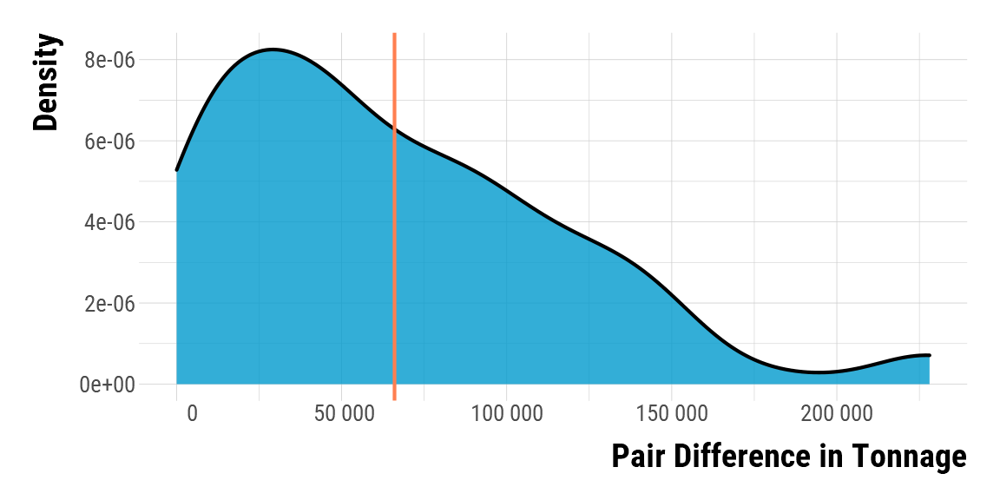
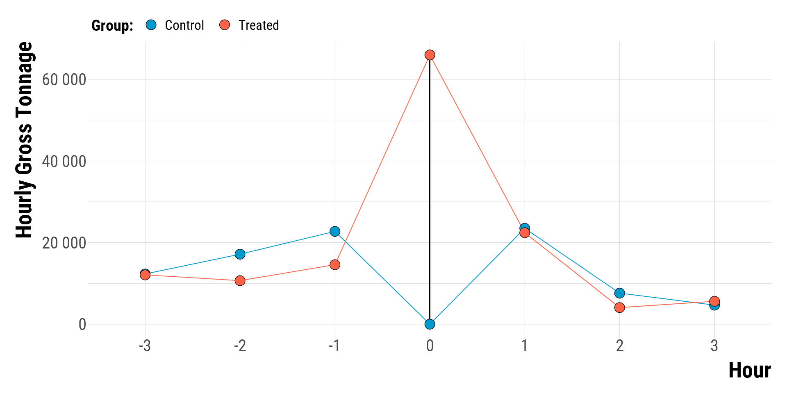
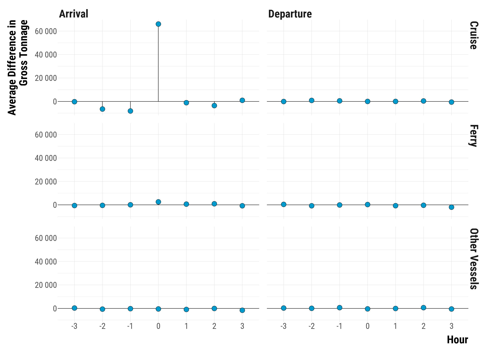

<style>
body {
text-align: justify}
</style>

In this document, we take great care providing all steps and R codes required to check the intervention we set up in our matching procedure. We compare hours where:

* treated units are hours with positive entering cruise traffic in t.
* control units are hours without entering cruise traffic in t.

We adjust for calendar calendar indicator and weather confouding factors.

**Should you have any questions, need help to reproduce the analysis or find coding errors, please do not hesitate to contact us at leo.zabrocki@psemail.eu and marion.leroutier@psemail.eu.**

# Required Packages

To reproduce exactly the `3_script_checking_intervention.html` document, we first need to have installed:

* the [R](https://www.r-project.org/) programming language 
* [RStudio](https://rstudio.com/), an integrated development environment for R, which will allow you to knit the `3_script_checking_intervention.Rmd` file and interact with the R code chunks
* the [R Markdown](https://rmarkdown.rstudio.com/) package
* and the [Distill](https://rstudio.github.io/distill/) package which provides the template for this document. 

Once everything is set up, we have to load the following packages:

<div class="layout-chunk" data-layout="l-body">
<div class="sourceCode"><pre class="sourceCode r"><code class="sourceCode r"><span class='co'># load required packages</span>
<span class='kw'><a href='https://rdrr.io/r/base/library.html'>library</a></span><span class='op'>(</span><span class='va'><a href='https://yihui.org/knitr/'>knitr</a></span><span class='op'>)</span> <span class='co'># for creating the R Markdown document</span>
<span class='kw'><a href='https://rdrr.io/r/base/library.html'>library</a></span><span class='op'>(</span><span class='va'><a href='https://here.r-lib.org/'>here</a></span><span class='op'>)</span> <span class='co'># for files paths organization</span>
<span class='kw'><a href='https://rdrr.io/r/base/library.html'>library</a></span><span class='op'>(</span><span class='va'><a href='https://tidyverse.tidyverse.org'>tidyverse</a></span><span class='op'>)</span> <span class='co'># for data manipulation and visualization</span>
<span class='kw'><a href='https://rdrr.io/r/base/library.html'>library</a></span><span class='op'>(</span><span class='va'><a href='https://wilkelab.org/ggridges/'>ggridges</a></span><span class='op'>)</span> <span class='co'># for ridge density plots</span>
<span class='kw'><a href='https://rdrr.io/r/base/library.html'>library</a></span><span class='op'>(</span><span class='va'><a href='http://www.rforge.net/Cairo/'>Cairo</a></span><span class='op'>)</span> <span class='co'># for printing customed police of graphs</span>
<span class='kw'><a href='https://rdrr.io/r/base/library.html'>library</a></span><span class='op'>(</span><span class='va'><a href='https://patchwork.data-imaginist.com'>patchwork</a></span><span class='op'>)</span> <span class='co'># combining plots</span>
</code></pre></div>

</div>


We finally load our customed `ggplot2` theme for graphs:

<div class="layout-chunk" data-layout="l-body">
<div class="sourceCode"><pre class="sourceCode r"><code class="sourceCode r"><span class='co'># load ggplot customed theme</span>
<span class='kw'><a href='https://rdrr.io/r/base/source.html'>source</a></span><span class='op'>(</span>
  <span class='fu'>here</span><span class='fu'>::</span><span class='fu'><a href='https://here.r-lib.org//reference/here.html'>here</a></span><span class='op'>(</span>
    <span class='st'>"2.scripts"</span>,
    <span class='st'>"4.custom_ggplot2_theme"</span>,
    <span class='st'>"script_custom_ggplot_theme.R"</span>
  <span class='op'>)</span>
<span class='op'>)</span>
</code></pre></div>

</div>


The theme is based on the fantastic [hrbrthemes](https://hrbrmstr.github.io/hrbrthemes/index.html) package. If you do not want to use this theme or are unable to install it because of fonts issues, you can use the `theme_bw()` already included in the `ggplot2` package.

# Preparing the Data

We load the matched data:

<div class="layout-chunk" data-layout="l-body">
<div class="sourceCode"><pre class="sourceCode r"><code class="sourceCode r"><span class='co'># load matched data</span>
<span class='va'>data_matched</span> <span class='op'>&lt;-</span>
  <span class='fu'><a href='https://rdrr.io/r/base/readRDS.html'>readRDS</a></span><span class='op'>(</span>
    <span class='fu'>here</span><span class='fu'>::</span><span class='fu'><a href='https://here.r-lib.org//reference/here.html'>here</a></span><span class='op'>(</span>
      <span class='st'>"1.data"</span>,
      <span class='st'>"2.data_for_analysis"</span>,
      <span class='st'>"1.matched_data"</span>,
      <span class='st'>"1.experiments_cruise"</span>,
      <span class='st'>"1.experiment_entry_cruise"</span>,
      <span class='st'>"matched_data_entry_cruise.rds"</span>
    <span class='op'>)</span>
  <span class='op'>)</span>
</code></pre></div>

</div>


# Checking the Hypothetical Intervention

We compute the difference in the cruise entering total gross tonnage for each pair:

<div class="layout-chunk" data-layout="l-body">
<div class="sourceCode"><pre class="sourceCode r"><code class="sourceCode r"><span class='co'># compute the difference in tonnage by pair</span>
<span class='va'>pair_difference_tonnage_t</span> <span class='op'>&lt;-</span> <span class='va'>data_matched</span> <span class='op'>%&gt;%</span>
  <span class='fu'>select</span><span class='op'>(</span><span class='va'>total_gross_tonnage_entry_cruise</span>, <span class='va'>is_treated</span>, <span class='va'>pair_number</span><span class='op'>)</span> <span class='op'>%&gt;%</span>
  <span class='fu'>arrange</span><span class='op'>(</span><span class='va'>pair_number</span>, <span class='va'>is_treated</span><span class='op'>)</span> <span class='op'>%&gt;%</span>
  <span class='fu'>select</span><span class='op'>(</span><span class='op'>-</span><span class='va'>is_treated</span><span class='op'>)</span> <span class='op'>%&gt;%</span>
  <span class='fu'>group_by</span><span class='op'>(</span><span class='va'>pair_number</span><span class='op'>)</span> <span class='op'>%&gt;%</span>
  <span class='fu'>summarise</span><span class='op'>(</span>tonnage_difference <span class='op'>=</span> <span class='va'>total_gross_tonnage_entry_cruise</span><span class='op'>[</span><span class='fl'>2</span><span class='op'>]</span> <span class='op'>-</span> <span class='va'>total_gross_tonnage_entry_cruise</span><span class='op'>[</span><span class='fl'>1</span><span class='op'>]</span><span class='op'>)</span>
</code></pre></div>

</div>


We find on average, a 6.6007\times 10^{4} difference in gross tonnage between treated and control units. Below is the distribution of the pair difference in hourly gross tonnage in t:

<div class="layout-chunk" data-layout="l-body-outset">
<div class="sourceCode"><pre class="sourceCode r"><code class="sourceCode r"><span class='co'># plot the graph</span>
<span class='va'>graph_tonnage_difference_density</span> <span class='op'>&lt;-</span>
  <span class='fu'>ggplot</span><span class='op'>(</span><span class='va'>pair_difference_tonnage_t</span>, <span class='fu'>aes</span><span class='op'>(</span>x <span class='op'>=</span> <span class='va'>tonnage_difference</span><span class='op'>)</span><span class='op'>)</span> <span class='op'>+</span>
  <span class='fu'>geom_density</span><span class='op'>(</span>
    colour <span class='op'>=</span> <span class='st'>"black"</span>,
    fill <span class='op'>=</span> <span class='st'>"deepskyblue3"</span>,
    size <span class='op'>=</span> <span class='fl'>1.1</span>,
    alpha <span class='op'>=</span> <span class='fl'>0.8</span>
  <span class='op'>)</span> <span class='op'>+</span>
  <span class='fu'>geom_vline</span><span class='op'>(</span>
    xintercept <span class='op'>=</span> <span class='fu'><a href='https://rdrr.io/r/base/mean.html'>mean</a></span><span class='op'>(</span><span class='va'>pair_difference_tonnage_t</span><span class='op'>$</span><span class='va'>tonnage_difference</span><span class='op'>)</span>,
    size <span class='op'>=</span> <span class='fl'>1.1</span>,
    color <span class='op'>=</span> <span class='st'>"coral"</span><span class='op'>)</span> <span class='op'>+</span>
  <span class='fu'>scale_x_continuous</span><span class='op'>(</span>
    breaks <span class='op'>=</span> <span class='fu'>scales</span><span class='fu'>::</span><span class='fu'><a href='https://scales.r-lib.org/reference/breaks_pretty.html'>pretty_breaks</a></span><span class='op'>(</span>n <span class='op'>=</span> <span class='fl'>8</span><span class='op'>)</span>,
    labels <span class='op'>=</span> <span class='kw'>function</span><span class='op'>(</span><span class='va'>x</span><span class='op'>)</span>
      <span class='fu'><a href='https://rdrr.io/r/base/format.html'>format</a></span><span class='op'>(</span><span class='va'>x</span>, big.mark <span class='op'>=</span> <span class='st'>" "</span>, scientific <span class='op'>=</span> <span class='cn'>FALSE</span><span class='op'>)</span>
  <span class='op'>)</span> <span class='op'>+</span>
  <span class='fu'>xlab</span><span class='op'>(</span><span class='st'>"Pair Difference in Tonnage"</span><span class='op'>)</span> <span class='op'>+</span> <span class='fu'>ylab</span><span class='op'>(</span><span class='st'>"Density"</span><span class='op'>)</span> <span class='op'>+</span>
  <span class='va'>custom_theme</span>

<span class='co'># we print the graph</span>
<span class='va'>graph_tonnage_difference_density</span>
</code></pre></div>
<!-- --><div class="sourceCode"><pre class="sourceCode r"><code class="sourceCode r"><span class='co'># save the graph</span>
<span class='fu'>ggsave</span><span class='op'>(</span>
  <span class='va'>graph_tonnage_difference_density</span>,
  filename <span class='op'>=</span> <span class='fu'>here</span><span class='fu'>::</span><span class='fu'><a href='https://here.r-lib.org//reference/here.html'>here</a></span><span class='op'>(</span>
    <span class='st'>"3.outputs"</span>,
    <span class='st'>"1.figures"</span>,
    <span class='st'>"2.experiments_cruise"</span>,
    <span class='st'>"1.experiment_entry_cruise"</span>,
    <span class='st'>"1.checking_matching_procedure"</span>,
    <span class='st'>"graph_tonnage_difference_entering_cruise_tonnage_density.pdf"</span>
  <span class='op'>)</span>,
  width <span class='op'>=</span> <span class='fl'>30</span>,
  height <span class='op'>=</span> <span class='fl'>20</span>,
  units <span class='op'>=</span> <span class='st'>"cm"</span>,
  device <span class='op'>=</span> <span class='va'>cairo_pdf</span>
<span class='op'>)</span>
</code></pre></div>

</div>


To check which hypothetical intervention we study, we plot below the average tonnage for each hour and for treated and control groups :

<div class="layout-chunk" data-layout="l-body-outset">
<div class="sourceCode"><pre class="sourceCode r"><code class="sourceCode r"><span class='co'># compute mean tonnage for each day</span>
<span class='va'>mean_tonnage_group_hour</span> <span class='op'>&lt;-</span> <span class='va'>data_matched</span> <span class='op'>%&gt;%</span>
  <span class='co'># select relevant variables</span>
  <span class='fu'>select</span><span class='op'>(</span><span class='va'>pair_number</span>,
         <span class='va'>is_treated</span>,
         <span class='fu'>contains</span><span class='op'>(</span><span class='st'>"total_gross_tonnage_entry_cruise"</span><span class='op'>)</span><span class='op'>)</span> <span class='op'>%&gt;%</span>
  <span class='co'># transform data in long format</span>
  <span class='fu'>pivot_longer</span><span class='op'>(</span>
    cols <span class='op'>=</span> <span class='op'>-</span><span class='fu'><a href='https://rdrr.io/r/base/c.html'>c</a></span><span class='op'>(</span><span class='va'>pair_number</span>, <span class='va'>is_treated</span><span class='op'>)</span>,
    names_to <span class='op'>=</span> <span class='st'>"variable"</span>,
    values_to <span class='op'>=</span> <span class='st'>"tonnage"</span>
  <span class='op'>)</span> <span class='op'>%&gt;%</span>
  <span class='co'># create the day variable</span>
  <span class='fu'>mutate</span><span class='op'>(</span>
    time <span class='op'>=</span> <span class='fl'>0</span> <span class='op'>%&gt;%</span>
      <span class='fu'><a href='https://rdrr.io/r/base/ifelse.html'>ifelse</a></span><span class='op'>(</span><span class='fu'>str_detect</span><span class='op'>(</span><span class='va'>variable</span>, <span class='st'>"lag_1"</span><span class='op'>)</span>,<span class='op'>-</span><span class='fl'>1</span>, <span class='va'>.</span><span class='op'>)</span> <span class='op'>%&gt;%</span>
      <span class='fu'><a href='https://rdrr.io/r/base/ifelse.html'>ifelse</a></span><span class='op'>(</span><span class='fu'>str_detect</span><span class='op'>(</span><span class='va'>variable</span>, <span class='st'>"lag_2"</span><span class='op'>)</span>,<span class='op'>-</span><span class='fl'>2</span>, <span class='va'>.</span><span class='op'>)</span> <span class='op'>%&gt;%</span>
      <span class='fu'><a href='https://rdrr.io/r/base/ifelse.html'>ifelse</a></span><span class='op'>(</span><span class='fu'>str_detect</span><span class='op'>(</span><span class='va'>variable</span>, <span class='st'>"lag_3"</span><span class='op'>)</span>,<span class='op'>-</span><span class='fl'>3</span>, <span class='va'>.</span><span class='op'>)</span> <span class='op'>%&gt;%</span>
      <span class='fu'><a href='https://rdrr.io/r/base/ifelse.html'>ifelse</a></span><span class='op'>(</span><span class='fu'>str_detect</span><span class='op'>(</span><span class='va'>variable</span>, <span class='st'>"lead_1"</span><span class='op'>)</span>, <span class='fl'>1</span>, <span class='va'>.</span><span class='op'>)</span> <span class='op'>%&gt;%</span>
      <span class='fu'><a href='https://rdrr.io/r/base/ifelse.html'>ifelse</a></span><span class='op'>(</span><span class='fu'>str_detect</span><span class='op'>(</span><span class='va'>variable</span>, <span class='st'>"lead_2"</span><span class='op'>)</span>, <span class='fl'>2</span>, <span class='va'>.</span><span class='op'>)</span> <span class='op'>%&gt;%</span>
      <span class='fu'><a href='https://rdrr.io/r/base/ifelse.html'>ifelse</a></span><span class='op'>(</span><span class='fu'>str_detect</span><span class='op'>(</span><span class='va'>variable</span>, <span class='st'>"lead_3"</span><span class='op'>)</span>, <span class='fl'>3</span>, <span class='va'>.</span><span class='op'>)</span>
  <span class='op'>)</span> <span class='op'>%&gt;%</span>
  <span class='co'># rename the labels of the is_treated dummy</span>
  <span class='fu'>mutate</span><span class='op'>(</span>is_treated <span class='op'>=</span> <span class='fu'><a href='https://rdrr.io/r/base/ifelse.html'>ifelse</a></span><span class='op'>(</span><span class='va'>is_treated</span> <span class='op'>==</span> <span class='cn'>TRUE</span>, <span class='st'>"Treated"</span>, <span class='st'>"Control"</span><span class='op'>)</span><span class='op'>)</span> <span class='op'>%&gt;%</span>
  <span class='co'># compute the mean tonnage for each day and pollutant</span>
  <span class='fu'>group_by</span><span class='op'>(</span><span class='va'>variable</span>, <span class='va'>is_treated</span>, <span class='va'>time</span><span class='op'>)</span> <span class='op'>%&gt;%</span>
  <span class='fu'>summarise</span><span class='op'>(</span>tonnage <span class='op'>=</span> <span class='fu'><a href='https://rdrr.io/r/base/mean.html'>mean</a></span><span class='op'>(</span><span class='va'>tonnage</span><span class='op'>)</span><span class='op'>)</span>

<span class='co'># plot the graph</span>
<span class='va'>graph_mean_tonnage_group_hour</span> <span class='op'>&lt;-</span>
  <span class='fu'>ggplot</span><span class='op'>(</span>
    <span class='va'>mean_tonnage_group_hour</span>,
    <span class='fu'>aes</span><span class='op'>(</span>
      x <span class='op'>=</span> <span class='fu'><a href='https://rdrr.io/r/base/factor.html'>as.factor</a></span><span class='op'>(</span><span class='va'>time</span><span class='op'>)</span>,
      y <span class='op'>=</span> <span class='va'>tonnage</span>,
      group <span class='op'>=</span> <span class='va'>is_treated</span>,
      colour <span class='op'>=</span> <span class='va'>is_treated</span>,
      fill <span class='op'>=</span> <span class='va'>is_treated</span>
    <span class='op'>)</span>
  <span class='op'>)</span>  <span class='op'>+</span>
  <span class='fu'>geom_segment</span><span class='op'>(</span>
    x <span class='op'>=</span> <span class='fl'>4</span>,
    y <span class='op'>=</span> <span class='fl'>0</span>,
    xend <span class='op'>=</span> <span class='fl'>4</span>,
    yend <span class='op'>=</span> <span class='fl'>65667</span>,
    lineend <span class='op'>=</span> <span class='st'>"round"</span>,
    <span class='co'># See available arrow types in example above</span>
    linejoin <span class='op'>=</span> <span class='st'>"round"</span>,
    size <span class='op'>=</span> <span class='fl'>0.5</span>,
    colour <span class='op'>=</span> <span class='st'>"black"</span>
  <span class='op'>)</span> <span class='op'>+</span>
  <span class='fu'>geom_line</span><span class='op'>(</span><span class='op'>)</span> <span class='op'>+</span>
  <span class='fu'>geom_point</span><span class='op'>(</span>shape <span class='op'>=</span> <span class='fl'>21</span>,
             size <span class='op'>=</span> <span class='fl'>8</span>,
             colour <span class='op'>=</span> <span class='st'>"black"</span><span class='op'>)</span> <span class='op'>+</span>
  <span class='fu'>scale_colour_manual</span><span class='op'>(</span>values <span class='op'>=</span> <span class='fu'><a href='https://rdrr.io/r/base/c.html'>c</a></span><span class='op'>(</span><span class='st'>"deepskyblue3"</span>, <span class='st'>"tomato"</span><span class='op'>)</span><span class='op'>)</span> <span class='op'>+</span>
  <span class='fu'>scale_fill_manual</span><span class='op'>(</span>values <span class='op'>=</span> <span class='fu'><a href='https://rdrr.io/r/base/c.html'>c</a></span><span class='op'>(</span><span class='st'>"deepskyblue3"</span>, <span class='st'>"tomato"</span><span class='op'>)</span><span class='op'>)</span> <span class='op'>+</span>
  <span class='fu'>scale_y_continuous</span><span class='op'>(</span>
    breaks <span class='op'>=</span> <span class='fu'>scales</span><span class='fu'>::</span><span class='fu'><a href='https://scales.r-lib.org/reference/breaks_pretty.html'>pretty_breaks</a></span><span class='op'>(</span>n <span class='op'>=</span> <span class='fl'>5</span><span class='op'>)</span>,
    labels <span class='op'>=</span> <span class='kw'>function</span><span class='op'>(</span><span class='va'>x</span><span class='op'>)</span>
      <span class='fu'><a href='https://rdrr.io/r/base/format.html'>format</a></span><span class='op'>(</span><span class='va'>x</span>, big.mark <span class='op'>=</span> <span class='st'>" "</span>, scientific <span class='op'>=</span> <span class='cn'>FALSE</span><span class='op'>)</span>
  <span class='op'>)</span> <span class='op'>+</span>
  <span class='fu'>labs</span><span class='op'>(</span>fill <span class='op'>=</span> <span class='st'>"Group:"</span><span class='op'>)</span> <span class='op'>+</span>
  <span class='fu'>xlab</span><span class='op'>(</span><span class='st'>"Hour"</span><span class='op'>)</span> <span class='op'>+</span> <span class='fu'>ylab</span><span class='op'>(</span><span class='st'>"Hourly Gross Tonnage"</span><span class='op'>)</span> <span class='op'>+</span>
  <span class='va'>custom_theme</span> <span class='op'>+</span>
  <span class='fu'>guides</span><span class='op'>(</span>color <span class='op'>=</span> <span class='cn'>FALSE</span><span class='op'>)</span> <span class='op'>+</span>
  <span class='fu'>theme</span><span class='op'>(</span>
    <span class='co'># axis titles parameters</span>
    axis.title.x <span class='op'>=</span> <span class='fu'>element_text</span><span class='op'>(</span>size<span class='op'>=</span><span class='fl'>40</span>, face <span class='op'>=</span> <span class='st'>"bold"</span>, margin <span class='op'>=</span> <span class='fu'>margin</span><span class='op'>(</span>t <span class='op'>=</span> <span class='fl'>20</span>, r <span class='op'>=</span> <span class='fl'>0</span>, b <span class='op'>=</span> <span class='fl'>0</span>, l <span class='op'>=</span><span class='fl'>0</span><span class='op'>)</span><span class='op'>)</span>,
    axis.title.y <span class='op'>=</span> <span class='fu'>element_text</span><span class='op'>(</span>size<span class='op'>=</span><span class='fl'>40</span>, face <span class='op'>=</span> <span class='st'>"bold"</span>, margin <span class='op'>=</span> <span class='fu'>margin</span><span class='op'>(</span>t <span class='op'>=</span> <span class='fl'>0</span>, r <span class='op'>=</span> <span class='fl'>20</span>, b <span class='op'>=</span> <span class='fl'>0</span>, l <span class='op'>=</span> <span class='fl'>0</span><span class='op'>)</span><span class='op'>)</span>,
    <span class='co'># axis texts</span>
    axis.text.x <span class='op'>=</span> <span class='fu'>element_text</span><span class='op'>(</span>size<span class='op'>=</span><span class='fl'>30</span><span class='op'>)</span>,
    axis.text.y <span class='op'>=</span> <span class='fu'>element_text</span><span class='op'>(</span>size<span class='op'>=</span><span class='fl'>30</span><span class='op'>)</span>,
    <span class='co'># facet texts</span>
    strip.text.x <span class='op'>=</span> <span class='fu'>element_text</span><span class='op'>(</span>size<span class='op'>=</span><span class='fl'>40</span>, face <span class='op'>=</span> <span class='st'>"bold"</span><span class='op'>)</span>,
    strip.text.y <span class='op'>=</span> <span class='fu'>element_text</span><span class='op'>(</span>size<span class='op'>=</span><span class='fl'>40</span>, face <span class='op'>=</span> <span class='st'>"bold"</span><span class='op'>)</span>,
    <span class='co'># legend parameters</span>
    legend.position <span class='op'>=</span> <span class='st'>"top"</span>,
    legend.justification <span class='op'>=</span> <span class='st'>"left"</span>,
    legend.direction <span class='op'>=</span> <span class='st'>"horizontal"</span>
  <span class='op'>)</span>

<span class='co'># we print the graph</span>
<span class='va'>graph_mean_tonnage_group_hour</span>
</code></pre></div>
<!-- --><div class="sourceCode"><pre class="sourceCode r"><code class="sourceCode r"><span class='co'># save the graph</span>
<span class='fu'>ggsave</span><span class='op'>(</span>
  <span class='va'>graph_mean_tonnage_group_hour</span>,
  filename <span class='op'>=</span> <span class='fu'>here</span><span class='fu'>::</span><span class='fu'><a href='https://here.r-lib.org//reference/here.html'>here</a></span><span class='op'>(</span>
    <span class='st'>"3.outputs"</span>,
    <span class='st'>"1.figures"</span>,
    <span class='st'>"2.experiments_cruise"</span>,
    <span class='st'>"1.experiment_entry_cruise"</span>,
    <span class='st'>"1.checking_matching_procedure"</span>,
    <span class='st'>"graph_mean_tonnage_group_hour_entering_cruise.pdf"</span>
  <span class='op'>)</span>,
  width <span class='op'>=</span> <span class='fl'>40</span>,
  height <span class='op'>=</span> <span class='fl'>20</span>,
  units <span class='op'>=</span> <span class='st'>"cm"</span>,
  device <span class='op'>=</span> <span class='va'>cairo_pdf</span>
<span class='op'>)</span>
</code></pre></div>

</div>


# Checking Other Vessels' Types Traffic Evolution

We also check how the difference in tonnage for other vessels' types between treated and control units evolves:

<div class="layout-chunk" data-layout="l-body-outset">
<div class="sourceCode"><pre class="sourceCode r"><code class="sourceCode r"><span class='co'># we create a table with the tonnage for each pair,</span>
<span class='co'># for each vessel type,</span>
<span class='co'># and for -6 hours to + 6 hours</span>
<span class='va'>data_vessel_type_tonnage</span> <span class='op'>&lt;-</span> <span class='va'>data_matched</span> <span class='op'>%&gt;%</span>
  <span class='co'># relabel treatment indicator</span>
  <span class='fu'>mutate</span><span class='op'>(</span>is_treated <span class='op'>=</span> <span class='fu'><a href='https://rdrr.io/r/base/ifelse.html'>ifelse</a></span><span class='op'>(</span><span class='va'>is_treated</span> <span class='op'>==</span> <span class='cn'>TRUE</span>, <span class='st'>"treated"</span>, <span class='st'>"control"</span><span class='op'>)</span><span class='op'>)</span> <span class='op'>%&gt;%</span>
  <span class='co'># select relevant variables</span>
  <span class='fu'>select</span><span class='op'>(</span>
    <span class='va'>pair_number</span>,
    <span class='va'>is_treated</span>,
    <span class='fu'>contains</span><span class='op'>(</span><span class='st'>"total_gross_tonnage_entry_cruise"</span><span class='op'>)</span>,
    <span class='fu'>contains</span><span class='op'>(</span><span class='st'>"total_gross_tonnage_exit_cruise"</span><span class='op'>)</span>,
    <span class='fu'>contains</span><span class='op'>(</span><span class='st'>"total_gross_tonnage_entry_ferry"</span><span class='op'>)</span>,
    <span class='fu'>contains</span><span class='op'>(</span><span class='st'>"total_gross_tonnage_exit_ferry"</span><span class='op'>)</span>,
    <span class='fu'>contains</span><span class='op'>(</span><span class='st'>"total_gross_tonnage_entry_other_vessels"</span><span class='op'>)</span>,
    <span class='fu'>contains</span><span class='op'>(</span><span class='st'>"total_gross_tonnage_exit_other_vessels"</span><span class='op'>)</span>
  <span class='op'>)</span> <span class='op'>%&gt;%</span>
  <span class='co'># transform data in long format</span>
  <span class='fu'>pivot_longer</span><span class='op'>(</span>
    cols <span class='op'>=</span> <span class='op'>-</span><span class='fu'><a href='https://rdrr.io/r/base/c.html'>c</a></span><span class='op'>(</span><span class='va'>pair_number</span>, <span class='va'>is_treated</span><span class='op'>)</span>,
    names_to <span class='op'>=</span> <span class='st'>"variable"</span>,
    values_to <span class='op'>=</span> <span class='st'>"tonnage"</span>
  <span class='op'>)</span> <span class='op'>%&gt;%</span>
  <span class='co'># create vessel type variable</span>
  <span class='fu'>mutate</span><span class='op'>(</span>
    vessel_type <span class='op'>=</span> <span class='cn'>NA</span> <span class='op'>%&gt;%</span>
      <span class='fu'><a href='https://rdrr.io/r/base/ifelse.html'>ifelse</a></span><span class='op'>(</span><span class='fu'>str_detect</span><span class='op'>(</span><span class='va'>variable</span>, <span class='st'>"cruise"</span><span class='op'>)</span>, <span class='st'>"Cruise"</span>, <span class='va'>.</span><span class='op'>)</span> <span class='op'>%&gt;%</span>
      <span class='fu'><a href='https://rdrr.io/r/base/ifelse.html'>ifelse</a></span><span class='op'>(</span><span class='fu'>str_detect</span><span class='op'>(</span><span class='va'>variable</span>, <span class='st'>"ferry"</span><span class='op'>)</span>, <span class='st'>"Ferry"</span>, <span class='va'>.</span><span class='op'>)</span> <span class='op'>%&gt;%</span>
      <span class='fu'><a href='https://rdrr.io/r/base/ifelse.html'>ifelse</a></span><span class='op'>(</span><span class='fu'>str_detect</span><span class='op'>(</span><span class='va'>variable</span>, <span class='st'>"other_vessels"</span><span class='op'>)</span>, <span class='st'>"Other Vessels"</span>, <span class='va'>.</span><span class='op'>)</span>
  <span class='op'>)</span> <span class='op'>%&gt;%</span>
  <span class='co'># create the day variable</span>
  <span class='fu'>mutate</span><span class='op'>(</span>entry_exit <span class='op'>=</span> <span class='cn'>NA</span> <span class='op'>%&gt;%</span>
           <span class='fu'><a href='https://rdrr.io/r/base/ifelse.html'>ifelse</a></span><span class='op'>(</span><span class='fu'>str_detect</span><span class='op'>(</span><span class='va'>variable</span>, <span class='st'>"entry"</span><span class='op'>)</span>, <span class='st'>"Arrival"</span>, <span class='va'>.</span><span class='op'>)</span> <span class='op'>%&gt;%</span>
           <span class='fu'><a href='https://rdrr.io/r/base/ifelse.html'>ifelse</a></span><span class='op'>(</span><span class='fu'>str_detect</span><span class='op'>(</span><span class='va'>variable</span>, <span class='st'>"exit"</span><span class='op'>)</span>, <span class='st'>"Departure"</span>, <span class='va'>.</span><span class='op'>)</span><span class='op'>)</span> <span class='op'>%&gt;%</span>
  <span class='fu'>mutate</span><span class='op'>(</span>
    time <span class='op'>=</span> <span class='fl'>0</span> <span class='op'>%&gt;%</span>
      <span class='fu'><a href='https://rdrr.io/r/base/ifelse.html'>ifelse</a></span><span class='op'>(</span><span class='fu'>str_detect</span><span class='op'>(</span><span class='va'>variable</span>, <span class='st'>"lag_1"</span><span class='op'>)</span>,<span class='op'>-</span><span class='fl'>1</span>, <span class='va'>.</span><span class='op'>)</span> <span class='op'>%&gt;%</span>
      <span class='fu'><a href='https://rdrr.io/r/base/ifelse.html'>ifelse</a></span><span class='op'>(</span><span class='fu'>str_detect</span><span class='op'>(</span><span class='va'>variable</span>, <span class='st'>"lag_2"</span><span class='op'>)</span>,<span class='op'>-</span><span class='fl'>2</span>, <span class='va'>.</span><span class='op'>)</span> <span class='op'>%&gt;%</span>
      <span class='fu'><a href='https://rdrr.io/r/base/ifelse.html'>ifelse</a></span><span class='op'>(</span><span class='fu'>str_detect</span><span class='op'>(</span><span class='va'>variable</span>, <span class='st'>"lag_3"</span><span class='op'>)</span>,<span class='op'>-</span><span class='fl'>3</span>, <span class='va'>.</span><span class='op'>)</span> <span class='op'>%&gt;%</span>
      <span class='fu'><a href='https://rdrr.io/r/base/ifelse.html'>ifelse</a></span><span class='op'>(</span><span class='fu'>str_detect</span><span class='op'>(</span><span class='va'>variable</span>, <span class='st'>"lead_1"</span><span class='op'>)</span>, <span class='fl'>1</span>, <span class='va'>.</span><span class='op'>)</span> <span class='op'>%&gt;%</span>
      <span class='fu'><a href='https://rdrr.io/r/base/ifelse.html'>ifelse</a></span><span class='op'>(</span><span class='fu'>str_detect</span><span class='op'>(</span><span class='va'>variable</span>, <span class='st'>"lead_2"</span><span class='op'>)</span>, <span class='fl'>2</span>, <span class='va'>.</span><span class='op'>)</span> <span class='op'>%&gt;%</span>
      <span class='fu'><a href='https://rdrr.io/r/base/ifelse.html'>ifelse</a></span><span class='op'>(</span><span class='fu'>str_detect</span><span class='op'>(</span><span class='va'>variable</span>, <span class='st'>"lead_3"</span><span class='op'>)</span>, <span class='fl'>3</span>, <span class='va'>.</span><span class='op'>)</span>
  <span class='op'>)</span> <span class='op'>%&gt;%</span>
  <span class='fu'>select</span><span class='op'>(</span><span class='va'>pair_number</span>, <span class='va'>vessel_type</span>, <span class='va'>is_treated</span>, <span class='va'>entry_exit</span>, <span class='va'>time</span>, <span class='va'>tonnage</span><span class='op'>)</span> <span class='op'>%&gt;%</span>
  <span class='fu'>pivot_wider</span><span class='op'>(</span>names_from <span class='op'>=</span> <span class='va'>is_treated</span>, values_from <span class='op'>=</span> <span class='va'>tonnage</span><span class='op'>)</span>

<span class='co'># compute the average difference in traffic between treated and control units</span>
<span class='va'>data_mean_difference</span> <span class='op'>&lt;-</span> <span class='va'>data_vessel_type_tonnage</span> <span class='op'>%&gt;%</span>
  <span class='fu'>mutate</span><span class='op'>(</span>difference <span class='op'>=</span> <span class='va'>treated</span> <span class='op'>-</span> <span class='va'>control</span><span class='op'>)</span> <span class='op'>%&gt;%</span>
  <span class='fu'>select</span><span class='op'>(</span><span class='op'>-</span><span class='fu'><a href='https://rdrr.io/r/base/c.html'>c</a></span><span class='op'>(</span><span class='va'>treated</span>, <span class='va'>control</span><span class='op'>)</span><span class='op'>)</span> <span class='op'>%&gt;%</span>
  <span class='fu'>group_by</span><span class='op'>(</span><span class='va'>vessel_type</span>, <span class='va'>entry_exit</span>, <span class='va'>time</span><span class='op'>)</span> <span class='op'>%&gt;%</span>
  <span class='fu'>summarise</span><span class='op'>(</span>mean_difference <span class='op'>=</span> <span class='fu'><a href='https://rdrr.io/r/base/mean.html'>mean</a></span><span class='op'>(</span><span class='va'>difference</span><span class='op'>)</span><span class='op'>)</span> <span class='op'>%&gt;%</span>
  <span class='fu'>ungroup</span><span class='op'>(</span><span class='op'>)</span>

<span class='co'># plot the evolution</span>
<span class='va'>graph_tonnage_difference_vessel_type</span> <span class='op'>&lt;-</span>
  <span class='fu'>ggplot</span><span class='op'>(</span><span class='va'>data_mean_difference</span>,
         <span class='fu'>aes</span><span class='op'>(</span>x <span class='op'>=</span> <span class='fu'><a href='https://rdrr.io/r/base/factor.html'>as.factor</a></span><span class='op'>(</span><span class='va'>time</span><span class='op'>)</span>, y <span class='op'>=</span> <span class='va'>mean_difference</span>, group <span class='op'>=</span> <span class='st'>"l"</span><span class='op'>)</span><span class='op'>)</span>  <span class='op'>+</span>
  <span class='fu'>geom_hline</span><span class='op'>(</span>yintercept <span class='op'>=</span> <span class='fl'>0</span><span class='op'>)</span> <span class='op'>+</span>
  <span class='fu'>geom_segment</span><span class='op'>(</span><span class='fu'>aes</span><span class='op'>(</span>
    x <span class='op'>=</span> <span class='fu'><a href='https://rdrr.io/r/base/factor.html'>as.factor</a></span><span class='op'>(</span><span class='va'>time</span><span class='op'>)</span>,
    xend <span class='op'>=</span> <span class='fu'><a href='https://rdrr.io/r/base/factor.html'>as.factor</a></span><span class='op'>(</span><span class='va'>time</span><span class='op'>)</span>,
    y <span class='op'>=</span> <span class='fl'>0</span>,
    yend <span class='op'>=</span> <span class='va'>mean_difference</span>
  <span class='op'>)</span><span class='op'>)</span> <span class='op'>+</span>
  <span class='fu'>geom_point</span><span class='op'>(</span>
    shape <span class='op'>=</span> <span class='fl'>21</span>,
    size <span class='op'>=</span> <span class='fl'>8</span>,
    colour <span class='op'>=</span> <span class='st'>"black"</span>,
    fill <span class='op'>=</span> <span class='st'>"deepskyblue3"</span>
  <span class='op'>)</span> <span class='op'>+</span>
  <span class='fu'>scale_y_continuous</span><span class='op'>(</span>
    breaks <span class='op'>=</span> <span class='fu'>scales</span><span class='fu'>::</span><span class='fu'><a href='https://scales.r-lib.org/reference/breaks_pretty.html'>pretty_breaks</a></span><span class='op'>(</span>n <span class='op'>=</span> <span class='fl'>5</span><span class='op'>)</span>,
    labels <span class='op'>=</span> <span class='kw'>function</span><span class='op'>(</span><span class='va'>x</span><span class='op'>)</span>
      <span class='fu'><a href='https://rdrr.io/r/base/format.html'>format</a></span><span class='op'>(</span><span class='va'>x</span>, big.mark <span class='op'>=</span> <span class='st'>" "</span>, scientific <span class='op'>=</span> <span class='cn'>FALSE</span><span class='op'>)</span>
  <span class='op'>)</span> <span class='op'>+</span>
  <span class='fu'>facet_grid</span><span class='op'>(</span><span class='va'>vessel_type</span> <span class='op'>~</span> <span class='va'>entry_exit</span><span class='op'>)</span> <span class='op'>+</span>
  <span class='fu'>xlab</span><span class='op'>(</span><span class='st'>"Hour"</span><span class='op'>)</span> <span class='op'>+</span> <span class='fu'>ylab</span><span class='op'>(</span><span class='st'>"Average Difference in\n Gross Tonnage"</span><span class='op'>)</span> <span class='op'>+</span>
  <span class='va'>custom_theme</span> <span class='op'>+</span>
  <span class='fu'>theme</span><span class='op'>(</span>
    <span class='co'># axis titles parameters</span>
    axis.title.x <span class='op'>=</span> <span class='fu'>element_text</span><span class='op'>(</span>size<span class='op'>=</span><span class='fl'>40</span>, face <span class='op'>=</span> <span class='st'>"bold"</span>, margin <span class='op'>=</span> <span class='fu'>margin</span><span class='op'>(</span>t <span class='op'>=</span> <span class='fl'>20</span>, r <span class='op'>=</span> <span class='fl'>0</span>, b <span class='op'>=</span> <span class='fl'>0</span>, l <span class='op'>=</span><span class='fl'>0</span><span class='op'>)</span><span class='op'>)</span>,
    axis.title.y <span class='op'>=</span> <span class='fu'>element_text</span><span class='op'>(</span>size<span class='op'>=</span><span class='fl'>40</span>, face <span class='op'>=</span> <span class='st'>"bold"</span>, margin <span class='op'>=</span> <span class='fu'>margin</span><span class='op'>(</span>t <span class='op'>=</span> <span class='fl'>0</span>, r <span class='op'>=</span> <span class='fl'>20</span>, b <span class='op'>=</span> <span class='fl'>0</span>, l <span class='op'>=</span> <span class='fl'>0</span><span class='op'>)</span><span class='op'>)</span>,
    <span class='co'># axis texts</span>
    axis.text.x <span class='op'>=</span> <span class='fu'>element_text</span><span class='op'>(</span>size<span class='op'>=</span><span class='fl'>30</span><span class='op'>)</span>,
    axis.text.y <span class='op'>=</span> <span class='fu'>element_text</span><span class='op'>(</span>size<span class='op'>=</span><span class='fl'>30</span><span class='op'>)</span>,
    <span class='co'># facet texts</span>
    strip.text.x <span class='op'>=</span> <span class='fu'>element_text</span><span class='op'>(</span>size<span class='op'>=</span><span class='fl'>40</span>, face <span class='op'>=</span> <span class='st'>"bold"</span><span class='op'>)</span>,
    strip.text.y <span class='op'>=</span> <span class='fu'>element_text</span><span class='op'>(</span>size<span class='op'>=</span><span class='fl'>40</span>, face <span class='op'>=</span> <span class='st'>"bold"</span><span class='op'>)</span>,
    <span class='co'># legend parameters</span>
    legend.position <span class='op'>=</span> <span class='st'>"top"</span>,
    legend.justification <span class='op'>=</span> <span class='st'>"left"</span>,
    legend.direction <span class='op'>=</span> <span class='st'>"horizontal"</span>,
    legend.title <span class='op'>=</span> <span class='fu'>element_text</span><span class='op'>(</span>size<span class='op'>=</span><span class='fl'>40</span>, face <span class='op'>=</span> <span class='st'>"bold"</span><span class='op'>)</span>,
    legend.text <span class='op'>=</span> <span class='fu'>element_text</span><span class='op'>(</span>size<span class='op'>=</span><span class='fl'>30</span><span class='op'>)</span>
  <span class='op'>)</span>

<span class='co'># we print the graph</span>
<span class='va'>graph_tonnage_difference_vessel_type</span>
</code></pre></div>
<!-- --><div class="sourceCode"><pre class="sourceCode r"><code class="sourceCode r"><span class='co'># save the graph</span>
<span class='fu'>ggsave</span><span class='op'>(</span>
  <span class='va'>graph_tonnage_difference_vessel_type</span>,
  filename <span class='op'>=</span> <span class='fu'>here</span><span class='fu'>::</span><span class='fu'><a href='https://here.r-lib.org//reference/here.html'>here</a></span><span class='op'>(</span>
    <span class='st'>"3.outputs"</span>,
    <span class='st'>"1.figures"</span>,
    <span class='st'>"2.experiments_cruise"</span>,
    <span class='st'>"1.experiment_entry_cruise"</span>,
    <span class='st'>"1.checking_matching_procedure"</span>,
    <span class='st'>"graph_tonnage_difference_vessel_type.pdf"</span>
  <span class='op'>)</span>,
  width <span class='op'>=</span> <span class='fl'>50</span>,
  height <span class='op'>=</span> <span class='fl'>36</span>,
  units <span class='op'>=</span> <span class='st'>"cm"</span>,
  device <span class='op'>=</span> <span class='va'>cairo_pdf</span>
<span class='op'>)</span>
</code></pre></div>

</div>


```{.r .distill-force-highlighting-css}
```
