<style>
body {
text-align: justify}
</style>

In this document, we take great care providing all steps and R codes required to analyze the effects of entering cruise traffic on air pollutants. We compare hours where:

* treated units are hours with positive entering cruise traffic in t.
* control units are hours without entering cruise traffic in t.

We adjust for calendar calendar indicator and weather confouding factors.

**Should you have any questions, need help to reproduce the analysis or find coding errors, please do not hesitate to contact us at leo.zabrocki@psemail.eu and marion.leroutier@psemail.eu.**

# Required Packages

To reproduce exactly the `6_script_analyzing_results.html` document, we first need to have installed:

* the [R](https://www.r-project.org/) programming language 
* [RStudio](https://rstudio.com/), an integrated development environment for R, which will allow you to knit the `6_script_analyzing_results.Rmd` file and interact with the R code chunks
* the [R Markdown](https://rmarkdown.rstudio.com/) package
* and the [Distill](https://rstudio.github.io/distill/) package which provides the template for this document. 

Once everything is set up, we have to load the following packages:

<div class="layout-chunk" data-layout="l-body">
<div class="sourceCode"><pre class="sourceCode r"><code class="sourceCode r"><span class='co'># load required packages</span>
<span class='kw'><a href='https://rdrr.io/r/base/library.html'>library</a></span><span class='op'>(</span><span class='va'><a href='https://yihui.org/knitr/'>knitr</a></span><span class='op'>)</span> <span class='co'># for creating the R Markdown document</span>
<span class='kw'><a href='https://rdrr.io/r/base/library.html'>library</a></span><span class='op'>(</span><span class='va'><a href='https://here.r-lib.org/'>here</a></span><span class='op'>)</span> <span class='co'># for files paths organization</span>
<span class='kw'><a href='https://rdrr.io/r/base/library.html'>library</a></span><span class='op'>(</span><span class='va'><a href='https://tidyverse.tidyverse.org'>tidyverse</a></span><span class='op'>)</span> <span class='co'># for data manipulation and visualization</span>
<span class='kw'><a href='https://rdrr.io/r/base/library.html'>library</a></span><span class='op'>(</span><span class='va'><a href='https://github.com/andytimm/retrodesign'>retrodesign</a></span><span class='op'>)</span> <span class='co'># for computing power, type M and S errors</span>
<span class='kw'><a href='https://rdrr.io/r/base/library.html'>library</a></span><span class='op'>(</span><span class='va'><a href='http://www.rforge.net/Cairo/'>Cairo</a></span><span class='op'>)</span> <span class='co'># for printing customed police of graphs</span>
</code></pre></div>

</div>


We finally load our customed `ggplot2` theme for graphs:

<div class="layout-chunk" data-layout="l-body">
<div class="sourceCode"><pre class="sourceCode r"><code class="sourceCode r"><span class='co'># load ggplot customed theme</span>
<span class='kw'><a href='https://rdrr.io/r/base/source.html'>source</a></span><span class='op'>(</span><span class='fu'>here</span><span class='fu'>::</span><span class='fu'><a href='https://here.r-lib.org//reference/here.html'>here</a></span><span class='op'>(</span><span class='st'>"2.scripts"</span>, <span class='st'>"4.custom_ggplot2_theme"</span>, <span class='st'>"script_custom_ggplot_theme.R"</span><span class='op'>)</span><span class='op'>)</span>
</code></pre></div>

</div>


The theme is based on the fantastic [hrbrthemes](https://hrbrmstr.github.io/hrbrthemes/index.html) package. If you do not want to use this theme or are unable to install it because of fonts issues, you can use the `theme_bw()` already included in the `ggplot2` package.

# Preparing the Data

We load the matching and matched data and bind them together:

<div class="layout-chunk" data-layout="l-body">
<div class="sourceCode"><pre class="sourceCode r"><code class="sourceCode r"><span class='co'># load matched data</span>
<span class='va'>data_matched</span> <span class='op'>&lt;-</span> <span class='fu'><a href='https://rdrr.io/r/base/readRDS.html'>readRDS</a></span><span class='op'>(</span><span class='fu'>here</span><span class='fu'>::</span><span class='fu'><a href='https://here.r-lib.org//reference/here.html'>here</a></span><span class='op'>(</span><span class='st'>"1.data"</span>, <span class='st'>"2.data_for_analysis"</span>, <span class='st'>"1.matched_data"</span>, <span class='st'>"1.experiments_cruise"</span>, <span class='st'>"1.experiment_entry_cruise"</span>, <span class='st'>"matched_data_entry_cruise.RDS"</span><span class='op'>)</span><span class='op'>)</span>
</code></pre></div>

</div>


# Distribution of the Pair Differences in Concentration between Treated and Control units for each Pollutant

## Computing Pairs Differences in Pollutant Concentrations

We first compute the differences in a pollutant's concentration for each pair over time:

<div class="layout-chunk" data-layout="l-body">
<div class="sourceCode"><pre class="sourceCode r"><code class="sourceCode r"><span class='va'>data_matched_wide</span> <span class='op'>&lt;-</span> <span class='va'>data_matched</span> <span class='op'>%&gt;%</span>
    <span class='fu'>mutate</span><span class='op'>(</span>is_treated <span class='op'>=</span> <span class='fu'><a href='https://rdrr.io/r/base/ifelse.html'>ifelse</a></span><span class='op'>(</span><span class='va'>is_treated</span> <span class='op'>==</span> <span class='cn'>TRUE</span>, <span class='st'>"treated"</span>, <span class='st'>"control"</span><span class='op'>)</span><span class='op'>)</span> <span class='op'>%&gt;%</span>
  <span class='fu'>select</span><span class='op'>(</span><span class='va'>is_treated</span>, <span class='va'>pair_number</span>, <span class='fu'>contains</span><span class='op'>(</span><span class='st'>"no2_l"</span><span class='op'>)</span>, <span class='fu'>contains</span><span class='op'>(</span><span class='st'>"no2_sl"</span><span class='op'>)</span>, <span class='fu'>contains</span><span class='op'>(</span><span class='st'>"o3"</span><span class='op'>)</span>, <span class='fu'>contains</span><span class='op'>(</span><span class='st'>"pm10_l"</span><span class='op'>)</span>, <span class='fu'>contains</span><span class='op'>(</span><span class='st'>"pm10_sl"</span><span class='op'>)</span>,<span class='fu'>contains</span><span class='op'>(</span><span class='st'>"pm25"</span><span class='op'>)</span>, <span class='fu'>contains</span><span class='op'>(</span><span class='st'>"so2"</span><span class='op'>)</span><span class='op'>)</span> <span class='op'>%&gt;%</span>
  <span class='fu'>pivot_longer</span><span class='op'>(</span>cols <span class='op'>=</span> <span class='op'>-</span><span class='fu'><a href='https://rdrr.io/r/base/c.html'>c</a></span><span class='op'>(</span><span class='va'>pair_number</span>, <span class='va'>is_treated</span><span class='op'>)</span>, names_to <span class='op'>=</span> <span class='st'>"variable"</span>, values_to <span class='op'>=</span> <span class='st'>"concentration"</span><span class='op'>)</span> <span class='op'>%&gt;%</span>
  <span class='fu'>mutate</span><span class='op'>(</span>pollutant <span class='op'>=</span> <span class='cn'>NA</span> <span class='op'>%&gt;%</span>
           <span class='fu'><a href='https://rdrr.io/r/base/ifelse.html'>ifelse</a></span><span class='op'>(</span><span class='fu'>str_detect</span><span class='op'>(</span><span class='va'>variable</span>, <span class='st'>"no2_l"</span><span class='op'>)</span>, <span class='st'>"NO2 Longchamp"</span>,<span class='va'>.</span><span class='op'>)</span> <span class='op'>%&gt;%</span>
           <span class='fu'><a href='https://rdrr.io/r/base/ifelse.html'>ifelse</a></span><span class='op'>(</span><span class='fu'>str_detect</span><span class='op'>(</span><span class='va'>variable</span>, <span class='st'>"no2_sl"</span><span class='op'>)</span>, <span class='st'>"NO2 Saint-Louis"</span>,<span class='va'>.</span><span class='op'>)</span> <span class='op'>%&gt;%</span>
           <span class='fu'><a href='https://rdrr.io/r/base/ifelse.html'>ifelse</a></span><span class='op'>(</span><span class='fu'>str_detect</span><span class='op'>(</span><span class='va'>variable</span>, <span class='st'>"o3"</span><span class='op'>)</span>, <span class='st'>"O3 Longchamp"</span>,<span class='va'>.</span><span class='op'>)</span> <span class='op'>%&gt;%</span>
           <span class='fu'><a href='https://rdrr.io/r/base/ifelse.html'>ifelse</a></span><span class='op'>(</span><span class='fu'>str_detect</span><span class='op'>(</span><span class='va'>variable</span>, <span class='st'>"pm10_l"</span><span class='op'>)</span>, <span class='st'>"PM10 Longchamp"</span>,<span class='va'>.</span><span class='op'>)</span> <span class='op'>%&gt;%</span>
           <span class='fu'><a href='https://rdrr.io/r/base/ifelse.html'>ifelse</a></span><span class='op'>(</span><span class='fu'>str_detect</span><span class='op'>(</span><span class='va'>variable</span>, <span class='st'>"pm10_sl"</span><span class='op'>)</span>, <span class='st'>"PM10 Saint-Louis"</span>,<span class='va'>.</span><span class='op'>)</span> <span class='op'>%&gt;%</span>
           <span class='fu'><a href='https://rdrr.io/r/base/ifelse.html'>ifelse</a></span><span class='op'>(</span><span class='fu'>str_detect</span><span class='op'>(</span><span class='va'>variable</span>, <span class='st'>"pm25"</span><span class='op'>)</span>, <span class='st'>"PM2.5 Longchamp"</span>,<span class='va'>.</span><span class='op'>)</span> <span class='op'>%&gt;%</span>
           <span class='fu'><a href='https://rdrr.io/r/base/ifelse.html'>ifelse</a></span><span class='op'>(</span><span class='fu'>str_detect</span><span class='op'>(</span><span class='va'>variable</span>, <span class='st'>"so2"</span><span class='op'>)</span>, <span class='st'>"SO2 Lonchamp"</span>,<span class='va'>.</span><span class='op'>)</span><span class='op'>)</span> <span class='op'>%&gt;%</span>
  <span class='fu'>mutate</span><span class='op'>(</span>time <span class='op'>=</span> <span class='fl'>0</span> <span class='op'>%&gt;%</span>
           <span class='fu'><a href='https://rdrr.io/r/base/ifelse.html'>ifelse</a></span><span class='op'>(</span><span class='fu'>str_detect</span><span class='op'>(</span><span class='va'>variable</span>, <span class='st'>"lag_1"</span><span class='op'>)</span>, <span class='op'>-</span><span class='fl'>1</span>, <span class='va'>.</span><span class='op'>)</span> <span class='op'>%&gt;%</span>
           <span class='fu'><a href='https://rdrr.io/r/base/ifelse.html'>ifelse</a></span><span class='op'>(</span><span class='fu'>str_detect</span><span class='op'>(</span><span class='va'>variable</span>, <span class='st'>"lag_2"</span><span class='op'>)</span>, <span class='op'>-</span><span class='fl'>2</span>, <span class='va'>.</span><span class='op'>)</span> <span class='op'>%&gt;%</span>
           <span class='fu'><a href='https://rdrr.io/r/base/ifelse.html'>ifelse</a></span><span class='op'>(</span><span class='fu'>str_detect</span><span class='op'>(</span><span class='va'>variable</span>, <span class='st'>"lag_3"</span><span class='op'>)</span>, <span class='op'>-</span><span class='fl'>3</span>, <span class='va'>.</span><span class='op'>)</span> <span class='op'>%&gt;%</span>
           <span class='fu'><a href='https://rdrr.io/r/base/ifelse.html'>ifelse</a></span><span class='op'>(</span><span class='fu'>str_detect</span><span class='op'>(</span><span class='va'>variable</span>, <span class='st'>"lead_1"</span><span class='op'>)</span>, <span class='fl'>1</span>, <span class='va'>.</span><span class='op'>)</span> <span class='op'>%&gt;%</span>
           <span class='fu'><a href='https://rdrr.io/r/base/ifelse.html'>ifelse</a></span><span class='op'>(</span><span class='fu'>str_detect</span><span class='op'>(</span><span class='va'>variable</span>, <span class='st'>"lead_2"</span><span class='op'>)</span>, <span class='fl'>2</span>, <span class='va'>.</span><span class='op'>)</span> <span class='op'>%&gt;%</span>
           <span class='fu'><a href='https://rdrr.io/r/base/ifelse.html'>ifelse</a></span><span class='op'>(</span><span class='fu'>str_detect</span><span class='op'>(</span><span class='va'>variable</span>, <span class='st'>"lead_3"</span><span class='op'>)</span>, <span class='fl'>3</span>, <span class='va'>.</span><span class='op'>)</span><span class='op'>)</span> <span class='op'>%&gt;%</span>
  <span class='fu'>select</span><span class='op'>(</span><span class='op'>-</span><span class='va'>variable</span><span class='op'>)</span> <span class='op'>%&gt;%</span>
  <span class='fu'>select</span><span class='op'>(</span><span class='va'>pair_number</span>, <span class='va'>is_treated</span>, <span class='va'>pollutant</span>, <span class='va'>time</span>, <span class='va'>concentration</span><span class='op'>)</span> <span class='op'>%&gt;%</span> 
  <span class='fu'>pivot_wider</span><span class='op'>(</span>names_from <span class='op'>=</span> <span class='va'>is_treated</span>, values_from <span class='op'>=</span> <span class='va'>concentration</span><span class='op'>)</span>

<span class='va'>data_pair_difference_pollutant</span> <span class='op'>&lt;-</span> <span class='va'>data_matched_wide</span> <span class='op'>%&gt;%</span>
  <span class='fu'>mutate</span><span class='op'>(</span>difference <span class='op'>=</span> <span class='va'>treated</span><span class='op'>-</span><span class='va'>control</span><span class='op'>)</span> <span class='op'>%&gt;%</span>
  <span class='fu'>select</span><span class='op'>(</span><span class='op'>-</span><span class='fu'><a href='https://rdrr.io/r/base/c.html'>c</a></span><span class='op'>(</span><span class='va'>treated</span>, <span class='va'>control</span><span class='op'>)</span><span class='op'>)</span>
</code></pre></div>

</div>


## Pairs Differences in NO2 Concentrations

Boxplots for NO2:

<div class="layout-chunk" data-layout="l-body-outset">
<div class="sourceCode"><pre class="sourceCode r"><code class="sourceCode r"><span class='co'># create the graph for no2</span>
<span class='va'>graph_boxplot_difference_pollutant_no2</span> <span class='op'>&lt;-</span> <span class='va'>data_pair_difference_pollutant</span> <span class='op'>%&gt;%</span>
  <span class='fu'><a href='https://rdrr.io/r/stats/filter.html'>filter</a></span><span class='op'>(</span><span class='fu'>str_detect</span><span class='op'>(</span><span class='va'>pollutant</span>, <span class='st'>"NO2"</span><span class='op'>)</span><span class='op'>)</span> <span class='op'>%&gt;%</span>
  <span class='fu'>ggplot</span><span class='op'>(</span><span class='va'>.</span>, <span class='fu'>aes</span><span class='op'>(</span>x <span class='op'>=</span> <span class='fu'><a href='https://rdrr.io/r/base/factor.html'>as.factor</a></span><span class='op'>(</span><span class='va'>time</span><span class='op'>)</span>, y <span class='op'>=</span> <span class='va'>difference</span><span class='op'>)</span><span class='op'>)</span> <span class='op'>+</span>
  <span class='fu'>geom_boxplot</span><span class='op'>(</span>colour <span class='op'>=</span> <span class='st'>"deepskyblue3"</span><span class='op'>)</span> <span class='op'>+</span>
  <span class='fu'>facet_wrap</span><span class='op'>(</span><span class='op'>~</span> <span class='va'>pollutant</span><span class='op'>)</span> <span class='op'>+</span>
  <span class='fu'>ggtitle</span><span class='op'>(</span><span class='st'>"Distribution of Pair Difference in Concentration"</span><span class='op'>)</span> <span class='op'>+</span>
  <span class='fu'>ylab</span><span class='op'>(</span><span class='st'>"Pair Difference in \nConcentration (µg/m3)"</span><span class='op'>)</span> <span class='op'>+</span> <span class='fu'>xlab</span><span class='op'>(</span><span class='st'>"Hour"</span><span class='op'>)</span> <span class='op'>+</span>
  <span class='va'>custom_theme</span>

<span class='co'># display the graph</span>
<span class='va'>graph_boxplot_difference_pollutant_no2</span>
</code></pre></div>
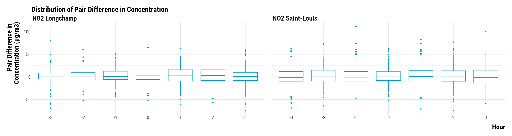<!-- --><div class="sourceCode"><pre class="sourceCode r"><code class="sourceCode r"><span class='co'># save the graph</span>
<span class='va'>graph_boxplot_difference_pollutant_no2</span> <span class='op'>&lt;-</span> <span class='va'>graph_boxplot_difference_pollutant_no2</span> <span class='op'>+</span>
  <span class='fu'>theme</span><span class='op'>(</span>plot.title <span class='op'>=</span> <span class='fu'>element_blank</span><span class='op'>(</span><span class='op'>)</span><span class='op'>)</span>

<span class='fu'>ggsave</span><span class='op'>(</span><span class='va'>graph_boxplot_difference_pollutant_no2</span>, filename <span class='op'>=</span> <span class='fu'>here</span><span class='fu'>::</span><span class='fu'><a href='https://here.r-lib.org//reference/here.html'>here</a></span><span class='op'>(</span><span class='st'>"3.outputs"</span>, <span class='st'>"1.figures"</span>, <span class='st'>"2.experiments_cruise"</span>, <span class='st'>"1.experiment_entry_cruise"</span>, <span class='st'>"2.matching_results"</span>, <span class='st'>"graph_boxplot_difference_pollutant_no2.pdf"</span><span class='op'>)</span>, 
       width <span class='op'>=</span> <span class='fl'>40</span>, height <span class='op'>=</span> <span class='fl'>18</span>, units <span class='op'>=</span> <span class='st'>"cm"</span>, device <span class='op'>=</span> <span class='va'>cairo_pdf</span><span class='op'>)</span>
</code></pre></div>

</div>


## Pairs Differences in O3 Concentrations

Boxplots for O3:

<div class="layout-chunk" data-layout="l-body-outset">
<div class="sourceCode"><pre class="sourceCode r"><code class="sourceCode r"><span class='co'># create the graph for o3</span>
<span class='va'>graph_boxplot_difference_pollutant_o3</span> <span class='op'>&lt;-</span> <span class='va'>data_pair_difference_pollutant</span> <span class='op'>%&gt;%</span>
  <span class='fu'><a href='https://rdrr.io/r/stats/filter.html'>filter</a></span><span class='op'>(</span><span class='fu'>str_detect</span><span class='op'>(</span><span class='va'>pollutant</span>, <span class='st'>"O3"</span><span class='op'>)</span><span class='op'>)</span> <span class='op'>%&gt;%</span>
  <span class='fu'>ggplot</span><span class='op'>(</span><span class='va'>.</span>, <span class='fu'>aes</span><span class='op'>(</span>x <span class='op'>=</span> <span class='fu'><a href='https://rdrr.io/r/base/factor.html'>as.factor</a></span><span class='op'>(</span><span class='va'>time</span><span class='op'>)</span>, y <span class='op'>=</span> <span class='va'>difference</span><span class='op'>)</span><span class='op'>)</span> <span class='op'>+</span>
  <span class='fu'>geom_boxplot</span><span class='op'>(</span>colour <span class='op'>=</span> <span class='st'>"deepskyblue3"</span><span class='op'>)</span> <span class='op'>+</span>
  <span class='fu'>ggtitle</span><span class='op'>(</span><span class='st'>"Distribution of Pair Difference in Concentration"</span><span class='op'>)</span> <span class='op'>+</span>
  <span class='fu'>ylab</span><span class='op'>(</span><span class='st'>"Pair Difference in \nConcentration (µg/m3)"</span><span class='op'>)</span> <span class='op'>+</span> <span class='fu'>xlab</span><span class='op'>(</span><span class='st'>"Hour"</span><span class='op'>)</span> <span class='op'>+</span>
  <span class='va'>custom_theme</span>

<span class='co'># display the graph</span>
<span class='va'>graph_boxplot_difference_pollutant_o3</span>
</code></pre></div>
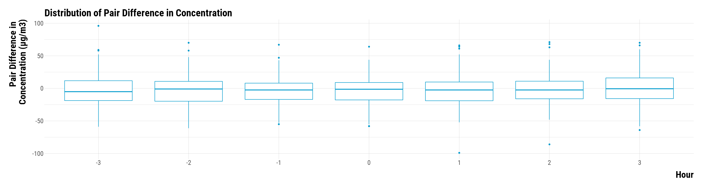<!-- --><div class="sourceCode"><pre class="sourceCode r"><code class="sourceCode r"><span class='co'># save the graph</span>
<span class='va'>graph_boxplot_difference_pollutant_o3</span> <span class='op'>&lt;-</span> <span class='va'>graph_boxplot_difference_pollutant_o3</span> <span class='op'>+</span>
  <span class='fu'>theme</span><span class='op'>(</span>plot.title <span class='op'>=</span> <span class='fu'>element_blank</span><span class='op'>(</span><span class='op'>)</span><span class='op'>)</span>

<span class='fu'>ggsave</span><span class='op'>(</span><span class='va'>graph_boxplot_difference_pollutant_o3</span>, filename <span class='op'>=</span> <span class='fu'>here</span><span class='fu'>::</span><span class='fu'><a href='https://here.r-lib.org//reference/here.html'>here</a></span><span class='op'>(</span><span class='st'>"3.outputs"</span>, <span class='st'>"1.figures"</span>, <span class='st'>"2.experiments_cruise"</span>, <span class='st'>"1.experiment_entry_cruise"</span>, <span class='st'>"2.matching_results"</span>, <span class='st'>"graph_boxplot_difference_pollutant_o3.pdf"</span><span class='op'>)</span>, 
       width <span class='op'>=</span> <span class='fl'>30</span>, height <span class='op'>=</span> <span class='fl'>15</span>, units <span class='op'>=</span> <span class='st'>"cm"</span>, device <span class='op'>=</span> <span class='va'>cairo_pdf</span><span class='op'>)</span>
</code></pre></div>

</div>


## Pairs Differences in PM10 Concentrations

Boxplots for PM10:

<div class="layout-chunk" data-layout="l-body-outset">
<div class="sourceCode"><pre class="sourceCode r"><code class="sourceCode r"><span class='co'># create the graph for pm10</span>
<span class='va'>graph_boxplot_difference_pollutant_pm10</span> <span class='op'>&lt;-</span> <span class='va'>data_pair_difference_pollutant</span> <span class='op'>%&gt;%</span>
  <span class='fu'><a href='https://rdrr.io/r/stats/filter.html'>filter</a></span><span class='op'>(</span><span class='fu'>str_detect</span><span class='op'>(</span><span class='va'>pollutant</span>, <span class='st'>"PM10"</span><span class='op'>)</span><span class='op'>)</span> <span class='op'>%&gt;%</span>
  <span class='fu'>ggplot</span><span class='op'>(</span><span class='va'>.</span>, <span class='fu'>aes</span><span class='op'>(</span>x <span class='op'>=</span> <span class='fu'><a href='https://rdrr.io/r/base/factor.html'>as.factor</a></span><span class='op'>(</span><span class='va'>time</span><span class='op'>)</span>, y <span class='op'>=</span> <span class='va'>difference</span><span class='op'>)</span><span class='op'>)</span> <span class='op'>+</span>
  <span class='fu'>geom_boxplot</span><span class='op'>(</span>colour <span class='op'>=</span> <span class='st'>"deepskyblue3"</span><span class='op'>)</span> <span class='op'>+</span>
  <span class='fu'>facet_wrap</span><span class='op'>(</span><span class='op'>~</span> <span class='va'>pollutant</span><span class='op'>)</span> <span class='op'>+</span>
  <span class='fu'>ggtitle</span><span class='op'>(</span><span class='st'>"Distribution of Pair Difference in Concentration"</span><span class='op'>)</span> <span class='op'>+</span>
  <span class='fu'>ylab</span><span class='op'>(</span><span class='st'>"Pair Difference in \nConcentration (µg/m3)"</span><span class='op'>)</span> <span class='op'>+</span> <span class='fu'>xlab</span><span class='op'>(</span><span class='st'>"Hour"</span><span class='op'>)</span> <span class='op'>+</span>
  <span class='va'>custom_theme</span>

<span class='co'># display the graph</span>
<span class='va'>graph_boxplot_difference_pollutant_pm10</span>
</code></pre></div>
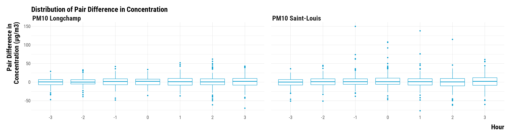<!-- --><div class="sourceCode"><pre class="sourceCode r"><code class="sourceCode r"><span class='co'># save the graph</span>
<span class='va'>graph_boxplot_difference_pollutant_pm10</span> <span class='op'>&lt;-</span> <span class='va'>graph_boxplot_difference_pollutant_pm10</span> <span class='op'>+</span>
  <span class='fu'>theme</span><span class='op'>(</span>plot.title <span class='op'>=</span> <span class='fu'>element_blank</span><span class='op'>(</span><span class='op'>)</span><span class='op'>)</span>

<span class='fu'>ggsave</span><span class='op'>(</span><span class='va'>graph_boxplot_difference_pollutant_pm10</span>, filename <span class='op'>=</span> <span class='fu'>here</span><span class='fu'>::</span><span class='fu'><a href='https://here.r-lib.org//reference/here.html'>here</a></span><span class='op'>(</span><span class='st'>"3.outputs"</span>, <span class='st'>"1.figures"</span>, <span class='st'>"2.experiments_cruise"</span>, <span class='st'>"1.experiment_entry_cruise"</span>, <span class='st'>"2.matching_results"</span>, <span class='st'>"graph_boxplot_difference_pollutant_pm10.pdf"</span><span class='op'>)</span>, 
       width <span class='op'>=</span> <span class='fl'>40</span>, height <span class='op'>=</span> <span class='fl'>18</span>, units <span class='op'>=</span> <span class='st'>"cm"</span>, device <span class='op'>=</span> <span class='va'>cairo_pdf</span><span class='op'>)</span>
</code></pre></div>

</div>


## Pairs Differences in PM2.5 Concentrations

Boxplots for PM2.5:

<div class="layout-chunk" data-layout="l-body-outset">
<div class="sourceCode"><pre class="sourceCode r"><code class="sourceCode r"><span class='co'># create the graph for pm2.5</span>
<span class='va'>graph_boxplot_difference_pollutant_pm25</span> <span class='op'>&lt;-</span> <span class='va'>data_pair_difference_pollutant</span> <span class='op'>%&gt;%</span>
  <span class='fu'><a href='https://rdrr.io/r/stats/filter.html'>filter</a></span><span class='op'>(</span><span class='fu'>str_detect</span><span class='op'>(</span><span class='va'>pollutant</span>, <span class='st'>"PM2.5"</span><span class='op'>)</span><span class='op'>)</span> <span class='op'>%&gt;%</span>
  <span class='fu'>ggplot</span><span class='op'>(</span><span class='va'>.</span>, <span class='fu'>aes</span><span class='op'>(</span>x <span class='op'>=</span> <span class='fu'><a href='https://rdrr.io/r/base/factor.html'>as.factor</a></span><span class='op'>(</span><span class='va'>time</span><span class='op'>)</span>, y <span class='op'>=</span> <span class='va'>difference</span><span class='op'>)</span><span class='op'>)</span> <span class='op'>+</span>
  <span class='fu'>geom_boxplot</span><span class='op'>(</span>colour <span class='op'>=</span> <span class='st'>"deepskyblue3"</span><span class='op'>)</span> <span class='op'>+</span>
  <span class='fu'>ggtitle</span><span class='op'>(</span><span class='st'>"Distribution of Pair Difference in Concentration"</span><span class='op'>)</span> <span class='op'>+</span>
  <span class='fu'>ylab</span><span class='op'>(</span><span class='st'>"Pair Difference in \nConcentration (µg/m3)"</span><span class='op'>)</span> <span class='op'>+</span> <span class='fu'>xlab</span><span class='op'>(</span><span class='st'>"Hour"</span><span class='op'>)</span> <span class='op'>+</span>
  <span class='va'>custom_theme</span>

<span class='co'># display the graph</span>
<span class='va'>graph_boxplot_difference_pollutant_pm25</span>
</code></pre></div>
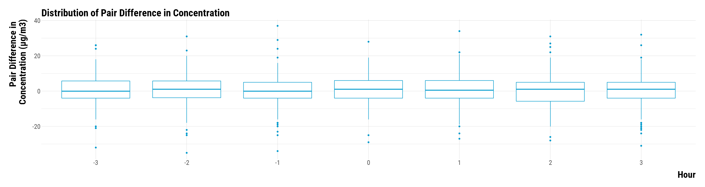<!-- --><div class="sourceCode"><pre class="sourceCode r"><code class="sourceCode r"><span class='co'># save the graph</span>
<span class='va'>graph_boxplot_difference_pollutant_pm25</span> <span class='op'>&lt;-</span> <span class='va'>graph_boxplot_difference_pollutant_pm25</span> <span class='op'>+</span>
  <span class='fu'>theme</span><span class='op'>(</span>plot.title <span class='op'>=</span> <span class='fu'>element_blank</span><span class='op'>(</span><span class='op'>)</span><span class='op'>)</span>

<span class='fu'>ggsave</span><span class='op'>(</span><span class='va'>graph_boxplot_difference_pollutant_pm25</span>, filename <span class='op'>=</span> <span class='fu'>here</span><span class='fu'>::</span><span class='fu'><a href='https://here.r-lib.org//reference/here.html'>here</a></span><span class='op'>(</span><span class='st'>"3.outputs"</span>, <span class='st'>"1.figures"</span>, <span class='st'>"2.experiments_cruise"</span>, <span class='st'>"1.experiment_entry_cruise"</span>, <span class='st'>"2.matching_results"</span>, <span class='st'>"graph_boxplot_difference_pollutant_pm25.pdf"</span><span class='op'>)</span>, 
       width <span class='op'>=</span> <span class='fl'>30</span>, height <span class='op'>=</span> <span class='fl'>15</span>, units <span class='op'>=</span> <span class='st'>"cm"</span>, device <span class='op'>=</span> <span class='va'>cairo_pdf</span><span class='op'>)</span>
</code></pre></div>

</div>


## Pairs Differences in SO2 Concentrations

Boxplots for SO2:

<div class="layout-chunk" data-layout="l-body-outset">
<div class="sourceCode"><pre class="sourceCode r"><code class="sourceCode r"><span class='co'># create the graph for so2</span>
<span class='va'>graph_boxplot_difference_pollutant_so2</span> <span class='op'>&lt;-</span> <span class='va'>data_pair_difference_pollutant</span> <span class='op'>%&gt;%</span>
  <span class='fu'><a href='https://rdrr.io/r/stats/filter.html'>filter</a></span><span class='op'>(</span><span class='fu'>str_detect</span><span class='op'>(</span><span class='va'>pollutant</span>, <span class='st'>"SO2"</span><span class='op'>)</span><span class='op'>)</span> <span class='op'>%&gt;%</span>
  <span class='fu'>ggplot</span><span class='op'>(</span><span class='va'>.</span>, <span class='fu'>aes</span><span class='op'>(</span>x <span class='op'>=</span> <span class='fu'><a href='https://rdrr.io/r/base/factor.html'>as.factor</a></span><span class='op'>(</span><span class='va'>time</span><span class='op'>)</span>, y <span class='op'>=</span> <span class='va'>difference</span><span class='op'>)</span><span class='op'>)</span> <span class='op'>+</span>
  <span class='fu'>geom_boxplot</span><span class='op'>(</span>colour <span class='op'>=</span> <span class='st'>"deepskyblue3"</span><span class='op'>)</span> <span class='op'>+</span>
  <span class='fu'>ggtitle</span><span class='op'>(</span><span class='st'>"Distribution of Pair Difference in Concentration"</span><span class='op'>)</span> <span class='op'>+</span>
  <span class='fu'>ylab</span><span class='op'>(</span><span class='st'>"Pair Difference in \nConcentration (µg/m3)"</span><span class='op'>)</span> <span class='op'>+</span> <span class='fu'>xlab</span><span class='op'>(</span><span class='st'>"Hour"</span><span class='op'>)</span> <span class='op'>+</span>
  <span class='va'>custom_theme</span>

<span class='co'># display the graph</span>
<span class='va'>graph_boxplot_difference_pollutant_so2</span>
</code></pre></div>
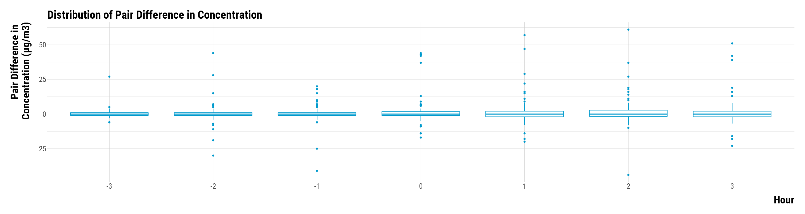<!-- --><div class="sourceCode"><pre class="sourceCode r"><code class="sourceCode r"><span class='co'># save the graph</span>
<span class='va'>graph_boxplot_difference_pollutant_so2</span> <span class='op'>&lt;-</span> <span class='va'>graph_boxplot_difference_pollutant_so2</span> <span class='op'>+</span>
  <span class='fu'>theme</span><span class='op'>(</span>plot.title <span class='op'>=</span> <span class='fu'>element_blank</span><span class='op'>(</span><span class='op'>)</span><span class='op'>)</span>

<span class='fu'>ggsave</span><span class='op'>(</span><span class='va'>graph_boxplot_difference_pollutant_so2</span>, filename <span class='op'>=</span> <span class='fu'>here</span><span class='fu'>::</span><span class='fu'><a href='https://here.r-lib.org//reference/here.html'>here</a></span><span class='op'>(</span><span class='st'>"3.outputs"</span>, <span class='st'>"1.figures"</span>, <span class='st'>"2.experiments_cruise"</span>, <span class='st'>"1.experiment_entry_cruise"</span>, <span class='st'>"2.matching_results"</span>, <span class='st'>"graph_boxplot_difference_pollutant_so2.pdf"</span><span class='op'>)</span>, 
       width <span class='op'>=</span> <span class='fl'>30</span>, height <span class='op'>=</span> <span class='fl'>15</span>, units <span class='op'>=</span> <span class='st'>"cm"</span>, device <span class='op'>=</span> <span class='va'>cairo_pdf</span><span class='op'>)</span>
</code></pre></div>

</div>


# Testing the Sharp Null Hypothesis

We test the sharp null hypothesis of no effect for any units. We first create a dataset where we nest the pair differences by pollutant and time. We also compute the observed test statistic which is the observed average of pair differences:

<div class="layout-chunk" data-layout="l-body">
<div class="sourceCode"><pre class="sourceCode r"><code class="sourceCode r"><span class='co'># nest the data by pollutant and time</span>
<span class='va'>ri_data_sharp_null</span> <span class='op'>&lt;-</span> <span class='va'>data_pair_difference_pollutant</span>   <span class='op'>%&gt;%</span>
  <span class='fu'>select</span><span class='op'>(</span><span class='va'>pollutant</span>, <span class='va'>time</span>, <span class='va'>difference</span><span class='op'>)</span> <span class='op'>%&gt;%</span>
  <span class='fu'>group_by</span><span class='op'>(</span><span class='va'>pollutant</span>, <span class='va'>time</span><span class='op'>)</span> <span class='op'>%&gt;%</span>
  <span class='fu'>mutate</span><span class='op'>(</span>observed_mean_difference <span class='op'>=</span> <span class='fu'><a href='https://rdrr.io/r/base/mean.html'>mean</a></span><span class='op'>(</span><span class='va'>difference</span><span class='op'>)</span><span class='op'>)</span> <span class='op'>%&gt;%</span>
  <span class='fu'>group_by</span><span class='op'>(</span><span class='va'>pollutant</span>, <span class='va'>time</span>, <span class='va'>observed_mean_difference</span><span class='op'>)</span> <span class='op'>%&gt;%</span>
  <span class='fu'>summarise</span><span class='op'>(</span>data_difference <span class='op'>=</span> <span class='fu'><a href='https://rdrr.io/r/base/list.html'>list</a></span><span class='op'>(</span><span class='va'>difference</span><span class='op'>)</span><span class='op'>)</span>
</code></pre></div>

</div>


We then create a function to compute the randomization distribution of the test statistic:

<div class="layout-chunk" data-layout="l-body">
<div class="sourceCode"><pre class="sourceCode r"><code class="sourceCode r"><span class='co'># randomization distribution function</span>
<span class='co'># this function takes the vector of pair differences</span>
<span class='co'># and then compute the average pair difference according </span>
<span class='co'># to the permuted treatment assignment</span>
<span class='va'>function_randomization_distribution</span> <span class='op'>&lt;-</span> <span class='kw'>function</span><span class='op'>(</span><span class='va'>data_difference</span><span class='op'>)</span> <span class='op'>{</span>
  <span class='va'>randomization_distribution</span> <span class='op'>=</span> <span class='cn'>NULL</span>
  <span class='va'>n_columns</span> <span class='op'>=</span> <span class='fu'><a href='https://rdrr.io/r/base/dim.html'>dim</a></span><span class='op'>(</span><span class='va'>permutations_matrix</span><span class='op'>)</span><span class='op'>[</span><span class='fl'>2</span><span class='op'>]</span>
  <span class='kw'>for</span> <span class='op'>(</span><span class='va'>i</span> <span class='kw'>in</span> <span class='fl'>1</span><span class='op'>:</span><span class='va'>n_columns</span><span class='op'>)</span> <span class='op'>{</span>
    <span class='va'>randomization_distribution</span><span class='op'>[</span><span class='va'>i</span><span class='op'>]</span> <span class='op'>=</span>  <span class='fu'><a href='https://rdrr.io/r/base/sum.html'>sum</a></span><span class='op'>(</span><span class='va'>data_difference</span> <span class='op'>*</span> <span class='va'>permutations_matrix</span><span class='op'>[</span>, <span class='va'>i</span><span class='op'>]</span><span class='op'>)</span> <span class='op'>/</span> <span class='va'>number_pairs</span>
  <span class='op'>}</span>
  <span class='kw'><a href='https://rdrr.io/r/base/function.html'>return</a></span><span class='op'>(</span><span class='va'>randomization_distribution</span><span class='op'>)</span>
<span class='op'>}</span>
</code></pre></div>

</div>


We store the number of pairs and the number of simulations we want to run:

<div class="layout-chunk" data-layout="l-body">
<div class="sourceCode"><pre class="sourceCode r"><code class="sourceCode r"><span class='co'># define number of pairs in the experiment</span>
<span class='va'>number_pairs</span> <span class='op'>&lt;-</span> <span class='fu'><a href='https://rdrr.io/r/base/nrow.html'>nrow</a></span><span class='op'>(</span><span class='va'>data_matched</span><span class='op'>)</span><span class='op'>/</span><span class='fl'>2</span>

<span class='co'># define number of simulations</span>
<span class='va'>number_simulations</span> <span class='op'>&lt;-</span> <span class='fl'>100000</span>
</code></pre></div>

</div>


We compute the permutations matrix:

<div class="layout-chunk" data-layout="l-body">
<div class="sourceCode"><pre class="sourceCode r"><code class="sourceCode r"><span class='co'># set the seed</span>
<span class='fu'><a href='https://rdrr.io/r/base/Random.html'>set.seed</a></span><span class='op'>(</span><span class='fl'>42</span><span class='op'>)</span>

<span class='co'># compute the permutations matrix</span>
<span class='va'>permutations_matrix</span> <span class='op'>&lt;-</span> <span class='fu'><a href='https://rdrr.io/r/base/matrix.html'>matrix</a></span><span class='op'>(</span><span class='fu'><a href='https://rdrr.io/r/stats/Binomial.html'>rbinom</a></span><span class='op'>(</span><span class='va'>number_pairs</span><span class='op'>*</span><span class='va'>number_simulations</span>, <span class='fl'>1</span>,<span class='fl'>.5</span><span class='op'>)</span><span class='op'>*</span><span class='fl'>2</span><span class='op'>-</span><span class='fl'>1</span>, nrow <span class='op'>=</span> <span class='va'>number_pairs</span>, ncol <span class='op'>=</span> <span class='va'>number_simulations</span><span class='op'>)</span>
</code></pre></div>

</div>


For each pollutant and time, we compute the randomization distribution of the test statistic using 100,000 iterations. It took us 46 seconds to run this code chunck on our basic local computer:

<div class="layout-chunk" data-layout="l-body">
<div class="sourceCode"><pre class="sourceCode r"><code class="sourceCode r"><span class='co'># compute the test statistic distribution</span>
<span class='va'>ri_data_sharp_null</span> <span class='op'>&lt;-</span> <span class='va'>ri_data_sharp_null</span> <span class='op'>%&gt;%</span>
  <span class='fu'>mutate</span><span class='op'>(</span>randomization_distribution <span class='op'>=</span> <span class='fu'>map</span><span class='op'>(</span><span class='va'>data_difference</span>, <span class='op'>~</span> <span class='fu'>function_randomization_distribution</span><span class='op'>(</span><span class='va'>.</span><span class='op'>)</span><span class='op'>)</span><span class='op'>)</span>
</code></pre></div>

</div>


Using the observed value of the test statistic and its randomization distribution, we compute the two-sided *p*-values:

<div class="layout-chunk" data-layout="l-body">
<div class="sourceCode"><pre class="sourceCode r"><code class="sourceCode r"><span class='co'># function to compute the upper one-sided p-value</span>
<span class='va'>function_fisher_upper_p_value</span> <span class='op'>&lt;-</span> <span class='kw'>function</span><span class='op'>(</span><span class='va'>observed_mean_difference</span>, <span class='va'>randomization_distribution</span><span class='op'>)</span><span class='op'>{</span>
  <span class='fu'><a href='https://rdrr.io/r/base/sum.html'>sum</a></span><span class='op'>(</span><span class='va'>randomization_distribution</span> <span class='op'>&gt;=</span> <span class='va'>observed_mean_difference</span><span class='op'>)</span><span class='op'>/</span><span class='va'>number_simulations</span>
<span class='op'>}</span>

<span class='co'># function compute the lower one-sided p-value</span>
<span class='va'>function_fisher_lower_p_value</span> <span class='op'>&lt;-</span> <span class='kw'>function</span><span class='op'>(</span><span class='va'>observed_mean_difference</span>, <span class='va'>randomization_distribution</span><span class='op'>)</span><span class='op'>{</span>
  <span class='fu'><a href='https://rdrr.io/r/base/sum.html'>sum</a></span><span class='op'>(</span><span class='va'>randomization_distribution</span> <span class='op'>&lt;=</span> <span class='va'>observed_mean_difference</span><span class='op'>)</span><span class='op'>/</span><span class='va'>number_simulations</span>
<span class='op'>}</span>

<span class='co'># compute the lower and upper one-sided p-values</span>
<span class='va'>ri_data_sharp_null</span> <span class='op'>&lt;-</span> <span class='va'>ri_data_sharp_null</span> <span class='op'>%&gt;%</span>
  <span class='fu'>mutate</span><span class='op'>(</span>p_value_upper <span class='op'>=</span> <span class='fu'>map2_dbl</span><span class='op'>(</span><span class='va'>observed_mean_difference</span>, <span class='va'>randomization_distribution</span>, <span class='op'>~</span> <span class='fu'>function_fisher_upper_p_value</span><span class='op'>(</span><span class='va'>.x</span>, <span class='va'>.y</span><span class='op'>)</span><span class='op'>)</span>,
         p_value_lower <span class='op'>=</span> <span class='fu'>map2_dbl</span><span class='op'>(</span><span class='va'>observed_mean_difference</span>, <span class='va'>randomization_distribution</span>, <span class='op'>~</span> <span class='fu'>function_fisher_lower_p_value</span><span class='op'>(</span><span class='va'>.x</span>, <span class='va'>.y</span><span class='op'>)</span><span class='op'>)</span><span class='op'>)</span>

<span class='co'># compute the two-sided p-value using rosenbaum (2010) procedure</span>
<span class='va'>ri_data_sharp_null</span> <span class='op'>&lt;-</span> <span class='va'>ri_data_sharp_null</span> <span class='op'>%&gt;%</span>
  <span class='fu'>rowwise</span><span class='op'>(</span><span class='op'>)</span> <span class='op'>%&gt;%</span>
  <span class='fu'>mutate</span><span class='op'>(</span>two_sided_p_value <span class='op'>=</span> <span class='fu'><a href='https://rdrr.io/r/base/Extremes.html'>min</a></span><span class='op'>(</span><span class='fu'><a href='https://rdrr.io/r/base/c.html'>c</a></span><span class='op'>(</span><span class='va'>p_value_upper</span>, <span class='va'>p_value_lower</span><span class='op'>)</span><span class='op'>)</span><span class='op'>*</span><span class='fl'>2</span><span class='op'>)</span> <span class='op'>%&gt;%</span>
  <span class='fu'>mutate</span><span class='op'>(</span>two_sided_p_value <span class='op'>=</span> <span class='fu'><a href='https://rdrr.io/r/base/Extremes.html'>min</a></span><span class='op'>(</span><span class='va'>two_sided_p_value</span>, <span class='fl'>1</span><span class='op'>)</span><span class='op'>)</span> <span class='op'>%&gt;%</span>
  <span class='fu'>select</span><span class='op'>(</span><span class='va'>pollutant</span>, <span class='va'>time</span>, <span class='va'>observed_mean_difference</span>, <span class='va'>two_sided_p_value</span><span class='op'>)</span> <span class='op'>%&gt;%</span>
  <span class='fu'>ungroup</span><span class='op'>(</span><span class='op'>)</span>
</code></pre></div>

</div>


We plot below the two-sided p-values for the sharp null hypothesis for each pollutant:

<div class="layout-chunk" data-layout="l-body-outset">
<div class="sourceCode"><pre class="sourceCode r"><code class="sourceCode r"><span class='co'># make the graph</span>
<span class='va'>graph_p_values</span> <span class='op'>&lt;-</span> <span class='va'>ri_data_sharp_null</span> <span class='op'>%&gt;%</span>
  <span class='fu'>ggplot</span><span class='op'>(</span><span class='va'>.</span>, <span class='fu'>aes</span><span class='op'>(</span>x <span class='op'>=</span> <span class='fu'><a href='https://rdrr.io/r/base/factor.html'>as.factor</a></span><span class='op'>(</span><span class='va'>time</span><span class='op'>)</span>, y <span class='op'>=</span> <span class='va'>two_sided_p_value</span><span class='op'>)</span><span class='op'>)</span> <span class='op'>+</span>
  <span class='fu'>geom_segment</span><span class='op'>(</span><span class='fu'>aes</span><span class='op'>(</span>x <span class='op'>=</span> <span class='fu'><a href='https://rdrr.io/r/base/factor.html'>as.factor</a></span><span class='op'>(</span><span class='va'>time</span><span class='op'>)</span>, xend <span class='op'>=</span> <span class='fu'><a href='https://rdrr.io/r/base/factor.html'>as.factor</a></span><span class='op'>(</span><span class='va'>time</span><span class='op'>)</span>, y <span class='op'>=</span> <span class='fl'>0</span>, yend <span class='op'>=</span> <span class='va'>two_sided_p_value</span><span class='op'>)</span><span class='op'>)</span> <span class='op'>+</span>
  <span class='fu'>geom_point</span><span class='op'>(</span>shape <span class='op'>=</span> <span class='fl'>21</span>, size <span class='op'>=</span> <span class='fl'>8</span>, colour <span class='op'>=</span> <span class='st'>"black"</span>, fill <span class='op'>=</span> <span class='st'>"deepskyblue3"</span><span class='op'>)</span> <span class='op'>+</span>
  <span class='fu'>facet_wrap</span><span class='op'>(</span><span class='op'>~</span> <span class='va'>pollutant</span>, ncol <span class='op'>=</span> <span class='fl'>4</span><span class='op'>)</span> <span class='op'>+</span>
  <span class='fu'>xlab</span><span class='op'>(</span><span class='st'>"Hour"</span><span class='op'>)</span> <span class='op'>+</span> <span class='fu'>ylab</span><span class='op'>(</span><span class='st'>"Two-Sided P-Value"</span><span class='op'>)</span> <span class='op'>+</span>
  <span class='va'>custom_theme</span> <span class='op'>+</span>
  <span class='fu'>theme</span><span class='op'>(</span>
    <span class='co'># axis titles parameters</span>
    axis.title.x <span class='op'>=</span> <span class='fu'>element_text</span><span class='op'>(</span>size<span class='op'>=</span><span class='fl'>36</span>, face <span class='op'>=</span> <span class='st'>"bold"</span>, margin <span class='op'>=</span> <span class='fu'>margin</span><span class='op'>(</span>t <span class='op'>=</span> <span class='fl'>20</span>, r <span class='op'>=</span> <span class='fl'>0</span>, b <span class='op'>=</span> <span class='fl'>0</span>, l <span class='op'>=</span><span class='fl'>0</span><span class='op'>)</span><span class='op'>)</span>,
    axis.title.y <span class='op'>=</span> <span class='fu'>element_text</span><span class='op'>(</span>size<span class='op'>=</span><span class='fl'>36</span>, face <span class='op'>=</span> <span class='st'>"bold"</span>, margin <span class='op'>=</span> <span class='fu'>margin</span><span class='op'>(</span>t <span class='op'>=</span> <span class='fl'>0</span>, r <span class='op'>=</span> <span class='fl'>20</span>, b <span class='op'>=</span> <span class='fl'>0</span>, l <span class='op'>=</span> <span class='fl'>0</span><span class='op'>)</span><span class='op'>)</span>,
    <span class='co'># axis texts</span>
    axis.text.x <span class='op'>=</span> <span class='fu'>element_text</span><span class='op'>(</span>size<span class='op'>=</span><span class='fl'>20</span><span class='op'>)</span>,
    axis.text.y <span class='op'>=</span> <span class='fu'>element_text</span><span class='op'>(</span>size<span class='op'>=</span><span class='fl'>20</span><span class='op'>)</span>,
    <span class='co'># facet texts</span>
    strip.text.x <span class='op'>=</span> <span class='fu'>element_text</span><span class='op'>(</span>size<span class='op'>=</span><span class='fl'>36</span>, face <span class='op'>=</span> <span class='st'>"bold"</span><span class='op'>)</span>,
    strip.text.y <span class='op'>=</span> <span class='fu'>element_text</span><span class='op'>(</span>size<span class='op'>=</span><span class='fl'>36</span>, face <span class='op'>=</span> <span class='st'>"bold"</span><span class='op'>)</span><span class='op'>)</span>
  
<span class='co'># display the graph</span>
<span class='va'>graph_p_values</span>
</code></pre></div>
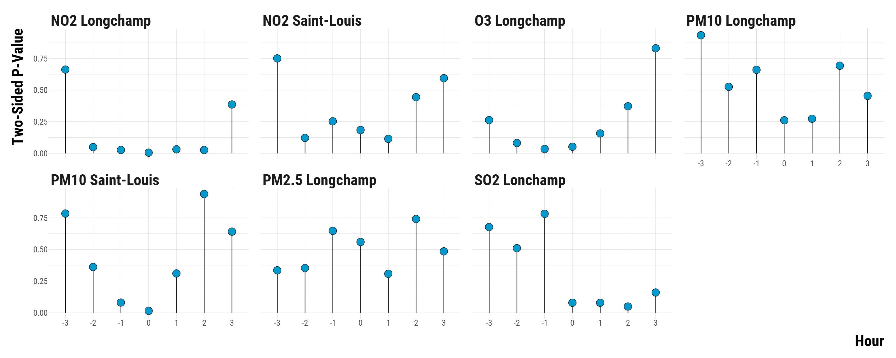<!-- --><div class="sourceCode"><pre class="sourceCode r"><code class="sourceCode r"><span class='co'># save the graph</span>
<span class='fu'>ggsave</span><span class='op'>(</span><span class='va'>graph_p_values</span>, filename <span class='op'>=</span> <span class='fu'>here</span><span class='fu'>::</span><span class='fu'><a href='https://here.r-lib.org//reference/here.html'>here</a></span><span class='op'>(</span><span class='st'>"3.outputs"</span>, <span class='st'>"1.figures"</span>, <span class='st'>"2.experiments_cruise"</span>, <span class='st'>"1.experiment_entry_cruise"</span>, <span class='st'>"2.matching_results"</span>, <span class='st'>"graph_p_values.pdf"</span><span class='op'>)</span>, 
       width <span class='op'>=</span> <span class='fl'>60</span>, height <span class='op'>=</span> <span class='fl'>25</span>, units <span class='op'>=</span> <span class='st'>"cm"</span>, device <span class='op'>=</span> <span class='va'>cairo_pdf</span><span class='op'>)</span>
</code></pre></div>

</div>


We display below the table of Fisher p-values:

<div class="layout-chunk" data-layout="l-body-outset">
<div data-pagedtable="false">
  <script data-pagedtable-source type="application/json">
{"columns":[{"label":["Pollutant"],"name":[1],"type":["chr"],"align":["left"]},{"label":["Time"],"name":[2],"type":["dbl"],"align":["right"]},{"label":["Observed Value of the Test Statistic"],"name":[3],"type":["dbl"],"align":["right"]},{"label":["Two-Sided P-Values"],"name":[4],"type":["dbl"],"align":["right"]}],"data":[{"1":"NO2 Longchamp","2":"-3","3":"0.7","4":"0.66218"},{"1":"NO2 Longchamp","2":"-2","3":"2.8","4":"0.04892"},{"1":"NO2 Longchamp","2":"-1","3":"3.5","4":"0.02636"},{"1":"NO2 Longchamp","2":"0","3":"4.7","4":"0.00526"},{"1":"NO2 Longchamp","2":"1","3":"3.8","4":"0.03146"},{"1":"NO2 Longchamp","2":"2","3":"3.8","4":"0.02606"},{"1":"NO2 Longchamp","2":"3","3":"1.5","4":"0.38610"},{"1":"NO2 Saint-Louis","2":"-3","3":"-0.6","4":"0.75050"},{"1":"NO2 Saint-Louis","2":"-2","3":"2.7","4":"0.12194"},{"1":"NO2 Saint-Louis","2":"-1","3":"2.3","4":"0.25304"},{"1":"NO2 Saint-Louis","2":"0","3":"2.5","4":"0.18410"},{"1":"NO2 Saint-Louis","2":"1","3":"3.2","4":"0.11408"},{"1":"NO2 Saint-Louis","2":"2","3":"1.5","4":"0.44368"},{"1":"NO2 Saint-Louis","2":"3","3":"1.1","4":"0.59404"},{"1":"O3 Longchamp","2":"-3","3":"-2.3","4":"0.26246"},{"1":"O3 Longchamp","2":"-2","3":"-3.3","4":"0.08144"},{"1":"O3 Longchamp","2":"-1","3":"-3.9","4":"0.03388"},{"1":"O3 Longchamp","2":"0","3":"-3.8","4":"0.05178"},{"1":"O3 Longchamp","2":"1","3":"-2.9","4":"0.15714"},{"1":"O3 Longchamp","2":"2","3":"-1.8","4":"0.37182"},{"1":"O3 Longchamp","2":"3","3":"0.4","4":"0.83066"},{"1":"PM10 Longchamp","2":"-3","3":"0.1","4":"0.93350"},{"1":"PM10 Longchamp","2":"-2","3":"0.7","4":"0.52556"},{"1":"PM10 Longchamp","2":"-1","3":"0.5","4":"0.65988"},{"1":"PM10 Longchamp","2":"0","3":"1.2","4":"0.26110"},{"1":"PM10 Longchamp","2":"1","3":"1.4","4":"0.27340"},{"1":"PM10 Longchamp","2":"2","3":"0.6","4":"0.69278"},{"1":"PM10 Longchamp","2":"3","3":"1.1","4":"0.45402"},{"1":"PM10 Saint-Louis","2":"-3","3":"-0.3","4":"0.78420"},{"1":"PM10 Saint-Louis","2":"-2","3":"1.1","4":"0.36162"},{"1":"PM10 Saint-Louis","2":"-1","3":"3.1","4":"0.08050"},{"1":"PM10 Saint-Louis","2":"0","3":"4.6","4":"0.01444"},{"1":"PM10 Saint-Louis","2":"1","3":"2.0","4":"0.31054"},{"1":"PM10 Saint-Louis","2":"2","3":"0.1","4":"0.93876"},{"1":"PM10 Saint-Louis","2":"3","3":"0.8","4":"0.64126"},{"1":"PM2.5 Longchamp","2":"-3","3":"0.7","4":"0.33532"},{"1":"PM2.5 Longchamp","2":"-2","3":"0.8","4":"0.35306"},{"1":"PM2.5 Longchamp","2":"-1","3":"0.4","4":"0.64726"},{"1":"PM2.5 Longchamp","2":"0","3":"0.4","4":"0.55946"},{"1":"PM2.5 Longchamp","2":"1","3":"0.8","4":"0.30786"},{"1":"PM2.5 Longchamp","2":"2","3":"0.3","4":"0.74130"},{"1":"PM2.5 Longchamp","2":"3","3":"0.6","4":"0.48524"},{"1":"SO2 Lonchamp","2":"-3","3":"0.1","4":"0.67732"},{"1":"SO2 Lonchamp","2":"-2","3":"0.4","4":"0.51024"},{"1":"SO2 Lonchamp","2":"-1","3":"0.1","4":"0.78206"},{"1":"SO2 Lonchamp","2":"0","3":"1.2","4":"0.07888"},{"1":"SO2 Lonchamp","2":"1","3":"1.2","4":"0.07876"},{"1":"SO2 Lonchamp","2":"2","3":"1.4","4":"0.04896"},{"1":"SO2 Lonchamp","2":"3","3":"1.0","4":"0.15980"}],"options":{"columns":{"min":{},"max":[10]},"rows":{"min":[10],"max":[10]},"pages":{}}}
  </script>
</div>

</div>


# Computing Fisherian intervals

To quickly compute 95% Fisherian intervals, we run the procedure on an Amazon Web Services virtual computer (EC2 t3.2xlarge). It took about 38 minutes for the code to run. It can be found in the `script_aws_fisherian_intervals.R` file. We explain below how we proceed. We first create a nested dataset with the pair differences for each pollutant and hour. We also add the set of hypothetical constant effects.

<div class="layout-chunk" data-layout="l-body">
<div class="sourceCode"><pre class="sourceCode r"><code class="sourceCode r"><span class='co'># create a nested dataframe with </span>
<span class='co'># the set of constant treatment effect sizes</span>
<span class='co'># and the vector of observed pair differences</span>
<span class='va'>ri_data_fi</span> <span class='op'>&lt;-</span> <span class='va'>data_pair_difference_pollutant</span> <span class='op'>%&gt;%</span>
  <span class='fu'>select</span><span class='op'>(</span><span class='va'>pollutant</span>, <span class='va'>time</span>, <span class='va'>difference</span><span class='op'>)</span> <span class='op'>%&gt;%</span>
  <span class='fu'>group_by</span><span class='op'>(</span><span class='va'>pollutant</span>, <span class='va'>time</span><span class='op'>)</span> <span class='op'>%&gt;%</span>
  <span class='fu'>summarise</span><span class='op'>(</span>data_difference <span class='op'>=</span> <span class='fu'><a href='https://rdrr.io/r/base/list.html'>list</a></span><span class='op'>(</span><span class='va'>difference</span><span class='op'>)</span><span class='op'>)</span> <span class='op'>%&gt;%</span>
  <span class='fu'>group_by</span><span class='op'>(</span><span class='va'>pollutant</span>, <span class='va'>time</span>, <span class='va'>data_difference</span><span class='op'>)</span> <span class='op'>%&gt;%</span>
  <span class='fu'>expand</span><span class='op'>(</span>effect <span class='op'>=</span> <span class='fu'><a href='https://rdrr.io/r/base/seq.html'>seq</a></span><span class='op'>(</span>from <span class='op'>=</span> <span class='op'>-</span><span class='fl'>10</span>, to <span class='op'>=</span> <span class='fl'>10</span>, by <span class='op'>=</span> <span class='fl'>0.1</span><span class='op'>)</span><span class='op'>)</span> <span class='op'>%&gt;%</span>
  <span class='fu'>ungroup</span><span class='op'>(</span><span class='op'>)</span>
</code></pre></div>

</div>

 
We then substract for each pair difference the hypothetical constant effect:

<div class="layout-chunk" data-layout="l-body">
<div class="sourceCode"><pre class="sourceCode r"><code class="sourceCode r"><span class='co'># function to get the observed statistic</span>
<span class='va'>adjusted_pair_difference_function</span> <span class='op'>&lt;-</span> <span class='kw'>function</span><span class='op'>(</span><span class='va'>pair_differences</span>, <span class='va'>effect</span><span class='op'>)</span><span class='op'>{</span>
  <span class='va'>adjusted_pair_difference</span> <span class='op'>&lt;-</span> <span class='va'>pair_differences</span><span class='op'>-</span><span class='va'>effect</span>
  <span class='kw'><a href='https://rdrr.io/r/base/function.html'>return</a></span><span class='op'>(</span><span class='va'>adjusted_pair_difference</span><span class='op'>)</span>
<span class='op'>}</span> 

<span class='co'># compute the adjusted pair differences</span>
<span class='va'>ri_data_fi</span> <span class='op'>&lt;-</span> <span class='va'>ri_data_fi</span> <span class='op'>%&gt;%</span>
  <span class='fu'>mutate</span><span class='op'>(</span>data_adjusted_pair_difference <span class='op'>=</span> <span class='fu'>map2</span><span class='op'>(</span><span class='va'>data_difference</span>, <span class='va'>effect</span>, <span class='op'>~</span> <span class='fu'>adjusted_pair_difference_function</span><span class='op'>(</span><span class='va'>.x</span>, <span class='va'>.y</span><span class='op'>)</span><span class='op'>)</span><span class='op'>)</span>
</code></pre></div>

</div>


We compute the observed mean of adjusted pair differences:

<div class="layout-chunk" data-layout="l-body">
<div class="sourceCode"><pre class="sourceCode r"><code class="sourceCode r"><span class='co'># compute the observed mean of adjusted pair differences</span>
<span class='va'>ri_data_fi</span> <span class='op'>&lt;-</span> <span class='va'>ri_data_fi</span> <span class='op'>%&gt;%</span>
  <span class='fu'>mutate</span><span class='op'>(</span>observed_mean_difference <span class='op'>=</span> <span class='fu'>map</span><span class='op'>(</span><span class='va'>data_adjusted_pair_difference</span>, <span class='op'>~</span> <span class='fu'><a href='https://rdrr.io/r/base/mean.html'>mean</a></span><span class='op'>(</span><span class='va'>.</span><span class='op'>)</span><span class='op'>)</span><span class='op'>)</span> <span class='op'>%&gt;%</span>
  <span class='fu'>unnest</span><span class='op'>(</span>cols <span class='op'>=</span> <span class='fu'><a href='https://rdrr.io/r/base/c.html'>c</a></span><span class='op'>(</span><span class='va'>observed_mean_difference</span><span class='op'>)</span><span class='op'>)</span> <span class='op'>%&gt;%</span>
  <span class='fu'>select</span><span class='op'>(</span><span class='op'>-</span><span class='va'>data_difference</span><span class='op'>)</span> <span class='op'>%&gt;%</span>
  <span class='fu'>ungroup</span><span class='op'>(</span><span class='op'>)</span>
</code></pre></div>

</div>


We use the same `function_randomization_distribution` to compute the randomization distribution of the test statistic and run 100,000 iterations for each pollutant-hour observation:

<div class="layout-chunk" data-layout="l-body">
<div class="sourceCode"><pre class="sourceCode r"><code class="sourceCode r"><span class='co'># define number of pairs in the experiment</span>
<span class='va'>number_pairs</span> <span class='op'>&lt;-</span> <span class='fu'><a href='https://rdrr.io/r/base/nrow.html'>nrow</a></span><span class='op'>(</span><span class='va'>data_matched</span><span class='op'>)</span><span class='op'>/</span><span class='fl'>2</span>

<span class='co'># define number of simulations</span>
<span class='va'>number_simulations</span> <span class='op'>&lt;-</span> <span class='fl'>100000</span>

<span class='co'># compute the permutations matrix</span>
<span class='va'>permutations_matrix</span> <span class='op'>&lt;-</span> <span class='fu'><a href='https://rdrr.io/r/base/matrix.html'>matrix</a></span><span class='op'>(</span><span class='fu'><a href='https://rdrr.io/r/stats/Binomial.html'>rbinom</a></span><span class='op'>(</span><span class='va'>number_pairs</span><span class='op'>*</span><span class='va'>number_simulations</span>, <span class='fl'>1</span>,<span class='fl'>.5</span><span class='op'>)</span><span class='op'>*</span><span class='fl'>2</span><span class='op'>-</span><span class='fl'>1</span>, nrow <span class='op'>=</span> <span class='va'>number_pairs</span>, ncol <span class='op'>=</span> <span class='va'>number_simulations</span><span class='op'>)</span>

<span class='co'># randomization distribution function</span>
<span class='co'># this function takes the vector of pair differences</span>
<span class='co'># and then compute the average pair difference according </span>
<span class='co'># to the permuted treatment assignment</span>
<span class='va'>function_randomization_distribution</span> <span class='op'>&lt;-</span> <span class='kw'>function</span><span class='op'>(</span><span class='va'>data_difference</span><span class='op'>)</span> <span class='op'>{</span>
  <span class='va'>randomization_distribution</span> <span class='op'>=</span> <span class='cn'>NULL</span>
  <span class='va'>n_columns</span> <span class='op'>=</span> <span class='fu'><a href='https://rdrr.io/r/base/dim.html'>dim</a></span><span class='op'>(</span><span class='va'>permutations_matrix</span><span class='op'>)</span><span class='op'>[</span><span class='fl'>2</span><span class='op'>]</span>
  <span class='kw'>for</span> <span class='op'>(</span><span class='va'>i</span> <span class='kw'>in</span> <span class='fl'>1</span><span class='op'>:</span><span class='va'>n_columns</span><span class='op'>)</span> <span class='op'>{</span>
    <span class='va'>randomization_distribution</span><span class='op'>[</span><span class='va'>i</span><span class='op'>]</span> <span class='op'>=</span>  <span class='fu'><a href='https://rdrr.io/r/base/sum.html'>sum</a></span><span class='op'>(</span><span class='va'>data_difference</span> <span class='op'>*</span> <span class='va'>permutations_matrix</span><span class='op'>[</span>, <span class='va'>i</span><span class='op'>]</span><span class='op'>)</span> <span class='op'>/</span> <span class='va'>number_pairs</span>
  <span class='op'>}</span>
  <span class='kw'><a href='https://rdrr.io/r/base/function.html'>return</a></span><span class='op'>(</span><span class='va'>randomization_distribution</span><span class='op'>)</span>
<span class='op'>}</span>
</code></pre></div>

</div>


We run the function:

<div class="layout-chunk" data-layout="l-body">
<div class="sourceCode"><pre class="sourceCode r"><code class="sourceCode r"><span class='co'># compute the test statistic distribution</span>
<span class='va'>ri_data_fi</span> <span class='op'>&lt;-</span> <span class='va'>ri_data_fi</span> <span class='op'>%&gt;%</span>
  <span class='fu'>mutate</span><span class='op'>(</span>randomization_distribution <span class='op'>=</span> <span class='fu'>map</span><span class='op'>(</span><span class='va'>data_adjusted_pair_difference</span>, <span class='op'>~</span> <span class='fu'>function_randomization_distribution</span><span class='op'>(</span><span class='va'>.</span><span class='op'>)</span><span class='op'>)</span><span class='op'>)</span>
</code></pre></div>

</div>


We compute the lower and upper *p*-values functions. From these functions, we retrieve the lower and upper bound of the 95% Fisherian intervals:

<div class="layout-chunk" data-layout="l-body">
<div class="sourceCode"><pre class="sourceCode r"><code class="sourceCode r"><span class='co'># define the p-values functions</span>
<span class='va'>function_fisher_upper_p_value</span> <span class='op'>&lt;-</span> <span class='kw'>function</span><span class='op'>(</span><span class='va'>observed_mean_difference</span>, <span class='va'>randomization_distribution</span><span class='op'>)</span><span class='op'>{</span>
  <span class='fu'><a href='https://rdrr.io/r/base/sum.html'>sum</a></span><span class='op'>(</span><span class='va'>randomization_distribution</span> <span class='op'>&gt;=</span> <span class='va'>observed_mean_difference</span><span class='op'>)</span><span class='op'>/</span><span class='va'>number_simulations</span>
<span class='op'>}</span>

<span class='va'>function_fisher_lower_p_value</span> <span class='op'>&lt;-</span> <span class='kw'>function</span><span class='op'>(</span><span class='va'>observed_mean_difference</span>, <span class='va'>randomization_distribution</span><span class='op'>)</span><span class='op'>{</span>
  <span class='fu'><a href='https://rdrr.io/r/base/sum.html'>sum</a></span><span class='op'>(</span><span class='va'>randomization_distribution</span> <span class='op'>&lt;=</span> <span class='va'>observed_mean_difference</span><span class='op'>)</span><span class='op'>/</span><span class='va'>number_simulations</span>
<span class='op'>}</span>

<span class='co'># compute the lower and upper one-sided p-values</span>
<span class='va'>ri_data_fi</span> <span class='op'>&lt;-</span> <span class='va'>ri_data_fi</span> <span class='op'>%&gt;%</span>
  <span class='fu'>mutate</span><span class='op'>(</span>p_value_upper <span class='op'>=</span> <span class='fu'>map2_dbl</span><span class='op'>(</span><span class='va'>observed_mean_difference</span>, <span class='va'>randomization_distribution</span>, <span class='op'>~</span> <span class='fu'>function_fisher_upper_p_value</span><span class='op'>(</span><span class='va'>.x</span>, <span class='va'>.y</span><span class='op'>)</span><span class='op'>)</span>,
         p_value_lower <span class='op'>=</span> <span class='fu'>map2_dbl</span><span class='op'>(</span><span class='va'>observed_mean_difference</span>, <span class='va'>randomization_distribution</span>, <span class='op'>~</span> <span class='fu'>function_fisher_lower_p_value</span><span class='op'>(</span><span class='va'>.x</span>, <span class='va'>.y</span><span class='op'>)</span><span class='op'>)</span><span class='op'>)</span>

<span class='co'># retrieve the constant effects with the p-values equal or the closest to 0.025</span>
<span class='va'>ri_data_fi</span> <span class='op'>&lt;-</span> <span class='va'>ri_data_fi</span> <span class='op'>%&gt;%</span>
  <span class='fu'>mutate</span><span class='op'>(</span>p_value_upper <span class='op'>=</span> <span class='fu'><a href='https://rdrr.io/r/base/MathFun.html'>abs</a></span><span class='op'>(</span><span class='va'>p_value_upper</span> <span class='op'>-</span> <span class='fl'>0.025</span><span class='op'>)</span>,
         p_value_lower <span class='op'>=</span> <span class='fu'><a href='https://rdrr.io/r/base/MathFun.html'>abs</a></span><span class='op'>(</span><span class='va'>p_value_lower</span> <span class='op'>-</span> <span class='fl'>0.025</span><span class='op'>)</span><span class='op'>)</span> <span class='op'>%&gt;%</span>
  <span class='fu'>group_by</span><span class='op'>(</span><span class='va'>pollutant</span>, <span class='va'>time</span><span class='op'>)</span> <span class='op'>%&gt;%</span>
  <span class='fu'><a href='https://rdrr.io/r/stats/filter.html'>filter</a></span><span class='op'>(</span><span class='va'>p_value_upper</span> <span class='op'>==</span> <span class='fu'><a href='https://rdrr.io/r/base/Extremes.html'>min</a></span><span class='op'>(</span><span class='va'>p_value_upper</span><span class='op'>)</span> <span class='op'>|</span> <span class='va'>p_value_lower</span> <span class='op'>==</span> <span class='fu'><a href='https://rdrr.io/r/base/Extremes.html'>min</a></span><span class='op'>(</span><span class='va'>p_value_lower</span><span class='op'>)</span><span class='op'>)</span> <span class='op'>%&gt;%</span>
<span class='co'># in case two effect sizes have a p-value equal to 0.025, we take the effect size</span>
<span class='co'># that make the Fisherian interval wider to be conservative</span>
  <span class='fu'>summarise</span><span class='op'>(</span>lower_fi <span class='op'>=</span> <span class='fu'><a href='https://rdrr.io/r/base/Extremes.html'>min</a></span><span class='op'>(</span><span class='va'>effect</span><span class='op'>)</span>,
            upper_fi <span class='op'>=</span> <span class='fu'><a href='https://rdrr.io/r/base/Extremes.html'>max</a></span><span class='op'>(</span><span class='va'>effect</span><span class='op'>)</span><span class='op'>)</span>
</code></pre></div>

</div>


We finally compute the point estimates of the Fisherian intervals which we define as the observed average of pair differences:

<div class="layout-chunk" data-layout="l-body">
<div class="sourceCode"><pre class="sourceCode r"><code class="sourceCode r"><span class='co'># compute observed average of pair differences</span>
<span class='va'>ri_data_fi_point_estimate</span> <span class='op'>&lt;-</span> <span class='va'>data_pair_difference_pollutant</span>   <span class='op'>%&gt;%</span>
  <span class='fu'>select</span><span class='op'>(</span><span class='va'>pollutant</span>, <span class='va'>time</span>, <span class='va'>difference</span><span class='op'>)</span> <span class='op'>%&gt;%</span>
  <span class='fu'>group_by</span><span class='op'>(</span><span class='va'>pollutant</span>, <span class='va'>time</span><span class='op'>)</span> <span class='op'>%&gt;%</span>
  <span class='fu'>mutate</span><span class='op'>(</span>observed_mean_difference <span class='op'>=</span> <span class='fu'><a href='https://rdrr.io/r/base/mean.html'>mean</a></span><span class='op'>(</span><span class='va'>difference</span><span class='op'>)</span><span class='op'>)</span> <span class='op'>%&gt;%</span>
  <span class='fu'>ungroup</span><span class='op'>(</span><span class='op'>)</span>
</code></pre></div>

</div>


We merge the point estimates data with the Fisherian intervals data:

<div class="layout-chunk" data-layout="l-body">
<div class="sourceCode"><pre class="sourceCode r"><code class="sourceCode r"><span class='co'># merge ri_data_fi_point_estimate with ri_data_fi</span>
<span class='va'>ri_data_fi_final</span> <span class='op'>&lt;-</span> <span class='fu'>left_join</span><span class='op'>(</span><span class='va'>ri_data_fi</span>, <span class='va'>ri_data_fi_point_estimate</span>, by <span class='op'>=</span> <span class='fu'><a href='https://rdrr.io/r/base/c.html'>c</a></span><span class='op'>(</span><span class='st'>"pollutant"</span>, <span class='st'>"time"</span><span class='op'>)</span><span class='op'>)</span>
</code></pre></div>

</div>


We plot below the 95% Fisherian intervals:

<div class="layout-chunk" data-layout="l-body-outset">
<div class="sourceCode"><pre class="sourceCode r"><code class="sourceCode r"><span class='co'># open the data on fisherian intervals</span>
<span class='va'>ri_data_fi_final</span> <span class='op'>&lt;-</span> <span class='fu'><a href='https://rdrr.io/r/base/readRDS.html'>readRDS</a></span><span class='op'>(</span><span class='fu'>here</span><span class='fu'>::</span><span class='fu'><a href='https://here.r-lib.org//reference/here.html'>here</a></span><span class='op'>(</span><span class='st'>"1.data"</span>, <span class='st'>"2.data_for_analysis"</span>, <span class='st'>"1.matched_data"</span>, <span class='st'>"1.experiments_cruise"</span>, <span class='st'>"1.experiment_entry_cruise"</span>, <span class='st'>"ri_data_fisherian_intervals.rds"</span><span class='op'>)</span><span class='op'>)</span>

<span class='co'># create an indicator to alternate shading of confidence intervals</span>
<span class='va'>ri_data_fi_final</span> <span class='op'>&lt;-</span> <span class='va'>ri_data_fi_final</span> <span class='op'>%&gt;%</span>
  <span class='fu'>arrange</span><span class='op'>(</span><span class='va'>pollutant</span>, <span class='va'>time</span><span class='op'>)</span> <span class='op'>%&gt;%</span>
  <span class='fu'>mutate</span><span class='op'>(</span>stripe <span class='op'>=</span> <span class='fu'><a href='https://rdrr.io/r/base/ifelse.html'>ifelse</a></span><span class='op'>(</span><span class='op'>(</span><span class='va'>time</span> <span class='op'>%%</span> <span class='fl'>2</span><span class='op'>)</span> <span class='op'>==</span> <span class='fl'>0</span>, <span class='st'>"Grey"</span>, <span class='st'>"White"</span><span class='op'>)</span><span class='op'>)</span> <span class='op'>%&gt;%</span>
  <span class='fu'>ungroup</span><span class='op'>(</span><span class='op'>)</span>

<span class='co'># make the graph</span>
<span class='va'>graph_fisherian_intervals</span> <span class='op'>&lt;-</span> <span class='fu'>ggplot</span><span class='op'>(</span><span class='va'>ri_data_fi_final</span>, <span class='fu'>aes</span><span class='op'>(</span>x <span class='op'>=</span> <span class='fu'><a href='https://rdrr.io/r/base/factor.html'>as.factor</a></span><span class='op'>(</span><span class='va'>time</span><span class='op'>)</span>, y <span class='op'>=</span> <span class='va'>observed_mean_difference</span><span class='op'>)</span><span class='op'>)</span> <span class='op'>+</span>
      <span class='fu'>geom_rect</span><span class='op'>(</span><span class='fu'>aes</span><span class='op'>(</span>fill <span class='op'>=</span> <span class='va'>stripe</span><span class='op'>)</span>, xmin <span class='op'>=</span> <span class='fu'><a href='https://rdrr.io/r/base/numeric.html'>as.numeric</a></span><span class='op'>(</span><span class='fu'><a href='https://rdrr.io/r/base/factor.html'>as.factor</a></span><span class='op'>(</span><span class='va'>ri_data_fi_final</span><span class='op'>$</span><span class='va'>time</span><span class='op'>)</span><span class='op'>)</span><span class='op'>-</span><span class='fl'>0.42</span>,
            xmax <span class='op'>=</span> <span class='fu'><a href='https://rdrr.io/r/base/numeric.html'>as.numeric</a></span><span class='op'>(</span><span class='fu'><a href='https://rdrr.io/r/base/factor.html'>as.factor</a></span><span class='op'>(</span><span class='va'>ri_data_fi_final</span><span class='op'>$</span><span class='va'>time</span><span class='op'>)</span><span class='op'>)</span><span class='op'>+</span><span class='fl'>0.42</span>, ymin <span class='op'>=</span> <span class='op'>-</span><span class='cn'>Inf</span>, ymax<span class='op'>=</span><span class='cn'>Inf</span>, color <span class='op'>=</span> <span class='cn'>NA</span>, alpha <span class='op'>=</span> <span class='fl'>0.4</span><span class='op'>)</span> <span class='op'>+</span>
  <span class='fu'>geom_hline</span><span class='op'>(</span>yintercept <span class='op'>=</span> <span class='fl'>0</span>, color<span class='op'>=</span><span class='st'>"black"</span><span class='op'>)</span> <span class='op'>+</span>
  <span class='fu'>geom_vline</span><span class='op'>(</span>xintercept <span class='op'>=</span> <span class='st'>"0"</span>, color <span class='op'>=</span> <span class='st'>"black"</span><span class='op'>)</span> <span class='op'>+</span>
  <span class='fu'>geom_pointrange</span><span class='op'>(</span><span class='fu'>aes</span><span class='op'>(</span>x <span class='op'>=</span> <span class='fu'><a href='https://rdrr.io/r/base/factor.html'>as.factor</a></span><span class='op'>(</span><span class='va'>time</span><span class='op'>)</span>, y <span class='op'>=</span> <span class='va'>observed_mean_difference</span>, ymin <span class='op'>=</span> <span class='va'>lower_fi</span> ,
                      ymax <span class='op'>=</span> <span class='va'>upper_fi</span><span class='op'>)</span>, colour<span class='op'>=</span><span class='st'>"deepskyblue3"</span>, lwd <span class='op'>=</span> <span class='fl'>0.8</span><span class='op'>)</span> <span class='op'>+</span>
  <span class='fu'>facet_wrap</span><span class='op'>(</span><span class='op'>~</span> <span class='va'>pollutant</span>, scales <span class='op'>=</span> <span class='st'>"free_y"</span>, ncol <span class='op'>=</span> <span class='fl'>4</span><span class='op'>)</span> <span class='op'>+</span>
  <span class='fu'>scale_fill_manual</span><span class='op'>(</span>values <span class='op'>=</span> <span class='fu'><a href='https://rdrr.io/r/base/c.html'>c</a></span><span class='op'>(</span><span class='st'>'gray96'</span>, <span class='cn'>NA</span><span class='op'>)</span><span class='op'>)</span> <span class='op'>+</span>
  <span class='fu'>guides</span><span class='op'>(</span>fill <span class='op'>=</span> <span class='cn'>FALSE</span><span class='op'>)</span> <span class='op'>+</span>
  <span class='fu'>ylab</span><span class='op'>(</span><span class='st'>"Constant-Additive Increase \nin Concentrations (µg/m³)"</span><span class='op'>)</span> <span class='op'>+</span> <span class='fu'>xlab</span><span class='op'>(</span><span class='st'>"Hour"</span><span class='op'>)</span> <span class='op'>+</span>
  <span class='va'>custom_theme</span> <span class='op'>+</span>
  <span class='fu'>theme</span><span class='op'>(</span>
    <span class='co'># axis titles parameters</span>
    axis.title.x <span class='op'>=</span> <span class='fu'>element_text</span><span class='op'>(</span>size<span class='op'>=</span><span class='fl'>36</span>, face <span class='op'>=</span> <span class='st'>"bold"</span>, margin <span class='op'>=</span> <span class='fu'>margin</span><span class='op'>(</span>t <span class='op'>=</span> <span class='fl'>20</span>, r <span class='op'>=</span> <span class='fl'>0</span>, b <span class='op'>=</span> <span class='fl'>0</span>, l <span class='op'>=</span><span class='fl'>0</span><span class='op'>)</span><span class='op'>)</span>,
    axis.title.y <span class='op'>=</span> <span class='fu'>element_text</span><span class='op'>(</span>size<span class='op'>=</span><span class='fl'>36</span>, face <span class='op'>=</span> <span class='st'>"bold"</span>, margin <span class='op'>=</span> <span class='fu'>margin</span><span class='op'>(</span>t <span class='op'>=</span> <span class='fl'>0</span>, r <span class='op'>=</span> <span class='fl'>20</span>, b <span class='op'>=</span> <span class='fl'>0</span>, l <span class='op'>=</span> <span class='fl'>0</span><span class='op'>)</span><span class='op'>)</span>,
    <span class='co'># facet texts</span>
    strip.text.x <span class='op'>=</span> <span class='fu'>element_text</span><span class='op'>(</span>size<span class='op'>=</span><span class='fl'>36</span>, face <span class='op'>=</span> <span class='st'>"bold"</span><span class='op'>)</span>,
    strip.text.y <span class='op'>=</span> <span class='fu'>element_text</span><span class='op'>(</span>size<span class='op'>=</span><span class='fl'>36</span>, face <span class='op'>=</span> <span class='st'>"bold"</span><span class='op'>)</span><span class='op'>)</span>

<span class='co'># print the graph</span>
<span class='va'>graph_fisherian_intervals</span>
</code></pre></div>
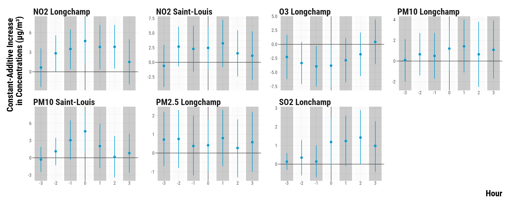<!-- --><div class="sourceCode"><pre class="sourceCode r"><code class="sourceCode r"><span class='co'># save the graph</span>
<span class='fu'>ggsave</span><span class='op'>(</span><span class='va'>graph_fisherian_intervals</span>, filename <span class='op'>=</span> <span class='fu'>here</span><span class='fu'>::</span><span class='fu'><a href='https://here.r-lib.org//reference/here.html'>here</a></span><span class='op'>(</span><span class='st'>"3.outputs"</span>, <span class='st'>"1.figures"</span>, <span class='st'>"2.experiments_cruise"</span>, <span class='st'>"1.experiment_entry_cruise"</span>, <span class='st'>"2.matching_results"</span>, <span class='st'>"graph_fisherian_intervals.pdf"</span><span class='op'>)</span>, width <span class='op'>=</span> <span class='fl'>70</span>, height <span class='op'>=</span> <span class='fl'>30</span>, units <span class='op'>=</span> <span class='st'>"cm"</span>, device <span class='op'>=</span> <span class='va'>cairo_pdf</span><span class='op'>)</span>
</code></pre></div>

</div>


We display below the table with the 95% fiducial intervals and the point estimates:

<div class="layout-chunk" data-layout="l-body-outset">
<div data-pagedtable="false">
  <script data-pagedtable-source type="application/json">
{"columns":[{"label":["Pollutant"],"name":[1],"type":["chr"],"align":["left"]},{"label":["Time"],"name":[2],"type":["dbl"],"align":["right"]},{"label":["Point Estimate"],"name":[3],"type":["dbl"],"align":["right"]},{"label":["Lower Bound of the 95% Fisherian Interval"],"name":[4],"type":["dbl"],"align":["right"]},{"label":["Upper Bound of the 95% Fisherian Interval"],"name":[5],"type":["dbl"],"align":["right"]}],"data":[{"1":"NO2 Longchamp","2":"-3","3":"0.7","4":"-2.3","5":"3.6"},{"1":"NO2 Longchamp","2":"-2","3":"2.8","4":"0.0","5":"5.6"},{"1":"NO2 Longchamp","2":"-1","3":"3.5","4":"0.4","5":"6.5"},{"1":"NO2 Longchamp","2":"0","3":"4.7","4":"1.4","5":"8.0"},{"1":"NO2 Longchamp","2":"1","3":"3.8","4":"0.4","5":"7.2"},{"1":"NO2 Longchamp","2":"2","3":"3.8","4":"0.5","5":"7.2"},{"1":"NO2 Longchamp","2":"3","3":"1.5","4":"-1.9","5":"5.0"},{"1":"NO2 Saint-Louis","2":"-3","3":"-0.6","4":"-4.2","5":"3.0"},{"1":"NO2 Saint-Louis","2":"-2","3":"2.7","4":"-0.7","5":"6.1"},{"1":"NO2 Saint-Louis","2":"-1","3":"2.3","4":"-1.6","5":"6.2"},{"1":"NO2 Saint-Louis","2":"0","3":"2.5","4":"-1.2","5":"6.1"},{"1":"NO2 Saint-Louis","2":"1","3":"3.2","4":"-0.8","5":"7.3"},{"1":"NO2 Saint-Louis","2":"2","3":"1.5","4":"-2.4","5":"5.5"},{"1":"NO2 Saint-Louis","2":"3","3":"1.1","4":"-3.0","5":"5.3"},{"1":"O3 Longchamp","2":"-3","3":"-2.3","4":"-6.2","5":"1.7"},{"1":"O3 Longchamp","2":"-2","3":"-3.3","4":"-7.1","5":"0.4"},{"1":"O3 Longchamp","2":"-1","3":"-3.9","4":"-7.5","5":"-0.3"},{"1":"O3 Longchamp","2":"0","3":"-3.8","4":"-7.6","5":"0.0"},{"1":"O3 Longchamp","2":"1","3":"-2.9","4":"-6.8","5":"1.1"},{"1":"O3 Longchamp","2":"2","3":"-1.8","4":"-5.7","5":"2.1"},{"1":"O3 Longchamp","2":"3","3":"0.4","4":"-3.5","5":"4.4"},{"1":"PM10 Longchamp","2":"-3","3":"0.1","4":"-2.0","5":"2.1"},{"1":"PM10 Longchamp","2":"-2","3":"0.7","4":"-1.4","5":"2.7"},{"1":"PM10 Longchamp","2":"-1","3":"0.5","4":"-1.7","5":"2.7"},{"1":"PM10 Longchamp","2":"0","3":"1.2","4":"-0.9","5":"3.3"},{"1":"PM10 Longchamp","2":"1","3":"1.4","4":"-1.1","5":"4.0"},{"1":"PM10 Longchamp","2":"2","3":"0.6","4":"-2.5","5":"3.8"},{"1":"PM10 Longchamp","2":"3","3":"1.1","4":"-1.7","5":"3.9"},{"1":"PM10 Saint-Louis","2":"-3","3":"-0.3","4":"-2.5","5":"1.9"},{"1":"PM10 Saint-Louis","2":"-2","3":"1.1","4":"-1.3","5":"3.5"},{"1":"PM10 Saint-Louis","2":"-1","3":"3.1","4":"-0.3","5":"6.5"},{"1":"PM10 Saint-Louis","2":"0","3":"4.6","4":"0.9","5":"8.3"},{"1":"PM10 Saint-Louis","2":"1","3":"2.0","4":"-1.8","5":"5.9"},{"1":"PM10 Saint-Louis","2":"2","3":"0.1","4":"-3.4","5":"3.8"},{"1":"PM10 Saint-Louis","2":"3","3":"0.8","4":"-2.6","5":"4.2"},{"1":"PM2.5 Longchamp","2":"-3","3":"0.7","4":"-0.7","5":"2.2"},{"1":"PM2.5 Longchamp","2":"-2","3":"0.8","4":"-0.8","5":"2.3"},{"1":"PM2.5 Longchamp","2":"-1","3":"0.4","4":"-1.2","5":"2.0"},{"1":"PM2.5 Longchamp","2":"0","3":"0.4","4":"-1.0","5":"1.8"},{"1":"PM2.5 Longchamp","2":"1","3":"0.8","4":"-0.7","5":"2.3"},{"1":"PM2.5 Longchamp","2":"2","3":"0.3","4":"-1.3","5":"1.8"},{"1":"PM2.5 Longchamp","2":"3","3":"0.6","4":"-1.0","5":"2.2"},{"1":"SO2 Lonchamp","2":"-3","3":"0.1","4":"-0.3","5":"0.6"},{"1":"SO2 Lonchamp","2":"-2","3":"0.4","4":"-0.6","5":"1.3"},{"1":"SO2 Lonchamp","2":"-1","3":"0.1","4":"-0.7","5":"1.0"},{"1":"SO2 Lonchamp","2":"0","3":"1.2","4":"-0.1","5":"2.5"},{"1":"SO2 Lonchamp","2":"1","3":"1.2","4":"-0.1","5":"2.6"},{"1":"SO2 Lonchamp","2":"2","3":"1.4","4":"0.0","5":"2.9"},{"1":"SO2 Lonchamp","2":"3","3":"1.0","4":"-0.4","5":"2.3"}],"options":{"columns":{"min":{},"max":[10]},"rows":{"min":[10],"max":[10]},"pages":{}}}
  </script>
</div>

</div>


# Checking the Sensivity of Results

In this section, we carry out four investigations:

* We check how our results are sensitive to outliers by computing 95% fiducial intervals based on the Wilcoxon's signed rank test statistic.
* As we imputed the missing pollutant concentrations, we also want to see how our results might for the non-missing outcomes. We compute 95% fiducial intervals based on the Wilcoxon's signed rank test statistic.
* We compute confidence intervals for the average treatment effect using Neyman's approach.
* We explore how our study could suffer from type S and M errors.

### Outliers

To gauge how sensitive our results are to outliers, we use a Wilcoxon signed rank test statistic and compute 95% fiducial intervals using the `wilcox.test()` function.

<div class="layout-chunk" data-layout="l-body-outset">
<div class="sourceCode"><pre class="sourceCode r"><code class="sourceCode r"><span class='co'># carry out the wilcox.test </span>
<span class='va'>data_rank_ci</span> <span class='op'>&lt;-</span> <span class='va'>data_pair_difference_pollutant</span> <span class='op'>%&gt;%</span>
  <span class='fu'>select</span><span class='op'>(</span><span class='op'>-</span> <span class='va'>pair_number</span><span class='op'>)</span> <span class='op'>%&gt;%</span>
  <span class='fu'>group_by</span><span class='op'>(</span><span class='va'>pollutant</span>, <span class='va'>time</span><span class='op'>)</span> <span class='op'>%&gt;%</span>
  <span class='fu'>nest</span><span class='op'>(</span><span class='op'>)</span> <span class='op'>%&gt;%</span>
  <span class='fu'>mutate</span><span class='op'>(</span>effect <span class='op'>=</span> <span class='fu'>map</span><span class='op'>(</span><span class='va'>data</span>, <span class='op'>~</span> <span class='fu'><a href='https://rdrr.io/r/stats/wilcox.test.html'>wilcox.test</a></span><span class='op'>(</span><span class='va'>.</span><span class='op'>$</span><span class='va'>difference</span>, conf.int <span class='op'>=</span> <span class='cn'>TRUE</span><span class='op'>)</span><span class='op'>$</span><span class='va'>estimate</span><span class='op'>)</span>,
         lower_ci <span class='op'>=</span> <span class='fu'>map</span><span class='op'>(</span><span class='va'>data</span>, <span class='op'>~</span> <span class='fu'><a href='https://rdrr.io/r/stats/wilcox.test.html'>wilcox.test</a></span><span class='op'>(</span><span class='va'>.</span><span class='op'>$</span><span class='va'>difference</span>, conf.int <span class='op'>=</span> <span class='cn'>TRUE</span><span class='op'>)</span><span class='op'>$</span><span class='va'>conf.int</span><span class='op'>[</span><span class='fl'>1</span><span class='op'>]</span><span class='op'>)</span>,
         upper_ci <span class='op'>=</span> <span class='fu'>map</span><span class='op'>(</span><span class='va'>data</span>, <span class='op'>~</span> <span class='fu'><a href='https://rdrr.io/r/stats/wilcox.test.html'>wilcox.test</a></span><span class='op'>(</span><span class='va'>.</span><span class='op'>$</span><span class='va'>difference</span>, conf.int <span class='op'>=</span> <span class='cn'>TRUE</span><span class='op'>)</span><span class='op'>$</span><span class='va'>conf.int</span><span class='op'>[</span><span class='fl'>2</span><span class='op'>]</span><span class='op'>)</span><span class='op'>)</span> <span class='op'>%&gt;%</span>
  <span class='fu'>unnest</span><span class='op'>(</span>cols <span class='op'>=</span> <span class='fu'><a href='https://rdrr.io/r/base/c.html'>c</a></span><span class='op'>(</span><span class='va'>effect</span>, <span class='va'>lower_ci</span>, <span class='va'>upper_ci</span><span class='op'>)</span><span class='op'>)</span> <span class='op'>%&gt;%</span>
  <span class='fu'>mutate</span><span class='op'>(</span>data <span class='op'>=</span> <span class='st'>"Wilcoxon Rank Test Statistic"</span><span class='op'>)</span>

<span class='co'># bind ri_data_fi_final with data_rank_ci</span>
<span class='va'>data_ci</span> <span class='op'>&lt;-</span> <span class='va'>ri_data_fi_final</span> <span class='op'>%&gt;%</span>
  <span class='fu'>rename</span><span class='op'>(</span>effect <span class='op'>=</span> <span class='va'>observed_mean_difference</span>, lower_ci <span class='op'>=</span> <span class='va'>lower_fi</span>, upper_ci <span class='op'>=</span> <span class='va'>upper_fi</span><span class='op'>)</span> <span class='op'>%&gt;%</span>
  <span class='fu'>mutate</span><span class='op'>(</span>data <span class='op'>=</span> <span class='st'>"Average Pair Difference Test Statistic"</span><span class='op'>)</span> <span class='op'>%&gt;%</span>
  <span class='fu'>bind_rows</span><span class='op'>(</span><span class='va'>.</span>, <span class='va'>data_rank_ci</span><span class='op'>)</span>

<span class='co'># create an indicator to alternate shading of confidence intervals</span>
<span class='va'>data_ci</span> <span class='op'>&lt;-</span> <span class='va'>data_ci</span> <span class='op'>%&gt;%</span>
  <span class='fu'>arrange</span><span class='op'>(</span><span class='va'>pollutant</span>, <span class='va'>time</span><span class='op'>)</span> <span class='op'>%&gt;%</span>
  <span class='fu'>mutate</span><span class='op'>(</span>stripe <span class='op'>=</span> <span class='fu'><a href='https://rdrr.io/r/base/ifelse.html'>ifelse</a></span><span class='op'>(</span><span class='op'>(</span><span class='va'>time</span> <span class='op'>%%</span> <span class='fl'>2</span><span class='op'>)</span> <span class='op'>==</span> <span class='fl'>0</span>, <span class='st'>"Grey"</span>, <span class='st'>"White"</span><span class='op'>)</span><span class='op'>)</span> <span class='op'>%&gt;%</span>
  <span class='fu'>ungroup</span><span class='op'>(</span><span class='op'>)</span>

<span class='co'># make the graph</span>
<span class='va'>graph_ri_ci_wilcoxon</span> <span class='op'>&lt;-</span> <span class='fu'>ggplot</span><span class='op'>(</span><span class='va'>data_ci</span>, <span class='fu'>aes</span><span class='op'>(</span>x <span class='op'>=</span> <span class='fu'><a href='https://rdrr.io/r/base/factor.html'>as.factor</a></span><span class='op'>(</span><span class='va'>time</span><span class='op'>)</span>, y <span class='op'>=</span> <span class='va'>effect</span>, ymin <span class='op'>=</span> <span class='va'>lower_ci</span>,
                        ymax <span class='op'>=</span> <span class='va'>upper_ci</span>, colour <span class='op'>=</span> <span class='va'>data</span>, shape <span class='op'>=</span> <span class='va'>data</span><span class='op'>)</span><span class='op'>)</span> <span class='op'>+</span>
  <span class='fu'>geom_rect</span><span class='op'>(</span><span class='fu'>aes</span><span class='op'>(</span>fill <span class='op'>=</span> <span class='va'>stripe</span><span class='op'>)</span>, xmin <span class='op'>=</span> <span class='fu'><a href='https://rdrr.io/r/base/numeric.html'>as.numeric</a></span><span class='op'>(</span><span class='fu'><a href='https://rdrr.io/r/base/factor.html'>as.factor</a></span><span class='op'>(</span><span class='va'>data_ci</span><span class='op'>$</span><span class='va'>time</span><span class='op'>)</span><span class='op'>)</span><span class='op'>-</span><span class='fl'>0.42</span>,
            xmax <span class='op'>=</span> <span class='fu'><a href='https://rdrr.io/r/base/numeric.html'>as.numeric</a></span><span class='op'>(</span><span class='fu'><a href='https://rdrr.io/r/base/factor.html'>as.factor</a></span><span class='op'>(</span><span class='va'>data_ci</span><span class='op'>$</span><span class='va'>time</span><span class='op'>)</span><span class='op'>)</span><span class='op'>+</span><span class='fl'>0.42</span>, ymin <span class='op'>=</span> <span class='op'>-</span><span class='cn'>Inf</span>, ymax<span class='op'>=</span><span class='cn'>Inf</span>, color <span class='op'>=</span> <span class='cn'>NA</span>, alpha <span class='op'>=</span> <span class='fl'>0.4</span><span class='op'>)</span> <span class='op'>+</span>
  <span class='fu'>geom_hline</span><span class='op'>(</span>yintercept <span class='op'>=</span> <span class='fl'>0</span>, color<span class='op'>=</span><span class='st'>"black"</span><span class='op'>)</span> <span class='op'>+</span>
  <span class='fu'>geom_pointrange</span><span class='op'>(</span>position <span class='op'>=</span> <span class='fu'>position_dodge</span><span class='op'>(</span>width <span class='op'>=</span> <span class='fl'>1</span><span class='op'>)</span>, size <span class='op'>=</span> <span class='fl'>0.8</span>, fatten <span class='op'>=</span> <span class='fl'>2</span><span class='op'>)</span> <span class='op'>+</span>
  <span class='fu'>scale_shape_manual</span><span class='op'>(</span>name <span class='op'>=</span> <span class='st'>"Test Statistic:"</span>, values <span class='op'>=</span> <span class='fu'><a href='https://rdrr.io/r/base/c.html'>c</a></span><span class='op'>(</span><span class='fl'>16</span>, <span class='fl'>17</span><span class='op'>)</span><span class='op'>)</span> <span class='op'>+</span>
  <span class='fu'>scale_color_manual</span><span class='op'>(</span>name <span class='op'>=</span> <span class='st'>"Test Statistic:"</span>, values <span class='op'>=</span> <span class='fu'><a href='https://rdrr.io/r/base/c.html'>c</a></span><span class='op'>(</span><span class='st'>"coral"</span>, <span class='st'>"deepskyblue3"</span><span class='op'>)</span><span class='op'>)</span> <span class='op'>+</span>
  <span class='fu'>facet_wrap</span><span class='op'>(</span><span class='op'>~</span> <span class='va'>pollutant</span>, scales <span class='op'>=</span> <span class='st'>"free_y"</span>, ncol <span class='op'>=</span> <span class='fl'>4</span><span class='op'>)</span> <span class='op'>+</span>
  <span class='fu'>scale_fill_manual</span><span class='op'>(</span>values <span class='op'>=</span> <span class='fu'><a href='https://rdrr.io/r/base/c.html'>c</a></span><span class='op'>(</span><span class='st'>'gray92'</span>, <span class='cn'>NA</span><span class='op'>)</span><span class='op'>)</span> <span class='op'>+</span>
  <span class='fu'>guides</span><span class='op'>(</span>fill <span class='op'>=</span> <span class='cn'>FALSE</span><span class='op'>)</span> <span class='op'>+</span>
  <span class='fu'>ylab</span><span class='op'>(</span><span class='st'>"Constant-Additive Increase \nin Concentrations (µg/m³)"</span><span class='op'>)</span> <span class='op'>+</span> <span class='fu'>xlab</span><span class='op'>(</span><span class='st'>"Hour"</span><span class='op'>)</span> <span class='op'>+</span>
  <span class='va'>custom_theme</span> <span class='op'>+</span>
  <span class='fu'>theme</span><span class='op'>(</span>legend.position <span class='op'>=</span> <span class='st'>"top"</span>, legend.justification <span class='op'>=</span> <span class='st'>"left"</span>, legend.direction <span class='op'>=</span> <span class='st'>"horizontal"</span><span class='op'>)</span> <span class='op'>+</span>
  <span class='fu'>theme</span><span class='op'>(</span>
    <span class='co'># axis titles parameters</span>
    axis.title.x <span class='op'>=</span> <span class='fu'>element_text</span><span class='op'>(</span>size<span class='op'>=</span><span class='fl'>36</span>, face <span class='op'>=</span> <span class='st'>"bold"</span>, margin <span class='op'>=</span> <span class='fu'>margin</span><span class='op'>(</span>t <span class='op'>=</span> <span class='fl'>20</span>, r <span class='op'>=</span> <span class='fl'>0</span>, b <span class='op'>=</span> <span class='fl'>0</span>, l <span class='op'>=</span><span class='fl'>0</span><span class='op'>)</span><span class='op'>)</span>,
    axis.title.y <span class='op'>=</span> <span class='fu'>element_text</span><span class='op'>(</span>size<span class='op'>=</span><span class='fl'>36</span>, face <span class='op'>=</span> <span class='st'>"bold"</span>, margin <span class='op'>=</span> <span class='fu'>margin</span><span class='op'>(</span>t <span class='op'>=</span> <span class='fl'>0</span>, r <span class='op'>=</span> <span class='fl'>20</span>, b <span class='op'>=</span> <span class='fl'>0</span>, l <span class='op'>=</span> <span class='fl'>0</span><span class='op'>)</span><span class='op'>)</span>,
    <span class='co'># axis texts</span>
    axis.text.x <span class='op'>=</span> <span class='fu'>element_text</span><span class='op'>(</span>size<span class='op'>=</span><span class='fl'>20</span><span class='op'>)</span>,
    axis.text.y <span class='op'>=</span> <span class='fu'>element_text</span><span class='op'>(</span>size<span class='op'>=</span><span class='fl'>20</span><span class='op'>)</span>,
    <span class='co'># facet texts</span>
    strip.text.x <span class='op'>=</span> <span class='fu'>element_text</span><span class='op'>(</span>size<span class='op'>=</span><span class='fl'>36</span>, face <span class='op'>=</span> <span class='st'>"bold"</span><span class='op'>)</span>,
    strip.text.y <span class='op'>=</span> <span class='fu'>element_text</span><span class='op'>(</span>size<span class='op'>=</span><span class='fl'>36</span>, face <span class='op'>=</span> <span class='st'>"bold"</span><span class='op'>)</span>,
    <span class='co'># legend parameters</span>
    legend.position <span class='op'>=</span> <span class='st'>"top"</span>, legend.justification <span class='op'>=</span> <span class='st'>"left"</span>, legend.direction <span class='op'>=</span> <span class='st'>"horizontal"</span>,
    legend.title <span class='op'>=</span> <span class='fu'>element_text</span><span class='op'>(</span>size<span class='op'>=</span><span class='fl'>36</span>, face <span class='op'>=</span> <span class='st'>"bold"</span><span class='op'>)</span>,
    legend.text <span class='op'>=</span> <span class='fu'>element_text</span><span class='op'>(</span>size<span class='op'>=</span><span class='fl'>28</span><span class='op'>)</span><span class='op'>)</span>

<span class='co'># print the graph</span>
<span class='va'>graph_ri_ci_wilcoxon</span>
</code></pre></div>
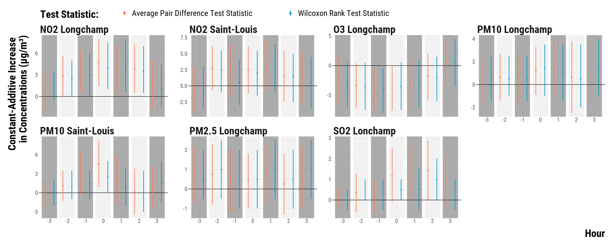<!-- --><div class="sourceCode"><pre class="sourceCode r"><code class="sourceCode r"><span class='co'># save the graph</span>
<span class='fu'>ggsave</span><span class='op'>(</span><span class='va'>graph_ri_ci_wilcoxon</span>, filename <span class='op'>=</span> <span class='fu'>here</span><span class='fu'>::</span><span class='fu'><a href='https://here.r-lib.org//reference/here.html'>here</a></span><span class='op'>(</span><span class='st'>"3.outputs"</span>, <span class='st'>"1.figures"</span>, <span class='st'>"2.experiments_cruise"</span>, <span class='st'>"1.experiment_entry_cruise"</span>, <span class='st'>"2.matching_results"</span>, <span class='st'>"graph_ri_ci_wilcoxon.pdf"</span><span class='op'>)</span>, width <span class='op'>=</span> <span class='fl'>70</span>, height <span class='op'>=</span> <span class='fl'>30</span>, units <span class='op'>=</span> <span class='st'>"cm"</span>, device <span class='op'>=</span> <span class='va'>cairo_pdf</span><span class='op'>)</span>
</code></pre></div>

</div>


### Missing Outcomes

We load non-imputed air pollution data and compute for each pollutant the 0-6 daily lags and leads:

<div class="layout-chunk" data-layout="l-body">
<div class="sourceCode"><pre class="sourceCode r"><code class="sourceCode r"><span class='co'># load marseille raw air pollution data</span>
<span class='va'>data_marseille_raw_pollutants</span> <span class='op'>&lt;-</span> <span class='fu'><a href='https://rdrr.io/r/base/readRDS.html'>readRDS</a></span><span class='op'>(</span><span class='fu'>here</span><span class='fu'>::</span><span class='fu'><a href='https://here.r-lib.org//reference/here.html'>here</a></span><span class='op'>(</span><span class='st'>"1.data"</span>, <span class='st'>"1.raw_data"</span>, <span class='st'>"2.pollution_data"</span>, <span class='st'>"marseille"</span>, <span class='st'>"raw_marseille_hourly_pollutants_2008_2018_data.rds"</span><span class='op'>)</span><span class='op'>)</span> <span class='op'>%&gt;%</span>
  <span class='fu'>rename_at</span><span class='op'>(</span><span class='fu'>vars</span><span class='op'>(</span><span class='op'>-</span><span class='va'>date</span><span class='op'>)</span>, <span class='kw'>function</span><span class='op'>(</span><span class='va'>x</span><span class='op'>)</span> <span class='fu'><a href='https://rdrr.io/r/base/paste.html'>paste0</a></span><span class='op'>(</span><span class='st'>"raw_"</span>, <span class='va'>x</span><span class='op'>)</span><span class='op'>)</span>

<span class='co'># we first define data_marseille_raw_pollutants_leads and data_marseille_raw_pollutants_lags</span>
<span class='co'># to store leads and lags</span>

<span class='va'>data_marseille_raw_pollutants_leads</span> <span class='op'>&lt;-</span> <span class='va'>data_marseille_raw_pollutants</span>
<span class='va'>data_marseille_raw_pollutants_lags</span> <span class='op'>&lt;-</span> <span class='va'>data_marseille_raw_pollutants</span>

<span class='co'>#</span>
<span class='co'># create leads</span>
<span class='co'># </span>

<span class='co'># create a list to store dataframe of leads</span>
<span class='va'>leads_list</span> <span class='op'>&lt;-</span> <span class='fu'><a href='https://rdrr.io/r/base/vector.html'>vector</a></span><span class='op'>(</span>mode <span class='op'>=</span> <span class='st'>"list"</span>, length <span class='op'>=</span> <span class='fl'>3</span><span class='op'>)</span>
<span class='fu'><a href='https://rdrr.io/r/base/names.html'>names</a></span><span class='op'>(</span><span class='va'>leads_list</span><span class='op'>)</span> <span class='op'>&lt;-</span> <span class='fu'><a href='https://rdrr.io/r/base/c.html'>c</a></span><span class='op'>(</span><span class='fl'>1</span><span class='op'>:</span><span class='fl'>3</span><span class='op'>)</span> 

<span class='co'># create the leads</span>
<span class='kw'>for</span><span class='op'>(</span><span class='va'>i</span> <span class='kw'>in</span> <span class='fl'>1</span><span class='op'>:</span><span class='fl'>3</span><span class='op'>)</span><span class='op'>{</span>
  <span class='va'>leads_list</span><span class='op'>[[</span><span class='va'>i</span><span class='op'>]</span><span class='op'>]</span> <span class='op'>&lt;-</span> <span class='va'>data_marseille_raw_pollutants_leads</span> <span class='op'>%&gt;%</span>
    <span class='fu'>mutate_at</span><span class='op'>(</span><span class='fu'>vars</span><span class='op'>(</span><span class='op'>-</span><span class='va'>date</span><span class='op'>)</span>, <span class='op'>~</span>  <span class='fu'>lead</span><span class='op'>(</span><span class='va'>.</span>, n <span class='op'>=</span> <span class='va'>i</span>, order_by <span class='op'>=</span> <span class='va'>date</span><span class='op'>)</span><span class='op'>)</span> <span class='op'>%&gt;%</span>
    <span class='fu'>rename_at</span><span class='op'>(</span><span class='fu'>vars</span><span class='op'>(</span><span class='op'>-</span><span class='va'>date</span><span class='op'>)</span>,<span class='kw'>function</span><span class='op'>(</span><span class='va'>x</span><span class='op'>)</span> <span class='fu'><a href='https://rdrr.io/r/base/paste.html'>paste0</a></span><span class='op'>(</span><span class='va'>x</span>,<span class='st'>"_lead_"</span>, <span class='va'>i</span><span class='op'>)</span><span class='op'>)</span>
<span class='op'>}</span>

<span class='co'># merge the dataframes of leads</span>
<span class='va'>data_leads</span> <span class='op'>&lt;-</span> <span class='va'>leads_list</span> <span class='op'>%&gt;%</span>
  <span class='fu'>reduce</span><span class='op'>(</span><span class='va'>left_join</span>, by <span class='op'>=</span> <span class='st'>"date"</span><span class='op'>)</span>

<span class='co'># merge the leads with the data_marseille_raw_pollutants_leads</span>
<span class='va'>data_marseille_raw_pollutants_leads</span> <span class='op'>&lt;-</span> <span class='fu'>left_join</span><span class='op'>(</span><span class='va'>data_marseille_raw_pollutants_leads</span>, <span class='va'>data_leads</span>, by <span class='op'>=</span> <span class='st'>"date"</span><span class='op'>)</span> <span class='op'>%&gt;%</span>
  <span class='fu'>select</span><span class='op'>(</span><span class='op'>-</span><span class='fu'><a href='https://rdrr.io/r/base/c.html'>c</a></span><span class='op'>(</span><span class='va'>raw_mean_no2_l</span><span class='op'>:</span><span class='va'>raw_mean_pm10_sl</span><span class='op'>)</span><span class='op'>)</span>

<span class='co'>#</span>
<span class='co'># create lags</span>
<span class='co'># </span>

<span class='co'># create a list to store dataframe of lags</span>
<span class='va'>lags_list</span> <span class='op'>&lt;-</span> <span class='fu'><a href='https://rdrr.io/r/base/vector.html'>vector</a></span><span class='op'>(</span>mode <span class='op'>=</span> <span class='st'>"list"</span>, length <span class='op'>=</span> <span class='fl'>3</span><span class='op'>)</span>
<span class='fu'><a href='https://rdrr.io/r/base/names.html'>names</a></span><span class='op'>(</span><span class='va'>lags_list</span><span class='op'>)</span> <span class='op'>&lt;-</span> <span class='fu'><a href='https://rdrr.io/r/base/c.html'>c</a></span><span class='op'>(</span><span class='fl'>1</span><span class='op'>:</span><span class='fl'>3</span><span class='op'>)</span> 

<span class='co'># create the lags</span>
<span class='kw'>for</span><span class='op'>(</span><span class='va'>i</span> <span class='kw'>in</span> <span class='fl'>1</span><span class='op'>:</span><span class='fl'>3</span><span class='op'>)</span><span class='op'>{</span>
  <span class='va'>lags_list</span><span class='op'>[[</span><span class='va'>i</span><span class='op'>]</span><span class='op'>]</span> <span class='op'>&lt;-</span> <span class='va'>data_marseille_raw_pollutants_lags</span> <span class='op'>%&gt;%</span>
    <span class='fu'>mutate_at</span><span class='op'>(</span><span class='fu'>vars</span><span class='op'>(</span><span class='op'>-</span><span class='va'>date</span><span class='op'>)</span>, <span class='op'>~</span>  <span class='fu'><a href='https://rdrr.io/r/stats/lag.html'>lag</a></span><span class='op'>(</span><span class='va'>.</span>, n <span class='op'>=</span> <span class='va'>i</span>, order_by <span class='op'>=</span> <span class='va'>date</span><span class='op'>)</span><span class='op'>)</span> <span class='op'>%&gt;%</span>
    <span class='fu'>rename_at</span><span class='op'>(</span><span class='fu'>vars</span><span class='op'>(</span><span class='op'>-</span><span class='va'>date</span><span class='op'>)</span>,<span class='kw'>function</span><span class='op'>(</span><span class='va'>x</span><span class='op'>)</span> <span class='fu'><a href='https://rdrr.io/r/base/paste.html'>paste0</a></span><span class='op'>(</span><span class='va'>x</span>,<span class='st'>"_lag_"</span>, <span class='va'>i</span><span class='op'>)</span><span class='op'>)</span>
<span class='op'>}</span>

<span class='co'># merge the dataframes of lags</span>
<span class='va'>data_lags</span> <span class='op'>&lt;-</span> <span class='va'>lags_list</span> <span class='op'>%&gt;%</span>
  <span class='fu'>reduce</span><span class='op'>(</span><span class='va'>left_join</span>, by <span class='op'>=</span> <span class='st'>"date"</span><span class='op'>)</span>

<span class='co'># merge the lags with the initial data_marseille_raw_pollutants_lags</span>
<span class='va'>data_marseille_raw_pollutants_lags</span> <span class='op'>&lt;-</span> <span class='fu'>left_join</span><span class='op'>(</span><span class='va'>data_marseille_raw_pollutants_lags</span>, <span class='va'>data_lags</span>, by <span class='op'>=</span> <span class='st'>"date"</span><span class='op'>)</span>

<span class='co'>#</span>
<span class='co'># merge data_marseille_raw_pollutants_leads with data_marseille_raw_pollutants_lags</span>
<span class='co'>#</span>

<span class='va'>data_marseille_raw_pollutants</span> <span class='op'>&lt;-</span> <span class='fu'>left_join</span><span class='op'>(</span><span class='va'>data_marseille_raw_pollutants_lags</span>, <span class='va'>data_marseille_raw_pollutants_leads</span>, by <span class='op'>=</span> <span class='st'>"date"</span><span class='op'>)</span>
</code></pre></div>

</div>


We merge these data with the matched data and compute pair differences: 

<div class="layout-chunk" data-layout="l-body">
<div class="sourceCode"><pre class="sourceCode r"><code class="sourceCode r"><span class='co'># merge with the matched data</span>
<span class='va'>data_matched_with_raw_pollutants</span> <span class='op'>&lt;-</span> <span class='fu'><a href='https://rdrr.io/r/base/merge.html'>merge</a></span><span class='op'>(</span><span class='va'>data_matched</span>, <span class='va'>data_marseille_raw_pollutants</span>, by <span class='op'>=</span> <span class='st'>"date"</span><span class='op'>)</span>

<span class='co'># compute pair differences</span>
<span class='va'>data_matched_wide_raw_pollutants</span> <span class='op'>&lt;-</span> <span class='va'>data_matched_with_raw_pollutants</span> <span class='op'>%&gt;%</span>
  <span class='fu'>mutate</span><span class='op'>(</span>is_treated <span class='op'>=</span> <span class='fu'><a href='https://rdrr.io/r/base/ifelse.html'>ifelse</a></span><span class='op'>(</span><span class='va'>is_treated</span> <span class='op'>==</span> <span class='cn'>TRUE</span>, <span class='st'>"treated"</span>, <span class='st'>"control"</span><span class='op'>)</span><span class='op'>)</span> <span class='op'>%&gt;%</span>
  <span class='fu'>select</span><span class='op'>(</span><span class='va'>is_treated</span>, <span class='va'>pair_number</span>, <span class='fu'>contains</span><span class='op'>(</span><span class='st'>"raw_mean_no2_l"</span><span class='op'>)</span>, <span class='fu'>contains</span><span class='op'>(</span><span class='st'>"raw_mean_no2_sl"</span><span class='op'>)</span>, <span class='fu'>contains</span><span class='op'>(</span><span class='st'>"raw_mean_o3"</span><span class='op'>)</span>, <span class='fu'>contains</span><span class='op'>(</span><span class='st'>"raw_mean_pm10_l"</span><span class='op'>)</span>, <span class='fu'>contains</span><span class='op'>(</span><span class='st'>"raw_mean_pm10_sl"</span><span class='op'>)</span>, <span class='fu'>contains</span><span class='op'>(</span><span class='st'>"raw_mean_pm25"</span><span class='op'>)</span>, <span class='fu'>contains</span><span class='op'>(</span><span class='st'>"raw_mean_so2"</span><span class='op'>)</span><span class='op'>)</span> <span class='op'>%&gt;%</span>
  <span class='fu'>pivot_longer</span><span class='op'>(</span>cols <span class='op'>=</span> <span class='op'>-</span><span class='fu'><a href='https://rdrr.io/r/base/c.html'>c</a></span><span class='op'>(</span><span class='va'>pair_number</span>, <span class='va'>is_treated</span><span class='op'>)</span>, names_to <span class='op'>=</span> <span class='st'>"variable"</span>, values_to <span class='op'>=</span> <span class='st'>"concentration"</span><span class='op'>)</span> <span class='op'>%&gt;%</span>
  <span class='fu'>mutate</span><span class='op'>(</span>pollutant <span class='op'>=</span> <span class='cn'>NA</span> <span class='op'>%&gt;%</span>
           <span class='fu'><a href='https://rdrr.io/r/base/ifelse.html'>ifelse</a></span><span class='op'>(</span><span class='fu'>str_detect</span><span class='op'>(</span><span class='va'>variable</span>, <span class='st'>"no2_l"</span><span class='op'>)</span>, <span class='st'>"NO2 Longchamp"</span>,<span class='va'>.</span><span class='op'>)</span> <span class='op'>%&gt;%</span>
           <span class='fu'><a href='https://rdrr.io/r/base/ifelse.html'>ifelse</a></span><span class='op'>(</span><span class='fu'>str_detect</span><span class='op'>(</span><span class='va'>variable</span>, <span class='st'>"no2_sl"</span><span class='op'>)</span>, <span class='st'>"NO2 Saint-Louis"</span>,<span class='va'>.</span><span class='op'>)</span> <span class='op'>%&gt;%</span>
           <span class='fu'><a href='https://rdrr.io/r/base/ifelse.html'>ifelse</a></span><span class='op'>(</span><span class='fu'>str_detect</span><span class='op'>(</span><span class='va'>variable</span>, <span class='st'>"o3"</span><span class='op'>)</span>, <span class='st'>"O3 Longchamp"</span>,<span class='va'>.</span><span class='op'>)</span> <span class='op'>%&gt;%</span>
           <span class='fu'><a href='https://rdrr.io/r/base/ifelse.html'>ifelse</a></span><span class='op'>(</span><span class='fu'>str_detect</span><span class='op'>(</span><span class='va'>variable</span>, <span class='st'>"pm10_l"</span><span class='op'>)</span>, <span class='st'>"PM10 Longchamp"</span>,<span class='va'>.</span><span class='op'>)</span> <span class='op'>%&gt;%</span>
           <span class='fu'><a href='https://rdrr.io/r/base/ifelse.html'>ifelse</a></span><span class='op'>(</span><span class='fu'>str_detect</span><span class='op'>(</span><span class='va'>variable</span>, <span class='st'>"pm10_sl"</span><span class='op'>)</span>, <span class='st'>"PM10 Saint-Louis"</span>,<span class='va'>.</span><span class='op'>)</span> <span class='op'>%&gt;%</span>
           <span class='fu'><a href='https://rdrr.io/r/base/ifelse.html'>ifelse</a></span><span class='op'>(</span><span class='fu'>str_detect</span><span class='op'>(</span><span class='va'>variable</span>, <span class='st'>"pm25"</span><span class='op'>)</span>, <span class='st'>"PM2.5 Longchamp"</span>,<span class='va'>.</span><span class='op'>)</span> <span class='op'>%&gt;%</span>
           <span class='fu'><a href='https://rdrr.io/r/base/ifelse.html'>ifelse</a></span><span class='op'>(</span><span class='fu'>str_detect</span><span class='op'>(</span><span class='va'>variable</span>, <span class='st'>"so2"</span><span class='op'>)</span>, <span class='st'>"SO2 Lonchamp"</span>,<span class='va'>.</span><span class='op'>)</span><span class='op'>)</span> <span class='op'>%&gt;%</span>
  <span class='fu'>mutate</span><span class='op'>(</span>time <span class='op'>=</span> <span class='fl'>0</span> <span class='op'>%&gt;%</span>
           <span class='fu'><a href='https://rdrr.io/r/base/ifelse.html'>ifelse</a></span><span class='op'>(</span><span class='fu'>str_detect</span><span class='op'>(</span><span class='va'>variable</span>, <span class='st'>"lag_1"</span><span class='op'>)</span>, <span class='op'>-</span><span class='fl'>1</span>, <span class='va'>.</span><span class='op'>)</span> <span class='op'>%&gt;%</span>
           <span class='fu'><a href='https://rdrr.io/r/base/ifelse.html'>ifelse</a></span><span class='op'>(</span><span class='fu'>str_detect</span><span class='op'>(</span><span class='va'>variable</span>, <span class='st'>"lag_2"</span><span class='op'>)</span>, <span class='op'>-</span><span class='fl'>2</span>, <span class='va'>.</span><span class='op'>)</span> <span class='op'>%&gt;%</span>
           <span class='fu'><a href='https://rdrr.io/r/base/ifelse.html'>ifelse</a></span><span class='op'>(</span><span class='fu'>str_detect</span><span class='op'>(</span><span class='va'>variable</span>, <span class='st'>"lag_3"</span><span class='op'>)</span>, <span class='op'>-</span><span class='fl'>3</span>, <span class='va'>.</span><span class='op'>)</span> <span class='op'>%&gt;%</span>
           <span class='fu'><a href='https://rdrr.io/r/base/ifelse.html'>ifelse</a></span><span class='op'>(</span><span class='fu'>str_detect</span><span class='op'>(</span><span class='va'>variable</span>, <span class='st'>"lead_1"</span><span class='op'>)</span>, <span class='fl'>1</span>, <span class='va'>.</span><span class='op'>)</span> <span class='op'>%&gt;%</span>
           <span class='fu'><a href='https://rdrr.io/r/base/ifelse.html'>ifelse</a></span><span class='op'>(</span><span class='fu'>str_detect</span><span class='op'>(</span><span class='va'>variable</span>, <span class='st'>"lead_2"</span><span class='op'>)</span>, <span class='fl'>2</span>, <span class='va'>.</span><span class='op'>)</span> <span class='op'>%&gt;%</span>
           <span class='fu'><a href='https://rdrr.io/r/base/ifelse.html'>ifelse</a></span><span class='op'>(</span><span class='fu'>str_detect</span><span class='op'>(</span><span class='va'>variable</span>, <span class='st'>"lead_3"</span><span class='op'>)</span>, <span class='fl'>3</span>, <span class='va'>.</span><span class='op'>)</span><span class='op'>)</span> <span class='op'>%&gt;%</span>
  <span class='fu'>select</span><span class='op'>(</span><span class='op'>-</span><span class='va'>variable</span><span class='op'>)</span> <span class='op'>%&gt;%</span>
  <span class='fu'>select</span><span class='op'>(</span><span class='va'>pair_number</span>, <span class='va'>is_treated</span>, <span class='va'>pollutant</span>, <span class='va'>time</span>, <span class='va'>concentration</span><span class='op'>)</span> <span class='op'>%&gt;%</span> 
  <span class='fu'>pivot_wider</span><span class='op'>(</span>names_from <span class='op'>=</span> <span class='va'>is_treated</span>, values_from <span class='op'>=</span> <span class='va'>concentration</span><span class='op'>)</span>

<span class='va'>data_raw_pair_difference_pollutant</span> <span class='op'>&lt;-</span> <span class='va'>data_matched_wide_raw_pollutants</span> <span class='op'>%&gt;%</span>
  <span class='fu'>mutate</span><span class='op'>(</span>difference <span class='op'>=</span> <span class='va'>treated</span><span class='op'>-</span><span class='va'>control</span><span class='op'>)</span> <span class='op'>%&gt;%</span>
  <span class='fu'>select</span><span class='op'>(</span><span class='op'>-</span><span class='fu'><a href='https://rdrr.io/r/base/c.html'>c</a></span><span class='op'>(</span><span class='va'>treated</span>, <span class='va'>control</span><span class='op'>)</span><span class='op'>)</span> 
</code></pre></div>

</div>


We display below the number of missing differences by pollutant and day:

<div class="layout-chunk" data-layout="l-body-outset">
<div class="sourceCode"><pre class="sourceCode r"><code class="sourceCode r"><span class='co'># make the graph</span>
<span class='va'>graph_missing_pollutants</span> <span class='op'>&lt;-</span> <span class='va'>data_raw_pair_difference_pollutant</span> <span class='op'>%&gt;%</span>
  <span class='fu'>group_by</span><span class='op'>(</span><span class='va'>pollutant</span>, <span class='va'>time</span><span class='op'>)</span> <span class='op'>%&gt;%</span>
  <span class='fu'>summarise</span><span class='op'>(</span>n_missing <span class='op'>=</span> <span class='fu'><a href='https://rdrr.io/r/base/sum.html'>sum</a></span><span class='op'>(</span><span class='fu'><a href='https://rdrr.io/r/base/NA.html'>is.na</a></span><span class='op'>(</span><span class='va'>difference</span><span class='op'>)</span><span class='op'>)</span><span class='op'>)</span> <span class='op'>%&gt;%</span>
  <span class='fu'>ggplot</span><span class='op'>(</span><span class='va'>.</span>, <span class='fu'>aes</span><span class='op'>(</span>x <span class='op'>=</span> <span class='fu'><a href='https://rdrr.io/r/base/factor.html'>as.factor</a></span><span class='op'>(</span><span class='va'>time</span><span class='op'>)</span>, y <span class='op'>=</span> <span class='va'>n_missing</span><span class='op'>)</span><span class='op'>)</span> <span class='op'>+</span>
  <span class='fu'>geom_segment</span><span class='op'>(</span><span class='fu'>aes</span><span class='op'>(</span>x <span class='op'>=</span> <span class='fu'><a href='https://rdrr.io/r/base/factor.html'>as.factor</a></span><span class='op'>(</span><span class='va'>time</span><span class='op'>)</span>, xend <span class='op'>=</span> <span class='fu'><a href='https://rdrr.io/r/base/factor.html'>as.factor</a></span><span class='op'>(</span><span class='va'>time</span><span class='op'>)</span>, y <span class='op'>=</span> <span class='fl'>0</span>, yend <span class='op'>=</span> <span class='va'>n_missing</span><span class='op'>)</span><span class='op'>)</span> <span class='op'>+</span>
  <span class='fu'>geom_point</span><span class='op'>(</span>shape <span class='op'>=</span> <span class='fl'>21</span>, size <span class='op'>=</span> <span class='fl'>4</span>, colour <span class='op'>=</span> <span class='st'>"black"</span>, fill <span class='op'>=</span> <span class='st'>"deepskyblue3"</span><span class='op'>)</span> <span class='op'>+</span>
  <span class='fu'>facet_wrap</span><span class='op'>(</span><span class='op'>~</span> <span class='va'>pollutant</span><span class='op'>)</span> <span class='op'>+</span>
  <span class='fu'>xlab</span><span class='op'>(</span><span class='st'>"Day"</span><span class='op'>)</span> <span class='op'>+</span> <span class='fu'>ylab</span><span class='op'>(</span><span class='st'>"Number of Pairs with Missing Concentrations"</span><span class='op'>)</span> <span class='op'>+</span>
  <span class='va'>custom_theme</span> 
  
<span class='co'># display the graph</span>
<span class='va'>graph_missing_pollutants</span>
</code></pre></div>
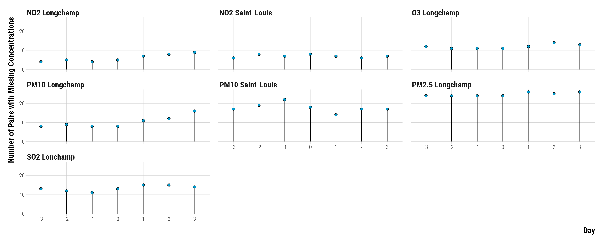<!-- --><div class="sourceCode"><pre class="sourceCode r"><code class="sourceCode r"><span class='co'># save the graph</span>
<span class='fu'>ggsave</span><span class='op'>(</span><span class='va'>graph_missing_pollutants</span>, filename <span class='op'>=</span> <span class='fu'>here</span><span class='fu'>::</span><span class='fu'><a href='https://here.r-lib.org//reference/here.html'>here</a></span><span class='op'>(</span><span class='st'>"3.outputs"</span>, <span class='st'>"1.figures"</span>, <span class='st'>"2.experiments_cruise"</span>, <span class='st'>"1.experiment_entry_cruise"</span>, <span class='st'>"2.matching_results"</span>, <span class='st'>"graph_missing_pollutants.pdf"</span><span class='op'>)</span>, 
       width <span class='op'>=</span> <span class='fl'>40</span>, height <span class='op'>=</span> <span class='fl'>20</span>, units <span class='op'>=</span> <span class='st'>"cm"</span>, device <span class='op'>=</span> <span class='va'>cairo_pdf</span><span class='op'>)</span>
</code></pre></div>

</div>


As we have 138 pairs, up to 25% of the pairs can have missing pollutant concentrations. We compute below the 95% fiducial intervals for pairs without missing concentrations and compare the results to those found with the imputed dataset:

<div class="layout-chunk" data-layout="l-body-outset">
<div class="sourceCode"><pre class="sourceCode r"><code class="sourceCode r"><span class='co'># carry out the wilcox.test </span>
<span class='va'>data_raw_rank_ci</span> <span class='op'>&lt;-</span> <span class='va'>data_raw_pair_difference_pollutant</span> <span class='op'>%&gt;%</span>
  <span class='fu'>drop_na</span><span class='op'>(</span><span class='op'>)</span> <span class='op'>%&gt;%</span>
  <span class='fu'>select</span><span class='op'>(</span><span class='op'>-</span> <span class='va'>pair_number</span><span class='op'>)</span> <span class='op'>%&gt;%</span>
  <span class='fu'>group_by</span><span class='op'>(</span><span class='va'>pollutant</span>, <span class='va'>time</span><span class='op'>)</span> <span class='op'>%&gt;%</span>
  <span class='fu'>nest</span><span class='op'>(</span><span class='op'>)</span> <span class='op'>%&gt;%</span>
  <span class='fu'>mutate</span><span class='op'>(</span>effect <span class='op'>=</span> <span class='fu'>map</span><span class='op'>(</span><span class='va'>data</span>, <span class='op'>~</span> <span class='fu'><a href='https://rdrr.io/r/stats/wilcox.test.html'>wilcox.test</a></span><span class='op'>(</span><span class='va'>.</span><span class='op'>$</span><span class='va'>difference</span>, conf.int <span class='op'>=</span> <span class='cn'>TRUE</span><span class='op'>)</span><span class='op'>$</span><span class='va'>estimate</span><span class='op'>)</span>,
         lower_ci <span class='op'>=</span> <span class='fu'>map</span><span class='op'>(</span><span class='va'>data</span>, <span class='op'>~</span> <span class='fu'><a href='https://rdrr.io/r/stats/wilcox.test.html'>wilcox.test</a></span><span class='op'>(</span><span class='va'>.</span><span class='op'>$</span><span class='va'>difference</span>, conf.int <span class='op'>=</span> <span class='cn'>TRUE</span><span class='op'>)</span><span class='op'>$</span><span class='va'>conf.int</span><span class='op'>[</span><span class='fl'>1</span><span class='op'>]</span><span class='op'>)</span>,
         upper_ci <span class='op'>=</span> <span class='fu'>map</span><span class='op'>(</span><span class='va'>data</span>, <span class='op'>~</span> <span class='fu'><a href='https://rdrr.io/r/stats/wilcox.test.html'>wilcox.test</a></span><span class='op'>(</span><span class='va'>.</span><span class='op'>$</span><span class='va'>difference</span>, conf.int <span class='op'>=</span> <span class='cn'>TRUE</span><span class='op'>)</span><span class='op'>$</span><span class='va'>conf.int</span><span class='op'>[</span><span class='fl'>2</span><span class='op'>]</span><span class='op'>)</span><span class='op'>)</span> <span class='op'>%&gt;%</span>
  <span class='fu'>unnest</span><span class='op'>(</span>cols <span class='op'>=</span> <span class='fu'><a href='https://rdrr.io/r/base/c.html'>c</a></span><span class='op'>(</span><span class='va'>effect</span>, <span class='va'>lower_ci</span>, <span class='va'>upper_ci</span><span class='op'>)</span><span class='op'>)</span> <span class='op'>%&gt;%</span>
  <span class='fu'>mutate</span><span class='op'>(</span>data <span class='op'>=</span> <span class='st'>"Pairs without Missing Concentrations"</span><span class='op'>)</span>

<span class='co'># bind data_rank_ci with data_raw_rank_ci</span>
<span class='va'>data_ci</span> <span class='op'>&lt;-</span> <span class='va'>data_rank_ci</span> <span class='op'>%&gt;%</span>
  <span class='fu'>mutate</span><span class='op'>(</span>data <span class='op'>=</span> <span class='st'>"Pairs with Imputed Pollutant Concentrations"</span><span class='op'>)</span> <span class='op'>%&gt;%</span>
  <span class='fu'>bind_rows</span><span class='op'>(</span><span class='va'>.</span>, <span class='va'>data_raw_rank_ci</span><span class='op'>)</span>

<span class='co'># create an indicator to alternate shading of confidence intervals</span>
<span class='va'>data_ci</span> <span class='op'>&lt;-</span> <span class='va'>data_ci</span> <span class='op'>%&gt;%</span>
  <span class='fu'>arrange</span><span class='op'>(</span><span class='va'>pollutant</span>, <span class='va'>time</span><span class='op'>)</span> <span class='op'>%&gt;%</span>
  <span class='fu'>mutate</span><span class='op'>(</span>stripe <span class='op'>=</span> <span class='fu'><a href='https://rdrr.io/r/base/ifelse.html'>ifelse</a></span><span class='op'>(</span><span class='op'>(</span><span class='va'>time</span> <span class='op'>%%</span> <span class='fl'>2</span><span class='op'>)</span> <span class='op'>==</span> <span class='fl'>0</span>, <span class='st'>"Grey"</span>, <span class='st'>"White"</span><span class='op'>)</span><span class='op'>)</span> <span class='op'>%&gt;%</span>
  <span class='fu'>ungroup</span><span class='op'>(</span><span class='op'>)</span>

<span class='co'># make the graph</span>
<span class='va'>graph_ri_ci_missing_concentration</span> <span class='op'>&lt;-</span> <span class='fu'>ggplot</span><span class='op'>(</span><span class='va'>data_ci</span>, <span class='fu'>aes</span><span class='op'>(</span>x <span class='op'>=</span> <span class='fu'><a href='https://rdrr.io/r/base/factor.html'>as.factor</a></span><span class='op'>(</span><span class='va'>time</span><span class='op'>)</span>, y <span class='op'>=</span> <span class='va'>effect</span>, ymin <span class='op'>=</span> <span class='va'>lower_ci</span>,
                        ymax <span class='op'>=</span> <span class='va'>upper_ci</span>, colour <span class='op'>=</span> <span class='va'>data</span>, shape <span class='op'>=</span> <span class='va'>data</span><span class='op'>)</span><span class='op'>)</span> <span class='op'>+</span>
  <span class='fu'>geom_rect</span><span class='op'>(</span><span class='fu'>aes</span><span class='op'>(</span>fill <span class='op'>=</span> <span class='va'>stripe</span><span class='op'>)</span>, xmin <span class='op'>=</span> <span class='fu'><a href='https://rdrr.io/r/base/numeric.html'>as.numeric</a></span><span class='op'>(</span><span class='fu'><a href='https://rdrr.io/r/base/factor.html'>as.factor</a></span><span class='op'>(</span><span class='va'>data_ci</span><span class='op'>$</span><span class='va'>time</span><span class='op'>)</span><span class='op'>)</span><span class='op'>-</span><span class='fl'>0.42</span>,
            xmax <span class='op'>=</span> <span class='fu'><a href='https://rdrr.io/r/base/numeric.html'>as.numeric</a></span><span class='op'>(</span><span class='fu'><a href='https://rdrr.io/r/base/factor.html'>as.factor</a></span><span class='op'>(</span><span class='va'>data_ci</span><span class='op'>$</span><span class='va'>time</span><span class='op'>)</span><span class='op'>)</span><span class='op'>+</span><span class='fl'>0.42</span>, ymin <span class='op'>=</span> <span class='op'>-</span><span class='cn'>Inf</span>, ymax<span class='op'>=</span><span class='cn'>Inf</span>, color <span class='op'>=</span> <span class='cn'>NA</span>, alpha <span class='op'>=</span> <span class='fl'>0.4</span><span class='op'>)</span> <span class='op'>+</span>
  <span class='fu'>geom_hline</span><span class='op'>(</span>yintercept <span class='op'>=</span> <span class='fl'>0</span>, color<span class='op'>=</span><span class='st'>"black"</span><span class='op'>)</span> <span class='op'>+</span>
  <span class='fu'>geom_pointrange</span><span class='op'>(</span>position <span class='op'>=</span> <span class='fu'>position_dodge</span><span class='op'>(</span>width <span class='op'>=</span> <span class='fl'>1</span><span class='op'>)</span>, size <span class='op'>=</span> <span class='fl'>0.8</span>, fatten <span class='op'>=</span> <span class='fl'>2</span><span class='op'>)</span> <span class='op'>+</span>
  <span class='fu'>scale_shape_manual</span><span class='op'>(</span>name <span class='op'>=</span> <span class='st'>"Dataset:"</span>, values <span class='op'>=</span> <span class='fu'><a href='https://rdrr.io/r/base/c.html'>c</a></span><span class='op'>(</span><span class='fl'>16</span>, <span class='fl'>17</span><span class='op'>)</span><span class='op'>)</span> <span class='op'>+</span>
  <span class='fu'>scale_color_manual</span><span class='op'>(</span>name <span class='op'>=</span> <span class='st'>"Dataset:"</span>, values <span class='op'>=</span> <span class='fu'><a href='https://rdrr.io/r/base/c.html'>c</a></span><span class='op'>(</span><span class='st'>"coral"</span>, <span class='st'>"deepskyblue3"</span><span class='op'>)</span><span class='op'>)</span> <span class='op'>+</span>
  <span class='fu'>facet_wrap</span><span class='op'>(</span><span class='op'>~</span> <span class='va'>pollutant</span>, scales <span class='op'>=</span> <span class='st'>"free_y"</span>, ncol <span class='op'>=</span> <span class='fl'>4</span><span class='op'>)</span> <span class='op'>+</span>
  <span class='fu'>scale_fill_manual</span><span class='op'>(</span>values <span class='op'>=</span> <span class='fu'><a href='https://rdrr.io/r/base/c.html'>c</a></span><span class='op'>(</span><span class='st'>'gray92'</span>, <span class='cn'>NA</span><span class='op'>)</span><span class='op'>)</span> <span class='op'>+</span>
  <span class='fu'>guides</span><span class='op'>(</span>fill <span class='op'>=</span> <span class='cn'>FALSE</span><span class='op'>)</span> <span class='op'>+</span>
  <span class='fu'>ylab</span><span class='op'>(</span><span class='st'>"Constant-Additive Increase \nin Concentrations (µg/m³)"</span><span class='op'>)</span> <span class='op'>+</span> <span class='fu'>xlab</span><span class='op'>(</span><span class='st'>"Hour"</span><span class='op'>)</span> <span class='op'>+</span>
  <span class='va'>custom_theme</span> <span class='op'>+</span>
  <span class='fu'>theme</span><span class='op'>(</span>
    <span class='co'># axis titles parameters</span>
    axis.title.x <span class='op'>=</span> <span class='fu'>element_text</span><span class='op'>(</span>size<span class='op'>=</span><span class='fl'>36</span>, face <span class='op'>=</span> <span class='st'>"bold"</span>, margin <span class='op'>=</span> <span class='fu'>margin</span><span class='op'>(</span>t <span class='op'>=</span> <span class='fl'>20</span>, r <span class='op'>=</span> <span class='fl'>0</span>, b <span class='op'>=</span> <span class='fl'>0</span>, l <span class='op'>=</span><span class='fl'>0</span><span class='op'>)</span><span class='op'>)</span>,
    axis.title.y <span class='op'>=</span> <span class='fu'>element_text</span><span class='op'>(</span>size<span class='op'>=</span><span class='fl'>36</span>, face <span class='op'>=</span> <span class='st'>"bold"</span>, margin <span class='op'>=</span> <span class='fu'>margin</span><span class='op'>(</span>t <span class='op'>=</span> <span class='fl'>0</span>, r <span class='op'>=</span> <span class='fl'>20</span>, b <span class='op'>=</span> <span class='fl'>0</span>, l <span class='op'>=</span> <span class='fl'>0</span><span class='op'>)</span><span class='op'>)</span>,
    <span class='co'># axis texts</span>
    axis.text.x <span class='op'>=</span> <span class='fu'>element_text</span><span class='op'>(</span>size<span class='op'>=</span><span class='fl'>20</span><span class='op'>)</span>,
    axis.text.y <span class='op'>=</span> <span class='fu'>element_text</span><span class='op'>(</span>size<span class='op'>=</span><span class='fl'>20</span><span class='op'>)</span>,
    <span class='co'># facet texts</span>
    strip.text.x <span class='op'>=</span> <span class='fu'>element_text</span><span class='op'>(</span>size<span class='op'>=</span><span class='fl'>36</span>, face <span class='op'>=</span> <span class='st'>"bold"</span><span class='op'>)</span>,
    strip.text.y <span class='op'>=</span> <span class='fu'>element_text</span><span class='op'>(</span>size<span class='op'>=</span><span class='fl'>36</span>, face <span class='op'>=</span> <span class='st'>"bold"</span><span class='op'>)</span>,
    <span class='co'># legend parameters</span>
    legend.position <span class='op'>=</span> <span class='st'>"top"</span>, legend.justification <span class='op'>=</span> <span class='st'>"left"</span>, legend.direction <span class='op'>=</span> <span class='st'>"horizontal"</span>,
    legend.title <span class='op'>=</span> <span class='fu'>element_text</span><span class='op'>(</span>size<span class='op'>=</span><span class='fl'>36</span>, face <span class='op'>=</span> <span class='st'>"bold"</span><span class='op'>)</span>,
    legend.text <span class='op'>=</span> <span class='fu'>element_text</span><span class='op'>(</span>size<span class='op'>=</span><span class='fl'>28</span><span class='op'>)</span><span class='op'>)</span>

<span class='co'># print the graph</span>
<span class='va'>graph_ri_ci_missing_concentration</span>
</code></pre></div>
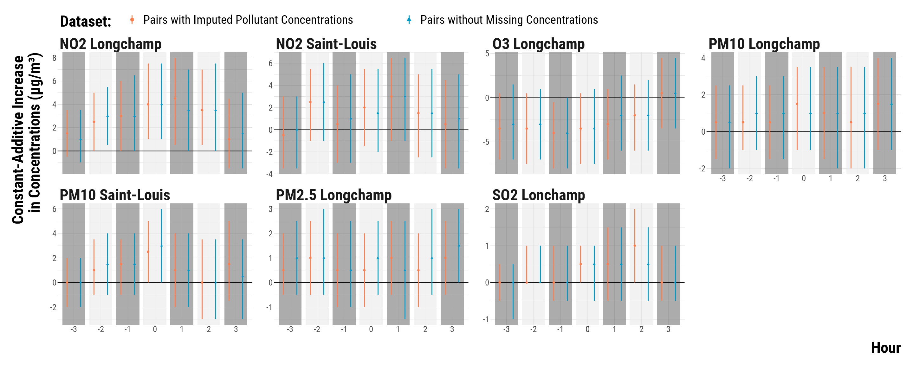<!-- --><div class="sourceCode"><pre class="sourceCode r"><code class="sourceCode r"><span class='co'># save the graph</span>
<span class='fu'>ggsave</span><span class='op'>(</span><span class='va'>graph_ri_ci_missing_concentration</span>, filename <span class='op'>=</span> <span class='fu'>here</span><span class='fu'>::</span><span class='fu'><a href='https://here.r-lib.org//reference/here.html'>here</a></span><span class='op'>(</span><span class='st'>"3.outputs"</span>, <span class='st'>"1.figures"</span>, <span class='st'>"2.experiments_cruise"</span>, <span class='st'>"1.experiment_entry_cruise"</span>, <span class='st'>"2.matching_results"</span>, <span class='st'>"graph_ri_ci_missing_concentration.pdf"</span><span class='op'>)</span>, width <span class='op'>=</span> <span class='fl'>70</span>, height <span class='op'>=</span> <span class='fl'>30</span>, units <span class='op'>=</span> <span class='st'>"cm"</span>, device <span class='op'>=</span> <span class='va'>cairo_pdf</span><span class='op'>)</span>
</code></pre></div>

</div>


### Neyman's Approach: Computing Confidence Intervals for the Average Treatment Effects

We compute confidence intervals for the average treatement using Neyman's approach. We use the formula for the standard error of pair randomized experiment found in Imbens and Rubin (2015).

<div class="layout-chunk" data-layout="l-body">
<div class="sourceCode"><pre class="sourceCode r"><code class="sourceCode r"><span class='co'># we first compute the average treatment effects for each pollutant and hour</span>
<span class='va'>data_pair_mean_difference</span> <span class='op'>&lt;-</span> <span class='va'>data_pair_difference_pollutant</span> <span class='op'>%&gt;%</span>
  <span class='fu'>group_by</span><span class='op'>(</span><span class='va'>pollutant</span>, <span class='va'>time</span><span class='op'>)</span> <span class='op'>%&gt;%</span>
  <span class='fu'>summarise</span><span class='op'>(</span>mean_difference <span class='op'>=</span> <span class='fu'><a href='https://rdrr.io/r/base/mean.html'>mean</a></span><span class='op'>(</span><span class='va'>difference</span><span class='op'>)</span><span class='op'>)</span> <span class='op'>%&gt;%</span>
  <span class='fu'>ungroup</span><span class='op'>(</span><span class='op'>)</span>

<span class='co'># we store the number of pairs</span>
<span class='va'>n_pair</span> <span class='op'>&lt;-</span> <span class='fu'><a href='https://rdrr.io/r/base/nrow.html'>nrow</a></span><span class='op'>(</span><span class='va'>data_matched</span><span class='op'>)</span><span class='op'>/</span><span class='fl'>2</span>

<span class='co'># compute the standard error</span>
<span class='va'>data_se_neyman_pair</span> <span class='op'>&lt;-</span> <span class='fu'>left_join</span><span class='op'>(</span><span class='va'>data_pair_difference_pollutant</span>, <span class='va'>data_pair_mean_difference</span>, by <span class='op'>=</span> <span class='fu'><a href='https://rdrr.io/r/base/c.html'>c</a></span><span class='op'>(</span><span class='st'>"pollutant"</span>, <span class='st'>"time"</span><span class='op'>)</span><span class='op'>)</span> <span class='op'>%&gt;%</span>
  <span class='fu'>mutate</span><span class='op'>(</span>squared_difference <span class='op'>=</span> <span class='op'>(</span><span class='va'>difference</span><span class='op'>-</span><span class='va'>mean_difference</span><span class='op'>)</span><span class='op'>^</span><span class='fl'>2</span><span class='op'>)</span> <span class='op'>%&gt;%</span>
  <span class='fu'>group_by</span><span class='op'>(</span><span class='va'>pollutant</span>, <span class='va'>time</span><span class='op'>)</span> <span class='op'>%&gt;%</span>
  <span class='fu'>summarise</span><span class='op'>(</span>standard_error <span class='op'>=</span> <span class='fu'><a href='https://rdrr.io/r/base/MathFun.html'>sqrt</a></span><span class='op'>(</span><span class='fl'>1</span><span class='op'>/</span><span class='op'>(</span><span class='va'>n_pair</span><span class='op'>*</span><span class='op'>(</span><span class='va'>n_pair</span><span class='op'>-</span><span class='fl'>1</span><span class='op'>)</span><span class='op'>)</span><span class='op'>*</span><span class='fu'><a href='https://rdrr.io/r/base/sum.html'>sum</a></span><span class='op'>(</span><span class='va'>squared_difference</span><span class='op'>)</span><span class='op'>)</span><span class='op'>)</span> <span class='op'>%&gt;%</span>
  <span class='fu'>select</span><span class='op'>(</span><span class='va'>pollutant</span>, <span class='va'>time</span>, <span class='va'>standard_error</span><span class='op'>)</span> <span class='op'>%&gt;%</span>
  <span class='fu'>ungroup</span><span class='op'>(</span><span class='op'>)</span>

<span class='co'># merge the average treatment effect data witht the standard error data</span>
<span class='va'>data_neyman</span> <span class='op'>&lt;-</span> <span class='fu'>left_join</span><span class='op'>(</span><span class='va'>data_pair_mean_difference</span>, <span class='va'>data_se_neyman_pair</span>, by <span class='op'>=</span> <span class='fu'><a href='https://rdrr.io/r/base/c.html'>c</a></span><span class='op'>(</span><span class='st'>"pollutant"</span>, <span class='st'>"time"</span><span class='op'>)</span><span class='op'>)</span> <span class='op'>%&gt;%</span>
<span class='co'># compute the 95% confidence intervals</span>
  <span class='fu'>mutate</span><span class='op'>(</span>ci_lower_95 <span class='op'>=</span> <span class='va'>mean_difference</span> <span class='op'>-</span> <span class='fl'>1.96</span><span class='op'>*</span><span class='va'>standard_error</span>,
         ci_upper_95 <span class='op'>=</span> <span class='va'>mean_difference</span> <span class='op'>+</span> <span class='fl'>1.96</span><span class='op'>*</span><span class='va'>standard_error</span><span class='op'>)</span>
</code></pre></div>

</div>


We plot the the point estimates for the average treatment effects and their associated 95% confidence intervals:

<div class="layout-chunk" data-layout="l-body-outset">
<div class="sourceCode"><pre class="sourceCode r"><code class="sourceCode r"><span class='co'># create an indicator to alternate shading of confidence intervals</span>
<span class='va'>data_neyman</span> <span class='op'>&lt;-</span> <span class='va'>data_neyman</span> <span class='op'>%&gt;%</span>
  <span class='fu'>arrange</span><span class='op'>(</span><span class='va'>pollutant</span>, <span class='va'>time</span><span class='op'>)</span> <span class='op'>%&gt;%</span>
  <span class='fu'>mutate</span><span class='op'>(</span>stripe <span class='op'>=</span> <span class='fu'><a href='https://rdrr.io/r/base/ifelse.html'>ifelse</a></span><span class='op'>(</span><span class='op'>(</span><span class='va'>time</span> <span class='op'>%%</span> <span class='fl'>2</span><span class='op'>)</span> <span class='op'>==</span> <span class='fl'>0</span>, <span class='st'>"Grey"</span>, <span class='st'>"White"</span><span class='op'>)</span><span class='op'>)</span> <span class='op'>%&gt;%</span>
  <span class='fu'>ungroup</span><span class='op'>(</span><span class='op'>)</span>

<span class='co'># make the graph</span>
<span class='va'>graph_neyman_ci</span> <span class='op'>&lt;-</span>
  <span class='fu'>ggplot</span><span class='op'>(</span><span class='va'>data_neyman</span>, <span class='fu'>aes</span><span class='op'>(</span>x <span class='op'>=</span> <span class='fu'><a href='https://rdrr.io/r/base/factor.html'>as.factor</a></span><span class='op'>(</span><span class='va'>time</span><span class='op'>)</span>, y <span class='op'>=</span> <span class='va'>mean_difference</span><span class='op'>)</span><span class='op'>)</span> <span class='op'>+</span>
  <span class='fu'>geom_rect</span><span class='op'>(</span>
    <span class='fu'>aes</span><span class='op'>(</span>fill <span class='op'>=</span> <span class='va'>stripe</span><span class='op'>)</span>,
    xmin <span class='op'>=</span> <span class='fu'><a href='https://rdrr.io/r/base/numeric.html'>as.numeric</a></span><span class='op'>(</span><span class='fu'><a href='https://rdrr.io/r/base/factor.html'>as.factor</a></span><span class='op'>(</span><span class='va'>data_neyman</span><span class='op'>$</span><span class='va'>time</span><span class='op'>)</span><span class='op'>)</span> <span class='op'>-</span> <span class='fl'>0.42</span>,
    xmax <span class='op'>=</span> <span class='fu'><a href='https://rdrr.io/r/base/numeric.html'>as.numeric</a></span><span class='op'>(</span><span class='fu'><a href='https://rdrr.io/r/base/factor.html'>as.factor</a></span><span class='op'>(</span><span class='va'>data_neyman</span><span class='op'>$</span><span class='va'>time</span><span class='op'>)</span><span class='op'>)</span> <span class='op'>+</span> <span class='fl'>0.42</span>,
    ymin <span class='op'>=</span> <span class='op'>-</span><span class='cn'>Inf</span>,
    ymax <span class='op'>=</span> <span class='cn'>Inf</span>,
    color <span class='op'>=</span> <span class='cn'>NA</span>,
    alpha <span class='op'>=</span> <span class='fl'>0.4</span>
  <span class='op'>)</span> <span class='op'>+</span>
  <span class='fu'>geom_hline</span><span class='op'>(</span>yintercept <span class='op'>=</span> <span class='fl'>0</span>, color <span class='op'>=</span> <span class='st'>"black"</span><span class='op'>)</span> <span class='op'>+</span>
  <span class='fu'>geom_vline</span><span class='op'>(</span>xintercept <span class='op'>=</span> <span class='st'>"0"</span>, color <span class='op'>=</span> <span class='st'>"black"</span><span class='op'>)</span> <span class='op'>+</span>
  <span class='fu'>geom_pointrange</span><span class='op'>(</span>
    <span class='fu'>aes</span><span class='op'>(</span>
      x <span class='op'>=</span> <span class='fu'><a href='https://rdrr.io/r/base/factor.html'>as.factor</a></span><span class='op'>(</span><span class='va'>time</span><span class='op'>)</span>,
      y <span class='op'>=</span> <span class='va'>mean_difference</span>,
      ymin <span class='op'>=</span> <span class='va'>ci_lower_95</span> ,
      ymax <span class='op'>=</span> <span class='va'>ci_upper_95</span>
    <span class='op'>)</span>,
    colour <span class='op'>=</span> <span class='st'>"deepskyblue3"</span>,
    lwd <span class='op'>=</span> <span class='fl'>0.8</span>
  <span class='op'>)</span> <span class='op'>+</span>
  <span class='fu'>facet_wrap</span><span class='op'>(</span> <span class='op'>~</span> <span class='va'>pollutant</span>, scales <span class='op'>=</span> <span class='st'>"free_y"</span>, ncol <span class='op'>=</span> <span class='fl'>4</span><span class='op'>)</span> <span class='op'>+</span>
  <span class='fu'>scale_fill_manual</span><span class='op'>(</span>values <span class='op'>=</span> <span class='fu'><a href='https://rdrr.io/r/base/c.html'>c</a></span><span class='op'>(</span><span class='st'>'gray92'</span>, <span class='cn'>NA</span><span class='op'>)</span><span class='op'>)</span> <span class='op'>+</span>
  <span class='fu'>guides</span><span class='op'>(</span>fill <span class='op'>=</span> <span class='cn'>FALSE</span><span class='op'>)</span> <span class='op'>+</span>
  <span class='fu'>ylab</span><span class='op'>(</span><span class='st'>"Average Pair Difference \nin Concentrations (µg/m³)"</span><span class='op'>)</span> <span class='op'>+</span> <span class='fu'>xlab</span><span class='op'>(</span><span class='st'>"Hour"</span><span class='op'>)</span> <span class='op'>+</span>
  <span class='va'>custom_theme</span> <span class='op'>+</span>
  <span class='fu'>theme</span><span class='op'>(</span>
    <span class='co'># axis titles parameters</span>
    axis.title.x <span class='op'>=</span> <span class='fu'>element_text</span><span class='op'>(</span>size<span class='op'>=</span><span class='fl'>36</span>, face <span class='op'>=</span> <span class='st'>"bold"</span>, margin <span class='op'>=</span> <span class='fu'>margin</span><span class='op'>(</span>t <span class='op'>=</span> <span class='fl'>20</span>, r <span class='op'>=</span> <span class='fl'>0</span>, b <span class='op'>=</span> <span class='fl'>0</span>, l <span class='op'>=</span><span class='fl'>0</span><span class='op'>)</span><span class='op'>)</span>,
    axis.title.y <span class='op'>=</span> <span class='fu'>element_text</span><span class='op'>(</span>size<span class='op'>=</span><span class='fl'>36</span>, face <span class='op'>=</span> <span class='st'>"bold"</span>, margin <span class='op'>=</span> <span class='fu'>margin</span><span class='op'>(</span>t <span class='op'>=</span> <span class='fl'>0</span>, r <span class='op'>=</span> <span class='fl'>20</span>, b <span class='op'>=</span> <span class='fl'>0</span>, l <span class='op'>=</span> <span class='fl'>0</span><span class='op'>)</span><span class='op'>)</span>,
    <span class='co'># axis texts</span>
    axis.text.x <span class='op'>=</span> <span class='fu'>element_text</span><span class='op'>(</span>size<span class='op'>=</span><span class='fl'>20</span><span class='op'>)</span>,
    axis.text.y <span class='op'>=</span> <span class='fu'>element_text</span><span class='op'>(</span>size<span class='op'>=</span><span class='fl'>20</span><span class='op'>)</span>,
    <span class='co'># facet texts</span>
    strip.text.x <span class='op'>=</span> <span class='fu'>element_text</span><span class='op'>(</span>size<span class='op'>=</span><span class='fl'>36</span>, face <span class='op'>=</span> <span class='st'>"bold"</span><span class='op'>)</span>,
    strip.text.y <span class='op'>=</span> <span class='fu'>element_text</span><span class='op'>(</span>size<span class='op'>=</span><span class='fl'>36</span>, face <span class='op'>=</span> <span class='st'>"bold"</span><span class='op'>)</span>,
    <span class='co'># legend parameters</span>
    legend.position <span class='op'>=</span> <span class='st'>"top"</span>, legend.justification <span class='op'>=</span> <span class='st'>"left"</span>, legend.direction <span class='op'>=</span> <span class='st'>"horizontal"</span>,
    legend.title <span class='op'>=</span> <span class='fu'>element_text</span><span class='op'>(</span>size<span class='op'>=</span><span class='fl'>36</span>, face <span class='op'>=</span> <span class='st'>"bold"</span><span class='op'>)</span>,
    legend.text <span class='op'>=</span> <span class='fu'>element_text</span><span class='op'>(</span>size<span class='op'>=</span><span class='fl'>28</span><span class='op'>)</span><span class='op'>)</span>

<span class='co'># print the graph</span>
<span class='va'>graph_neyman_ci</span>
</code></pre></div>
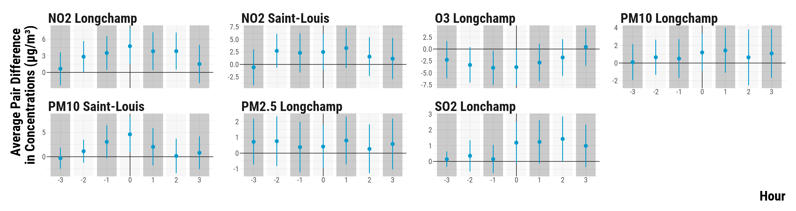<!-- --><div class="sourceCode"><pre class="sourceCode r"><code class="sourceCode r"><span class='co'># save the graph</span>
<span class='fu'>ggsave</span><span class='op'>(</span>
  <span class='va'>graph_neyman_ci</span>,
  filename <span class='op'>=</span> <span class='fu'>here</span><span class='fu'>::</span><span class='fu'><a href='https://here.r-lib.org//reference/here.html'>here</a></span><span class='op'>(</span>
    <span class='st'>"3.outputs"</span>,
    <span class='st'>"1.figures"</span>,
    <span class='st'>"2.experiments_cruise"</span>,
    <span class='st'>"1.experiment_entry_cruise"</span>,
    <span class='st'>"2.matching_results"</span>,
    <span class='st'>"graph_ci_neyman.pdf"</span>
  <span class='op'>)</span>,
  width <span class='op'>=</span> <span class='fl'>70</span>,
  height <span class='op'>=</span> <span class='fl'>30</span>,
  units <span class='op'>=</span> <span class='st'>"cm"</span>,
  device <span class='op'>=</span> <span class='va'>cairo_pdf</span>
<span class='op'>)</span>
</code></pre></div>

</div>


### Statistical Power Issues 

Our matching procedure resulted in few matched treated units: we might therefore have a low statistical power to detect the effect of cruise vessels on air pollutant concentrations. Even more worrying is our higher chance to suffer from type-S an type-M errors. While we do not know what the true effect of cruise on air pollutants is, we can explore our statistical power and our probability to make types S and M errors using a grid of plausible effect sizes. We proceed as follows:

* We take the standard error computed for the average treatment effect of cruise on NO2 concentration in *t* at Saint-Louis. 
* We set create a grid of plausible effect sizes.
* The `retrodesign` package allows us to compute the statistical power, the type-M and type-S errors associated with each effect size.

<div class="layout-chunk" data-layout="l-body">
<div class="sourceCode"><pre class="sourceCode r"><code class="sourceCode r"><span class='co'># retrieve the standard error</span>
<span class='va'>standard_error</span> <span class='op'>&lt;-</span> <span class='va'>data_neyman</span> <span class='op'>%&gt;%</span>
  <span class='fu'><a href='https://rdrr.io/r/stats/filter.html'>filter</a></span><span class='op'>(</span><span class='va'>pollutant</span> <span class='op'>==</span> <span class='st'>"NO2 Saint-Louis"</span> <span class='op'>&amp;</span> <span class='va'>time</span> <span class='op'>==</span> <span class='fl'>0</span><span class='op'>)</span> <span class='op'>%&gt;%</span>
  <span class='fu'>pull</span><span class='op'>(</span><span class='va'>standard_error</span><span class='op'>)</span>

<span class='co'># create data on plausible effect sizes</span>
<span class='va'>data_type_m_s_errors</span> <span class='op'>&lt;-</span> <span class='fu'>tibble</span><span class='op'>(</span>plausible_effect <span class='op'>=</span> <span class='fu'><a href='https://rdrr.io/r/base/seq.html'>seq</a></span><span class='op'>(</span>from <span class='op'>=</span> <span class='fl'>0.25</span>, to <span class='op'>=</span> <span class='fl'>6</span>, by <span class='op'>=</span> <span class='fl'>0.1</span><span class='op'>)</span><span class='op'>)</span>

<span class='co'># add the standard error to data_type_m_s_errors</span>
<span class='va'>data_type_m_s_errors</span> <span class='op'>&lt;-</span> <span class='va'>data_type_m_s_errors</span> <span class='op'>%&gt;%</span>
  <span class='fu'>mutate</span><span class='op'>(</span>standard_error <span class='op'>=</span> <span class='va'>standard_error</span><span class='op'>)</span>

<span class='co'># we compute power, type s and m errors</span>
<span class='va'>data_type_m_s_errors</span> <span class='op'>&lt;-</span> <span class='va'>data_type_m_s_errors</span> <span class='op'>%&gt;%</span>
  <span class='fu'>mutate</span><span class='op'>(</span>power <span class='op'>=</span> <span class='fu'>map2</span><span class='op'>(</span><span class='va'>plausible_effect</span>, <span class='va'>standard_error</span>, <span class='op'>~</span> <span class='fu'><a href='https://rdrr.io/pkg/retrodesign/man/retro_design.html'>retro_design</a></span><span class='op'>(</span><span class='va'>.x</span>, <span class='va'>.y</span><span class='op'>)</span><span class='op'>$</span><span class='va'>power</span><span class='op'>*</span><span class='fl'>100</span><span class='op'>)</span>,
         type_m_error <span class='op'>=</span> <span class='fu'>map2</span><span class='op'>(</span><span class='va'>plausible_effect</span>, <span class='va'>standard_error</span>, <span class='op'>~</span> <span class='fu'><a href='https://rdrr.io/pkg/retrodesign/man/retro_design.html'>retro_design</a></span><span class='op'>(</span><span class='va'>.x</span>, <span class='va'>.y</span><span class='op'>)</span><span class='op'>$</span><span class='va'>typeM</span><span class='op'>)</span>,
         type_s_error <span class='op'>=</span> <span class='fu'>map2</span><span class='op'>(</span><span class='va'>plausible_effect</span>, <span class='va'>standard_error</span>, <span class='op'>~</span> <span class='fu'><a href='https://rdrr.io/pkg/retrodesign/man/retro_design.html'>retro_design</a></span><span class='op'>(</span><span class='va'>.x</span>, <span class='va'>.y</span><span class='op'>)</span><span class='op'>$</span><span class='va'>typeS</span><span class='op'>*</span><span class='fl'>100</span><span class='op'>)</span><span class='op'>)</span> <span class='op'>%&gt;%</span>
  <span class='fu'>unnest</span><span class='op'>(</span><span class='fu'><a href='https://rdrr.io/r/base/c.html'>c</a></span><span class='op'>(</span><span class='va'>power</span>, <span class='va'>type_m_error</span>, <span class='va'>type_s_error</span><span class='op'>)</span><span class='op'>)</span>
</code></pre></div>

</div>


We plot and save the results:

<div class="layout-chunk" data-layout="l-body-outset">
<div class="sourceCode"><pre class="sourceCode r"><code class="sourceCode r"><span class='co'># make the graph</span>
<span class='va'>graph_type_m_s_errors</span> <span class='op'>&lt;-</span> <span class='va'>data_type_m_s_errors</span> <span class='op'>%&gt;%</span>
  <span class='fu'>rename</span><span class='op'>(</span>
    <span class='st'>"Power (%)"</span> <span class='op'>=</span> <span class='va'>power</span>,
    <span class='st'>"Type M Error (Bias)"</span> <span class='op'>=</span> <span class='va'>type_m_error</span>,
    <span class='st'>"Type S Error (%)"</span> <span class='op'>=</span> <span class='va'>type_s_error</span>
  <span class='op'>)</span> <span class='op'>%&gt;%</span>
  <span class='fu'>pivot_longer</span><span class='op'>(</span>
    cols <span class='op'>=</span> <span class='op'>-</span><span class='fu'><a href='https://rdrr.io/r/base/c.html'>c</a></span><span class='op'>(</span><span class='va'>plausible_effect</span>, <span class='va'>standard_error</span><span class='op'>)</span>,
    names_to <span class='op'>=</span> <span class='st'>"variable"</span>,
    values_to <span class='op'>=</span> <span class='st'>"value"</span>
  <span class='op'>)</span> <span class='op'>%&gt;%</span>
  <span class='fu'>ggplot</span><span class='op'>(</span><span class='va'>.</span>, <span class='fu'>aes</span><span class='op'>(</span>x <span class='op'>=</span> <span class='va'>plausible_effect</span>, y <span class='op'>=</span> <span class='va'>value</span><span class='op'>)</span><span class='op'>)</span> <span class='op'>+</span>
  <span class='fu'>geom_line</span><span class='op'>(</span>size <span class='op'>=</span> <span class='fl'>1.3</span>, colour <span class='op'>=</span> <span class='st'>"deepskyblue3"</span><span class='op'>)</span> <span class='op'>+</span>
  <span class='fu'>scale_y_continuous</span><span class='op'>(</span>breaks <span class='op'>=</span> <span class='fu'>scales</span><span class='fu'>::</span><span class='fu'><a href='https://scales.r-lib.org/reference/breaks_pretty.html'>pretty_breaks</a></span><span class='op'>(</span>n <span class='op'>=</span> <span class='fl'>10</span><span class='op'>)</span><span class='op'>)</span> <span class='op'>+</span>
  <span class='fu'>facet_wrap</span><span class='op'>(</span> <span class='op'>~</span> <span class='va'>variable</span>, scales <span class='op'>=</span> <span class='st'>"free"</span><span class='op'>)</span> <span class='op'>+</span>
  <span class='fu'>xlab</span><span class='op'>(</span><span class='st'>"Plausible Effect Sizes for an Average Increase\n in NO2 Concentrations (µg/m³)"</span><span class='op'>)</span> <span class='op'>+</span> <span class='fu'>ylab</span><span class='op'>(</span><span class='st'>""</span><span class='op'>)</span> <span class='op'>+</span>
  <span class='va'>custom_theme</span>


<span class='co'># print the graph</span>
<span class='va'>graph_type_m_s_errors</span>
</code></pre></div>
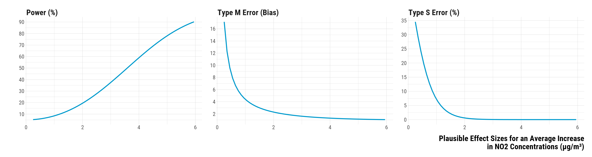<!-- --><div class="sourceCode"><pre class="sourceCode r"><code class="sourceCode r"><span class='co'># save the graph</span>
<span class='fu'>ggsave</span><span class='op'>(</span>
  <span class='va'>graph_type_m_s_errors</span>,
  filename <span class='op'>=</span> <span class='fu'>here</span><span class='fu'>::</span><span class='fu'><a href='https://here.r-lib.org//reference/here.html'>here</a></span><span class='op'>(</span>
    <span class='st'>"3.outputs"</span>,
    <span class='st'>"1.figures"</span>,
    <span class='st'>"2.experiments_cruise"</span>,
    <span class='st'>"1.experiment_entry_cruise"</span>,
    <span class='st'>"2.matching_results"</span>,
    <span class='st'>"graph_type_m_s_errors.pdf"</span>
  <span class='op'>)</span>,
  width <span class='op'>=</span> <span class='fl'>40</span>,
  height <span class='op'>=</span> <span class='fl'>15</span>,
  units <span class='op'>=</span> <span class='st'>"cm"</span>,
  device <span class='op'>=</span> <span class='va'>cairo_pdf</span>
<span class='op'>)</span>
</code></pre></div>

</div>


# Regression Analysis on Matching Data

Finally, we ran a simple time-stratified regression model on the matching data to see how the results differ with those found in our matched data analysis. We only adjust for calendar indicator and weather covariates measured at time t. Again, we ran this procedure on an Amazon Web Services virtual computer (EC2 t3.2xlarge). The code we used is in the script `script_aws_regression_matching_data.R` located in the **1.experiment_entry_cruise/script_aws** folder. It takes several minutes to run.

We load the outputs of the regression model and plot the 95% confidence intervals:

<div class="layout-chunk" data-layout="l-body-outset">
<div class="sourceCode"><pre class="sourceCode r"><code class="sourceCode r"><span class='co'># load regression outputs</span>
<span class='va'>data_matching_regression</span> <span class='op'>&lt;-</span> <span class='fu'><a href='https://rdrr.io/r/base/readRDS.html'>readRDS</a></span><span class='op'>(</span><span class='fu'>here</span><span class='fu'>::</span><span class='fu'><a href='https://here.r-lib.org//reference/here.html'>here</a></span><span class='op'>(</span><span class='st'>"1.data"</span>, <span class='st'>"2.data_for_analysis"</span>, <span class='st'>"1.matched_data"</span>, <span class='st'>"1.experiments_cruise"</span>, <span class='st'>"1.experiment_entry_cruise"</span>, <span class='st'>"data_matching_regression.rds"</span><span class='op'>)</span><span class='op'>)</span> <span class='op'>%&gt;%</span>
<span class='co'># compute 95% confidence intervals using the standard error</span>
  <span class='fu'>mutate</span><span class='op'>(</span>ci_lower_95 <span class='op'>=</span> <span class='va'>estimate</span> <span class='op'>-</span> <span class='fl'>1.96</span><span class='op'>*</span><span class='va'>std.error</span>,
         ci_upper_95 <span class='op'>=</span> <span class='va'>estimate</span> <span class='op'>+</span> <span class='fl'>1.96</span><span class='op'>*</span><span class='va'>std.error</span><span class='op'>)</span>

<span class='co'># make the graph</span>
<span class='va'>graph_regression_matching_data</span> <span class='op'>&lt;-</span> <span class='fu'>ggplot</span><span class='op'>(</span><span class='va'>data_matching_regression</span>, <span class='fu'>aes</span><span class='op'>(</span>x <span class='op'>=</span> <span class='fu'><a href='https://rdrr.io/r/base/factor.html'>as.factor</a></span><span class='op'>(</span><span class='va'>time</span><span class='op'>)</span>, y <span class='op'>=</span> <span class='va'>estimate</span>,  ymin <span class='op'>=</span> <span class='va'>ci_lower_95</span>,
                      ymax <span class='op'>=</span> <span class='va'>ci_upper_95</span><span class='op'>)</span><span class='op'>)</span> <span class='op'>+</span>
  <span class='fu'>geom_hline</span><span class='op'>(</span>yintercept <span class='op'>=</span> <span class='fl'>0</span>, color <span class='op'>=</span> <span class='st'>"black"</span><span class='op'>)</span> <span class='op'>+</span>
  <span class='fu'>geom_vline</span><span class='op'>(</span>xintercept <span class='op'>=</span> <span class='st'>"0"</span>, color <span class='op'>=</span> <span class='st'>"black"</span><span class='op'>)</span> <span class='op'>+</span>
  <span class='fu'>geom_pointrange</span><span class='op'>(</span>colour<span class='op'>=</span><span class='st'>"deepskyblue3"</span>, lwd <span class='op'>=</span> <span class='fl'>0.8</span><span class='op'>)</span> <span class='op'>+</span>
  <span class='fu'>facet_wrap</span><span class='op'>(</span><span class='op'>~</span> <span class='va'>pollutant</span>, scales <span class='op'>=</span> <span class='st'>"free_y"</span><span class='op'>)</span> <span class='op'>+</span>
  <span class='fu'>xlab</span><span class='op'>(</span><span class='st'>"Hour"</span><span class='op'>)</span> <span class='op'>+</span> <span class='fu'>ylab</span><span class='op'>(</span><span class='st'>"Average Difference \nin Concentrations (µg/m³)"</span><span class='op'>)</span> <span class='op'>+</span>
  <span class='va'>custom_theme</span> <span class='op'>+</span>
  <span class='fu'>theme</span><span class='op'>(</span>
    <span class='co'># axis titles parameters</span>
    axis.title.x <span class='op'>=</span> <span class='fu'>element_text</span><span class='op'>(</span>size<span class='op'>=</span><span class='fl'>36</span>, face <span class='op'>=</span> <span class='st'>"bold"</span>, margin <span class='op'>=</span> <span class='fu'>margin</span><span class='op'>(</span>t <span class='op'>=</span> <span class='fl'>20</span>, r <span class='op'>=</span> <span class='fl'>0</span>, b <span class='op'>=</span> <span class='fl'>0</span>, l <span class='op'>=</span><span class='fl'>0</span><span class='op'>)</span><span class='op'>)</span>,
    axis.title.y <span class='op'>=</span> <span class='fu'>element_text</span><span class='op'>(</span>size<span class='op'>=</span><span class='fl'>36</span>, face <span class='op'>=</span> <span class='st'>"bold"</span>, margin <span class='op'>=</span> <span class='fu'>margin</span><span class='op'>(</span>t <span class='op'>=</span> <span class='fl'>0</span>, r <span class='op'>=</span> <span class='fl'>20</span>, b <span class='op'>=</span> <span class='fl'>0</span>, l <span class='op'>=</span> <span class='fl'>0</span><span class='op'>)</span><span class='op'>)</span>,
    <span class='co'># axis texts</span>
    axis.text.x <span class='op'>=</span> <span class='fu'>element_text</span><span class='op'>(</span>size<span class='op'>=</span><span class='fl'>20</span><span class='op'>)</span>,
    axis.text.y <span class='op'>=</span> <span class='fu'>element_text</span><span class='op'>(</span>size<span class='op'>=</span><span class='fl'>20</span><span class='op'>)</span>,
    <span class='co'># facet texts</span>
    strip.text.x <span class='op'>=</span> <span class='fu'>element_text</span><span class='op'>(</span>size<span class='op'>=</span><span class='fl'>36</span>, face <span class='op'>=</span> <span class='st'>"bold"</span><span class='op'>)</span>,
    strip.text.y <span class='op'>=</span> <span class='fu'>element_text</span><span class='op'>(</span>size<span class='op'>=</span><span class='fl'>36</span>, face <span class='op'>=</span> <span class='st'>"bold"</span><span class='op'>)</span>,
    <span class='co'># legend parameters</span>
    legend.position <span class='op'>=</span> <span class='st'>"top"</span>, legend.justification <span class='op'>=</span> <span class='st'>"left"</span>, legend.direction <span class='op'>=</span> <span class='st'>"horizontal"</span>,
    legend.title <span class='op'>=</span> <span class='fu'>element_text</span><span class='op'>(</span>size<span class='op'>=</span><span class='fl'>36</span>, face <span class='op'>=</span> <span class='st'>"bold"</span><span class='op'>)</span>,
    legend.text <span class='op'>=</span> <span class='fu'>element_text</span><span class='op'>(</span>size<span class='op'>=</span><span class='fl'>28</span><span class='op'>)</span><span class='op'>)</span>


<span class='co'># print the graph</span>
<span class='va'>graph_regression_matching_data</span>
</code></pre></div>
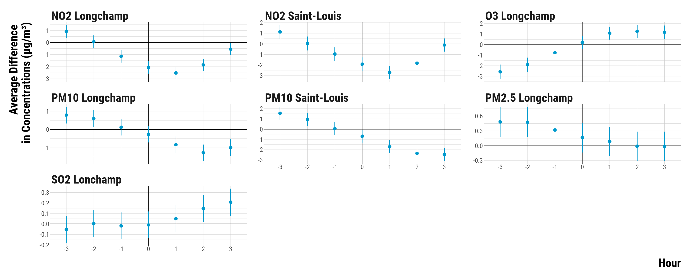<!-- --><div class="sourceCode"><pre class="sourceCode r"><code class="sourceCode r"><span class='co'># save the graph</span>
<span class='fu'>ggsave</span><span class='op'>(</span><span class='va'>graph_regression_matching_data</span>, filename <span class='op'>=</span> <span class='fu'>here</span><span class='fu'>::</span><span class='fu'><a href='https://here.r-lib.org//reference/here.html'>here</a></span><span class='op'>(</span>
    <span class='st'>"3.outputs"</span>,
    <span class='st'>"1.figures"</span>,
    <span class='st'>"2.experiments_cruise"</span>,
    <span class='st'>"1.experiment_entry_cruise"</span>,
    <span class='st'>"2.matching_results"</span>,
    <span class='st'>"graph_matching_regression.pdf"</span>
  <span class='op'>)</span>,
  width <span class='op'>=</span> <span class='fl'>70</span>,
  height <span class='op'>=</span> <span class='fl'>30</span>,
  units <span class='op'>=</span> <span class='st'>"cm"</span>,
  device <span class='op'>=</span> <span class='va'>cairo_pdf</span>
<span class='op'>)</span>
</code></pre></div>

</div>


And we display below the point estimates with the 95% confidence intervals:

<div class="layout-chunk" data-layout="l-body-outset">
<div data-pagedtable="false">
  <script data-pagedtable-source type="application/json">
{"columns":[{"label":["Pollutant"],"name":[1],"type":["chr"],"align":["left"]},{"label":["Time"],"name":[2],"type":["dbl"],"align":["right"]},{"label":["Point Estimate"],"name":[3],"type":["dbl"],"align":["right"]},{"label":["Lower Bound of the 95% Confidence Interval"],"name":[4],"type":["dbl"],"align":["right"]},{"label":["Upper Bound of the 95% Confidence Interval"],"name":[5],"type":["dbl"],"align":["right"]}],"data":[{"1":"NO2 Longchamp","2":"0","3":"-2.1","4":"-2.6","5":"-1.6"},{"1":"NO2 Saint-Louis","2":"0","3":"-1.9","4":"-2.5","5":"-1.3"},{"1":"NO2 Longchamp","2":"-1","3":"-1.1","4":"-1.7","5":"-0.6"},{"1":"NO2 Saint-Louis","2":"-1","3":"-1.0","4":"-1.6","5":"-0.3"},{"1":"NO2 Longchamp","2":"-2","3":"0.1","4":"-0.5","5":"0.6"},{"1":"NO2 Saint-Louis","2":"-2","3":"0.0","4":"-0.6","5":"0.7"},{"1":"NO2 Longchamp","2":"-3","3":"0.9","4":"0.4","5":"1.5"},{"1":"NO2 Saint-Louis","2":"-3","3":"1.1","4":"0.5","5":"1.8"},{"1":"NO2 Longchamp","2":"1","3":"-2.5","4":"-3.0","5":"-2.0"},{"1":"NO2 Saint-Louis","2":"1","3":"-2.7","4":"-3.3","5":"-2.1"},{"1":"NO2 Longchamp","2":"2","3":"-1.9","4":"-2.4","5":"-1.4"},{"1":"NO2 Saint-Louis","2":"2","3":"-1.8","4":"-2.4","5":"-1.2"},{"1":"NO2 Longchamp","2":"3","3":"-0.6","4":"-1.1","5":"0.0"},{"1":"NO2 Saint-Louis","2":"3","3":"-0.1","4":"-0.7","5":"0.5"},{"1":"O3 Longchamp","2":"0","3":"0.2","4":"-0.4","5":"0.9"},{"1":"O3 Longchamp","2":"-1","3":"-0.8","4":"-1.4","5":"-0.1"},{"1":"O3 Longchamp","2":"-2","3":"-1.9","4":"-2.6","5":"-1.2"},{"1":"O3 Longchamp","2":"-3","3":"-2.6","4":"-3.3","5":"-1.9"},{"1":"O3 Longchamp","2":"1","3":"1.1","4":"0.5","5":"1.7"},{"1":"O3 Longchamp","2":"2","3":"1.3","4":"0.6","5":"1.9"},{"1":"O3 Longchamp","2":"3","3":"1.2","4":"0.5","5":"1.8"},{"1":"PM10 Longchamp","2":"0","3":"-0.3","4":"-0.7","5":"0.2"},{"1":"PM10 Saint-Louis","2":"0","3":"-0.7","4":"-1.3","5":"-0.1"},{"1":"PM10 Longchamp","2":"-1","3":"0.1","4":"-0.3","5":"0.6"},{"1":"PM10 Saint-Louis","2":"-1","3":"0.0","4":"-0.6","5":"0.7"},{"1":"PM10 Longchamp","2":"-2","3":"0.6","4":"0.1","5":"1.1"},{"1":"PM10 Saint-Louis","2":"-2","3":"1.0","4":"0.3","5":"1.6"},{"1":"PM10 Longchamp","2":"-3","3":"0.8","4":"0.3","5":"1.2"},{"1":"PM10 Saint-Louis","2":"-3","3":"1.5","4":"0.9","5":"2.2"},{"1":"PM10 Longchamp","2":"1","3":"-0.8","4":"-1.3","5":"-0.4"},{"1":"PM10 Saint-Louis","2":"1","3":"-1.7","4":"-2.3","5":"-1.1"},{"1":"PM10 Longchamp","2":"2","3":"-1.3","4":"-1.7","5":"-0.8"},{"1":"PM10 Saint-Louis","2":"2","3":"-2.4","4":"-3.0","5":"-1.7"},{"1":"PM10 Longchamp","2":"3","3":"-1.0","4":"-1.5","5":"-0.5"},{"1":"PM10 Saint-Louis","2":"3","3":"-2.5","4":"-3.1","5":"-1.9"},{"1":"PM2.5 Longchamp","2":"0","3":"0.2","4":"-0.1","5":"0.5"},{"1":"PM2.5 Longchamp","2":"-1","3":"0.3","4":"0.0","5":"0.6"},{"1":"PM2.5 Longchamp","2":"-2","3":"0.5","4":"0.2","5":"0.8"},{"1":"PM2.5 Longchamp","2":"-3","3":"0.5","4":"0.2","5":"0.8"},{"1":"PM2.5 Longchamp","2":"1","3":"0.1","4":"-0.2","5":"0.4"},{"1":"PM2.5 Longchamp","2":"2","3":"0.0","4":"-0.3","5":"0.3"},{"1":"PM2.5 Longchamp","2":"3","3":"0.0","4":"-0.3","5":"0.3"},{"1":"SO2 Lonchamp","2":"0","3":"0.0","4":"-0.1","5":"0.1"},{"1":"SO2 Lonchamp","2":"-1","3":"0.0","4":"-0.1","5":"0.1"},{"1":"SO2 Lonchamp","2":"-2","3":"0.0","4":"-0.1","5":"0.1"},{"1":"SO2 Lonchamp","2":"-3","3":"-0.1","4":"-0.2","5":"0.1"},{"1":"SO2 Lonchamp","2":"1","3":"0.1","4":"-0.1","5":"0.2"},{"1":"SO2 Lonchamp","2":"2","3":"0.1","4":"0.0","5":"0.3"},{"1":"SO2 Lonchamp","2":"3","3":"0.2","4":"0.1","5":"0.3"}],"options":{"columns":{"min":{},"max":[10]},"rows":{"min":[10],"max":[10]},"pages":{}}}
  </script>
</div>

</div>


```{.r .distill-force-highlighting-css}
```
