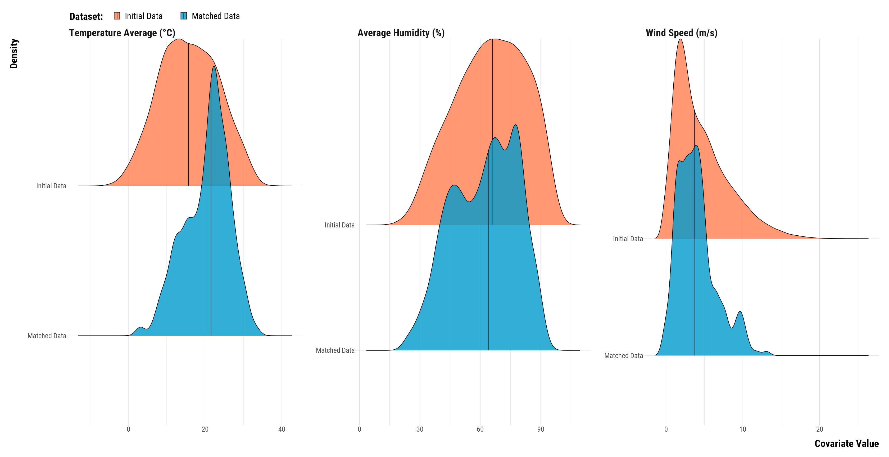

<style>
body {
text-align: justify}
</style>

In this document, we take great care providing all steps and R codes required to compare the matched data to the initial data. We compare hours where:

* treated units are hours with positive exiting cruise traffic in t.
* control units are hours without exiting cruise traffic in t.

We adjust for calendar calendar indicator and weather confouding factors.

**Should you have any questions, need help to reproduce the analysis or find coding errors, please do not hesitate to contact us at leo.zabrocki@psemail.eu and marion.leroutier@psemail.eu.**

# Required Packages

To reproduce exactly the `2_script_comparing_two_datasets.html` document, we first need to have installed:

* the [R](https://www.r-project.org/) programming language 
* [RStudio](https://rstudio.com/), an integrated development environment for R, which will allow you to knit the `2_script_comparing_two_datasets.Rmd` file and interact with the R code chunks
* the [R Markdown](https://rmarkdown.rstudio.com/) package
* and the [Distill](https://rstudio.github.io/distill/) package which provides the template for this document. 

Once everything is set up, we have to load the following packages:

<div class="layout-chunk" data-layout="l-body">
<div class="sourceCode"><pre class="sourceCode r"><code class="sourceCode r"><span class='co'># load required packages</span>
<span class='kw'><a href='https://rdrr.io/r/base/library.html'>library</a></span><span class='op'>(</span><span class='va'><a href='https://yihui.org/knitr/'>knitr</a></span><span class='op'>)</span> <span class='co'># for creating the R Markdown document</span>
<span class='kw'><a href='https://rdrr.io/r/base/library.html'>library</a></span><span class='op'>(</span><span class='va'><a href='https://here.r-lib.org/'>here</a></span><span class='op'>)</span> <span class='co'># for files paths organization</span>
<span class='kw'><a href='https://rdrr.io/r/base/library.html'>library</a></span><span class='op'>(</span><span class='va'><a href='https://tidyverse.tidyverse.org'>tidyverse</a></span><span class='op'>)</span> <span class='co'># for data manipulation and visualization</span>
<span class='kw'><a href='https://rdrr.io/r/base/library.html'>library</a></span><span class='op'>(</span><span class='va'><a href='https://wilkelab.org/ggridges/'>ggridges</a></span><span class='op'>)</span> <span class='co'># for ridge density plots</span>
<span class='kw'><a href='https://rdrr.io/r/base/library.html'>library</a></span><span class='op'>(</span><span class='va'><a href='http://haozhu233.github.io/kableExtra/'>kableExtra</a></span><span class='op'>)</span> <span class='co'># for table formatting</span>
<span class='kw'><a href='https://rdrr.io/r/base/library.html'>library</a></span><span class='op'>(</span><span class='va'><a href='http://www.rforge.net/Cairo/'>Cairo</a></span><span class='op'>)</span> <span class='co'># for printing customed police of graphs</span>
<span class='kw'><a href='https://rdrr.io/r/base/library.html'>library</a></span><span class='op'>(</span><span class='va'><a href='https://patchwork.data-imaginist.com'>patchwork</a></span><span class='op'>)</span> <span class='co'># combining plots</span>
</code></pre></div>

</div>


We finally load our customed `ggplot2` theme for graphs:

<div class="layout-chunk" data-layout="l-body">
<div class="sourceCode"><pre class="sourceCode r"><code class="sourceCode r"><span class='co'># load ggplot customed theme</span>
<span class='kw'><a href='https://rdrr.io/r/base/source.html'>source</a></span><span class='op'>(</span>
  <span class='fu'>here</span><span class='fu'>::</span><span class='fu'><a href='https://here.r-lib.org//reference/here.html'>here</a></span><span class='op'>(</span>
    <span class='st'>"2.scripts"</span>,
    <span class='st'>"4.custom_ggplot2_theme"</span>,
    <span class='st'>"script_custom_ggplot_theme.R"</span>
  <span class='op'>)</span>
<span class='op'>)</span>
</code></pre></div>

</div>


The theme is based on the fantastic [hrbrthemes](https://hrbrmstr.github.io/hrbrthemes/index.html) package. If you do not want to use this theme or are unable to install it because of fonts issues, you can use the `theme_bw()` already included in the `ggplot2` package.

# Comparing Distribution of Covariates in Matched and Initial Datasets

We explore the characteristics of the matched data by comparing the distribution of its covariates to those of the initial data. We load the two datasets and bind them in the `data_all` object:

<div class="layout-chunk" data-layout="l-body">
<div class="sourceCode"><pre class="sourceCode r"><code class="sourceCode r"><span class='co'># load Initial Data</span>
<span class='va'>data_matching</span> <span class='op'>&lt;-</span>
  <span class='fu'><a href='https://rdrr.io/r/base/readRDS.html'>readRDS</a></span><span class='op'>(</span>
    <span class='fu'>here</span><span class='fu'>::</span><span class='fu'><a href='https://here.r-lib.org//reference/here.html'>here</a></span><span class='op'>(</span>
      <span class='st'>"1.data"</span>,
      <span class='st'>"2.data_for_analysis"</span>,
      <span class='st'>"1.matched_data"</span>,
      <span class='st'>"1.experiments_cruise"</span>,
      <span class='st'>"2.experiment_exit_cruise"</span>,
      <span class='st'>"matching_data.rds"</span>
    <span class='op'>)</span>
  <span class='op'>)</span> <span class='op'>%&gt;%</span>
  <span class='fu'>mutate</span><span class='op'>(</span>dataset <span class='op'>=</span> <span class='st'>"Initial Data"</span><span class='op'>)</span>

<span class='co'># load matched data</span>
<span class='va'>data_matched</span> <span class='op'>&lt;-</span>
  <span class='fu'><a href='https://rdrr.io/r/base/readRDS.html'>readRDS</a></span><span class='op'>(</span>
    <span class='fu'>here</span><span class='fu'>::</span><span class='fu'><a href='https://here.r-lib.org//reference/here.html'>here</a></span><span class='op'>(</span>
      <span class='st'>"1.data"</span>,
      <span class='st'>"2.data_for_analysis"</span>,
      <span class='st'>"1.matched_data"</span>,
      <span class='st'>"1.experiments_cruise"</span>,
      <span class='st'>"2.experiment_exit_cruise"</span>,
      <span class='st'>"matched_data_exit_cruise.rds"</span>
    <span class='op'>)</span>
  <span class='op'>)</span> <span class='op'>%&gt;%</span>
  <span class='fu'>mutate</span><span class='op'>(</span>dataset <span class='op'>=</span> <span class='st'>"Matched Data"</span><span class='op'>)</span>

<span class='co'># bind the three datasets</span>
<span class='va'>data_all</span> <span class='op'>&lt;-</span> <span class='fu'>bind_rows</span><span class='op'>(</span><span class='va'>data_matching</span>, <span class='va'>data_matched</span><span class='op'>)</span>
</code></pre></div>

</div>


# Figures

We plot below the density distributions of continuous weather covariates for the two datasets:

<div class="layout-chunk" data-layout="l-body-outset">
<div class="sourceCode"><pre class="sourceCode r"><code class="sourceCode r"><span class='co'># we select continuous weather variables and store them in a long dataframe</span>
<span class='va'>data_continuous_weather_variables</span> <span class='op'>&lt;-</span> <span class='va'>data_all</span> <span class='op'>%&gt;%</span>
  <span class='fu'>select</span><span class='op'>(</span><span class='va'>temperature_average</span>, <span class='va'>wind_speed</span>, <span class='va'>humidity_average</span>, <span class='va'>dataset</span><span class='op'>)</span> <span class='op'>%&gt;%</span>
  <span class='fu'>pivot_longer</span><span class='op'>(</span>
    <span class='va'>.</span>,
    cols <span class='op'>=</span>  <span class='fu'><a href='https://rdrr.io/r/base/c.html'>c</a></span><span class='op'>(</span><span class='va'>temperature_average</span><span class='op'>:</span><span class='va'>humidity_average</span><span class='op'>)</span>,
    names_to <span class='op'>=</span> <span class='st'>"variable"</span>,
    values_to <span class='op'>=</span> <span class='st'>"values"</span>
  <span class='op'>)</span> <span class='op'>%&gt;%</span>
  <span class='fu'>mutate</span><span class='op'>(</span>
    variable <span class='op'>=</span>  <span class='fu'><a href='https://rdrr.io/r/base/factor.html'>factor</a></span><span class='op'>(</span>
      <span class='va'>variable</span>,
      levels <span class='op'>=</span> <span class='fu'><a href='https://rdrr.io/r/base/c.html'>c</a></span><span class='op'>(</span><span class='st'>"temperature_average"</span>, <span class='st'>"humidity_average"</span>, <span class='st'>"wind_speed"</span><span class='op'>)</span>
    <span class='op'>)</span> <span class='op'>%&gt;%</span>
      <span class='fu'>fct_recode</span><span class='op'>(</span>
        <span class='va'>.</span>,
        <span class='st'>"Temperature Average (°C)"</span> <span class='op'>=</span> <span class='st'>"temperature_average"</span>,
        <span class='st'>"Average Humidity (%)"</span> <span class='op'>=</span> <span class='st'>"humidity_average"</span>,
        <span class='st'>"Wind Speed (m/s)"</span> <span class='op'>=</span> <span class='st'>"wind_speed"</span>
      <span class='op'>)</span>
  <span class='op'>)</span> <span class='op'>%&gt;%</span>
  <span class='fu'>mutate</span><span class='op'>(</span>dataset <span class='op'>=</span> <span class='fu'>fct_relevel</span><span class='op'>(</span><span class='va'>dataset</span>, <span class='st'>"Initial Data"</span>, <span class='st'>"Matched Data"</span><span class='op'>)</span><span class='op'>)</span>

<span class='co'># we plot the density distributions</span>
<span class='va'>graph_density_continuous_weather_variables</span> <span class='op'>&lt;-</span>
  <span class='fu'>ggplot</span><span class='op'>(</span><span class='va'>data_continuous_weather_variables</span>,
         <span class='fu'>aes</span><span class='op'>(</span>
           x <span class='op'>=</span> <span class='va'>values</span>,
           y <span class='op'>=</span> <span class='fu'>fct_rev</span><span class='op'>(</span><span class='va'>dataset</span><span class='op'>)</span>,
           fill <span class='op'>=</span> <span class='fu'>fct_rev</span><span class='op'>(</span><span class='va'>dataset</span><span class='op'>)</span>
         <span class='op'>)</span><span class='op'>)</span> <span class='op'>+</span>
  <span class='fu'><a href='https://wilkelab.org/ggridges/reference/stat_density_ridges.html'>stat_density_ridges</a></span><span class='op'>(</span>
    quantile_lines <span class='op'>=</span> <span class='cn'>TRUE</span>,
    quantiles <span class='op'>=</span> <span class='fl'>2</span>,
    colour <span class='op'>=</span> <span class='st'>"black"</span>,
    alpha <span class='op'>=</span> <span class='fl'>0.8</span>
  <span class='op'>)</span> <span class='op'>+</span>
  <span class='fu'>scale_fill_manual</span><span class='op'>(</span>values <span class='op'>=</span> <span class='fu'><a href='https://rdrr.io/r/base/c.html'>c</a></span><span class='op'>(</span><span class='st'>"deepskyblue3"</span>, <span class='st'>"coral"</span><span class='op'>)</span>,
                    guide <span class='op'>=</span> <span class='fu'>guide_legend</span><span class='op'>(</span>reverse <span class='op'>=</span> <span class='cn'>TRUE</span><span class='op'>)</span><span class='op'>)</span> <span class='op'>+</span>
  <span class='fu'>ylab</span><span class='op'>(</span><span class='st'>"Density"</span><span class='op'>)</span> <span class='op'>+</span>
  <span class='fu'>xlab</span><span class='op'>(</span><span class='st'>"Covariate Value"</span><span class='op'>)</span> <span class='op'>+</span>
  <span class='fu'>labs</span><span class='op'>(</span>fill <span class='op'>=</span> <span class='st'>"Dataset:"</span><span class='op'>)</span> <span class='op'>+</span>
  <span class='fu'>facet_wrap</span><span class='op'>(</span> <span class='op'>~</span> <span class='va'>variable</span>, scale <span class='op'>=</span> <span class='st'>"free"</span>, ncol <span class='op'>=</span> <span class='fl'>3</span><span class='op'>)</span> <span class='op'>+</span>
  <span class='va'>custom_theme</span> <span class='op'>+</span>
  <span class='fu'>theme</span><span class='op'>(</span>
    legend.position <span class='op'>=</span> <span class='st'>"top"</span>,
    legend.justification <span class='op'>=</span> <span class='st'>"left"</span>,
    legend.direction <span class='op'>=</span> <span class='st'>"horizontal"</span>
  <span class='op'>)</span>

<span class='co'># print the graph</span>
<span class='va'>graph_density_continuous_weather_variables</span>
</code></pre></div>
<!-- -->

</div>


We plot the proportion of weather categorical variables for the two datasets 

<div class="layout-chunk" data-layout="l-body-outset">
<div class="sourceCode"><pre class="sourceCode r"><code class="sourceCode r"><span class='co'># we select categorical weather variables and store them in a long dataframe</span>
<span class='va'>data_categorical_weather_variables</span> <span class='op'>&lt;-</span> <span class='va'>data_all</span> <span class='op'>%&gt;%</span>
  <span class='co'># select relevant variables</span>
  <span class='fu'>select</span><span class='op'>(</span><span class='va'>wind_direction_categories</span>, <span class='va'>rainfall_height_dummy</span>, <span class='va'>dataset</span><span class='op'>)</span> <span class='op'>%&gt;%</span>
  <span class='co'># recode the rainfall_height_dummy into true/false</span>
  <span class='fu'>mutate</span><span class='op'>(</span>
    rainfall_height_dummy <span class='op'>=</span> <span class='fu'><a href='https://rdrr.io/r/base/ifelse.html'>ifelse</a></span><span class='op'>(</span><span class='va'>rainfall_height_dummy</span> <span class='op'>==</span> <span class='fl'>1</span>, <span class='st'>"Rainning: True"</span>, <span class='st'>"Rainning: False"</span><span class='op'>)</span>
  <span class='op'>)</span> <span class='op'>%&gt;%</span>
  <span class='fu'>mutate</span><span class='op'>(</span>
    wind_direction_categories <span class='op'>=</span> <span class='fu'>fct_recode</span><span class='op'>(</span>
      <span class='va'>wind_direction_categories</span>,
      <span class='st'>"Wind Direction: North-East"</span> <span class='op'>=</span> <span class='st'>"North-East"</span>,
      <span class='st'>"Wind Direction: South-East"</span> <span class='op'>=</span> <span class='st'>"South-East"</span>,
      <span class='st'>"Wind Direction: South-West"</span> <span class='op'>=</span> <span class='st'>"South-West"</span>,
      <span class='st'>"Wind Direction: North-West"</span> <span class='op'>=</span> <span class='st'>"North-West"</span>
    <span class='op'>)</span>
  <span class='op'>)</span> <span class='op'>%&gt;%</span>
  <span class='co'># transform variables to character</span>
  <span class='fu'>mutate_all</span><span class='op'>(</span> <span class='op'>~</span> <span class='fu'><a href='https://rdrr.io/r/base/character.html'>as.character</a></span><span class='op'>(</span><span class='va'>.</span><span class='op'>)</span><span class='op'>)</span> <span class='op'>%&gt;%</span>
  <span class='co'># transform the data to long to compute the proportion of observations for each variable</span>
  <span class='fu'>pivot_longer</span><span class='op'>(</span>cols <span class='op'>=</span> <span class='op'>-</span><span class='fu'><a href='https://rdrr.io/r/base/c.html'>c</a></span><span class='op'>(</span><span class='va'>dataset</span><span class='op'>)</span>,
               names_to <span class='op'>=</span> <span class='st'>"variable"</span>,
               values_to <span class='op'>=</span> <span class='st'>"values"</span><span class='op'>)</span> <span class='op'>%&gt;%</span>
  <span class='co'># group by dataset, variable and values</span>
  <span class='fu'>group_by</span><span class='op'>(</span><span class='va'>dataset</span>, <span class='va'>variable</span>, <span class='va'>values</span><span class='op'>)</span> <span class='op'>%&gt;%</span>
  <span class='co'># compute the number of observations</span>
  <span class='fu'>summarise</span><span class='op'>(</span>n <span class='op'>=</span> <span class='fu'>n</span><span class='op'>(</span><span class='op'>)</span><span class='op'>)</span> <span class='op'>%&gt;%</span>
  <span class='co'># compute the proportion</span>
  <span class='fu'>mutate</span><span class='op'>(</span>freq <span class='op'>=</span> <span class='fu'><a href='https://rdrr.io/r/base/Round.html'>round</a></span><span class='op'>(</span><span class='va'>n</span> <span class='op'>/</span> <span class='fu'><a href='https://rdrr.io/r/base/sum.html'>sum</a></span><span class='op'>(</span><span class='va'>n</span><span class='op'>)</span> <span class='op'>*</span> <span class='fl'>100</span>, <span class='fl'>0</span><span class='op'>)</span><span class='op'>)</span> <span class='op'>%&gt;%</span>
  <span class='co'># reorder labels of the dataset variable</span>
  <span class='fu'>ungroup</span><span class='op'>(</span><span class='op'>)</span> <span class='op'>%&gt;%</span>
  <span class='fu'>mutate</span><span class='op'>(</span>dataset <span class='op'>=</span> <span class='fu'>fct_relevel</span><span class='op'>(</span><span class='va'>dataset</span>, <span class='st'>"Initial Data"</span>, <span class='st'>"Matched Data"</span><span class='op'>)</span><span class='op'>)</span>

<span class='co'># we plot the cleveland dots plots</span>
<span class='va'>graph_categorical_weather_variables</span> <span class='op'>&lt;-</span>
  <span class='fu'>ggplot</span><span class='op'>(</span><span class='va'>data_categorical_weather_variables</span>,
         <span class='fu'>aes</span><span class='op'>(</span>
           x <span class='op'>=</span> <span class='va'>freq</span>,
           y <span class='op'>=</span> <span class='fu'>fct_rev</span><span class='op'>(</span><span class='va'>dataset</span><span class='op'>)</span>,
           fill <span class='op'>=</span>  <span class='fu'>fct_rev</span><span class='op'>(</span><span class='va'>dataset</span><span class='op'>)</span>
         <span class='op'>)</span><span class='op'>)</span> <span class='op'>+</span>
  <span class='fu'>geom_segment</span><span class='op'>(</span><span class='fu'>aes</span><span class='op'>(</span>
    x <span class='op'>=</span> <span class='fl'>0</span>,
    xend <span class='op'>=</span> <span class='va'>freq</span>,
    y <span class='op'>=</span>  <span class='fu'>fct_rev</span><span class='op'>(</span><span class='va'>dataset</span><span class='op'>)</span>,
    yend <span class='op'>=</span>  <span class='fu'>fct_rev</span><span class='op'>(</span><span class='va'>dataset</span><span class='op'>)</span>
  <span class='op'>)</span><span class='op'>)</span> <span class='op'>+</span>
  <span class='fu'>geom_point</span><span class='op'>(</span>shape <span class='op'>=</span> <span class='fl'>21</span>,
             color <span class='op'>=</span> <span class='st'>"black"</span>,
             size <span class='op'>=</span> <span class='fl'>8</span><span class='op'>)</span> <span class='op'>+</span>
  <span class='fu'>scale_fill_manual</span><span class='op'>(</span>values <span class='op'>=</span> <span class='fu'><a href='https://rdrr.io/r/base/c.html'>c</a></span><span class='op'>(</span><span class='st'>"deepskyblue3"</span>, <span class='st'>"coral"</span><span class='op'>)</span>,
                    guide <span class='op'>=</span> <span class='fu'>guide_legend</span><span class='op'>(</span>reverse <span class='op'>=</span> <span class='cn'>TRUE</span><span class='op'>)</span><span class='op'>)</span> <span class='op'>+</span>
  <span class='fu'>facet_wrap</span><span class='op'>(</span> <span class='op'>~</span> <span class='va'>values</span>, scale <span class='op'>=</span> <span class='st'>"free_x"</span>, ncol <span class='op'>=</span> <span class='fl'>3</span><span class='op'>)</span> <span class='op'>+</span>
  <span class='fu'>ggtitle</span><span class='op'>(</span><span class='st'>"Categorical Weather Covariates Distributions in the Two Datasets"</span><span class='op'>)</span> <span class='op'>+</span>
  <span class='fu'>ylab</span><span class='op'>(</span><span class='st'>""</span><span class='op'>)</span> <span class='op'>+</span>
  <span class='fu'>xlab</span><span class='op'>(</span><span class='st'>"Proportion (%)"</span><span class='op'>)</span> <span class='op'>+</span>
  <span class='fu'>labs</span><span class='op'>(</span>fill <span class='op'>=</span> <span class='st'>"Dataset:"</span><span class='op'>)</span> <span class='op'>+</span>
  <span class='va'>custom_theme</span> <span class='op'>+</span>
  <span class='fu'>theme</span><span class='op'>(</span>
    legend.position <span class='op'>=</span> <span class='st'>"top"</span>,
    legend.justification <span class='op'>=</span> <span class='st'>"left"</span>,
    legend.direction <span class='op'>=</span> <span class='st'>"horizontal"</span>
  <span class='op'>)</span>

<span class='co'># print the graph</span>
<span class='va'>graph_categorical_weather_variables</span>
</code></pre></div>
<!-- -->

</div>


We combine the graph_density_continuous_weather_variables and graph_categorical_weather_variables

<div class="layout-chunk" data-layout="l-body-outset">
<div class="sourceCode"><pre class="sourceCode r"><code class="sourceCode r"><span class='co'># combine plots</span>
<span class='va'>graph_weather_three_datasets</span> <span class='op'>&lt;-</span>
  <span class='va'>graph_density_continuous_weather_variables</span> <span class='op'>/</span> <span class='va'>graph_categorical_weather_variables</span> <span class='op'>+</span>
  <span class='fu'><a href='https://patchwork.data-imaginist.com/reference/plot_annotation.html'>plot_annotation</a></span><span class='op'>(</span>tag_levels <span class='op'>=</span> <span class='st'>'A'</span><span class='op'>)</span> <span class='op'>&amp;</span>
  <span class='fu'>theme</span><span class='op'>(</span>plot.tag <span class='op'>=</span> <span class='fu'>element_text</span><span class='op'>(</span>size <span class='op'>=</span> <span class='fl'>30</span>, face <span class='op'>=</span> <span class='st'>"bold"</span><span class='op'>)</span><span class='op'>)</span>

<span class='co'># save the plot</span>
<span class='fu'>ggsave</span><span class='op'>(</span>
  <span class='va'>graph_weather_three_datasets</span>,
  filename <span class='op'>=</span> <span class='fu'>here</span><span class='fu'>::</span><span class='fu'><a href='https://here.r-lib.org//reference/here.html'>here</a></span><span class='op'>(</span>
    <span class='st'>"3.outputs"</span>,
    <span class='st'>"1.figures"</span>,
    <span class='st'>"2.experiments_cruise"</span>,
    <span class='st'>"2.experiment_exit_cruise"</span>,
    <span class='st'>"1.checking_matching_procedure"</span>,
    <span class='st'>"graph_weather_two_datasets.pdf"</span>
  <span class='op'>)</span>,
  width <span class='op'>=</span> <span class='fl'>50</span>,
  height <span class='op'>=</span> <span class='fl'>40</span>,
  units <span class='op'>=</span> <span class='st'>"cm"</span>,
  device <span class='op'>=</span> <span class='va'>cairo_pdf</span>
<span class='op'>)</span>
</code></pre></div>

</div>


We plot the proportions of observations belonging to each hour by dataset:

<div class="layout-chunk" data-layout="l-body-outset">
<div class="sourceCode"><pre class="sourceCode r"><code class="sourceCode r"><span class='co'># we select season and year variables</span>
<span class='va'>data_hour</span> <span class='op'>&lt;-</span> <span class='va'>data_all</span> <span class='op'>%&gt;%</span>
  <span class='fu'>select</span><span class='op'>(</span><span class='va'>hour</span>, <span class='va'>dataset</span><span class='op'>)</span> <span class='op'>%&gt;%</span>
  <span class='fu'>pivot_longer</span><span class='op'>(</span><span class='va'>.</span>,<span class='op'>-</span><span class='va'>dataset</span><span class='op'>)</span> <span class='op'>%&gt;%</span>
  <span class='fu'>group_by</span><span class='op'>(</span><span class='va'>name</span>, <span class='va'>dataset</span>, <span class='va'>value</span><span class='op'>)</span> <span class='op'>%&gt;%</span>
  <span class='fu'>summarise</span><span class='op'>(</span>n <span class='op'>=</span> <span class='fu'>n</span><span class='op'>(</span><span class='op'>)</span><span class='op'>)</span> <span class='op'>%&gt;%</span>
  <span class='fu'>mutate</span><span class='op'>(</span>proportion <span class='op'>=</span> <span class='fu'><a href='https://rdrr.io/r/base/Round.html'>round</a></span><span class='op'>(</span><span class='va'>n</span> <span class='op'>/</span> <span class='fu'><a href='https://rdrr.io/r/base/sum.html'>sum</a></span><span class='op'>(</span><span class='va'>n</span><span class='op'>)</span> <span class='op'>*</span> <span class='fl'>100</span>, <span class='fl'>0</span><span class='op'>)</span><span class='op'>)</span> <span class='op'>%&gt;%</span>
  <span class='fu'>ungroup</span><span class='op'>(</span><span class='op'>)</span> <span class='op'>%&gt;%</span>
  <span class='fu'>mutate</span><span class='op'>(</span>dataset <span class='op'>=</span> <span class='fu'>fct_relevel</span><span class='op'>(</span><span class='va'>dataset</span>, <span class='st'>"Initial Data"</span>, <span class='st'>"Matched Data"</span><span class='op'>)</span><span class='op'>)</span>


<span class='co'># we plot the data using cleveland dot plots</span>
<span class='va'>graph_hour</span> <span class='op'>&lt;-</span>
  <span class='fu'>ggplot</span><span class='op'>(</span>
    <span class='va'>data_hour</span>,
    <span class='fu'>aes</span><span class='op'>(</span>
      x <span class='op'>=</span> <span class='fu'><a href='https://rdrr.io/r/base/factor.html'>as.factor</a></span><span class='op'>(</span><span class='va'>value</span><span class='op'>)</span>,
      y <span class='op'>=</span> <span class='va'>proportion</span>,
      colour <span class='op'>=</span> <span class='va'>dataset</span>,
      group <span class='op'>=</span> <span class='va'>dataset</span>
    <span class='op'>)</span>
  <span class='op'>)</span> <span class='op'>+</span>
  <span class='fu'>geom_line</span><span class='op'>(</span>size <span class='op'>=</span> <span class='fl'>2</span><span class='op'>)</span> <span class='op'>+</span>
  <span class='fu'>scale_colour_manual</span><span class='op'>(</span>values <span class='op'>=</span> <span class='fu'><a href='https://rdrr.io/r/base/c.html'>c</a></span><span class='op'>(</span><span class='st'>"coral"</span>, <span class='st'>"deepskyblue3"</span><span class='op'>)</span>,
                      guide <span class='op'>=</span> <span class='fu'>guide_legend</span><span class='op'>(</span>reverse <span class='op'>=</span> <span class='cn'>FALSE</span><span class='op'>)</span><span class='op'>)</span> <span class='op'>+</span>
  <span class='fu'>ggtitle</span><span class='op'>(</span><span class='st'>"Hour"</span><span class='op'>)</span> <span class='op'>+</span>
  <span class='fu'>ylab</span><span class='op'>(</span><span class='st'>"Proportion (%)"</span><span class='op'>)</span> <span class='op'>+</span>
  <span class='fu'>xlab</span><span class='op'>(</span><span class='st'>""</span><span class='op'>)</span> <span class='op'>+</span>
  <span class='fu'>labs</span><span class='op'>(</span>colour <span class='op'>=</span> <span class='st'>"Dataset:"</span><span class='op'>)</span> <span class='op'>+</span>
  <span class='va'>custom_theme</span> <span class='op'>+</span>
  <span class='fu'>theme</span><span class='op'>(</span>
    legend.position <span class='op'>=</span> <span class='st'>"top"</span>,
    legend.justification <span class='op'>=</span> <span class='st'>"left"</span>,
    legend.direction <span class='op'>=</span> <span class='st'>"horizontal"</span>
  <span class='op'>)</span>

<span class='co'># we print the graph</span>
<span class='va'>graph_hour</span>
</code></pre></div>
<!-- -->

</div>


We plot the proportions of observations belonging to each day of the week by dataset:

<div class="layout-chunk" data-layout="l-body-outset">
<div class="sourceCode"><pre class="sourceCode r"><code class="sourceCode r"><span class='co'># compute the proportions of observations belonging to each day of the week by dataset</span>
<span class='va'>data_weekday</span> <span class='op'>&lt;-</span> <span class='va'>data_all</span> <span class='op'>%&gt;%</span>
  <span class='fu'>mutate</span><span class='op'>(</span>weekday <span class='op'>=</span> <span class='fu'>lubridate</span><span class='fu'>::</span><span class='fu'><a href='https://lubridate.tidyverse.org/reference/day.html'>wday</a></span><span class='op'>(</span><span class='va'>date</span>, abbr <span class='op'>=</span> <span class='cn'>FALSE</span>, label <span class='op'>=</span> <span class='cn'>TRUE</span><span class='op'>)</span><span class='op'>)</span> <span class='op'>%&gt;%</span>
  <span class='fu'>select</span><span class='op'>(</span><span class='va'>weekday</span>, <span class='va'>dataset</span><span class='op'>)</span> <span class='op'>%&gt;%</span>
  <span class='fu'>mutate</span><span class='op'>(</span>
    weekday <span class='op'>=</span> <span class='fu'>fct_relevel</span><span class='op'>(</span>
      <span class='va'>weekday</span>,
      <span class='st'>"Monday"</span>,
      <span class='st'>"Tuesday"</span>,
      <span class='st'>"Wednesday"</span>,
      <span class='st'>"Thursday"</span>,
      <span class='st'>"Friday"</span>,
      <span class='st'>"Saturday"</span>,
      <span class='st'>"Sunday"</span>
    <span class='op'>)</span>
  <span class='op'>)</span> <span class='op'>%&gt;%</span>
  <span class='fu'>pivot_longer</span><span class='op'>(</span><span class='va'>.</span>,<span class='op'>-</span><span class='va'>dataset</span><span class='op'>)</span> <span class='op'>%&gt;%</span>
  <span class='fu'>group_by</span><span class='op'>(</span><span class='va'>name</span>, <span class='va'>dataset</span>, <span class='va'>value</span><span class='op'>)</span> <span class='op'>%&gt;%</span>
  <span class='fu'>summarise</span><span class='op'>(</span>n <span class='op'>=</span> <span class='fu'>n</span><span class='op'>(</span><span class='op'>)</span><span class='op'>)</span> <span class='op'>%&gt;%</span>
  <span class='fu'>mutate</span><span class='op'>(</span>proportion <span class='op'>=</span> <span class='fu'><a href='https://rdrr.io/r/base/Round.html'>round</a></span><span class='op'>(</span><span class='va'>n</span> <span class='op'>/</span> <span class='fu'><a href='https://rdrr.io/r/base/sum.html'>sum</a></span><span class='op'>(</span><span class='va'>n</span><span class='op'>)</span> <span class='op'>*</span> <span class='fl'>100</span>, <span class='fl'>0</span><span class='op'>)</span><span class='op'>)</span> <span class='op'>%&gt;%</span>
  <span class='fu'>ungroup</span><span class='op'>(</span><span class='op'>)</span> <span class='op'>%&gt;%</span>
  <span class='fu'>mutate</span><span class='op'>(</span>dataset <span class='op'>=</span> <span class='fu'>fct_relevel</span><span class='op'>(</span><span class='va'>dataset</span>, <span class='st'>"Initial Data"</span>, <span class='st'>"Matched Data"</span><span class='op'>)</span><span class='op'>)</span>

<span class='co'># we plot the data using cleveland dot plots</span>
<span class='va'>graph_weekday</span> <span class='op'>&lt;-</span>
  <span class='fu'>ggplot</span><span class='op'>(</span>
    <span class='va'>data_weekday</span>,
    <span class='fu'>aes</span><span class='op'>(</span>
      x <span class='op'>=</span> <span class='fu'><a href='https://rdrr.io/r/base/factor.html'>as.factor</a></span><span class='op'>(</span><span class='va'>value</span><span class='op'>)</span>,
      y <span class='op'>=</span> <span class='va'>proportion</span>,
      colour <span class='op'>=</span> <span class='va'>dataset</span>,
      group <span class='op'>=</span> <span class='va'>dataset</span>
    <span class='op'>)</span>
  <span class='op'>)</span> <span class='op'>+</span>
  <span class='fu'>geom_line</span><span class='op'>(</span>size <span class='op'>=</span> <span class='fl'>2</span><span class='op'>)</span> <span class='op'>+</span>
  <span class='fu'>scale_colour_manual</span><span class='op'>(</span>values <span class='op'>=</span> <span class='fu'><a href='https://rdrr.io/r/base/c.html'>c</a></span><span class='op'>(</span><span class='st'>"coral"</span>, <span class='st'>"deepskyblue3"</span><span class='op'>)</span>,
                      guide <span class='op'>=</span> <span class='fu'>guide_legend</span><span class='op'>(</span>reverse <span class='op'>=</span> <span class='cn'>FALSE</span><span class='op'>)</span><span class='op'>)</span> <span class='op'>+</span>
  <span class='fu'>ggtitle</span><span class='op'>(</span><span class='st'>"Day of the Week"</span><span class='op'>)</span> <span class='op'>+</span>
  <span class='fu'>ylab</span><span class='op'>(</span><span class='st'>"Proportion (%)"</span><span class='op'>)</span> <span class='op'>+</span>
  <span class='fu'>xlab</span><span class='op'>(</span><span class='st'>""</span><span class='op'>)</span> <span class='op'>+</span>
  <span class='fu'>labs</span><span class='op'>(</span>colour <span class='op'>=</span> <span class='st'>"Dataset:"</span><span class='op'>)</span> <span class='op'>+</span>
  <span class='va'>custom_theme</span> <span class='op'>+</span>
  <span class='fu'>theme</span><span class='op'>(</span>
    legend.position <span class='op'>=</span> <span class='st'>"top"</span>,
    legend.justification <span class='op'>=</span> <span class='st'>"left"</span>,
    legend.direction <span class='op'>=</span> <span class='st'>"horizontal"</span>
  <span class='op'>)</span>

<span class='co'># we print the graph</span>
<span class='va'>graph_weekday</span>
</code></pre></div>
<!-- -->

</div>


We plot the proportions of observations belonging to bank days and holidays by dataset:

<div class="layout-chunk" data-layout="l-body-outset">
<div class="sourceCode"><pre class="sourceCode r"><code class="sourceCode r"><span class='co'># compute the proportions of observations belonging to bank days and holidays by dataset</span>
<span class='va'>data_bank_holidays</span> <span class='op'>&lt;-</span> <span class='va'>data_all</span> <span class='op'>%&gt;%</span>
  <span class='fu'>select</span><span class='op'>(</span><span class='va'>bank_day_dummy</span>, <span class='va'>holidays_dummy</span>, <span class='va'>dataset</span><span class='op'>)</span> <span class='op'>%&gt;%</span>
  <span class='fu'>pivot_longer</span><span class='op'>(</span><span class='va'>.</span>,<span class='op'>-</span><span class='va'>dataset</span><span class='op'>)</span> <span class='op'>%&gt;%</span>
  <span class='fu'>mutate</span><span class='op'>(</span>name <span class='op'>=</span> <span class='fu'>recode</span><span class='op'>(</span><span class='va'>name</span>, bank_day_dummy <span class='op'>=</span> <span class='st'>"Bank Day"</span>, holidays_dummy <span class='op'>=</span> <span class='st'>"Holidays"</span><span class='op'>)</span><span class='op'>)</span> <span class='op'>%&gt;%</span>
  <span class='fu'>group_by</span><span class='op'>(</span><span class='va'>name</span>, <span class='va'>dataset</span>, <span class='va'>value</span><span class='op'>)</span> <span class='op'>%&gt;%</span>
  <span class='fu'>summarise</span><span class='op'>(</span>n <span class='op'>=</span> <span class='fu'>n</span><span class='op'>(</span><span class='op'>)</span><span class='op'>)</span> <span class='op'>%&gt;%</span>
  <span class='fu'>mutate</span><span class='op'>(</span>proportion <span class='op'>=</span> <span class='fu'><a href='https://rdrr.io/r/base/Round.html'>round</a></span><span class='op'>(</span><span class='va'>n</span> <span class='op'>/</span> <span class='fu'><a href='https://rdrr.io/r/base/sum.html'>sum</a></span><span class='op'>(</span><span class='va'>n</span><span class='op'>)</span> <span class='op'>*</span> <span class='fl'>100</span>, <span class='fl'>0</span><span class='op'>)</span><span class='op'>)</span> <span class='op'>%&gt;%</span>
  <span class='fu'>ungroup</span><span class='op'>(</span><span class='op'>)</span> <span class='op'>%&gt;%</span>
  <span class='fu'>mutate</span><span class='op'>(</span>dataset <span class='op'>=</span> <span class='fu'>fct_relevel</span><span class='op'>(</span><span class='va'>dataset</span>, <span class='st'>"Data"</span>, <span class='st'>"Initial Data"</span>, <span class='st'>"Matched Data"</span><span class='op'>)</span><span class='op'>)</span> <span class='op'>%&gt;%</span>
  <span class='fu'><a href='https://rdrr.io/r/stats/filter.html'>filter</a></span><span class='op'>(</span><span class='va'>value</span> <span class='op'>==</span> <span class='fl'>1</span><span class='op'>)</span> <span class='op'>%&gt;%</span>
  <span class='fu'>mutate</span><span class='op'>(</span>name <span class='op'>=</span> <span class='fu'><a href='https://rdrr.io/r/base/paste.html'>paste</a></span><span class='op'>(</span><span class='va'>name</span>, <span class='st'>": True"</span>, sep <span class='op'>=</span> <span class='st'>""</span><span class='op'>)</span><span class='op'>)</span>

<span class='co'># we plot the data using cleveland dot plots</span>
<span class='va'>graph_bank_holidays</span> <span class='op'>&lt;-</span>
  <span class='fu'>ggplot</span><span class='op'>(</span><span class='va'>data_bank_holidays</span>,
         <span class='fu'>aes</span><span class='op'>(</span>
           x <span class='op'>=</span> <span class='va'>proportion</span>,
           y <span class='op'>=</span> <span class='fu'><a href='https://rdrr.io/r/base/factor.html'>as.factor</a></span><span class='op'>(</span><span class='va'>dataset</span><span class='op'>)</span>,
           fill <span class='op'>=</span> <span class='va'>dataset</span>
         <span class='op'>)</span><span class='op'>)</span> <span class='op'>+</span>
  <span class='fu'>geom_segment</span><span class='op'>(</span><span class='fu'>aes</span><span class='op'>(</span>
    x <span class='op'>=</span> <span class='fl'>0</span>,
    xend <span class='op'>=</span> <span class='va'>proportion</span>,
    y <span class='op'>=</span>  <span class='fu'>fct_rev</span><span class='op'>(</span><span class='va'>dataset</span><span class='op'>)</span>,
    yend <span class='op'>=</span>  <span class='fu'>fct_rev</span><span class='op'>(</span><span class='va'>dataset</span><span class='op'>)</span>
  <span class='op'>)</span><span class='op'>)</span> <span class='op'>+</span>
  <span class='fu'>geom_point</span><span class='op'>(</span>shape <span class='op'>=</span> <span class='fl'>21</span>,
             colour <span class='op'>=</span> <span class='st'>"black"</span>,
             size <span class='op'>=</span> <span class='fl'>8</span><span class='op'>)</span> <span class='op'>+</span>
  <span class='fu'>scale_fill_manual</span><span class='op'>(</span>values <span class='op'>=</span> <span class='fu'><a href='https://rdrr.io/r/base/c.html'>c</a></span><span class='op'>(</span><span class='st'>"coral"</span>, <span class='st'>"deepskyblue3"</span><span class='op'>)</span>,
                    guide <span class='op'>=</span> <span class='fu'>guide_legend</span><span class='op'>(</span>reverse <span class='op'>=</span> <span class='cn'>FALSE</span><span class='op'>)</span><span class='op'>)</span> <span class='op'>+</span>
  <span class='fu'>facet_wrap</span><span class='op'>(</span> <span class='op'>~</span> <span class='va'>name</span><span class='op'>)</span> <span class='op'>+</span>
  <span class='fu'>ggtitle</span><span class='op'>(</span><span class='st'>"Bank Days and Holidays"</span><span class='op'>)</span> <span class='op'>+</span>
  <span class='fu'>ylab</span><span class='op'>(</span><span class='st'>"Proportion (%)"</span><span class='op'>)</span> <span class='op'>+</span>
  <span class='fu'>xlab</span><span class='op'>(</span><span class='st'>""</span><span class='op'>)</span> <span class='op'>+</span>
  <span class='fu'>labs</span><span class='op'>(</span>fill <span class='op'>=</span> <span class='st'>"Dataset:"</span><span class='op'>)</span> <span class='op'>+</span>
  <span class='va'>custom_theme</span> <span class='op'>+</span>
  <span class='fu'>theme</span><span class='op'>(</span>
    legend.position <span class='op'>=</span> <span class='st'>"top"</span>,
    legend.justification <span class='op'>=</span> <span class='st'>"left"</span>,
    legend.direction <span class='op'>=</span> <span class='st'>"horizontal"</span>
  <span class='op'>)</span>

<span class='co'># we print the graph</span>
<span class='va'>graph_bank_holidays</span>
</code></pre></div>
<!-- -->

</div>


We plot the proportions of observations belonging to each month by dataset:

<div class="layout-chunk" data-layout="l-body-outset">
<div class="sourceCode"><pre class="sourceCode r"><code class="sourceCode r"><span class='co'># compute the proportions of observations belonging to each month by dataset</span>
<span class='va'>data_month</span> <span class='op'>&lt;-</span> <span class='va'>data_all</span> <span class='op'>%&gt;%</span>
  <span class='fu'>select</span><span class='op'>(</span><span class='va'>month</span>, <span class='va'>dataset</span><span class='op'>)</span> <span class='op'>%&gt;%</span>
  <span class='fu'>mutate</span><span class='op'>(</span>
    month <span class='op'>=</span> <span class='fu'>recode</span><span class='op'>(</span>
      <span class='va'>month</span>,
      `1` <span class='op'>=</span> <span class='st'>"January"</span>,
      `2` <span class='op'>=</span> <span class='st'>"February"</span>,
      `3` <span class='op'>=</span> <span class='st'>"March"</span>,
      `4` <span class='op'>=</span> <span class='st'>"April"</span>,
      `5` <span class='op'>=</span> <span class='st'>"May"</span>,
      `6` <span class='op'>=</span> <span class='st'>"June"</span>,
      `7` <span class='op'>=</span> <span class='st'>"July"</span>,
      `8` <span class='op'>=</span> <span class='st'>"August"</span>,
      `9` <span class='op'>=</span> <span class='st'>"September"</span>,
      `10` <span class='op'>=</span> <span class='st'>"October"</span>,
      `11` <span class='op'>=</span> <span class='st'>"November"</span>,
      `12` <span class='op'>=</span> <span class='st'>"December"</span>
    <span class='op'>)</span> <span class='op'>%&gt;%</span>
      <span class='fu'>fct_relevel</span><span class='op'>(</span>
        <span class='va'>.</span>,
        <span class='st'>"January"</span>,
        <span class='st'>"February"</span>,
        <span class='st'>"March"</span>,
        <span class='st'>"April"</span>,
        <span class='st'>"May"</span>,
        <span class='st'>"June"</span>,
        <span class='st'>"July"</span>,
        <span class='st'>"August"</span>,
        <span class='st'>"September"</span>,
        <span class='st'>"October"</span>,
        <span class='st'>"November"</span>,
        <span class='st'>"December"</span>
      <span class='op'>)</span>
  <span class='op'>)</span> <span class='op'>%&gt;%</span>
  <span class='fu'>pivot_longer</span><span class='op'>(</span><span class='va'>.</span>,<span class='op'>-</span><span class='va'>dataset</span><span class='op'>)</span> <span class='op'>%&gt;%</span>
  <span class='fu'>group_by</span><span class='op'>(</span><span class='va'>name</span>, <span class='va'>dataset</span>, <span class='va'>value</span><span class='op'>)</span> <span class='op'>%&gt;%</span>
  <span class='fu'>summarise</span><span class='op'>(</span>n <span class='op'>=</span> <span class='fu'>n</span><span class='op'>(</span><span class='op'>)</span><span class='op'>)</span> <span class='op'>%&gt;%</span>
  <span class='fu'>mutate</span><span class='op'>(</span>proportion <span class='op'>=</span> <span class='fu'><a href='https://rdrr.io/r/base/Round.html'>round</a></span><span class='op'>(</span><span class='va'>n</span> <span class='op'>/</span> <span class='fu'><a href='https://rdrr.io/r/base/sum.html'>sum</a></span><span class='op'>(</span><span class='va'>n</span><span class='op'>)</span> <span class='op'>*</span> <span class='fl'>100</span>, <span class='fl'>0</span><span class='op'>)</span><span class='op'>)</span> <span class='op'>%&gt;%</span>
  <span class='fu'>ungroup</span><span class='op'>(</span><span class='op'>)</span> <span class='op'>%&gt;%</span>
  <span class='fu'>mutate</span><span class='op'>(</span>dataset <span class='op'>=</span> <span class='fu'>fct_relevel</span><span class='op'>(</span><span class='va'>dataset</span>, <span class='st'>"Initial Data"</span>, <span class='st'>"Matched Data"</span><span class='op'>)</span><span class='op'>)</span>


<span class='co'># we plot the data using cleveland dot plots</span>
<span class='va'>graph_month</span> <span class='op'>&lt;-</span>
  <span class='fu'>ggplot</span><span class='op'>(</span>
    <span class='va'>data_month</span>,
    <span class='fu'>aes</span><span class='op'>(</span>
      x <span class='op'>=</span> <span class='fu'><a href='https://rdrr.io/r/base/factor.html'>as.factor</a></span><span class='op'>(</span><span class='va'>value</span><span class='op'>)</span>,
      y <span class='op'>=</span> <span class='va'>proportion</span>,
      colour <span class='op'>=</span> <span class='va'>dataset</span>,
      group <span class='op'>=</span> <span class='va'>dataset</span>
    <span class='op'>)</span>
  <span class='op'>)</span> <span class='op'>+</span>
  <span class='fu'>geom_line</span><span class='op'>(</span>size <span class='op'>=</span> <span class='fl'>2</span><span class='op'>)</span> <span class='op'>+</span>
  <span class='fu'>scale_colour_manual</span><span class='op'>(</span>values <span class='op'>=</span> <span class='fu'><a href='https://rdrr.io/r/base/c.html'>c</a></span><span class='op'>(</span><span class='st'>"coral"</span>, <span class='st'>"deepskyblue3"</span><span class='op'>)</span>,
                      guide <span class='op'>=</span> <span class='fu'>guide_legend</span><span class='op'>(</span>reverse <span class='op'>=</span> <span class='cn'>FALSE</span><span class='op'>)</span><span class='op'>)</span> <span class='op'>+</span>
  <span class='fu'>ggtitle</span><span class='op'>(</span><span class='st'>"Month"</span><span class='op'>)</span> <span class='op'>+</span>
  <span class='fu'>ylab</span><span class='op'>(</span><span class='st'>"Proportion (%)"</span><span class='op'>)</span> <span class='op'>+</span>
  <span class='fu'>xlab</span><span class='op'>(</span><span class='st'>""</span><span class='op'>)</span> <span class='op'>+</span>
  <span class='fu'>labs</span><span class='op'>(</span>colour <span class='op'>=</span> <span class='st'>"Dataset:"</span><span class='op'>)</span> <span class='op'>+</span>
  <span class='va'>custom_theme</span> <span class='op'>+</span>
  <span class='fu'>theme</span><span class='op'>(</span>
    legend.position <span class='op'>=</span> <span class='st'>"top"</span>,
    legend.justification <span class='op'>=</span> <span class='st'>"left"</span>,
    legend.direction <span class='op'>=</span> <span class='st'>"horizontal"</span>
  <span class='op'>)</span>

<span class='co'># we print the graph</span>
<span class='va'>graph_month</span>
</code></pre></div>
<!-- -->

</div>


We plot the proportions of observations belonging to each year by dataset:

<div class="layout-chunk" data-layout="l-body-outset">
<div class="sourceCode"><pre class="sourceCode r"><code class="sourceCode r"><span class='co'># compute the proportions of observations belonging to each year by dataset</span>
<span class='va'>data_year</span> <span class='op'>&lt;-</span> <span class='va'>data_all</span> <span class='op'>%&gt;%</span>
  <span class='fu'>select</span><span class='op'>(</span><span class='va'>year</span>, <span class='va'>dataset</span><span class='op'>)</span> <span class='op'>%&gt;%</span>
  <span class='fu'>pivot_longer</span><span class='op'>(</span><span class='va'>.</span>,<span class='op'>-</span><span class='va'>dataset</span><span class='op'>)</span> <span class='op'>%&gt;%</span>
  <span class='fu'>group_by</span><span class='op'>(</span><span class='va'>name</span>, <span class='va'>dataset</span>, <span class='va'>value</span><span class='op'>)</span> <span class='op'>%&gt;%</span>
  <span class='fu'>summarise</span><span class='op'>(</span>n <span class='op'>=</span> <span class='fu'>n</span><span class='op'>(</span><span class='op'>)</span><span class='op'>)</span> <span class='op'>%&gt;%</span>
  <span class='fu'>mutate</span><span class='op'>(</span>proportion <span class='op'>=</span> <span class='fu'><a href='https://rdrr.io/r/base/Round.html'>round</a></span><span class='op'>(</span><span class='va'>n</span> <span class='op'>/</span> <span class='fu'><a href='https://rdrr.io/r/base/sum.html'>sum</a></span><span class='op'>(</span><span class='va'>n</span><span class='op'>)</span> <span class='op'>*</span> <span class='fl'>100</span>, <span class='fl'>0</span><span class='op'>)</span><span class='op'>)</span> <span class='op'>%&gt;%</span>
  <span class='fu'>ungroup</span><span class='op'>(</span><span class='op'>)</span> <span class='op'>%&gt;%</span>
  <span class='fu'>mutate</span><span class='op'>(</span>dataset <span class='op'>=</span> <span class='fu'>fct_relevel</span><span class='op'>(</span><span class='va'>dataset</span>, <span class='st'>"Initial Data"</span>, <span class='st'>"Matched Data"</span><span class='op'>)</span><span class='op'>)</span>


<span class='co'># we plot the data using cleveland dot plots</span>
<span class='va'>graph_year</span> <span class='op'>&lt;-</span>
  <span class='fu'>ggplot</span><span class='op'>(</span>
    <span class='va'>data_year</span>,
    <span class='fu'>aes</span><span class='op'>(</span>
      x <span class='op'>=</span> <span class='fu'><a href='https://rdrr.io/r/base/factor.html'>as.factor</a></span><span class='op'>(</span><span class='va'>value</span><span class='op'>)</span>,
      y <span class='op'>=</span> <span class='va'>proportion</span>,
      colour <span class='op'>=</span> <span class='va'>dataset</span>,
      group <span class='op'>=</span> <span class='va'>dataset</span>
    <span class='op'>)</span>
  <span class='op'>)</span> <span class='op'>+</span>
  <span class='fu'>geom_line</span><span class='op'>(</span>size <span class='op'>=</span> <span class='fl'>2</span><span class='op'>)</span> <span class='op'>+</span>
  <span class='fu'>scale_colour_manual</span><span class='op'>(</span>values <span class='op'>=</span> <span class='fu'><a href='https://rdrr.io/r/base/c.html'>c</a></span><span class='op'>(</span><span class='st'>"coral"</span>, <span class='st'>"deepskyblue3"</span><span class='op'>)</span>,
                      guide <span class='op'>=</span> <span class='fu'>guide_legend</span><span class='op'>(</span>reverse <span class='op'>=</span> <span class='cn'>FALSE</span><span class='op'>)</span><span class='op'>)</span> <span class='op'>+</span>
  <span class='fu'>ggtitle</span><span class='op'>(</span><span class='st'>"Year"</span><span class='op'>)</span> <span class='op'>+</span>
  <span class='fu'>ylab</span><span class='op'>(</span><span class='st'>"Proportion (%)"</span><span class='op'>)</span> <span class='op'>+</span>
  <span class='fu'>xlab</span><span class='op'>(</span><span class='st'>""</span><span class='op'>)</span> <span class='op'>+</span>
  <span class='fu'>labs</span><span class='op'>(</span>colour <span class='op'>=</span> <span class='st'>"Dataset:"</span><span class='op'>)</span> <span class='op'>+</span>
  <span class='va'>custom_theme</span> <span class='op'>+</span>
  <span class='fu'>theme</span><span class='op'>(</span>
    legend.position <span class='op'>=</span> <span class='st'>"top"</span>,
    legend.justification <span class='op'>=</span> <span class='st'>"left"</span>,
    legend.direction <span class='op'>=</span> <span class='st'>"horizontal"</span>
  <span class='op'>)</span>

<span class='co'># we print the graph</span>
<span class='va'>graph_year</span>
</code></pre></div>
<!-- -->

</div>


We combine all plots for calendar variables:

<div class="layout-chunk" data-layout="l-body-outset">
<div class="sourceCode"><pre class="sourceCode r"><code class="sourceCode r"><span class='co'># combine plots</span>
<span class='va'>graph_calendar_three_datasets</span> <span class='op'>&lt;-</span>
  <span class='op'>(</span><span class='va'>graph_hour</span> <span class='op'>+</span> <span class='va'>graph_weekday</span> <span class='op'>+</span> <span class='va'>graph_bank_holidays</span><span class='op'>)</span> <span class='op'>/</span> <span class='op'>(</span><span class='va'>graph_month</span> <span class='op'>+</span> <span class='va'>graph_year</span><span class='op'>)</span> <span class='op'>+</span>
  <span class='fu'><a href='https://patchwork.data-imaginist.com/reference/plot_annotation.html'>plot_annotation</a></span><span class='op'>(</span>tag_levels <span class='op'>=</span> <span class='st'>'A'</span><span class='op'>)</span> <span class='op'>&amp;</span>
  <span class='fu'>theme</span><span class='op'>(</span>plot.tag <span class='op'>=</span> <span class='fu'>element_text</span><span class='op'>(</span>size <span class='op'>=</span> <span class='fl'>30</span>, face <span class='op'>=</span> <span class='st'>"bold"</span><span class='op'>)</span><span class='op'>)</span>

<span class='co'># save the plot</span>
<span class='fu'>ggsave</span><span class='op'>(</span>
  <span class='va'>graph_calendar_three_datasets</span>,
  filename <span class='op'>=</span> <span class='fu'>here</span><span class='fu'>::</span><span class='fu'><a href='https://here.r-lib.org//reference/here.html'>here</a></span><span class='op'>(</span>
    <span class='st'>"3.outputs"</span>,
    <span class='st'>"1.figures"</span>,
    <span class='st'>"2.experiments_cruise"</span>,
    <span class='st'>"2.experiment_exit_cruise"</span>,
    <span class='st'>"1.checking_matching_procedure"</span>,
    <span class='st'>"graph_calendar_two_datasets.pdf"</span>
  <span class='op'>)</span>,
  width <span class='op'>=</span> <span class='fl'>80</span>,
  height <span class='op'>=</span> <span class='fl'>40</span>,
  units <span class='op'>=</span> <span class='st'>"cm"</span>,
  device <span class='op'>=</span> <span class='va'>cairo_pdf</span>
<span class='op'>)</span>
</code></pre></div>

</div>

```{.r .distill-force-highlighting-css}
```
