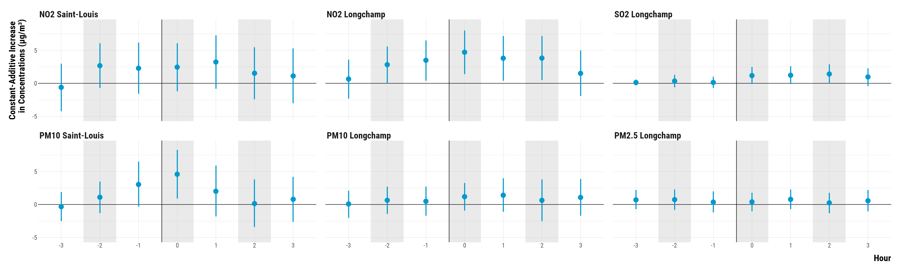

<style>
body {
text-align: justify}
</style>

In this document, we provide all steps and R codes required to reproduce the figures of Fisherian intervals displayed in the main article. **Should you have any questions, need help to reproduce the analysis or find coding errors, please do not hesitate to contact us at leo.zabrocki@psemail.eu and marion.leroutier@psemail.eu.**

# Required Packages

To reproduce exactly the `script_figures_paper.html` document, we first need to have installed:

* the [R](https://www.r-project.org/) programming language 
* [RStudio](https://rstudio.com/), an integrated development environment for R, which will allow you to knit the `5_script_checking_balance_figures.Rmd` file and interact with the R code chunks
* the [R Markdown](https://rmarkdown.rstudio.com/) package
* and the [Distill](https://rstudio.github.io/distill/) package which provides the template for this document. 

Once everything is set up, we have to load the following packages:

<div class="layout-chunk" data-layout="l-body">
<div class="sourceCode"><pre class="sourceCode r"><code class="sourceCode r"><span class='co'># load required packages</span>
<span class='kw'><a href='https://rdrr.io/r/base/library.html'>library</a></span><span class='op'>(</span><span class='va'><a href='https://yihui.org/knitr/'>knitr</a></span><span class='op'>)</span> <span class='co'># for creating the R Markdown document</span>
<span class='kw'><a href='https://rdrr.io/r/base/library.html'>library</a></span><span class='op'>(</span><span class='va'><a href='https://here.r-lib.org/'>here</a></span><span class='op'>)</span> <span class='co'># for files paths organization</span>
<span class='kw'><a href='https://rdrr.io/r/base/library.html'>library</a></span><span class='op'>(</span><span class='va'><a href='https://tidyverse.tidyverse.org'>tidyverse</a></span><span class='op'>)</span> <span class='co'># for data manipulation and visualization</span>
<span class='kw'><a href='https://rdrr.io/r/base/library.html'>library</a></span><span class='op'>(</span><span class='va'><a href='https://wilkelab.org/ggridges/'>ggridges</a></span><span class='op'>)</span> <span class='co'># for ridge density plots</span>
<span class='kw'><a href='https://rdrr.io/r/base/library.html'>library</a></span><span class='op'>(</span><span class='va'><a href='http://www.rforge.net/Cairo/'>Cairo</a></span><span class='op'>)</span> <span class='co'># for printing customed police of graphs</span>
<span class='kw'><a href='https://rdrr.io/r/base/library.html'>library</a></span><span class='op'>(</span><span class='va'><a href='https://patchwork.data-imaginist.com'>patchwork</a></span><span class='op'>)</span> <span class='co'># combining plots</span>
</code></pre></div>

</div>


We finally load our customed `ggplot2` theme for graphs:

<div class="layout-chunk" data-layout="l-body">
<div class="sourceCode"><pre class="sourceCode r"><code class="sourceCode r"><span class='co'># load ggplot customed theme</span>
<span class='kw'><a href='https://rdrr.io/r/base/source.html'>source</a></span><span class='op'>(</span><span class='fu'>here</span><span class='fu'>::</span><span class='fu'><a href='https://here.r-lib.org//reference/here.html'>here</a></span><span class='op'>(</span><span class='st'>"2.scripts"</span>, <span class='st'>"4.custom_ggplot2_theme"</span>, <span class='st'>"script_custom_ggplot_theme.R"</span><span class='op'>)</span><span class='op'>)</span>
</code></pre></div>

</div>


The theme is based on the fantastic [hrbrthemes](https://hrbrmstr.github.io/hrbrthemes/index.html) package. If you do not want to use this theme or are unable to install it because of fonts issues, you can use the `theme_bw()` already included in the `ggplot2` package.

# Preparing the Data

We load the matched data for cruise arrivals and departures:

<div class="layout-chunk" data-layout="l-body">
<div class="sourceCode"><pre class="sourceCode r"><code class="sourceCode r"><span class='co'># load matched cruise data</span>
<span class='va'>data</span> <span class='op'>&lt;-</span> <span class='fu'><a href='https://rdrr.io/r/base/readRDS.html'>readRDS</a></span><span class='op'>(</span><span class='fu'>here</span><span class='fu'>::</span><span class='fu'><a href='https://here.r-lib.org//reference/here.html'>here</a></span><span class='op'>(</span><span class='st'>"1.data"</span>, <span class='st'>"2.data_for_analysis"</span>, <span class='st'>"1.matched_data"</span>, <span class='st'>"1.experiments_cruise"</span>, <span class='st'>"1.experiment_entry_cruise"</span>, <span class='st'>"ri_data_fisherian_intervals.rds"</span><span class='op'>)</span><span class='op'>)</span> 
</code></pre></div>

</div>


For clarity, we only display in the main paper the results for NO2, SO2, PM10 and PM2.5 over the -3 to +3 hours period.

<div class="layout-chunk" data-layout="l-body">
<div class="sourceCode"><pre class="sourceCode r"><code class="sourceCode r"><span class='va'>data</span> <span class='op'>&lt;-</span> <span class='va'>data</span> <span class='op'>%&gt;%</span>
  <span class='fu'><a href='https://rdrr.io/r/stats/filter.html'>filter</a></span><span class='op'>(</span><span class='op'>!</span><span class='fu'>str_detect</span><span class='op'>(</span><span class='va'>pollutant</span>, <span class='st'>"O3"</span><span class='op'>)</span><span class='op'>)</span>
</code></pre></div>

</div>


# Randomization Inference: Confidence intervals

We plot below the results of our randomization inference to compute 95% confidence intervals:

<div class="layout-chunk" data-layout="l-body-outset">
<div class="sourceCode"><pre class="sourceCode r"><code class="sourceCode r"><span class='co'># create an indicator to alternate shading of confidence intervals</span>
<span class='va'>data</span> <span class='op'>&lt;-</span> <span class='va'>data</span> <span class='op'>%&gt;%</span>
  <span class='fu'>mutate</span><span class='op'>(</span>pollutant <span class='op'>=</span> <span class='fu'><a href='https://rdrr.io/r/base/ifelse.html'>ifelse</a></span><span class='op'>(</span><span class='fu'>str_detect</span><span class='op'>(</span><span class='va'>pollutant</span>, <span class='st'>"SO2"</span><span class='op'>)</span>, <span class='st'>"SO2 Longchamp"</span>, <span class='va'>pollutant</span><span class='op'>)</span><span class='op'>)</span> <span class='op'>%&gt;%</span>
  <span class='fu'>arrange</span><span class='op'>(</span><span class='va'>pollutant</span>, <span class='va'>time</span><span class='op'>)</span> <span class='op'>%&gt;%</span>
  <span class='fu'>mutate</span><span class='op'>(</span>stripe <span class='op'>=</span> <span class='fu'><a href='https://rdrr.io/r/base/ifelse.html'>ifelse</a></span><span class='op'>(</span><span class='op'>(</span><span class='va'>time</span> <span class='op'>%%</span> <span class='fl'>2</span><span class='op'>)</span> <span class='op'>==</span> <span class='fl'>0</span>, <span class='st'>"Grey"</span>, <span class='st'>"White"</span><span class='op'>)</span><span class='op'>)</span> <span class='op'>%&gt;%</span>
  <span class='fu'>ungroup</span><span class='op'>(</span><span class='op'>)</span>

    
<span class='va'>graph_fi</span> <span class='op'>&lt;-</span> <span class='fu'>ggplot</span><span class='op'>(</span><span class='va'>data</span>, <span class='fu'>aes</span><span class='op'>(</span>x <span class='op'>=</span> <span class='fu'><a href='https://rdrr.io/r/base/factor.html'>as.factor</a></span><span class='op'>(</span><span class='va'>time</span><span class='op'>)</span>, y <span class='op'>=</span> <span class='va'>observed_mean_difference</span>, ymin <span class='op'>=</span> <span class='va'>lower_fi</span>,
                        ymax <span class='op'>=</span> <span class='va'>upper_fi</span><span class='op'>)</span><span class='op'>)</span> <span class='op'>+</span>
  <span class='fu'>geom_rect</span><span class='op'>(</span><span class='fu'>aes</span><span class='op'>(</span>fill <span class='op'>=</span> <span class='va'>stripe</span><span class='op'>)</span>, xmin <span class='op'>=</span> <span class='fu'><a href='https://rdrr.io/r/base/numeric.html'>as.numeric</a></span><span class='op'>(</span><span class='fu'><a href='https://rdrr.io/r/base/factor.html'>as.factor</a></span><span class='op'>(</span><span class='va'>data</span><span class='op'>$</span><span class='va'>time</span><span class='op'>)</span><span class='op'>)</span><span class='op'>-</span><span class='fl'>0.42</span>,
            xmax <span class='op'>=</span> <span class='fu'><a href='https://rdrr.io/r/base/numeric.html'>as.numeric</a></span><span class='op'>(</span><span class='fu'><a href='https://rdrr.io/r/base/factor.html'>as.factor</a></span><span class='op'>(</span><span class='va'>data</span><span class='op'>$</span><span class='va'>time</span><span class='op'>)</span><span class='op'>)</span><span class='op'>+</span><span class='fl'>0.42</span>, ymin <span class='op'>=</span> <span class='op'>-</span><span class='cn'>Inf</span>, ymax<span class='op'>=</span><span class='cn'>Inf</span>, color <span class='op'>=</span> <span class='cn'>NA</span>, alpha <span class='op'>=</span> <span class='fl'>0.4</span><span class='op'>)</span> <span class='op'>+</span>
          <span class='fu'>scale_fill_manual</span><span class='op'>(</span>values <span class='op'>=</span> <span class='fu'><a href='https://rdrr.io/r/base/c.html'>c</a></span><span class='op'>(</span><span class='st'>'gray80'</span>, <span class='st'>"NA"</span><span class='op'>)</span><span class='op'>)</span> <span class='op'>+</span>
  <span class='fu'>geom_hline</span><span class='op'>(</span>yintercept <span class='op'>=</span> <span class='fl'>0</span>, color<span class='op'>=</span><span class='st'>"black"</span><span class='op'>)</span> <span class='op'>+</span>
  <span class='fu'>geom_vline</span><span class='op'>(</span>xintercept <span class='op'>=</span> <span class='fu'><a href='https://rdrr.io/r/base/c.html'>c</a></span><span class='op'>(</span><span class='fl'>3.6</span><span class='op'>)</span>, color <span class='op'>=</span> <span class='st'>"black"</span><span class='op'>)</span> <span class='op'>+</span>
  <span class='fu'>geom_pointrange</span><span class='op'>(</span><span class='fu'>aes</span><span class='op'>(</span>x <span class='op'>=</span> <span class='fu'><a href='https://rdrr.io/r/base/factor.html'>as.factor</a></span><span class='op'>(</span><span class='va'>time</span><span class='op'>)</span>, y <span class='op'>=</span> <span class='va'>observed_mean_difference</span>, ymin <span class='op'>=</span> <span class='va'>lower_fi</span> ,
                      ymax <span class='op'>=</span> <span class='va'>upper_fi</span><span class='op'>)</span>, colour<span class='op'>=</span><span class='st'>"deepskyblue3"</span>, lwd <span class='op'>=</span> <span class='fl'>1.2</span>, fatten <span class='op'>=</span> <span class='fl'>5</span><span class='op'>)</span> <span class='op'>+</span>
    <span class='fu'>facet_wrap</span><span class='op'>(</span><span class='op'>~</span> <span class='fu'><a href='https://rdrr.io/r/base/factor.html'>factor</a></span><span class='op'>(</span>
    <span class='va'>pollutant</span>,
    levels <span class='op'>=</span> <span class='fu'><a href='https://rdrr.io/r/base/c.html'>c</a></span><span class='op'>(</span>
      <span class='st'>"NO2 Saint-Louis"</span>,
      <span class='st'>"NO2 Longchamp"</span>,
      <span class='st'>"SO2 Longchamp"</span>,
      <span class='st'>"PM10 Saint-Louis"</span>,
      <span class='st'>"PM10 Longchamp"</span>,
      <span class='st'>"PM2.5 Longchamp"</span><span class='op'>)</span>
    <span class='op'>)</span><span class='op'>)</span> <span class='op'>+</span>
        <span class='fu'><a href='https://rdrr.io/r/graphics/plot.window.html'>ylim</a></span><span class='op'>(</span><span class='op'>-</span><span class='fl'>5</span>, <span class='fl'>9</span><span class='op'>)</span> <span class='op'>+</span>
  <span class='fu'>labs</span><span class='op'>(</span>colour <span class='op'>=</span> <span class='st'>"Vessel Traffic:"</span><span class='op'>)</span> <span class='op'>+</span>
  <span class='fu'>ylab</span><span class='op'>(</span><span class='st'>"Constant-Additive Increase \nin Concentrations (µg/m³)"</span><span class='op'>)</span> <span class='op'>+</span> <span class='fu'>xlab</span><span class='op'>(</span><span class='st'>"Hour"</span><span class='op'>)</span> <span class='op'>+</span>
  <span class='va'>custom_theme</span> <span class='op'>+</span>
  <span class='fu'>guides</span><span class='op'>(</span>fill <span class='op'>=</span> <span class='cn'>FALSE</span><span class='op'>)</span> <span class='op'>+</span>
    <span class='fu'>theme</span><span class='op'>(</span>legend.position <span class='op'>=</span> <span class='st'>"top"</span>, legend.justification <span class='op'>=</span> <span class='st'>"left"</span>, legend.direction <span class='op'>=</span> <span class='st'>"horizontal"</span><span class='op'>)</span>


<span class='va'>graph_fi</span>
</code></pre></div>
<!-- --><div class="sourceCode"><pre class="sourceCode r"><code class="sourceCode r"><span class='co'># save the graph</span>
<span class='fu'>ggsave</span><span class='op'>(</span><span class='va'>graph_fi</span>, filename <span class='op'>=</span> <span class='fu'>here</span><span class='fu'>::</span><span class='fu'><a href='https://here.r-lib.org//reference/here.html'>here</a></span><span class='op'>(</span><span class='st'>"3.outputs"</span>, <span class='st'>"1.figures"</span>, <span class='st'>"3.figures_paper"</span>, <span class='st'>"graph_fi_hourly_arrival_experiment.pdf"</span><span class='op'>)</span>, width <span class='op'>=</span> <span class='fl'>40</span>, height <span class='op'>=</span> <span class='fl'>20</span>, units <span class='op'>=</span> <span class='st'>"cm"</span>, device <span class='op'>=</span> <span class='va'>cairo_pdf</span><span class='op'>)</span>
</code></pre></div>

</div>

```{.r .distill-force-highlighting-css}
```
