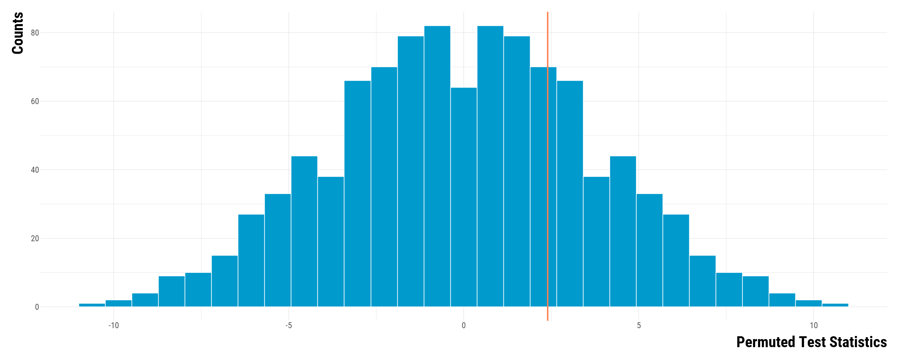

<style>
body {
text-align: justify}
</style>

In this document, we explain with a toy example how to:

* compute a two-sided *p*-value for the test of the sharp null hypothesis of no effect.
* carry out a test inversion procedure to compute a 95% Fisherian interval.

**Should you have any questions, need help to reproduce the analysis or find coding errors, please do not hesitate to contact us at leo.zabrocki@psemail.eu and marion.leroutier@psemail.eu.**

# Required Packages

To reproduce exactly the `script_toy_example_randomization_inference.html` document, we first need to have installed:

* the [R](https://www.r-project.org/) programming language 
* [RStudio](https://rstudio.com/), an integrated development environment for R, which will allow you to knit the `script_toy_example_randomization_inference.Rmd` file and interact with the R code chunks
* the [R Markdown](https://rmarkdown.rstudio.com/) package
* and the [Distill](https://rstudio.github.io/distill/) package which provides the template for this document. 

Once everything is set up, we have to load the following packages:

<div class="layout-chunk" data-layout="l-body">
<div class="sourceCode"><pre class="sourceCode r"><code class="sourceCode r"><span class='co'># load required packages</span>
<span class='kw'><a href='https://rdrr.io/r/base/library.html'>library</a></span><span class='op'>(</span><span class='va'><a href='https://yihui.org/knitr/'>knitr</a></span><span class='op'>)</span> <span class='co'># for creating the R Markdown document</span>
<span class='kw'><a href='https://rdrr.io/r/base/library.html'>library</a></span><span class='op'>(</span><span class='va'><a href='https://here.r-lib.org/'>here</a></span><span class='op'>)</span> <span class='co'># for files paths organization</span>
<span class='kw'><a href='https://rdrr.io/r/base/library.html'>library</a></span><span class='op'>(</span><span class='va'><a href='https://tidyverse.tidyverse.org'>tidyverse</a></span><span class='op'>)</span> <span class='co'># for data manipulation and visualization</span>
<span class='kw'><a href='https://rdrr.io/r/base/library.html'>library</a></span><span class='op'>(</span><span class='va'><a href='http://haozhu233.github.io/kableExtra/'>kableExtra</a></span><span class='op'>)</span> <span class='co'># for building nice tables</span>
<span class='kw'><a href='https://rdrr.io/r/base/library.html'>library</a></span><span class='op'>(</span><span class='va'><a href='http://www.rforge.net/Cairo/'>Cairo</a></span><span class='op'>)</span> <span class='co'># for printing customed police of graphs</span>
</code></pre></div>

</div>


We finally load our customed `ggplot2` theme for graphs:

<div class="layout-chunk" data-layout="l-body">
<div class="sourceCode"><pre class="sourceCode r"><code class="sourceCode r"><span class='co'># load ggplot customed theme</span>
<span class='kw'><a href='https://rdrr.io/r/base/source.html'>source</a></span><span class='op'>(</span><span class='fu'>here</span><span class='fu'>::</span><span class='fu'><a href='https://here.r-lib.org//reference/here.html'>here</a></span><span class='op'>(</span><span class='st'>"2.scripts"</span>, <span class='st'>"script_custom_ggplot_theme.R"</span><span class='op'>)</span><span class='op'>)</span>
</code></pre></div>

</div>


The theme is based on the fantastic [hrbrthemes](https://hrbrmstr.github.io/hrbrthemes/index.html) package. If you do not want to use this theme or are unable to install it because of fonts issues, you can use the `theme_bw()` already included in the `ggplot2` package.


# Toy Example

In this toy example, we want to estimate the effect of cruise vessels docking at Marseille's port on NO$_{2}$ concentration. For simplicity, imagine that our matching procedure resulted in 10 pairs of hours with similar weather and calendar characteristics. Treated hours are hours with cruise vessels docking at the port while control hours are hours without cruise vessels. The outcome of the experiment is the hourly NO$_{2}$ measured at a station located in the city. The exposition of this toy example is inspired by those found in Paul Rosenbaum's textbook (*Design of Observational Studies*, 2019, chapter II) and Tirthankar Dasgupta and Donald B. Rubin's forthcoming textbook (*Experimental Design: A Randomization-Based Perspective*).

# Science Table

We display below the Science Table of our imaginary experiment:

* The first column **Pair** is the indicator of the pair. We represent the index of a pair by *i* which takes values from 1 to 5.
* The second column **Unit Index** shows the index *j* of a unit within the pair (*j* is equal to 1 for the first unit in the pair and to 2 for the second unit).
* The third column **W** indicates the treatment allocation. W = 1 for treated units and W = 0 for controls.
* The fourth and fifth columns are the potential outcomes of each unit and represent the NO$_{2}$ concentrations measured in $\mu g/m^{3}$. Y(W = 0) is the potential outcome when the unit does not receive the treatment and Y(W = 1) is the potential outcome when the unit is treated. As this is an artificial example, we imagine that we know for each unit the values of both potential outcomes.
* The six column $\tau$ is the unit constant causal effect. Here, the causal effect is equal to +3 $\mu g/m^{3}$.
* The last column **Y$^{obs}$** represents the potential outcome that we would observe according to the treatment allocation, that is to say $Y_{i,j} = W_{i,j}\times Y_{i,j}(1) + (1-W_{i,j})*Y_{i,j}(0)$. Here, in each pair, the first unit does not receive the treatment so that we observe Y(0) while the second unit is treated and we observe Y(1).


<div class="layout-chunk" data-layout="l-body">
<div class="sourceCode"><pre class="sourceCode r"><code class="sourceCode r"><span class='co'># load the science table</span>
<span class='va'>science_table</span> <span class='op'>&lt;-</span> <span class='fu'><a href='https://rdrr.io/r/base/readRDS.html'>readRDS</a></span><span class='op'>(</span><span class='fu'>here</span><span class='fu'>::</span><span class='fu'><a href='https://here.r-lib.org//reference/here.html'>here</a></span><span class='op'>(</span><span class='st'>"1.data"</span>, <span class='st'>"science_table.RDS"</span><span class='op'>)</span><span class='op'>)</span>

<span class='co'># display the table</span>
<span class='va'>science_table</span> <span class='op'>%&gt;%</span>
  <span class='fu'>rename</span><span class='op'>(</span>
    Pair <span class='op'>=</span> <span class='va'>pair</span>,
    <span class='st'>"Unit Index"</span> <span class='op'>=</span> <span class='va'>unit</span>,
    W <span class='op'>=</span> <span class='va'>w</span>,
    <span class='st'>"Y(0)"</span> <span class='op'>=</span> <span class='va'>y_0</span>,
    <span class='st'>"Y(1)"</span> <span class='op'>=</span> <span class='va'>y_1</span>,
    <span class='st'>"$\\tau$"</span> <span class='op'>=</span> <span class='va'>tau</span>,
    <span class='st'>"Y$^{obs}$"</span> <span class='op'>=</span> <span class='va'>y</span>
  <span class='op'>)</span> <span class='op'>%&gt;%</span>
  <span class='fu'><a href='https://rdrr.io/pkg/knitr/man/kable.html'>kable</a></span><span class='op'>(</span>align <span class='op'>=</span> <span class='fu'><a href='https://rdrr.io/r/base/c.html'>c</a></span><span class='op'>(</span><span class='fu'><a href='https://rdrr.io/r/base/rep.html'>rep</a></span><span class='op'>(</span><span class='st'>"c"</span>, <span class='fl'>6</span><span class='op'>)</span><span class='op'>)</span><span class='op'>)</span> <span class='op'>%&gt;%</span>
  <span class='fu'><a href='https://rdrr.io/pkg/kableExtra/man/kable_styling.html'>kable_styling</a></span><span class='op'>(</span>bootstrap_options <span class='op'>=</span> <span class='fu'><a href='https://rdrr.io/r/base/c.html'>c</a></span><span class='op'>(</span><span class='st'>"striped"</span>, <span class='st'>"hover"</span><span class='op'>)</span><span class='op'>)</span>
</code></pre></div>
<table class="table table-striped table-hover" style="margin-left: auto; margin-right: auto;">
 <thead>
  <tr>
   <th style="text-align:center;"> Pair </th>
   <th style="text-align:center;"> Unit Index </th>
   <th style="text-align:center;"> W </th>
   <th style="text-align:center;"> Y(0) </th>
   <th style="text-align:center;"> Y(1) </th>
   <th style="text-align:center;"> $\tau$ </th>
   <th style="text-align:center;"> Y$^{obs}$ </th>
  </tr>
 </thead>
<tbody>
  <tr>
   <td style="text-align:center;"> I </td>
   <td style="text-align:center;"> 1 </td>
   <td style="text-align:center;"> 0 </td>
   <td style="text-align:center;"> 37 </td>
   <td style="text-align:center;"> 40 </td>
   <td style="text-align:center;"> 3 </td>
   <td style="text-align:center;"> 37 </td>
  </tr>
  <tr>
   <td style="text-align:center;"> I </td>
   <td style="text-align:center;"> 2 </td>
   <td style="text-align:center;"> 1 </td>
   <td style="text-align:center;"> 21 </td>
   <td style="text-align:center;"> 24 </td>
   <td style="text-align:center;"> 3 </td>
   <td style="text-align:center;"> 24 </td>
  </tr>
  <tr>
   <td style="text-align:center;"> II </td>
   <td style="text-align:center;"> 1 </td>
   <td style="text-align:center;"> 0 </td>
   <td style="text-align:center;"> 33 </td>
   <td style="text-align:center;"> 36 </td>
   <td style="text-align:center;"> 3 </td>
   <td style="text-align:center;"> 33 </td>
  </tr>
  <tr>
   <td style="text-align:center;"> II </td>
   <td style="text-align:center;"> 2 </td>
   <td style="text-align:center;"> 1 </td>
   <td style="text-align:center;"> 22 </td>
   <td style="text-align:center;"> 25 </td>
   <td style="text-align:center;"> 3 </td>
   <td style="text-align:center;"> 25 </td>
  </tr>
  <tr>
   <td style="text-align:center;"> III </td>
   <td style="text-align:center;"> 1 </td>
   <td style="text-align:center;"> 0 </td>
   <td style="text-align:center;"> 38 </td>
   <td style="text-align:center;"> 41 </td>
   <td style="text-align:center;"> 3 </td>
   <td style="text-align:center;"> 38 </td>
  </tr>
  <tr>
   <td style="text-align:center;"> III </td>
   <td style="text-align:center;"> 2 </td>
   <td style="text-align:center;"> 1 </td>
   <td style="text-align:center;"> 50 </td>
   <td style="text-align:center;"> 53 </td>
   <td style="text-align:center;"> 3 </td>
   <td style="text-align:center;"> 53 </td>
  </tr>
  <tr>
   <td style="text-align:center;"> IV </td>
   <td style="text-align:center;"> 1 </td>
   <td style="text-align:center;"> 0 </td>
   <td style="text-align:center;"> 41 </td>
   <td style="text-align:center;"> 44 </td>
   <td style="text-align:center;"> 3 </td>
   <td style="text-align:center;"> 41 </td>
  </tr>
  <tr>
   <td style="text-align:center;"> IV </td>
   <td style="text-align:center;"> 2 </td>
   <td style="text-align:center;"> 1 </td>
   <td style="text-align:center;"> 47 </td>
   <td style="text-align:center;"> 50 </td>
   <td style="text-align:center;"> 3 </td>
   <td style="text-align:center;"> 50 </td>
  </tr>
  <tr>
   <td style="text-align:center;"> V </td>
   <td style="text-align:center;"> 1 </td>
   <td style="text-align:center;"> 0 </td>
   <td style="text-align:center;"> 41 </td>
   <td style="text-align:center;"> 44 </td>
   <td style="text-align:center;"> 3 </td>
   <td style="text-align:center;"> 41 </td>
  </tr>
  <tr>
   <td style="text-align:center;"> V </td>
   <td style="text-align:center;"> 2 </td>
   <td style="text-align:center;"> 1 </td>
   <td style="text-align:center;"> 56 </td>
   <td style="text-align:center;"> 59 </td>
   <td style="text-align:center;"> 3 </td>
   <td style="text-align:center;"> 59 </td>
  </tr>
  <tr>
   <td style="text-align:center;"> VI </td>
   <td style="text-align:center;"> 1 </td>
   <td style="text-align:center;"> 0 </td>
   <td style="text-align:center;"> 33 </td>
   <td style="text-align:center;"> 36 </td>
   <td style="text-align:center;"> 3 </td>
   <td style="text-align:center;"> 33 </td>
  </tr>
  <tr>
   <td style="text-align:center;"> VI </td>
   <td style="text-align:center;"> 2 </td>
   <td style="text-align:center;"> 1 </td>
   <td style="text-align:center;"> 40 </td>
   <td style="text-align:center;"> 43 </td>
   <td style="text-align:center;"> 3 </td>
   <td style="text-align:center;"> 43 </td>
  </tr>
  <tr>
   <td style="text-align:center;"> VII </td>
   <td style="text-align:center;"> 1 </td>
   <td style="text-align:center;"> 0 </td>
   <td style="text-align:center;"> 23 </td>
   <td style="text-align:center;"> 26 </td>
   <td style="text-align:center;"> 3 </td>
   <td style="text-align:center;"> 23 </td>
  </tr>
  <tr>
   <td style="text-align:center;"> VII </td>
   <td style="text-align:center;"> 2 </td>
   <td style="text-align:center;"> 1 </td>
   <td style="text-align:center;"> 28 </td>
   <td style="text-align:center;"> 31 </td>
   <td style="text-align:center;"> 3 </td>
   <td style="text-align:center;"> 31 </td>
  </tr>
  <tr>
   <td style="text-align:center;"> VIII </td>
   <td style="text-align:center;"> 1 </td>
   <td style="text-align:center;"> 0 </td>
   <td style="text-align:center;"> 27 </td>
   <td style="text-align:center;"> 30 </td>
   <td style="text-align:center;"> 3 </td>
   <td style="text-align:center;"> 27 </td>
  </tr>
  <tr>
   <td style="text-align:center;"> VIII </td>
   <td style="text-align:center;"> 2 </td>
   <td style="text-align:center;"> 1 </td>
   <td style="text-align:center;"> 31 </td>
   <td style="text-align:center;"> 34 </td>
   <td style="text-align:center;"> 3 </td>
   <td style="text-align:center;"> 34 </td>
  </tr>
  <tr>
   <td style="text-align:center;"> IX </td>
   <td style="text-align:center;"> 1 </td>
   <td style="text-align:center;"> 0 </td>
   <td style="text-align:center;"> 27 </td>
   <td style="text-align:center;"> 30 </td>
   <td style="text-align:center;"> 3 </td>
   <td style="text-align:center;"> 27 </td>
  </tr>
  <tr>
   <td style="text-align:center;"> IX </td>
   <td style="text-align:center;"> 2 </td>
   <td style="text-align:center;"> 1 </td>
   <td style="text-align:center;"> 19 </td>
   <td style="text-align:center;"> 22 </td>
   <td style="text-align:center;"> 3 </td>
   <td style="text-align:center;"> 22 </td>
  </tr>
  <tr>
   <td style="text-align:center;"> X </td>
   <td style="text-align:center;"> 1 </td>
   <td style="text-align:center;"> 0 </td>
   <td style="text-align:center;"> 51 </td>
   <td style="text-align:center;"> 54 </td>
   <td style="text-align:center;"> 3 </td>
   <td style="text-align:center;"> 51 </td>
  </tr>
  <tr>
   <td style="text-align:center;"> X </td>
   <td style="text-align:center;"> 2 </td>
   <td style="text-align:center;"> 1 </td>
   <td style="text-align:center;"> 31 </td>
   <td style="text-align:center;"> 34 </td>
   <td style="text-align:center;"> 3 </td>
   <td style="text-align:center;"> 34 </td>
  </tr>
</tbody>
</table>

</div>


# Observed Data

Researchers will not have access to the Science Table but the table below where they only have information on the pair indicator, the unit index, the treatment allocated and the observed NO$_{2}$ concentration. Our randomization inference procedure will be based only on this table.

<div class="layout-chunk" data-layout="l-body">
<div class="sourceCode"><pre class="sourceCode r"><code class="sourceCode r"><span class='co'># create observed data</span>
<span class='va'>data</span> <span class='op'>&lt;-</span> <span class='va'>science_table</span> <span class='op'>%&gt;%</span>
  <span class='fu'>select</span><span class='op'>(</span><span class='va'>pair</span>, <span class='va'>unit</span>, <span class='va'>w</span>, <span class='va'>y</span><span class='op'>)</span>

<span class='co'># display observed data</span>
<span class='va'>data</span> <span class='op'>%&gt;%</span>
  <span class='fu'>rename</span><span class='op'>(</span>Pair <span class='op'>=</span> <span class='va'>pair</span>, <span class='st'>"Unit Index"</span> <span class='op'>=</span> <span class='va'>unit</span>, W <span class='op'>=</span> <span class='va'>w</span>, <span class='st'>"Y$^{obs}$"</span> <span class='op'>=</span> <span class='va'>y</span><span class='op'>)</span> <span class='op'>%&gt;%</span>
  <span class='fu'><a href='https://rdrr.io/pkg/knitr/man/kable.html'>kable</a></span><span class='op'>(</span>align <span class='op'>=</span> <span class='fu'><a href='https://rdrr.io/r/base/c.html'>c</a></span><span class='op'>(</span><span class='fu'><a href='https://rdrr.io/r/base/rep.html'>rep</a></span><span class='op'>(</span><span class='st'>"c"</span>, <span class='fl'>4</span><span class='op'>)</span><span class='op'>)</span><span class='op'>)</span> <span class='op'>%&gt;%</span>
  <span class='fu'><a href='https://rdrr.io/pkg/kableExtra/man/kable_styling.html'>kable_styling</a></span><span class='op'>(</span>bootstrap_options <span class='op'>=</span> <span class='fu'><a href='https://rdrr.io/r/base/c.html'>c</a></span><span class='op'>(</span><span class='st'>"striped"</span>, <span class='st'>"hover"</span><span class='op'>)</span><span class='op'>)</span>
</code></pre></div>
<table class="table table-striped table-hover" style="margin-left: auto; margin-right: auto;">
 <thead>
  <tr>
   <th style="text-align:center;"> Pair </th>
   <th style="text-align:center;"> Unit Index </th>
   <th style="text-align:center;"> W </th>
   <th style="text-align:center;"> Y$^{obs}$ </th>
  </tr>
 </thead>
<tbody>
  <tr>
   <td style="text-align:center;"> I </td>
   <td style="text-align:center;"> 1 </td>
   <td style="text-align:center;"> 0 </td>
   <td style="text-align:center;"> 37 </td>
  </tr>
  <tr>
   <td style="text-align:center;"> I </td>
   <td style="text-align:center;"> 2 </td>
   <td style="text-align:center;"> 1 </td>
   <td style="text-align:center;"> 24 </td>
  </tr>
  <tr>
   <td style="text-align:center;"> II </td>
   <td style="text-align:center;"> 1 </td>
   <td style="text-align:center;"> 0 </td>
   <td style="text-align:center;"> 33 </td>
  </tr>
  <tr>
   <td style="text-align:center;"> II </td>
   <td style="text-align:center;"> 2 </td>
   <td style="text-align:center;"> 1 </td>
   <td style="text-align:center;"> 25 </td>
  </tr>
  <tr>
   <td style="text-align:center;"> III </td>
   <td style="text-align:center;"> 1 </td>
   <td style="text-align:center;"> 0 </td>
   <td style="text-align:center;"> 38 </td>
  </tr>
  <tr>
   <td style="text-align:center;"> III </td>
   <td style="text-align:center;"> 2 </td>
   <td style="text-align:center;"> 1 </td>
   <td style="text-align:center;"> 53 </td>
  </tr>
  <tr>
   <td style="text-align:center;"> IV </td>
   <td style="text-align:center;"> 1 </td>
   <td style="text-align:center;"> 0 </td>
   <td style="text-align:center;"> 41 </td>
  </tr>
  <tr>
   <td style="text-align:center;"> IV </td>
   <td style="text-align:center;"> 2 </td>
   <td style="text-align:center;"> 1 </td>
   <td style="text-align:center;"> 50 </td>
  </tr>
  <tr>
   <td style="text-align:center;"> V </td>
   <td style="text-align:center;"> 1 </td>
   <td style="text-align:center;"> 0 </td>
   <td style="text-align:center;"> 41 </td>
  </tr>
  <tr>
   <td style="text-align:center;"> V </td>
   <td style="text-align:center;"> 2 </td>
   <td style="text-align:center;"> 1 </td>
   <td style="text-align:center;"> 59 </td>
  </tr>
  <tr>
   <td style="text-align:center;"> VI </td>
   <td style="text-align:center;"> 1 </td>
   <td style="text-align:center;"> 0 </td>
   <td style="text-align:center;"> 33 </td>
  </tr>
  <tr>
   <td style="text-align:center;"> VI </td>
   <td style="text-align:center;"> 2 </td>
   <td style="text-align:center;"> 1 </td>
   <td style="text-align:center;"> 43 </td>
  </tr>
  <tr>
   <td style="text-align:center;"> VII </td>
   <td style="text-align:center;"> 1 </td>
   <td style="text-align:center;"> 0 </td>
   <td style="text-align:center;"> 23 </td>
  </tr>
  <tr>
   <td style="text-align:center;"> VII </td>
   <td style="text-align:center;"> 2 </td>
   <td style="text-align:center;"> 1 </td>
   <td style="text-align:center;"> 31 </td>
  </tr>
  <tr>
   <td style="text-align:center;"> VIII </td>
   <td style="text-align:center;"> 1 </td>
   <td style="text-align:center;"> 0 </td>
   <td style="text-align:center;"> 27 </td>
  </tr>
  <tr>
   <td style="text-align:center;"> VIII </td>
   <td style="text-align:center;"> 2 </td>
   <td style="text-align:center;"> 1 </td>
   <td style="text-align:center;"> 34 </td>
  </tr>
  <tr>
   <td style="text-align:center;"> IX </td>
   <td style="text-align:center;"> 1 </td>
   <td style="text-align:center;"> 0 </td>
   <td style="text-align:center;"> 27 </td>
  </tr>
  <tr>
   <td style="text-align:center;"> IX </td>
   <td style="text-align:center;"> 2 </td>
   <td style="text-align:center;"> 1 </td>
   <td style="text-align:center;"> 22 </td>
  </tr>
  <tr>
   <td style="text-align:center;"> X </td>
   <td style="text-align:center;"> 1 </td>
   <td style="text-align:center;"> 0 </td>
   <td style="text-align:center;"> 51 </td>
  </tr>
  <tr>
   <td style="text-align:center;"> X </td>
   <td style="text-align:center;"> 2 </td>
   <td style="text-align:center;"> 1 </td>
   <td style="text-align:center;"> 34 </td>
  </tr>
</tbody>
</table>

</div>


Before moving to the inference, we need to:

* know the number of unique treatment allocations. In a pair experiment, there are $2^{I}$ unique treatement allocations, with *I* is the number of pairs. In this experiment, there are 1024 unique treatment allocations. 
* define a test statistic. We will build its distribution under the sharp null hypothesis. We use the average of pair differences as a test statistic.

# Testing the Sharp Null Hypothesis of No Treatment

### Stating the Hypothesis

The sharp null hypothesis of no treatment states that $Y_{i,j}(0) = Y_{i,j}(1)$, that is to say the treatment has no effect for each unit. With this assumption, we could impute the missing Y(1) for control units and the missing Y(0) for treated units as shown in the table below :

<div class="layout-chunk" data-layout="l-body">
<div class="sourceCode"><pre class="sourceCode r"><code class="sourceCode r"><span class='co'># display imputed observed data</span>
<span class='va'>data</span> <span class='op'>%&gt;%</span>
  <span class='fu'>mutate</span><span class='op'>(</span><span class='st'>"Y(0)"</span> <span class='op'>=</span> <span class='va'>y</span>,
         <span class='st'>"Y(1)"</span> <span class='op'>=</span> <span class='va'>y</span><span class='op'>)</span> <span class='op'>%&gt;%</span>
  <span class='fu'>rename</span><span class='op'>(</span>Pair <span class='op'>=</span> <span class='va'>pair</span>, <span class='st'>"Unit Index"</span> <span class='op'>=</span> <span class='va'>unit</span>, W <span class='op'>=</span> <span class='va'>w</span>, <span class='st'>"Y$^{obs}$"</span> <span class='op'>=</span> <span class='va'>y</span><span class='op'>)</span> <span class='op'>%&gt;%</span>
  <span class='fu'><a href='https://rdrr.io/pkg/knitr/man/kable.html'>kable</a></span><span class='op'>(</span>align <span class='op'>=</span> <span class='fu'><a href='https://rdrr.io/r/base/c.html'>c</a></span><span class='op'>(</span><span class='fu'><a href='https://rdrr.io/r/base/rep.html'>rep</a></span><span class='op'>(</span><span class='st'>"c"</span>, <span class='fl'>6</span><span class='op'>)</span><span class='op'>)</span><span class='op'>)</span> <span class='op'>%&gt;%</span>
  <span class='fu'><a href='https://rdrr.io/pkg/kableExtra/man/kable_styling.html'>kable_styling</a></span><span class='op'>(</span>bootstrap_options <span class='op'>=</span> <span class='fu'><a href='https://rdrr.io/r/base/c.html'>c</a></span><span class='op'>(</span><span class='st'>"striped"</span>, <span class='st'>"hover"</span><span class='op'>)</span><span class='op'>)</span>
</code></pre></div>
<table class="table table-striped table-hover" style="margin-left: auto; margin-right: auto;">
 <thead>
  <tr>
   <th style="text-align:center;"> Pair </th>
   <th style="text-align:center;"> Unit Index </th>
   <th style="text-align:center;"> W </th>
   <th style="text-align:center;"> Y$^{obs}$ </th>
   <th style="text-align:center;"> Y(0) </th>
   <th style="text-align:center;"> Y(1) </th>
  </tr>
 </thead>
<tbody>
  <tr>
   <td style="text-align:center;"> I </td>
   <td style="text-align:center;"> 1 </td>
   <td style="text-align:center;"> 0 </td>
   <td style="text-align:center;"> 37 </td>
   <td style="text-align:center;"> 37 </td>
   <td style="text-align:center;"> 37 </td>
  </tr>
  <tr>
   <td style="text-align:center;"> I </td>
   <td style="text-align:center;"> 2 </td>
   <td style="text-align:center;"> 1 </td>
   <td style="text-align:center;"> 24 </td>
   <td style="text-align:center;"> 24 </td>
   <td style="text-align:center;"> 24 </td>
  </tr>
  <tr>
   <td style="text-align:center;"> II </td>
   <td style="text-align:center;"> 1 </td>
   <td style="text-align:center;"> 0 </td>
   <td style="text-align:center;"> 33 </td>
   <td style="text-align:center;"> 33 </td>
   <td style="text-align:center;"> 33 </td>
  </tr>
  <tr>
   <td style="text-align:center;"> II </td>
   <td style="text-align:center;"> 2 </td>
   <td style="text-align:center;"> 1 </td>
   <td style="text-align:center;"> 25 </td>
   <td style="text-align:center;"> 25 </td>
   <td style="text-align:center;"> 25 </td>
  </tr>
  <tr>
   <td style="text-align:center;"> III </td>
   <td style="text-align:center;"> 1 </td>
   <td style="text-align:center;"> 0 </td>
   <td style="text-align:center;"> 38 </td>
   <td style="text-align:center;"> 38 </td>
   <td style="text-align:center;"> 38 </td>
  </tr>
  <tr>
   <td style="text-align:center;"> III </td>
   <td style="text-align:center;"> 2 </td>
   <td style="text-align:center;"> 1 </td>
   <td style="text-align:center;"> 53 </td>
   <td style="text-align:center;"> 53 </td>
   <td style="text-align:center;"> 53 </td>
  </tr>
  <tr>
   <td style="text-align:center;"> IV </td>
   <td style="text-align:center;"> 1 </td>
   <td style="text-align:center;"> 0 </td>
   <td style="text-align:center;"> 41 </td>
   <td style="text-align:center;"> 41 </td>
   <td style="text-align:center;"> 41 </td>
  </tr>
  <tr>
   <td style="text-align:center;"> IV </td>
   <td style="text-align:center;"> 2 </td>
   <td style="text-align:center;"> 1 </td>
   <td style="text-align:center;"> 50 </td>
   <td style="text-align:center;"> 50 </td>
   <td style="text-align:center;"> 50 </td>
  </tr>
  <tr>
   <td style="text-align:center;"> V </td>
   <td style="text-align:center;"> 1 </td>
   <td style="text-align:center;"> 0 </td>
   <td style="text-align:center;"> 41 </td>
   <td style="text-align:center;"> 41 </td>
   <td style="text-align:center;"> 41 </td>
  </tr>
  <tr>
   <td style="text-align:center;"> V </td>
   <td style="text-align:center;"> 2 </td>
   <td style="text-align:center;"> 1 </td>
   <td style="text-align:center;"> 59 </td>
   <td style="text-align:center;"> 59 </td>
   <td style="text-align:center;"> 59 </td>
  </tr>
  <tr>
   <td style="text-align:center;"> VI </td>
   <td style="text-align:center;"> 1 </td>
   <td style="text-align:center;"> 0 </td>
   <td style="text-align:center;"> 33 </td>
   <td style="text-align:center;"> 33 </td>
   <td style="text-align:center;"> 33 </td>
  </tr>
  <tr>
   <td style="text-align:center;"> VI </td>
   <td style="text-align:center;"> 2 </td>
   <td style="text-align:center;"> 1 </td>
   <td style="text-align:center;"> 43 </td>
   <td style="text-align:center;"> 43 </td>
   <td style="text-align:center;"> 43 </td>
  </tr>
  <tr>
   <td style="text-align:center;"> VII </td>
   <td style="text-align:center;"> 1 </td>
   <td style="text-align:center;"> 0 </td>
   <td style="text-align:center;"> 23 </td>
   <td style="text-align:center;"> 23 </td>
   <td style="text-align:center;"> 23 </td>
  </tr>
  <tr>
   <td style="text-align:center;"> VII </td>
   <td style="text-align:center;"> 2 </td>
   <td style="text-align:center;"> 1 </td>
   <td style="text-align:center;"> 31 </td>
   <td style="text-align:center;"> 31 </td>
   <td style="text-align:center;"> 31 </td>
  </tr>
  <tr>
   <td style="text-align:center;"> VIII </td>
   <td style="text-align:center;"> 1 </td>
   <td style="text-align:center;"> 0 </td>
   <td style="text-align:center;"> 27 </td>
   <td style="text-align:center;"> 27 </td>
   <td style="text-align:center;"> 27 </td>
  </tr>
  <tr>
   <td style="text-align:center;"> VIII </td>
   <td style="text-align:center;"> 2 </td>
   <td style="text-align:center;"> 1 </td>
   <td style="text-align:center;"> 34 </td>
   <td style="text-align:center;"> 34 </td>
   <td style="text-align:center;"> 34 </td>
  </tr>
  <tr>
   <td style="text-align:center;"> IX </td>
   <td style="text-align:center;"> 1 </td>
   <td style="text-align:center;"> 0 </td>
   <td style="text-align:center;"> 27 </td>
   <td style="text-align:center;"> 27 </td>
   <td style="text-align:center;"> 27 </td>
  </tr>
  <tr>
   <td style="text-align:center;"> IX </td>
   <td style="text-align:center;"> 2 </td>
   <td style="text-align:center;"> 1 </td>
   <td style="text-align:center;"> 22 </td>
   <td style="text-align:center;"> 22 </td>
   <td style="text-align:center;"> 22 </td>
  </tr>
  <tr>
   <td style="text-align:center;"> X </td>
   <td style="text-align:center;"> 1 </td>
   <td style="text-align:center;"> 0 </td>
   <td style="text-align:center;"> 51 </td>
   <td style="text-align:center;"> 51 </td>
   <td style="text-align:center;"> 51 </td>
  </tr>
  <tr>
   <td style="text-align:center;"> X </td>
   <td style="text-align:center;"> 2 </td>
   <td style="text-align:center;"> 1 </td>
   <td style="text-align:center;"> 34 </td>
   <td style="text-align:center;"> 34 </td>
   <td style="text-align:center;"> 34 </td>
  </tr>
</tbody>
</table>

</div>


### Computional Shortcut

To create the the distribution of the test statistic under this sharp null hypothesis, we could permute the treatment vector, express for each unit the outcome observed according to the permuted value of the treatment and then compute the average of pair differences. This is a bit cumberstone in terms of programming. In the chapter II of his textbook, Paul Rosenbaum offers a more efficient procedure:

* For each unit *i* of each pair *j*, its observed outcome is equal to $Y_{i,j} = W_{i,j}\times Y_{i,j}(1) + (1-W_{i,j})*Y_{i,j}(0)$.
* The difference in outcomes for the pair *i* (i.e., the difference in outcomes between the treated and control units) is equal to $D_{i} = (W_{i,1} - W_{i,2})(Y_{i,1} - Y_{i,2})$
* Under the sharp null hypothesis of no effect, we have $Y_{i,j}(0) = Y_{i,j}(1)$ so that $D_{i} = (W_{i,1} - W_{i,2})(Y_{i,1}(0) - Y_{i,2}(0))$.
* If the treatment allocation within a pair is $(W_{i,1},  W_{i,2})$ = (0,1), $D_{i} = - (Y_{i,1}(0) - Y_{i,2}(0))$. If the treatment allocation is $(W_{i,1},  W_{i,2})$ = (1,0), $D_{i} = Y_{i,1}(0) - Y_{i,2}(0)$.
* **Therefore, under the sharp null hypotheis of no effect, the randomization of the treatment only changes the sign of the pair differences in outcomes.**

In terms of programming, we can proceed as follows:

1. We first compute the observed average of pair differences. We are now working with a table with 10 pair differences.
2. We then compute the permutations matrix of all possible treatment assignments This is a matrix of 10 rows with 1024 columns.
3. For each vector of treatment assignment, we compute the average of pair differences.


### Computing the Null Distribution of the Test Statistic

We compute the observed average of pair differences:

<div class="layout-chunk" data-layout="l-body">
<div class="sourceCode"><pre class="sourceCode r"><code class="sourceCode r"><span class='co'># compute average_observed_pair_differences</span>
<span class='va'>average_observed_pair_differences</span> <span class='op'>&lt;-</span> <span class='va'>data</span> <span class='op'>%&gt;%</span>
  <span class='fu'>group_by</span><span class='op'>(</span><span class='va'>pair</span><span class='op'>)</span> <span class='op'>%&gt;%</span>
  <span class='fu'>summarise</span><span class='op'>(</span>pair_difference <span class='op'>=</span> <span class='va'>y</span><span class='op'>[</span><span class='fl'>2</span><span class='op'>]</span> <span class='op'>-</span> <span class='va'>y</span><span class='op'>[</span><span class='fl'>1</span><span class='op'>]</span><span class='op'>)</span> <span class='op'>%&gt;%</span>
  <span class='fu'>ungroup</span><span class='op'>(</span><span class='op'>)</span> <span class='op'>%&gt;%</span>
  <span class='fu'>summarise</span><span class='op'>(</span>average_pair_differences <span class='op'>=</span> <span class='fu'><a href='https://rdrr.io/r/base/mean.html'>mean</a></span><span class='op'>(</span><span class='va'>pair_difference</span><span class='op'>)</span><span class='op'>)</span> <span class='op'>%&gt;%</span>
  <span class='fu'>pull</span><span class='op'>(</span><span class='va'>average_pair_differences</span><span class='op'>)</span>

<span class='co'># display average_observed_pair_differences</span>
<span class='va'>average_observed_pair_differences</span>
</code></pre></div>

```
[1] 2.4
```

</div>


We have already computed the permutations matrix of all treatment assignments and we load this matrix:

<div class="layout-chunk" data-layout="l-body">
<div class="sourceCode"><pre class="sourceCode r"><code class="sourceCode r"><span class='co'># open the matrix of treatment permutations</span>
<span class='va'>permutations_matrix</span> <span class='op'>&lt;-</span> <span class='fu'><a href='https://rdrr.io/r/base/readRDS.html'>readRDS</a></span><span class='op'>(</span><span class='fu'>here</span><span class='fu'>::</span><span class='fu'><a href='https://here.r-lib.org//reference/here.html'>here</a></span><span class='op'>(</span><span class='st'>"1.data"</span>, <span class='st'>"permutations_matrix.rds"</span><span class='op'>)</span><span class='op'>)</span>
</code></pre></div>

</div>


We store the vector of observed pair differences :

<div class="layout-chunk" data-layout="l-body">
<div class="sourceCode"><pre class="sourceCode r"><code class="sourceCode r"><span class='va'>observed_pair_differences</span> <span class='op'>&lt;-</span> <span class='va'>data</span> <span class='op'>%&gt;%</span>
  <span class='fu'>group_by</span><span class='op'>(</span><span class='va'>pair</span><span class='op'>)</span> <span class='op'>%&gt;%</span>
  <span class='fu'>summarise</span><span class='op'>(</span>pair_difference <span class='op'>=</span> <span class='va'>y</span><span class='op'>[</span><span class='fl'>2</span><span class='op'>]</span> <span class='op'>-</span> <span class='va'>y</span><span class='op'>[</span><span class='fl'>1</span><span class='op'>]</span><span class='op'>)</span> <span class='op'>%&gt;%</span>
  <span class='fu'>ungroup</span><span class='op'>(</span><span class='op'>)</span> <span class='op'>%&gt;%</span>
  <span class='fu'>pull</span><span class='op'>(</span><span class='va'>pair_difference</span><span class='op'>)</span>
</code></pre></div>

</div>


We then create a function to compute the randomization distribution of the test statistic:

<div class="layout-chunk" data-layout="l-body">
<div class="sourceCode"><pre class="sourceCode r"><code class="sourceCode r"><span class='co'># randomization distribution function</span>
<span class='co'># this function takes the vector of pair differences</span>
<span class='co'># and then compute the average pair difference according </span>
<span class='co'># to the permuted treatment assignment</span>
<span class='va'>function_randomization_distribution</span> <span class='op'>&lt;-</span> <span class='kw'>function</span><span class='op'>(</span><span class='va'>vector_pair_difference</span><span class='op'>)</span> <span class='op'>{</span>
  <span class='va'>randomization_distribution</span> <span class='op'>=</span> <span class='cn'>NULL</span>
  <span class='va'>n_columns</span> <span class='op'>=</span> <span class='fu'><a href='https://rdrr.io/r/base/dim.html'>dim</a></span><span class='op'>(</span><span class='va'>permutations_matrix</span><span class='op'>)</span><span class='op'>[</span><span class='fl'>2</span><span class='op'>]</span>
  <span class='kw'>for</span> <span class='op'>(</span><span class='va'>i</span> <span class='kw'>in</span> <span class='fl'>1</span><span class='op'>:</span><span class='va'>n_columns</span><span class='op'>)</span> <span class='op'>{</span>
    <span class='va'>randomization_distribution</span><span class='op'>[</span><span class='va'>i</span><span class='op'>]</span> <span class='op'>=</span>  <span class='fu'><a href='https://rdrr.io/r/base/sum.html'>sum</a></span><span class='op'>(</span><span class='va'>vector_pair_difference</span> <span class='op'>*</span> <span class='va'>permutations_matrix</span><span class='op'>[</span>, <span class='va'>i</span><span class='op'>]</span><span class='op'>)</span> <span class='op'>/</span> <span class='fl'>10</span>
  <span class='op'>}</span>
  <span class='kw'><a href='https://rdrr.io/r/base/function.html'>return</a></span><span class='op'>(</span><span class='va'>randomization_distribution</span><span class='op'>)</span>
<span class='op'>}</span>
</code></pre></div>

</div>


We run this function:

<div class="layout-chunk" data-layout="l-body">
<div class="sourceCode"><pre class="sourceCode r"><code class="sourceCode r"><span class='co'># get the distribution of permuted test statistics</span>
<span class='va'>distribution_test_statistics</span> <span class='op'>&lt;-</span> <span class='fu'>function_randomization_distribution</span><span class='op'>(</span><span class='va'>observed_pair_differences</span><span class='op'>)</span>
</code></pre></div>

</div>


We plot below the distribution of the test statistic under the sharp null hypothesis:

<div class="layout-chunk" data-layout="l-body-outset">
<div class="sourceCode"><pre class="sourceCode r"><code class="sourceCode r"><span class='co'># make the graph</span>
<span class='va'>graph_distribution_test_statistic</span> <span class='op'>&lt;-</span> <span class='fu'>tibble</span><span class='op'>(</span>distribution_test_statistics <span class='op'>=</span> <span class='va'>distribution_test_statistics</span><span class='op'>)</span> <span class='op'>%&gt;%</span>
  <span class='fu'>ggplot</span><span class='op'>(</span><span class='va'>.</span>, <span class='fu'>aes</span><span class='op'>(</span>x <span class='op'>=</span> <span class='va'>distribution_test_statistics</span><span class='op'>)</span><span class='op'>)</span> <span class='op'>+</span>
  <span class='fu'>geom_histogram</span><span class='op'>(</span>colour <span class='op'>=</span> <span class='st'>"white"</span>, fill <span class='op'>=</span> <span class='st'>"deepskyblue3"</span><span class='op'>)</span> <span class='op'>+</span>
  <span class='fu'>geom_vline</span><span class='op'>(</span>xintercept <span class='op'>=</span> <span class='va'>average_observed_pair_differences</span>, size <span class='op'>=</span> <span class='fl'>1.2</span>, colour <span class='op'>=</span> <span class='st'>"coral"</span><span class='op'>)</span> <span class='op'>+</span>
  <span class='fu'>xlab</span><span class='op'>(</span><span class='st'>"Permuted Test Statistics"</span><span class='op'>)</span> <span class='op'>+</span> <span class='fu'>ylab</span><span class='op'>(</span><span class='st'>"Counts"</span><span class='op'>)</span> <span class='op'>+</span>
  <span class='va'>custom_theme</span> <span class='op'>+</span>
  <span class='fu'>theme</span><span class='op'>(</span>
    <span class='co'># axis titles parameters</span>
    axis.title.x <span class='op'>=</span> <span class='fu'>element_text</span><span class='op'>(</span>size<span class='op'>=</span><span class='fl'>36</span>, face <span class='op'>=</span> <span class='st'>"bold"</span>, margin <span class='op'>=</span> <span class='fu'>margin</span><span class='op'>(</span>t <span class='op'>=</span> <span class='fl'>20</span>, r <span class='op'>=</span> <span class='fl'>0</span>, b <span class='op'>=</span> <span class='fl'>0</span>, l <span class='op'>=</span><span class='fl'>0</span><span class='op'>)</span><span class='op'>)</span>,
    axis.title.y <span class='op'>=</span> <span class='fu'>element_text</span><span class='op'>(</span>size<span class='op'>=</span><span class='fl'>36</span>, face <span class='op'>=</span> <span class='st'>"bold"</span>, margin <span class='op'>=</span> <span class='fu'>margin</span><span class='op'>(</span>t <span class='op'>=</span> <span class='fl'>0</span>, r <span class='op'>=</span> <span class='fl'>20</span>, b <span class='op'>=</span> <span class='fl'>0</span>, l <span class='op'>=</span> <span class='fl'>0</span><span class='op'>)</span><span class='op'>)</span><span class='op'>)</span>
  
<span class='co'># display the graph</span>
<span class='va'>graph_distribution_test_statistic</span>
</code></pre></div>
<!-- --><div class="sourceCode"><pre class="sourceCode r"><code class="sourceCode r"><span class='co'># save the graph</span>
<span class='fu'>ggsave</span><span class='op'>(</span><span class='va'>graph_distribution_test_statistic</span>, filename <span class='op'>=</span> <span class='fu'>here</span><span class='fu'>::</span><span class='fu'><a href='https://here.r-lib.org//reference/here.html'>here</a></span><span class='op'>(</span><span class='st'>"3.outputs"</span>, <span class='st'>"distribution_test_statistic_sharp_null.pdf"</span><span class='op'>)</span>, 
       width <span class='op'>=</span> <span class='fl'>40</span>, height <span class='op'>=</span> <span class='fl'>20</span>, units <span class='op'>=</span> <span class='st'>"cm"</span>, device <span class='op'>=</span> <span class='va'>cairo_pdf</span><span class='op'>)</span>
</code></pre></div>

</div>


### Computing the Two-Sided P-Value

To compute a two-sided *p*-value, we again follow the explanations provided by Paul Rosenbaum in the chapter II of his textbook:

1. We first compute both the proportions of permuted test statistics that are lower or higher than the observed test statistic.
2. We then double the smallest proportion.
3. We take the minimum of its value and one.

We implement this procedure as follows:

<div class="layout-chunk" data-layout="l-body">
<div class="sourceCode"><pre class="sourceCode r"><code class="sourceCode r"><span class='co'># compute upper proportion</span>
<span class='va'>upper_p_value</span> <span class='op'>&lt;-</span> <span class='fu'><a href='https://rdrr.io/r/base/sum.html'>sum</a></span><span class='op'>(</span><span class='va'>distribution_test_statistics</span> <span class='op'>&gt;=</span> <span class='va'>average_observed_pair_differences</span><span class='op'>)</span><span class='op'>/</span><span class='fl'>1024</span>

<span class='co'># compute lower proportion</span>
<span class='va'>lower_p_value</span> <span class='op'>&lt;-</span> <span class='fu'><a href='https://rdrr.io/r/base/sum.html'>sum</a></span><span class='op'>(</span><span class='va'>distribution_test_statistics</span> <span class='op'>&lt;=</span> <span class='va'>average_observed_pair_differences</span><span class='op'>)</span><span class='op'>/</span><span class='fl'>1024</span>

<span class='co'># double the smallest proportion</span>
<span class='va'>double_smallest_proprotion</span> <span class='op'>&lt;-</span> <span class='fu'><a href='https://rdrr.io/r/base/Extremes.html'>min</a></span><span class='op'>(</span><span class='fu'><a href='https://rdrr.io/r/base/c.html'>c</a></span><span class='op'>(</span><span class='va'>upper_p_value</span>, <span class='va'>lower_p_value</span><span class='op'>)</span><span class='op'>)</span><span class='op'>*</span><span class='fl'>2</span>

<span class='co'># take the minimum of this proprotion and one</span>
<span class='fu'><a href='https://rdrr.io/r/base/Extremes.html'>min</a></span><span class='op'>(</span><span class='va'>double_smallest_proprotion</span>, <span class='fl'>1</span><span class='op'>)</span>
</code></pre></div>

```
[1] 0.5527344
```

</div>


The two-sided *p*-value for the sharp null hypothesis of no effect is equal to 0.5527344.

# Computing a 95% Fisherian Intervals

We follow here the explanations provided by Tirthankar Dasguspta and Donald B. Rubin in their forthcoming textbook on experimental design: *Experimental Design: A Randomization-Based Perspective*.

### Steps of the Procedure

Instead of gauging a null effect for all units, we test a set of \textit{K} sharp null hypotheses $H_{0}^{k}$: Y$_{i,j}$(1) =  Y$_{i,j}$(0) + $\tau_{k}$ for *k* =1,$\ldots$, \textit{K} and where $\tau_{k}$ represents a constant unit-level treatment effect size. 

We must therefore choose of set of constant treatment effects that we would like to test. Here, we test a set of 81 sharp null hypotheses of constant treatment effects ranging from -20 \si{\ugpcm} to +20 \si{\ugpcm} with increments of 0.5\si{\ugpcm}. 

For each constant treatment effect \textit{k}, we compute the upper \textit{p}-value associated with the hypothesis $H_{0}^{k}$: Y$_{i,j}$(1) - Y$_{i,j}$(0) $>$ $\tau_{k}$ and the lower \textit{p}-value $H_{0}^{k}$: Y$_{i,j}$(1) - Y$_{i,j}$(0) $<$ $\tau_{k}$. 

To test each hypothesis, we compute the distribution of the test statistic. The sequence of \textit{K} hypotheses $H_{0}^{k}$: Y$_{i,j}$(1) - Y$_{i,j}$(0) $>$ $\tau_{k}$ forms an upper \textit{p}-value function of $\tau$, $p^{+}(\tau)$, while the sequence of alternative hypotheses $H_{0}^{k}$: Y$_{i,j}$(1) - Y$_{i,j}$(0) $<$ $\tau_{k}$ makes a lower \textit{p}-value function,  $\tau$, $p^{-}(\tau)$. To compute the bounds of the 100(1-$\alpha$)\% Fisherian interval, we solve $p^{+}(\tau) = \frac{\alpha}{2}$ for $\tau$ to get the lower limit and $p^{-}(\tau) = \frac{\alpha}{2}$ for the upper limit. We set our $\alpha$ significance level to 0.05 and thus compute 95\% Fisherian intervals. This procedure allows us to get the range of \textit{constant} treatment effects consistent with our data. 

As a point estimate of a Fisherian interval, we take the observed value of our test statistic which is the average of pair differences in a pollutant concentration. **For avoiding confusion, it is very important to note that our test statistic is an estimate for the individual-level treatment effect of an hypothetical experiment and not for the average treatment effect.**

### Computational Shortcut

For each hypothesis, we could impute the missing potential outcomes. Then, we would randomly allocate the treatment, express the observed outcome and finally compute the average of pair differences. Again, this is a cumbersome way to proceed. Instead, we use again a computional shortcut provided by Paul Rosenbaum in his textbook.

* We start by making a sharp hypothesis of a constant treatment effect $\tau$ such that $Y_{i,j}(1) =  Y_{i,j}(0) + \tau$.
* For a pair *i*, recall that the observed pair difference in outcomes is $D_{i} = (W_{i,1} - W_{i,2})(Y_{i,1} - Y_{i,2})$.
* Under the sharp hypothesis, we have $D_{i} = (W_{i,1} - W_{i,2})((Y_{i,1} + \tau W_{i,1}) - (Y_{i,2} + \tau W_{i,2}))$.
* We rearrange the right-hand side expression and find that  $D_{i} = \tau + (W_{i,1} - W_{i,2})(Y_{i,1}(0) - Y_{i,2}(0))$
* We have $D_{i} - \tau = (W_{i,1} - W_{i,2})(Y_{i,1}(0) - Y_{i,2}(0))$. This equation means that the observed pair difference in outcomes minus the hypothesized treatment effect is equal to  $\pm(Y_{i,1}(0) - Y_{i,2}(0))$. We can therefore carry out the randomization inference procedure seen in the previous section from the vector of observed pair differences adjusted for the hypothesized treatment effect.

### Implementation in R

We start by creating a nested tibble of our vector of observed pair differences with the set of constant treatment effect sizes we want to test:

<div class="layout-chunk" data-layout="l-body">
<div class="sourceCode"><pre class="sourceCode r"><code class="sourceCode r"><span class='co'># create a nested dataframe with </span>
<span class='co'># the set of constant treatment effect sizes</span>
<span class='co'># and the vector of observed pair differences</span>
<span class='va'>ri_data_fi</span> <span class='op'>&lt;-</span> <span class='fu'>tibble</span><span class='op'>(</span>observed_pair_differences <span class='op'>=</span> <span class='va'>observed_pair_differences</span><span class='op'>)</span> <span class='op'>%&gt;%</span>
  <span class='fu'>summarise</span><span class='op'>(</span>data_observed_pair_differences <span class='op'>=</span> <span class='fu'><a href='https://rdrr.io/r/base/list.html'>list</a></span><span class='op'>(</span><span class='va'>observed_pair_differences</span><span class='op'>)</span><span class='op'>)</span> <span class='op'>%&gt;%</span>
  <span class='fu'>group_by</span><span class='op'>(</span><span class='va'>data_observed_pair_differences</span><span class='op'>)</span> <span class='op'>%&gt;%</span>
  <span class='fu'>expand</span><span class='op'>(</span>effect <span class='op'>=</span> <span class='fu'><a href='https://rdrr.io/r/base/seq.html'>seq</a></span><span class='op'>(</span>from <span class='op'>=</span> <span class='op'>-</span><span class='fl'>20</span>, to <span class='op'>=</span> <span class='fl'>20</span>, by <span class='op'>=</span> <span class='fl'>0.5</span><span class='op'>)</span><span class='op'>)</span> <span class='op'>%&gt;%</span>
  <span class='fu'>ungroup</span><span class='op'>(</span><span class='op'>)</span>

<span class='co'># display the nested table</span>
<span class='va'>ri_data_fi</span>
</code></pre></div>

```
# A tibble: 81 x 2
   data_observed_pair_differences effect
   <list>                          <dbl>
 1 <dbl [10]>                      -20  
 2 <dbl [10]>                      -19.5
 3 <dbl [10]>                      -19  
 4 <dbl [10]>                      -18.5
 5 <dbl [10]>                      -18  
 6 <dbl [10]>                      -17.5
 7 <dbl [10]>                      -17  
 8 <dbl [10]>                      -16.5
 9 <dbl [10]>                      -16  
10 <dbl [10]>                      -15.5
# ... with 71 more rows
```

</div>

 
We then substract for each pair difference the hypothetical constant effect:

<div class="layout-chunk" data-layout="l-body">
<div class="sourceCode"><pre class="sourceCode r"><code class="sourceCode r"><span class='co'># function to get the observed statistic</span>
<span class='va'>adjusted_pair_difference_function</span> <span class='op'>&lt;-</span> <span class='kw'>function</span><span class='op'>(</span><span class='va'>data_observed_pair_differences</span>, <span class='va'>effect</span><span class='op'>)</span><span class='op'>{</span>
  <span class='va'>adjusted_pair_difference</span> <span class='op'>&lt;-</span> <span class='va'>data_observed_pair_differences</span><span class='op'>-</span><span class='va'>effect</span>
  <span class='kw'><a href='https://rdrr.io/r/base/function.html'>return</a></span><span class='op'>(</span><span class='va'>adjusted_pair_difference</span><span class='op'>)</span>
<span class='op'>}</span> 

<span class='co'># compute the adjusted pair differences</span>
<span class='va'>ri_data_fi</span> <span class='op'>&lt;-</span> <span class='va'>ri_data_fi</span> <span class='op'>%&gt;%</span>
  <span class='fu'>mutate</span><span class='op'>(</span>data_adjusted_pair_difference <span class='op'>=</span> <span class='fu'>map2</span><span class='op'>(</span><span class='va'>data_observed_pair_differences</span>, <span class='va'>effect</span>, <span class='op'>~</span> <span class='fu'>adjusted_pair_difference_function</span><span class='op'>(</span><span class='va'>.x</span>, <span class='va'>.y</span><span class='op'>)</span><span class='op'>)</span><span class='op'>)</span>

<span class='co'># display the table</span>
<span class='va'>ri_data_fi</span>
</code></pre></div>

```
# A tibble: 81 x 3
   data_observed_pair_differences effect data_adjusted_pair_difference
   <list>                          <dbl> <list>                       
 1 <dbl [10]>                      -20   <dbl [10]>                   
 2 <dbl [10]>                      -19.5 <dbl [10]>                   
 3 <dbl [10]>                      -19   <dbl [10]>                   
 4 <dbl [10]>                      -18.5 <dbl [10]>                   
 5 <dbl [10]>                      -18   <dbl [10]>                   
 6 <dbl [10]>                      -17.5 <dbl [10]>                   
 7 <dbl [10]>                      -17   <dbl [10]>                   
 8 <dbl [10]>                      -16.5 <dbl [10]>                   
 9 <dbl [10]>                      -16   <dbl [10]>                   
10 <dbl [10]>                      -15.5 <dbl [10]>                   
# ... with 71 more rows
```

</div>


We compute the observed mean of adjusted pair differences:

<div class="layout-chunk" data-layout="l-body">
<div class="sourceCode"><pre class="sourceCode r"><code class="sourceCode r"><span class='co'># compute the observed mean of adjusted pair differences</span>
<span class='va'>ri_data_fi</span> <span class='op'>&lt;-</span> <span class='va'>ri_data_fi</span> <span class='op'>%&gt;%</span>
  <span class='fu'>mutate</span><span class='op'>(</span>observed_mean_difference <span class='op'>=</span> <span class='fu'>map</span><span class='op'>(</span><span class='va'>data_adjusted_pair_difference</span>, <span class='op'>~</span> <span class='fu'><a href='https://rdrr.io/r/base/mean.html'>mean</a></span><span class='op'>(</span><span class='va'>.</span><span class='op'>)</span><span class='op'>)</span><span class='op'>)</span> <span class='op'>%&gt;%</span>
  <span class='fu'>unnest</span><span class='op'>(</span>cols <span class='op'>=</span> <span class='fu'><a href='https://rdrr.io/r/base/c.html'>c</a></span><span class='op'>(</span><span class='va'>observed_mean_difference</span><span class='op'>)</span><span class='op'>)</span> <span class='op'>%&gt;%</span>
  <span class='fu'>select</span><span class='op'>(</span><span class='op'>-</span><span class='va'>data_observed_pair_differences</span><span class='op'>)</span> <span class='op'>%&gt;%</span>
  <span class='fu'>ungroup</span><span class='op'>(</span><span class='op'>)</span>

<span class='co'># display the table</span>
<span class='va'>ri_data_fi</span>
</code></pre></div>

```
# A tibble: 81 x 3
   effect data_adjusted_pair_difference observed_mean_difference
    <dbl> <list>                                           <dbl>
 1  -20   <dbl [10]>                                        22.4
 2  -19.5 <dbl [10]>                                        21.9
 3  -19   <dbl [10]>                                        21.4
 4  -18.5 <dbl [10]>                                        20.9
 5  -18   <dbl [10]>                                        20.4
 6  -17.5 <dbl [10]>                                        19.9
 7  -17   <dbl [10]>                                        19.4
 8  -16.5 <dbl [10]>                                        18.9
 9  -16   <dbl [10]>                                        18.4
10  -15.5 <dbl [10]>                                        17.9
# ... with 71 more rows
```

</div>


We use the same `function_randomization_distribution` to compute the randomization distribution of the test statistic for each hypothesized constant effect:

<div class="layout-chunk" data-layout="l-body">
<div class="sourceCode"><pre class="sourceCode r"><code class="sourceCode r"><span class='co'># randomization distribution function</span>
<span class='co'># this function takes the vector of pair differences</span>
<span class='co'># and then compute the average pair difference according </span>
<span class='co'># to the permuted treatment assignment</span>
<span class='va'>function_randomization_distribution</span> <span class='op'>&lt;-</span> <span class='kw'>function</span><span class='op'>(</span><span class='va'>data_adjusted_pair_difference</span><span class='op'>)</span> <span class='op'>{</span>
  <span class='va'>randomization_distribution</span> <span class='op'>=</span> <span class='cn'>NULL</span>
  <span class='va'>n_columns</span> <span class='op'>=</span> <span class='fu'><a href='https://rdrr.io/r/base/dim.html'>dim</a></span><span class='op'>(</span><span class='va'>permutations_matrix</span><span class='op'>)</span><span class='op'>[</span><span class='fl'>2</span><span class='op'>]</span>
  <span class='kw'>for</span> <span class='op'>(</span><span class='va'>i</span> <span class='kw'>in</span> <span class='fl'>1</span><span class='op'>:</span><span class='va'>n_columns</span><span class='op'>)</span> <span class='op'>{</span>
    <span class='va'>randomization_distribution</span><span class='op'>[</span><span class='va'>i</span><span class='op'>]</span> <span class='op'>=</span>  <span class='fu'><a href='https://rdrr.io/r/base/sum.html'>sum</a></span><span class='op'>(</span><span class='va'>data_adjusted_pair_difference</span> <span class='op'>*</span> <span class='va'>permutations_matrix</span><span class='op'>[</span>, <span class='va'>i</span><span class='op'>]</span><span class='op'>)</span> <span class='op'>/</span> <span class='fl'>10</span>
  <span class='op'>}</span>
  <span class='kw'><a href='https://rdrr.io/r/base/function.html'>return</a></span><span class='op'>(</span><span class='va'>randomization_distribution</span><span class='op'>)</span>
<span class='op'>}</span>
</code></pre></div>

</div>


We run the function:

<div class="layout-chunk" data-layout="l-body">
<div class="sourceCode"><pre class="sourceCode r"><code class="sourceCode r"><span class='co'># compute the test statistic distribution</span>
<span class='va'>ri_data_fi</span> <span class='op'>&lt;-</span> <span class='va'>ri_data_fi</span> <span class='op'>%&gt;%</span>
  <span class='fu'>mutate</span><span class='op'>(</span>randomization_distribution <span class='op'>=</span> <span class='fu'>map</span><span class='op'>(</span><span class='va'>data_adjusted_pair_difference</span>, <span class='op'>~</span> <span class='fu'>function_randomization_distribution</span><span class='op'>(</span><span class='va'>.</span><span class='op'>)</span><span class='op'>)</span><span class='op'>)</span>

<span class='co'># display the table</span>
<span class='va'>ri_data_fi</span>
</code></pre></div>

```
# A tibble: 81 x 4
   effect data_adjusted_pair_d~ observed_mean_dif~ randomization_dist~
    <dbl> <list>                             <dbl> <list>             
 1  -20   <dbl [10]>                          22.4 <dbl [1,024]>      
 2  -19.5 <dbl [10]>                          21.9 <dbl [1,024]>      
 3  -19   <dbl [10]>                          21.4 <dbl [1,024]>      
 4  -18.5 <dbl [10]>                          20.9 <dbl [1,024]>      
 5  -18   <dbl [10]>                          20.4 <dbl [1,024]>      
 6  -17.5 <dbl [10]>                          19.9 <dbl [1,024]>      
 7  -17   <dbl [10]>                          19.4 <dbl [1,024]>      
 8  -16.5 <dbl [10]>                          18.9 <dbl [1,024]>      
 9  -16   <dbl [10]>                          18.4 <dbl [1,024]>      
10  -15.5 <dbl [10]>                          17.9 <dbl [1,024]>      
# ... with 71 more rows
```

</div>


We compute the lower and upper *p*-values functions. From these functions, we retrieve the lower and upper bound of the 95% Fisherian intervals:

<div class="layout-chunk" data-layout="l-body">
<div class="sourceCode"><pre class="sourceCode r"><code class="sourceCode r"><span class='co'># define the p-values functions</span>
<span class='va'>function_fisher_upper_p_value</span> <span class='op'>&lt;-</span> <span class='kw'>function</span><span class='op'>(</span><span class='va'>observed_mean_difference</span>, <span class='va'>randomization_distribution</span><span class='op'>)</span><span class='op'>{</span>
  <span class='fu'><a href='https://rdrr.io/r/base/sum.html'>sum</a></span><span class='op'>(</span><span class='va'>randomization_distribution</span> <span class='op'>&gt;=</span> <span class='va'>observed_mean_difference</span><span class='op'>)</span><span class='op'>/</span><span class='fl'>1024</span>
<span class='op'>}</span>

<span class='va'>function_fisher_lower_p_value</span> <span class='op'>&lt;-</span> <span class='kw'>function</span><span class='op'>(</span><span class='va'>observed_mean_difference</span>, <span class='va'>randomization_distribution</span><span class='op'>)</span><span class='op'>{</span>
  <span class='fu'><a href='https://rdrr.io/r/base/sum.html'>sum</a></span><span class='op'>(</span><span class='va'>randomization_distribution</span> <span class='op'>&lt;=</span> <span class='va'>observed_mean_difference</span><span class='op'>)</span><span class='op'>/</span><span class='fl'>1024</span>
<span class='op'>}</span>

<span class='co'># compute the lower and upper one-sided p-values</span>
<span class='va'>ri_data_fi</span> <span class='op'>&lt;-</span> <span class='va'>ri_data_fi</span> <span class='op'>%&gt;%</span>
  <span class='fu'>mutate</span><span class='op'>(</span>p_value_upper <span class='op'>=</span> <span class='fu'>map2_dbl</span><span class='op'>(</span><span class='va'>observed_mean_difference</span>, <span class='va'>randomization_distribution</span>, <span class='op'>~</span> <span class='fu'>function_fisher_upper_p_value</span><span class='op'>(</span><span class='va'>.x</span>, <span class='va'>.y</span><span class='op'>)</span><span class='op'>)</span>,
         p_value_lower <span class='op'>=</span> <span class='fu'>map2_dbl</span><span class='op'>(</span><span class='va'>observed_mean_difference</span>, <span class='va'>randomization_distribution</span>, <span class='op'>~</span> <span class='fu'>function_fisher_lower_p_value</span><span class='op'>(</span><span class='va'>.x</span>, <span class='va'>.y</span><span class='op'>)</span><span class='op'>)</span><span class='op'>)</span>
</code></pre></div>

</div>


We plot below the lower and upper *p*-values functions:

<div class="layout-chunk" data-layout="l-body">
<!-- -->

</div>


The orange line represents the alpha signifance level, set at 5%, divided by two. We then retrieve the lower and upper bound of the 95% Fisherian interval:

<div class="layout-chunk" data-layout="l-body">
<div class="sourceCode"><pre class="sourceCode r"><code class="sourceCode r"><span class='co'># retrieve the constant effects with the p-values equal or the closest to 0.025</span>
<span class='va'>ri_data_fi</span> <span class='op'>&lt;-</span> <span class='va'>ri_data_fi</span> <span class='op'>%&gt;%</span>
  <span class='fu'>mutate</span><span class='op'>(</span>p_value_upper <span class='op'>=</span> <span class='fu'><a href='https://rdrr.io/r/base/MathFun.html'>abs</a></span><span class='op'>(</span><span class='va'>p_value_upper</span> <span class='op'>-</span> <span class='fl'>0.025</span><span class='op'>)</span>,
         p_value_lower <span class='op'>=</span> <span class='fu'><a href='https://rdrr.io/r/base/MathFun.html'>abs</a></span><span class='op'>(</span><span class='va'>p_value_lower</span> <span class='op'>-</span> <span class='fl'>0.025</span><span class='op'>)</span><span class='op'>)</span> <span class='op'>%&gt;%</span>
  <span class='fu'><a href='https://rdrr.io/r/stats/filter.html'>filter</a></span><span class='op'>(</span><span class='va'>p_value_upper</span> <span class='op'>==</span> <span class='fu'><a href='https://rdrr.io/r/base/Extremes.html'>min</a></span><span class='op'>(</span><span class='va'>p_value_upper</span><span class='op'>)</span> <span class='op'>|</span> <span class='va'>p_value_lower</span> <span class='op'>==</span> <span class='fu'><a href='https://rdrr.io/r/base/Extremes.html'>min</a></span><span class='op'>(</span><span class='va'>p_value_lower</span><span class='op'>)</span><span class='op'>)</span> <span class='op'>%&gt;%</span>
<span class='co'># in case two effect sizes have a p-value equal to 0.025, we take the effect size</span>
<span class='co'># that make the Fisherian interval wider to be conservative</span>
  <span class='fu'>summarise</span><span class='op'>(</span>lower_fi <span class='op'>=</span> <span class='fu'><a href='https://rdrr.io/r/base/Extremes.html'>min</a></span><span class='op'>(</span><span class='va'>effect</span><span class='op'>)</span>,
            upper_fi <span class='op'>=</span> <span class='fu'><a href='https://rdrr.io/r/base/Extremes.html'>max</a></span><span class='op'>(</span><span class='va'>effect</span><span class='op'>)</span><span class='op'>)</span>

<span class='co'># display the lower and upper bounds</span>
<span class='va'>ri_data_fi</span>
</code></pre></div>

```
# A tibble: 1 x 2
  lower_fi upper_fi
     <dbl>    <dbl>
1       -7     11.5
```

</div>


As a point estimate, we take the value of the observed average of pair differences, that is to say 2.4. For this imaginary experiment, our point estimate is close to the true constant effect but the 95% Fisherian interval is wide: the data are consistent with both large negative and positive constant treatment effects.


```{.r .distill-force-highlighting-css}
```
